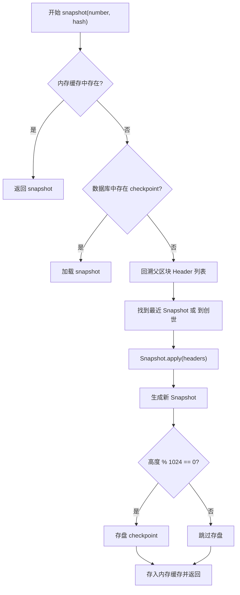
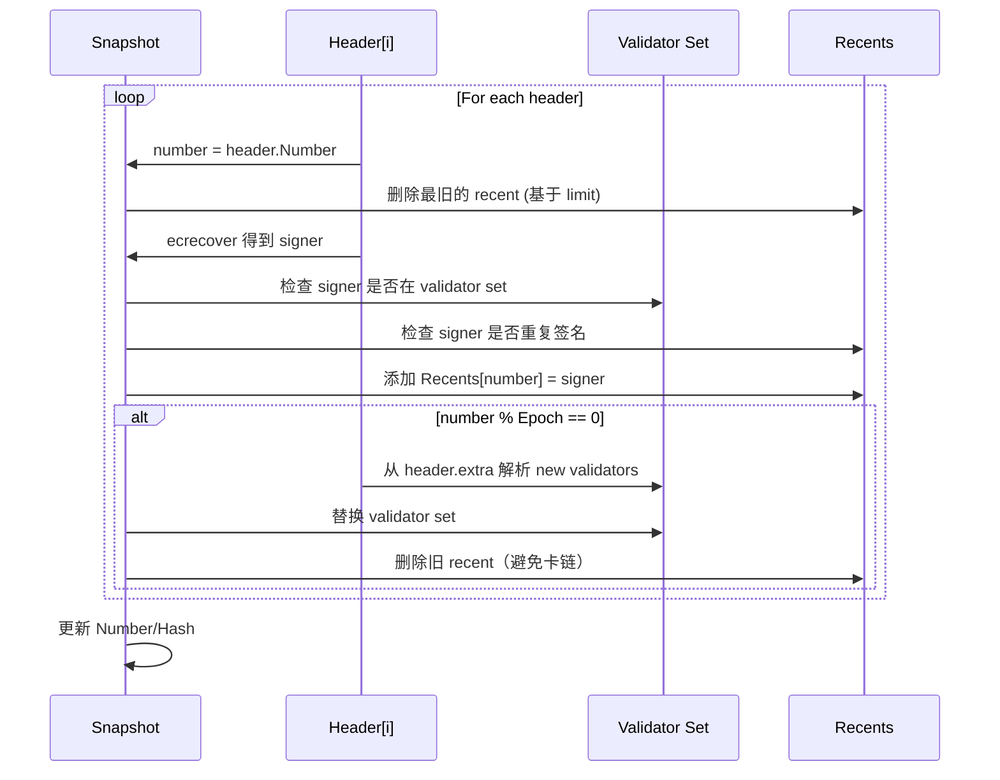

---

# 📘 **Congress POA Snapshot 技术文档**

> 适用于：基于 geth 共识引擎扩展的 Congress PoA
> 包含 snapshot 结构、构建流程、apply 逻辑、签名验证策略、epoch 切换机制等全部核心逻辑解析

---

# 1. 概述

Congress 是一种基于 **Proof-of-Authority（PoA）** 的共识机制。它要求每个区块必须由授权验证者（validator）签名。为了在节点之间保持一致的验证者集合、签名历史、防止重复签名以及处理 epoch 切换，Congress 引入了 **Snapshot**。

Snapshot 是一份**区块链状态的轻量级快照**，用于记录：

| 字段         | 含义                   |
| ---------- | -------------------- |
| Validators | 当前的验证者集合（Set）        |
| Recents    | 最近签过区块的验证者（用于禁止连续签名） |
| Number     | Snapshot 对应的区块高度     |
| Hash       | Snapshot 对应区块哈希      |

Snapshot 在每个节点独立维护，并保证：
**同一条链在同一高度的 snapshot 是确定性的（无随机性）。**

---

# 2. Snapshot 数据结构详解

```go
type Snapshot struct {
    config   *params.CongressConfig
    sigcache *lru.ARCCache

    Number     uint64
    Hash       common.Hash
    Validators map[common.Address]struct{}
    Recents    map[uint64]common.Address
}
```

## 2.1 Validators

一个 set，表示当前 epoch 的授权验证者。

来源：

* **创世块**从 genesis 中定义
* **每个 epoch 的第一个块从 header.extra 中读取**

## 2.2 Recents

`Recents` 保存最近签名者的 block→validator 映射。

用途：

* 禁止 validator 在“短窗口”中连续签名
* 窗口大小 = `len(Validators)/2 + 1`
* 同 Clique 共识一致

---

# 3. Snapshot 构建流程

`func (c *Congress) snapshot(...)` 的职责：

1. 从内存 LRU 找 snapshot
2. 从数据库 checkpoint 读取 snapshot
3. 若无可用快照：倒序回溯区块 header
4. 将这些 header 通过 `Snapshot.apply` 应用
5. 形成最终 Snapshot 并加入缓存
6. 每 1024 个块存盘 checkpoint

### 📘 Mermaid：Snapshot 构建流程图



---

# 4. Snapshot.apply —— 快照演化核心逻辑

源码解析 `apply()` 函数。

```go
func (s *Snapshot) apply(headers []*types.Header, chain consensus.ChainHeaderReader, parents []*types.Header) (*Snapshot, error) {
```

## 4.1 Apply 前置检查

```go
if len(headers) == 0 {
    return s, nil
}
for i := 0; i < len(headers)-1; i++ {
    if headers[i+1].Number.Uint64() != headers[i].Number.Uint64()+1 {
        return nil, errInvalidVotingChain
    }
}
if headers[0].Number.Uint64() != s.Number+1 {
    return nil, errInvalidVotingChain
}
```

确保 header 是连续的，不允许跳号或乱序。

---

## 4.2 基于当前 snapshot 复制一个新状态

```go
snap := s.copy()
```

保证快照不可变性，为 apply 链式产生新的快照。

---

## 4.3 遍历 header 逐个应用

```go
for _, header := range headers {
    number := header.Number.Uint64()
```

---

## 4.4 删除过期 recent（核心逻辑）

```go
if limit := uint64(len(snap.Validators)/2 + 1); number >= limit {
    delete(snap.Recents, number-limit)
}
```

窗口大小 = `len(Validators)/2 + 1`

目的：
⛔ 防止 validator 频繁连续出块
✔ 每过 limit 个区块，允许 validator 再次出块

---

## 4.5 用 ecrecover 恢复签名者

```go
validator, err := ecrecover(header, s.sigcache, chainConfig)
if err != nil { return nil, err }
```

恢复 signer（区块作者）。

---

## 4.6 验证 signer 是否为合法 validator

```go
if _, ok := snap.Validators[validator]; !ok {
    return nil, errUnauthorizedValidator
}
```

---

## 4.7 检查 signer 是否最近签过

```go
for _, recent := range snap.Recents {
    if recent == validator {
        return nil, errRecentlySigned
    }
}
```

禁止重复签名窗口策略。

---

## 4.8 记录 signer

```go
snap.Recents[number] = validator
```

---

## 4.9 epoch 边界，更新 validators

```go
if number > 0 && number%s.config.Epoch == 0 {
```

### 解析新 validators：

```go
validators := make([]common.Address, ...)
for i := range validators {
    copy(validators[i][:], checkpointHeader.Extra[...])
}
```

从 header.extra 中解析 validator 列表。

### 替换旧 validator 集合

```go
newValidators := make(map[common.Address]struct{})
for _, v := range validators {
    newValidators[v] = struct{}{}
}
snap.Validators = newValidators
```

---

## 4.10 处理 validator 减少后的 recents 清理

```go
limit := uint64(len(newValidators)/2 + 1)
for i := 0; i < len(snap.Validators)/2-len(newValidators)/2; i++ {
    delete(snap.Recents, number-limit-uint64(i))
}
```

这是一个非常关键的逻辑：

### 🔥 为什么需要额外删除 recents？

若 validator 数量减少：

* recent 窗口变大
* 旧 recents 可能阻塞所有 validator 出块（造成链停顿）

因此必须删除一些 recent，使 validator 立即能继续出块。

---

## 4.11 更新 snapshot 的 Number 与 Hash

```go
snap.Number += uint64(len(headers))
snap.Hash = headers[len(headers)-1].Hash()
```

---

# 5. Mermaid：Snapshot.apply 状态演化



---

# 6. Snapshot 的使用场景

Snapshot 贯穿整个 PoA 共识流程，是关键状态：

| 使用场景              | Snapshot 作用                |
| ----------------- | -------------------------- |
| verifySeal        | 判断 block signer 是否合法       |
| CalcDifficulty    | 判断 signer 是否 in-turn（影响难度） |
| Seal（出块）          | 本地节点基于 recents 判断是否可以出块    |
| Finalize/Assemble | epoch 切换、validator 替换      |

Snapshot 是 **签名验证 / 出块调度** 的唯一权威数据。

---

# 7. 关键逻辑总结

1. Snapshot 保存 validators + recents（短期签名历史）
2. recents 长度=validators/2+1，用于防止连续出块
3. snapshot 通过 apply 叠加 header 演化
4. epoch 中通过 header.extra 更新 validator 集合
5. validator 数减少时必须清理 recents 否则卡链
6. snapshot 会写入数据库，每 1024 个块形成 checkpoint
7. 验证和出块全部依赖 snapshot，而不是 chain.state

