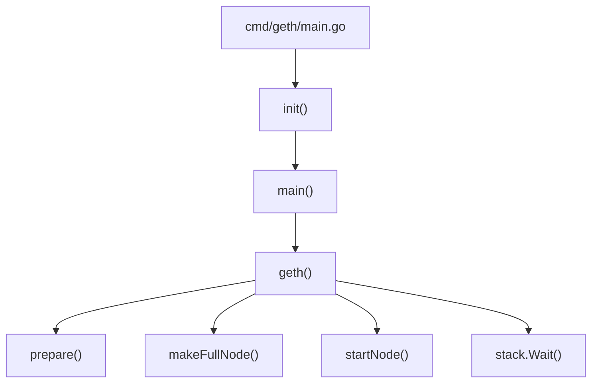
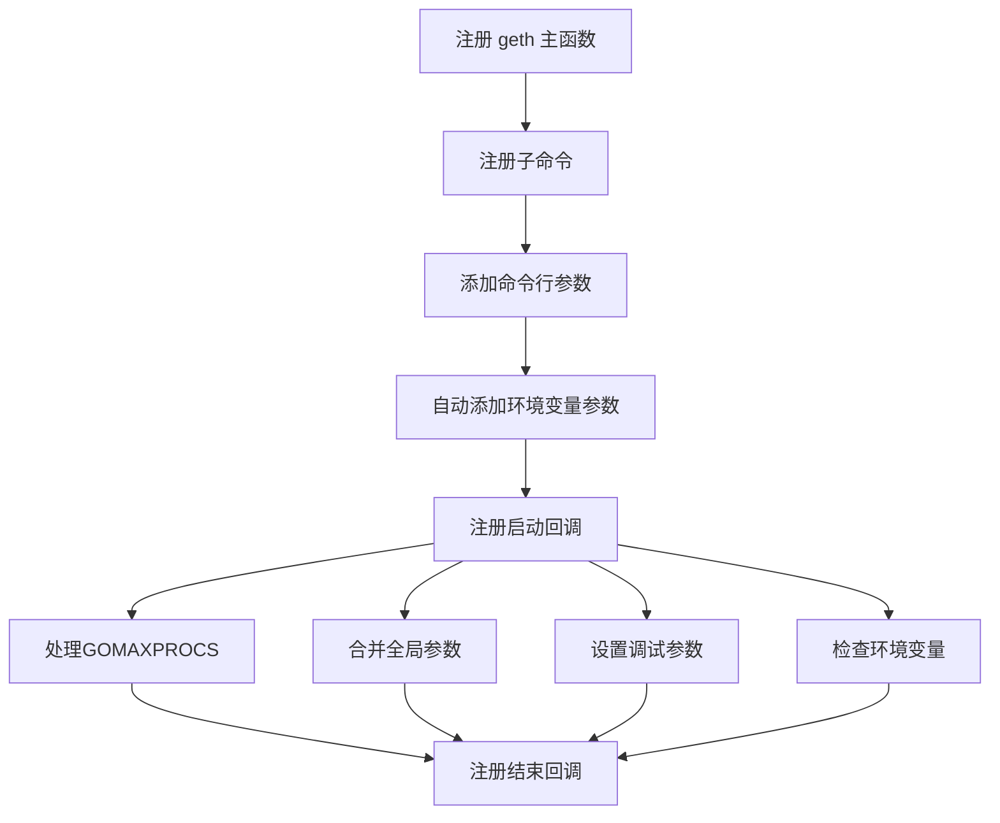
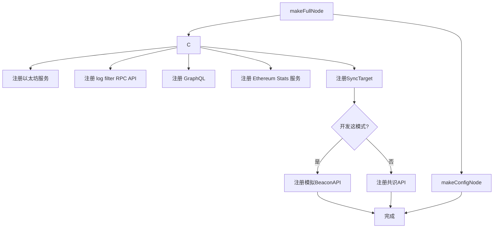

# Geth启动流程解析

## 1.引言

Geth是以太坊官方的Go语言实现，是接入以太坊网络的重要工具。了解其启动流程有助于我们深入理解以太坊的内部工作机制。本文将详细分析Geth的启动流程及各个环节的实际工作内容。本地代码中做了一些注解，但是看起来不够系统，所以整理成文档，给自己留一个笔记。以后忘记时也能回头参考。

## 2.启动主流程

Geth启动入口及几个主要方法：



### 2.1. 程序入口

Geth的程序入口在`cmd/geth/main.go`文件中

这里定义了一个名为app的cli.App对象，并在 init 方法中注册了所有子命令，启动 geth 进程的主命令就在 geth 方法中，另外还注册了一大堆子命令，包括创世、账号管理等，以后会再深入分析。

```go
var app = flags.NewApp("the go-ethereum command line interface")

// 这个方法是 Go 自动调用的，注册 geth命令和子命令的实现逻辑
func init() {
	// Initialize the CLI app and start Geth
	app.Action = geth // 这个是启动主函数
	app.Commands = []*cli.Command{
		// See chaincmd.go:
		initCommand, // 创世命令
        // ...other commands
    }
	sort.Sort(cli.CommandsByName(app.Commands))

    // 这里会注册命令支持接收的各种参数，定义的时候是分组的方便可读，这里使用时是混在一起的
	app.Flags = flags.Merge(
		nodeFlags,
		rpcFlags,
		consoleFlags,
		debug.Flags,
		metricsFlags,
	)
    // 为上面支持的参数自动生成对应的环境变量
    // 参数优先级：命令行参数 > 环境变量 > 配置文件 > 默认值
	flags.AutoEnvVars(app.Flags, "GETH")

	app.Before = func(ctx *cli.Context) error {
        // 自动设置 GOMAXPROCS 值以匹配 Linux 容器的 CPU 配额。
		maxprocs.Set() 
		flags.MigrateGlobalFlags(ctx)
        // - 设置调试相关的配置，如日志级别、性能分析等。
		if err := debug.Setup(ctx); err != nil {
			return err
		}
        // 检查环境变量参数是否有命令行参数不支持的情况
		flags.CheckEnvVars(ctx, app.Flags, "GETH")
		return nil
	}
    // 注册退出清理函数
	app.After = func(ctx *cli.Context) error {
		debug.Exit()
		prompt.Stdin.Close() // Resets terminal mode.
		return nil
	}
}
```

init 方法的处理流程如下图所示：


还有下面的 main 方法，他会用到上面定义的命令行 app 对象，这里它无关紧要，启动命令行工具逻辑而已，不用关注。
```go
func main() {
	if err := app.Run(os.Args); err != nil {
		fmt.Fprintln(os.Stderr, err)
		os.Exit(1)
	}
}
```

### 2.2. 启动主函数geth()

当没有指定子命令时，默认会执行geth()函数：

```go
func geth(ctx *cli.Context) error {
	prepare(ctx)
	stack, backend := makeFullNode(ctx)
	defer stack.Close()

	startNode(ctx, stack, backend, false)
	stack.Wait()
	return nil
}
```

此函数执行了完整的节点启动流程，主要包括四个步骤：
1. prepare(ctx) - 准备工作
2. makeFullNode(ctx) - 创建完整节点
3. startNode(ctx, stack, backend, false) - 启动节点
4. stack.Wait() - 等待中断信号

下面我们逐一分析这几个关键步骤。

### 2.3. prepare()函数

prepare函数不包含什么复杂的逻辑，主要就是一些前置条件检查，各种参数检查，下面增加注释的代码：

```go
func prepare(ctx *cli.Context) {
	switch {
    // 各种测试网络开关检查,goerli,sepolia,holesky以及dev 开关，这里只是打印出日志信息，并没有做任何处理
	case ctx.IsSet(utils.GoerliFlag.Name):
		log.Info("Starting Geth on Görli testnet...")
    // ...

    // 如果没有设置networkid参数，默认就是主网模式启动
	case !ctx.IsSet(utils.NetworkIdFlag.Name):
		log.Info("Starting Geth on Ethereum mainnet...")
	}
    // 下面的逻辑是在没有明确指定--cache参数，且是主网时(没有指定networkid参数)，设置缓存默认值4096
    // 并且需要满足没有设置各种测试网和 dev 开关
    // ⚠️注意！这里如果是基于以太坊开发的项目，且主网 ID 不是 1 的情况，需要自行修改此处代码或者显示指定 cache 参数，否则会导致缓存过小，影响性能
	ctx.Set(utils.CacheFlag.Name, strconv.Itoa(4096))
    // .....

	// 这里处理指标监控、导出等功能，当前不准备分析（后面我准备单独章节分析 geth 的监控体系）
	utils.SetupMetrics(ctx)

	// 主动搜集系统的一些运行指标
	go metrics.CollectProcessMetrics(3 * time.Second)
}
```

> 注意，这个方法并没有返回值，但是它直接修改了cli.Context对象内的取值(其实只修改了 cache 缓存参数)，会影响后续逻辑。
>

### 2.4. makeFullNode()函数 - 创建完整节点

这是启动流程中最核心的部分，负责创建并配置完整的以太坊节点：

```go
// cmd/geth/config.go
func makeFullNode(ctx *cli.Context) (*node.Node, ethapi.Backend) {
	// 加载配置
	stack, cfg := makeConfigNode(ctx)
    // 设置覆盖分叉参数 OverrideShanghai, OverrideCancun,OverrideVerkle
	if ctx.IsSet(utils.OverrideShanghai.Name) {
		v := ctx.Uint64(utils.OverrideShanghai.Name)
		cfg.Eth.OverrideShanghai = &v
	}
    // ...
	// 注册以太坊服务
	backend, eth := utils.RegisterEthService(stack, &cfg.Eth)
	// 注册节点健康指标
    // ...
	// 注册 log filter RPC API.
	filterSystem := utils.RegisterFilterAPI(stack, backend, &cfg.Eth)

	// 注册 GraphQL
	if ctx.IsSet(utils.GraphQLEnabledFlag.Name) {
		utils.RegisterGraphQLService(stack, backend, filterSystem, &cfg.Node)
	}
	// 注册 Ethereum Stats 服务
	if cfg.Ethstats.URL != "" {
		utils.RegisterEthStatsService(stack, backend, cfg.Ethstats.URL)
	}
	// 配置 full-sync 测试服务 (测试)
	if ctx.IsSet(utils.SyncTargetFlag.Name) {
		hex := hexutil.MustDecode(ctx.String(utils.SyncTargetFlag.Name))
		if len(hex) != common.HashLength {
			utils.Fatalf("invalid sync target length: have %d, want %d", len(hex), common.HashLength)
		}
		utils.RegisterFullSyncTester(stack, eth, common.BytesToHash(hex))
	}
	// 开发模式下自动创建一个模拟的 Beacon 链，可以本地不依赖其他环境进行测试
	if ctx.IsSet(utils.DeveloperFlag.Name) {
		simBeacon, err := catalyst.NewSimulatedBeacon(ctx.Uint64(utils.DeveloperPeriodFlag.Name), eth)
		if err != nil {
			utils.Fatalf("failed to register dev mode catalyst service: %v", err)
		}
		catalyst.RegisterSimulatedBeaconAPIs(stack, simBeacon)
		stack.RegisterLifecycle(simBeacon)
	} else {
        // 注册标准的 Catalyst 服务，用于与外部共识客户端（如 Lighthouse、Prysm 等）交互
		err := catalyst.Register(stack, eth)
		if err != nil {
			utils.Fatalf("failed to register catalyst service: %v", err)
		}
	}
	return stack, backend
}
```



makeFullNode主要做了两件事：
1. 调用makeConfigNode(ctx)创建基础节点配置和容器
2. 注册各类服务，主要是以太坊核心服务

#### 2.4.1 makeConfigNode() - 创建基础配置

下面是makeConfigNode()的魔改代码，里面涉及的一些参数，后面会细化，到时做个链接过来。

```go
func makeConfigNode(ctx *cli.Context) (*node.Node, gethConfig) {
    // 创建默认配置 (这两步是在loadBaseConfig逻辑中，为了方便查看，这里展开了)
    // 这个对象包含了所有的默认参数配置，如果命令行参数、环境变量、配置文件中都没有配置这些参数，则使用这里的默认值
	cfg := gethConfig{
		Eth:     ethconfig.Defaults,
		Node:    defaultNodeConfig(),
		Metrics: metrics.DefaultConfig,
	}
	// 加载配置文件并合并配置
	if err := loadConfig(file, &cfg); err != nil {
		utils.Fatalf("%v", err)
	}

	// 应用命令行标志，根据命令行参数更新 cfg 配置对象
	utils.SetNodeConfig(ctx, &cfg.Node)
    // 展开的loadBaseConfig逻辑到此为止

	// 创建Node实例(P2P 节点，并提供 RPC 服务)
	stack, err := node.New(&cfg.Node)
	if err != nil {
		Fatalf("Failed to create the protocol stack: %v", err)
	}
	
	// 账户管理后面再说
	if err := setAccountManagerBackends(stack.Config(), stack.AccountManager(), stack.KeyStoreDir()); err != nil {
		utils.Fatalf("Failed to set account manager backends: %v", err)
	}

	// 应用Eth 服务配置
	utils.SetEthConfig(ctx, stack, &cfg.Eth)

    // 如果配置了 EthStats 服务器的 URL，则进行设置
	if ctx.IsSet(utils.EthStatsURLFlag.Name) {
		cfg.Ethstats.URL = ctx.String(utils.EthStatsURLFlag.Name)
	}

    // 应用 指标 配置，后面再说
	applyMetricConfig(ctx, &cfg)
	return stack, cfg
}
```

#### 2.4.2 RegisterEthService() - 注册以太坊核心服务

```go
// cmd/utils/flags.go
func RegisterEthService(stack *node.Node, cfg *ethconfig.Config) (ethapi.Backend, *eth.Ethereum) {
	// 创建Ethereum实例
	backend, err := eth.New(stack, cfg)
	if err != nil {
		Fatalf("Failed to register the Ethereum service: %v", err)
	}
	
	// 注册debug API
    stack.RegisterAPIs(tracers.APIs(backend.APIBackend))
	
    // 注意这里返回来两个对象，一个是APIBackend，一个就是Ethereum实例
	return backend.APIBackend, backend
}
```

### 2.5. startNode()函数 - 启动节点

```go
func startNode(ctx *cli.Context, stack *node.Node, backend ethapi.Backend, isConsole bool) {
	// 启动Node
	if err := stack.Start(); err != nil {
		Fatalf("Error starting protocol stack: %v", err)
	}
	
	// 解锁账户（如果配置）
	unlockAccounts(ctx, stack)
	
	// 启动挖矿（如果配置）
	startMining(ctx, stack, backend)
}
```

startNode函数主要完成：
1. 调用stack.Start()启动所有已注册的服务 ([详细介绍](geth启动流程解析05.md#32-启动node服务))
2. 解锁指定账户（如果有配置） (以后介绍)
3. 启动挖矿服务（如果有配置） (以后介绍)

### 2.6. stack.Wait() - 等待中断信号

最后调用stack.Wait()使程序保持运行状态，直到收到中断信号（如Ctrl+C），然后进行清理工作并退出。

## 3.总结

Geth的启动流程虽然看起来简单，但背后涉及了大量的初始化工作：

1. **配置加载** - 解析命令行参数，加载配置文件
2. **节点创建** - 创建核心Node容器，初始化数据目录和网络
3. **服务注册** - 注册以太坊核心服务及其他可选服务
4. **节点启动** - 启动所有已注册的服务，包括网络、RPC等
5. **运行等待** - 等待外部中断信号

每个环节都有其特定的职责，共同构成了Geth完整的启动流程。
