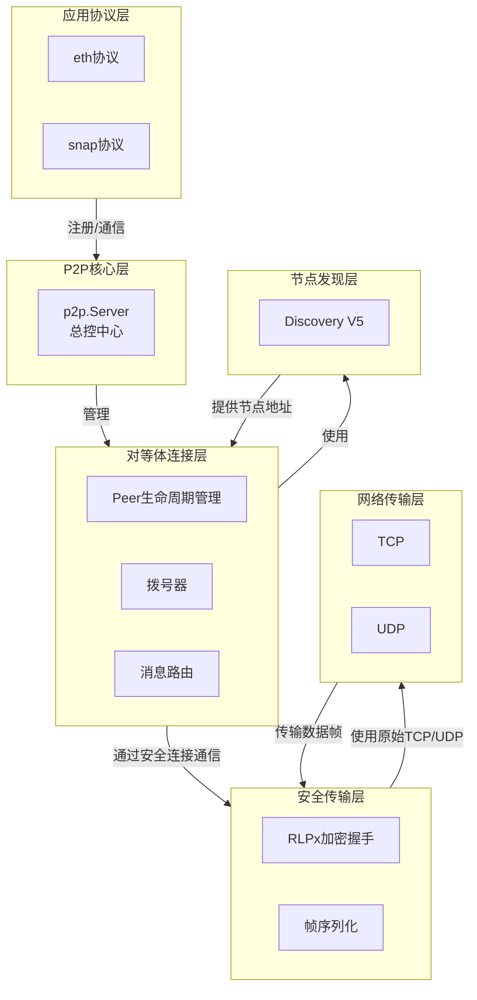

---

### **Go Ethereum P2P 模块详解**

#### **1. 概述**

Geth 的 P2P 子系统是其去中心化架构的基石，负责在无序的互联网环境中构建一个有序、安全、高效的节点通信网络。它采用分层设计，将**节点发现**、**安全连接**、**对等体管理**和**协议处理**解耦，通过清晰的接口进行协作。其核心目标是实现区块链数据的可靠广播与同步。

#### **2. 核心架构与数据流**

整个系统围绕 `p2p.Server` 这一核心枢纽展开，其架构与数据流可抽象为以下模型：

**数据流简述：**
1.  **引导**：`Server` 启动，加载配置，初始化节点发现、拨号器等组件。
2.  **发现**：节点发现协议（UDP）在后台运行，不断发现新的对等体地址并加入候选池。
3.  **连接**：拨号器从候选池中选取地址，建立 TCP 连接，并执行 RLPx 加密与协议握手。
4.  **多路复用**：握手成功后，为每个共享协议启动独立的消息处理循环（`Protocol.Run`）。
5.  **通信**：应用层通过 `Peer` 的 `ReadMsg`/`WriteMsg` 进行安全通信。`Server` 负责底层消息的路由与派发。

#### **3. 关键技术组件深度解析**

> 这里列出核心的功能组件及概述，后面会分几篇文章深入学习。
> 
##### **3.1 节点身份与发现 (p2p/enode, p2p/discover)**

*   **节点身份 (`enode.Node`)**：每个节点由 `enode.URL` 唯一标识，格式为 `enode://<node-id>@<ip>:<port>?discport=<discovery-port>`。其核心是 `secp256k1` 公钥，所有通信都基于此身份进行验证。
*   **Ethereum Node Records (ENR)**：一种灵活的可扩展记录，用于自我公告。它包含签名，防止篡改，可以存储 IP、TCP/UDP 端口以及其它自定义键值对，实现了元数据的可扩展性。
*   **节点发现协议 (`discover.UDPv5`)**：
    *   **协议基础**：基于 Kademlia 分布式哈希表，使用 UDP 协议进行无连接通信，效率极高。
    *   **路由表 (`discover.Table`)**：维护一个按异或距离排序的节点桶。节点被放置在各自的桶中，系统定期执行刷新以发现新节点并淘汰失效节点。
    *   **核心交互**：
        *   `PING/PONG`：保活与延迟探测。
        *   `FINDNODE`：查询指定逻辑距离的节点，是填充路由表的主要手段。
        *   `NODES`：对 `FINDNODE` 的响应，返回节点列表。

##### **3.2 P2P服务器核心 (p2p/server.go)**

*   **`p2p.Server` 结构**：这是系统的大脑。关键字段包括：
    *   `Config`: 包含所有运行时配置。
    *   `PrivateKey`: 节点的身份密钥。
    *   `peerOp`: 用于同步执行对等体增删操作的通道。
    *   `peers`: 存储所有已连接 `Peer` 的映射。
    *   `protocols`: 已注册的上层协议列表。
*   **`p2p.Config` 配置**：定义了服务器的行为，如 `MaxPeers`（最大对等体数）、`ListenAddr`（监听地址）、`NoDiscovery`（是否禁用发现）等。
*   **生命周期管理**：
    *   `Start()`: 依次启动 TCP 监听、节点数据库、发现协议和拨号调度器。
    *   `Stop()`: 向所有组件发送停止信号，并等待所有协程和连接优雅退出。

##### **3.3 对等体连接管理 (p2p/peer.go, p2p/dialstate.go)**

*   **`p2p.Peer` 结构**：代表一个活跃的远程连接。它封装了：
    *   `rwc`: 底层的连接对象（通常是 `rlpx.conn`）。
    *   `proto`: 一个映射，将协议名称映射到其对应的 `protoRW`（协议级别的读写器）。
*   **连接建立流程**：
    1.  **拨号调度**：`dialstate` 负责调度拨号任务。它管理多种 `dialTask`，包括针对静态节点的 `staticDialTask`、基于发现的 `discoverTask` 和实际建立 TCP 连接的 `tcpDialTask`。
    2.  **握手过程**：
        a. **TCP 连接建立**。
        b. **RLPx 加密握手**：使用 ECIES 进行非对称加密，协商出后续通信的对称会话密钥。
        c. **协议握手**：交换双方的基本信息（名称、版本、端口）和能力列表（支持的协议）。
    3.  **对等体注册**：握手成功后，创建 `Peer` 对象并将其注册到 `Server`。

##### **3.4 RLPx安全传输层 (p2p/rlpx.go)**

*   **`rlpx.conn`**：这是所有上层通信的安全管道。
*   **帧结构**：数据被分割成帧进行传输。每个帧包含：
    *   **帧头**：16字节的 MAC，用于验证帧完整性。
    *   **负载**：经过 AES-GCM 加密的实际消息数据。
*   **消息接口**：为上层提供 `ReadMsg()` 和 `WriteMsg()` 方法，处理帧的组装、加密、解密和验证，对应用层透明。

##### **3.5 协议多路复用与消息处理 (p2p/protocol.go)**

*   **`p2p.Protocol` 接口**：任何希望使用 P2P 网络的上层服务都必须实现此接口。关键字段：
    *   `Name`, `Version`: 协议标识。
    *   `Length`: 协议支持的唯一消息码数量。
    *   `Run`: 当与一个新对等体成功握手后，会为该协议启动一个协程执行此函数。
*   **消息处理循环**：在 `Protocol.Run` 函数中，通常会有一个 `for` 循环，不断调用 `peer.ReadMsg()` 读取消息。根据消息的 `Code` 字段，将其派发给相应的处理逻辑（例如，在 `eth` 协议中，`NewBlockMsg` 会触发区块处理函数）。
*   **协议注册**：以太坊服务在初始化时，会创建 `eth.Protocol` 等实例，并通过 `Server.Protocols` 字段将其注册到 P2P 服务器。

#### **4. 总结**

Geth v1.13.15 的 P2P 网络是一个经过精心设计和生产环境考验的复杂系统。其通过分层和模块化，实现了高内聚、低耦合。从基于 DHT 的节点发现，到安全的 RLPx 传输，再到灵活的多协议支持，每一层都各司其职，共同构建了一个健壮、可扩展的分布式网络，为整个以太坊区块链的运转提供了坚实的基础通信设施。
