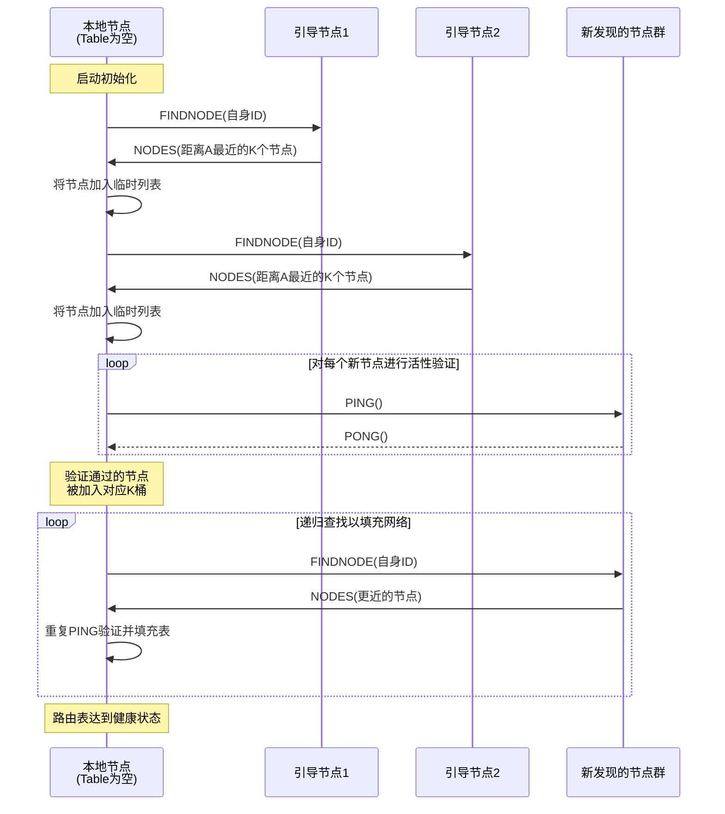
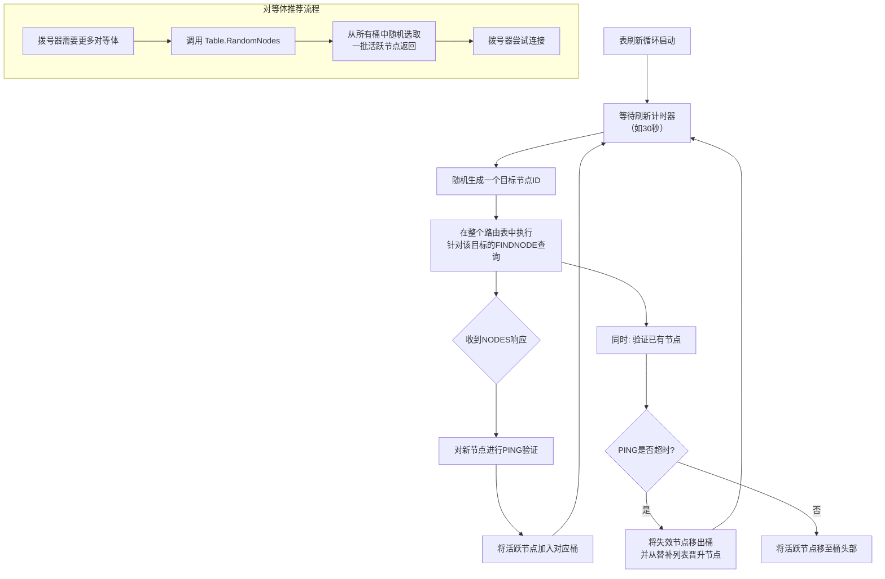

> 这个专题的核心是理解 Geth 节点如何在无中心服务器的网络中相互发现。其实现主要位于 `p2p/discover/` 和 `p2p/enode/` 目录下。

----

### **节点发现机制与分布式哈希表实现**

#### **1. 核心数据结构**

在深入流程之前，必须先理解几个关键的数据结构。

**1.1 节点身份：**

这是整个发现协议的基石，代表一个网络节点。

```go
// enode.Node
// p2p/enode/node.go
// Node 代表网络中的一个主机。
type Node struct {
    r  enr.Record // 底层的ENR记录
    id ID // 节点ID，由记录的公钥推导而来
}
```

```go
// enr.Record
// p2p/enr/enr.go
// 一个Record代表一个节点实例， 0值代表空记录
type Record struct {
	seq       uint64 // 序列号
	signature []byte // 签名
	raw       []byte // RLP编码的记录数据
	pairs     []pair // 所有 key/value 的排序列表
}
```
*   **`ID`**：一个 `[32]byte` 数组，是节点身份的终极代表。它由记录中公钥的 `Keccak256` 哈希值计算得出。**在 Kademlia 协议中，节点间的逻辑距离就是通过 XOR(节点A.ID, 节点B.ID) 来计算的。**
*   **`enr.Record`**：Ethereum Node Record 的缩写，是一个经过签名的、灵活的键值对容器。它存储了节点的网络信息，如：
    *   `secp256k1` 公钥 (ID 的来源)
    *   IP 地址 (`ip`)
    *   TCP 端口 (`tcp`)
    *   UDP (发现) 端口 (`udp`)
*   **序列化**：节点可以被序列化为 `enode://...` 格式的 URL，用于引导和共享。

**1.2 分布式哈希表：**

这是 Kademlia 协议的核心实现，每个节点都维护这样一个表来组织其已知的节点。

```go
// discover.Table
// p2p/discover/table.go
// Table 是节点表，包含所有与自身节点不同距离的活跃节点。
type Table struct {
    // ... 其他字段
    buckets [nBuckets]*bucket // 逻辑距离桶
    // ... 其他字段
}

// bucket 包含的节点，其逻辑距离在 [256-i-1, 256-i) 之间
// 例如，buckets[0] 包含距离在 [255, 256) 的节点（最近）
//       buckets[255] 包含距离在 [0, 1) 的节点（最远）
type bucket struct{
    entries []*Node // 桶内的活跃节点
    replacements []*Node // 替补节点
    ips          netutil.DistinctNetSet
	index        int
}
```
*   **桶结构**：表被划分为 256 个桶（在 IPv4 背景下，因为 Node ID 是 256 位）。第 `i` 个桶存储与本地节点 XOR 距离前 `i` 位为 0 的节点。这意味着离自己越“近”的节点，所在的桶索引越小。
*   **容量与淘汰**：每个桶有固定容量（默认为 16 个节点）。当新节点要加入已满的桶时，会使用 **LRU (Least Recently Used)** 策略进行淘汰。最近通信过的节点会被移动到切片头部，最久未通信的节点在尾部，成为被淘汰的候选。
*   **替补列表**：每个桶还有一个替补列表。当桶满时，仍有价值的节点（能够成功 Ping 通）会被加入替补列表。当活跃节点失效时，会从替补列表中选取节点进行替换。

**1.3 发现协议入口：**

这是 Discovery v5 协议的实现，它使用 UDP 协议与 `Table` 交互来管理节点。

```go
// discover.UDPv5
// p2p/discover/v5_udp.go
type UDPv5 struct {
    // ... 其他字段
    tab         *Table
    // ... 其他字段
}
```

#### **2. 节点发现流程详解**

**2.1 引导过程**

当 Geth 启动时，`p2p.Server` 会初始化 `UDPv5` 和 `Table`。`Table` 最初是空的，需要通过“引导节点”来填充自己。

1.  **种子节点**：代码中硬编码了一些或通过 `--bootnodes` 参数指定了一些初始节点（`enode://...`）。
2.  **引导查询**：`Table` 会向这些种子节点发送 `FINDNODE` 请求，请求的目标节点 ID 是**本地节点自身的 ID**。
3.  **响应与填充**：种子节点会返回它们认为离目标节点（即本机）最近的若干个节点（`NODES` 消息）。`Table` 收到这些节点后，会尝试对它们执行 `PING` 操作，验证其活性，然后将活跃节点加入相应的桶中。
4.  **递归查找**：`Table` 会继续向新得到的节点发送 `FINDNODE` 请求，像滚雪球一样，快速地将自己的路由表填充到一个健康的状态。

详细流程可以参考下面的流程图：


**2.2 持续的节点发现与表刷新**

即使路由表已满，系统也需要持续工作以应对节点下线、IP变更等情况。

*   **刷新计时器**：`Table` 内部有一个刷新循环（`loop` 协程），会定期（例如每30秒）随机生成一个目标节点 ID，然后在整个网络中执行一次 `FINDNODE` 查询。这个过程会：
    *   发现新的、未知的节点。
    *   激活并验证已有但久未联系的节点。
    *   将失效的节点从桶中移除。

*   **对等体推荐**：当 P2P 服务器的拨号器需要更多节点来建立连接时，它会调用 `Table.RandomNodes()` 方法。这会从所有桶中随机选取一批活跃的节点返回。这种随机性有助于保持网络的连通性和去中心化。


详细的实现流程参考下面的流程图：

#### **3. 核心协议交互**

所有交互都通过 UDP 进行，主要包含以下几种消息类型：

1.  **`PING` & `PONG`**：
    *   **用途**：保活、验证节点活性、测量网络延迟。
    *   **流程**：A 向 B 发送 `PING`，B 必须回复 `PONG`。如果 A 超时未收到 `PONG`，则认为 B 已失效，并将其从路由表中移除。

2.  **`FINDNODE` & `NODES`**：
    *   **用途**：查找离目标节点 ID 最近的节点。
    *   **流程**：A 向 B 发送 `FINDNODE`，其中包含目标 ID `target`。B 在自己的路由表中查找离 `target` 最近的 16 个节点，并通过 `NODES` 消息回复给 A。

3.  **`TALKREQ` & `TALKRESP` (v5 新增)**：
    *   **用途**：一种通用的请求-响应机制，允许应用层定义自定义的交互协议，增强了发现协议的扩展性。

#### **4. 关键源代码文件路径**

*   **节点记录与身份**：
    *   `p2p/enode/node.go`：`Node` 结构体定义和基本操作。
    *   `p2p/enr/enr.go`：ENR 记录的编码、解码和签名。
*   **分布式哈希表实现**：
    *   `p2p/discover/table.go`：`Table` 和 `bucket` 的核心逻辑，包括桶刷新、节点添加/淘汰。
*   **Discovery v5 协议**：
    *   `p2p/discover/v5_udp.go`：UDPv5 协议的主结构体和网络交互入口。
    *   `p2p/discover/udp.go`：包含底层 UDP 报文发送、接收和共享的编码/解码逻辑。
*   **节点数据库**：
    *   `p2p/nodedb.go`：将已知节点持久化到 LevelDB 数据库，以便重启后能快速恢复路由表。

#### **5. 总结**

Geth 的节点发现机制是一个典型的、经过优化的 Kademlia DHT 实现。它通过 `enode.Node` 和 ENR 来标识节点，通过 `discover.Table` 来组织网络拓扑，并通过 `discover.UDPv5` 协议进行无中心的节点信息交换。这种设计使得网络具有高度的自组织性、鲁棒性和抗审查能力，为整个以太坊 P2P 网络提供了坚实的地基。
