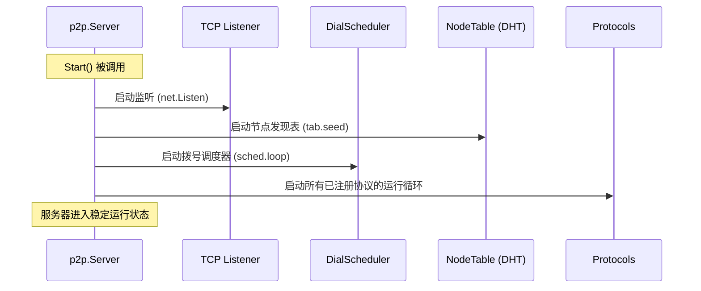
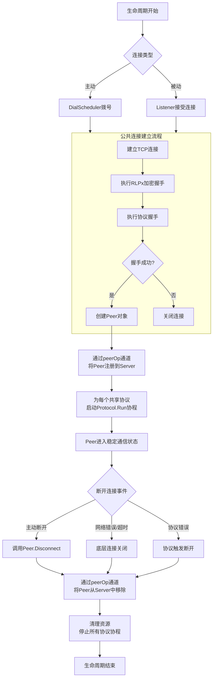

这个专题的核心是理解 `p2p.Server` 如何作为系统的大脑，协调所有组件，并管理一个对等体从诞生到消亡的完整生命周期。相关代码主要位于 `p2p/server.go`, `p2p/peer.go`, `p2p/dial.go` 等文件中。

---

### **P2P服务器核心与对等体生命周期管理**

#### **1. 核心数据结构**

**1.1 服务器枢纽：**

这是整个 P2P 系统的总控制器和容器。

```go
// p2p.Server
// p2p/server.go
type Server struct {
    // 配置，在启动后不应被修改
    Config Config

    // 运行时状态
    listener      net.Listener // TCP 监听器
    running       atomic.Bool  // 服务器运行状态
    ntab          *discover.Table // 节点发现表（专题一的主角）
    dialer        *dialScheduler  // 拨号调度器
    dialstate     *dialstate      // 拨号状态机

    // 对等体管理
    peers        map[enode.ID]*Peer // 已连接对等体的映射
    peerOp       chan peerOpFunc    // 用于串行化对等体操作的通道
    peerOpDone   chan struct{}      // 操作完成信号

    // 协议管理
    protocols    []Protocol // 已注册的上层协议
    // ... 其他字段
}
```
*   **`peerOp` 通道**：这是一个关键设计。所有对 `peers` 映射的增删改查操作，都必须通过向这个通道发送一个函数来执行。这确保了在高度并发的环境中，对核心状态的修改是**串行化**的，避免了竞态条件。
*   **`peers` 映射**：维护了所有当前活跃连接的 `Peer` 对象，以它们的 `enode.ID` 为键。

**1.2 对等体抽象：**

`Peer` 代表一个已建立的、经过验证的远程连接。

```go
// p2p.Peer
// p2p/peer.go
type Peer struct {
    rw      MsgReadWriter // 底层的消息读写器 (通常是 *protoRW)
    node    *enode.Node   // 远程节点的ENR信息
    // ... 其他字段
}
```
*   **`MsgReadWriter`**：这是一个接口，提供了 `ReadMsg()` 和 `WriteMsg()` 方法。对于每个已协商的协议，都会创建一个 `protoRW` 结构体来实现这个接口，它封装了协议特定的消息编码和解码逻辑。
*   **`node`**：包含了远程节点的所有公开信息（ID, IP, 端口等）。

**1.3 拨号调度器：`dialScheduler` 与 `dialstate` (`p2p/dial.go`)**

这对组合负责主动发起连接。

```go
// p2p.dialScheduler
// p2p/dial.go
// dailer创建扇出链接，并提交到Server。
// 创建的Peer连接有两种类型：
//  - static 节点，dailer将会始终尝试保持这些连接。
//  - dynamic 节点，通过节点发现。dailer会动态管理候选节点并更新状态。
type dialScheduler struct {
    // 下面几个遍历是在循环的Go协程中控制
	dialing   map[enode.ID]*dialTask // 活动任务
	peers     map[enode.ID]struct{}  // 已经连接的节点
	dialPeers int                    // 已经尝试连接的节点数

    // static map跟踪static节点的连接任务，可用的静态拨号任务放在staticPool中。
	static     map[enode.ID]*dialTask
	staticPool []*dialTask

    // history保存了最近的拨号记录
	history      expHeap
	historyTimer *mclock.Alarm
    // ...
}
```

*   **`dialScheduler`**：负责管理一个拨号任务队列，控制并发拨号的数量，并执行实际的拨号操作。
*   **`dialstate`**：是一个状态机，负责**生成**拨号任务。它知道当前需要连接什么类型的节点（静态节点、发现节点等），并决定拨号的优先级。

#### **2. 服务器生命周期与对等体管理流程**

**2.1 服务器启动流程 (`Server.Start()`)**

[Server的创建](Geth启动流程03节点创建.md#3node创建过程)和[启动](Geth启动流程05节点启动.md#32-启动node服务)流程分别参考连接内容。最终会调用到Server.Start()

```go
// p2p/server.go
func (srv *Server) Start() (err error) {
	// 一些基础条件检查
    // ...

    // 创建各种通道
	srv.quit = make(chan struct{})
	srv.delpeer = make(chan peerDrop)
	srv.checkpointPostHandshake = make(chan *conn)
	srv.checkpointAddPeer = make(chan *conn)
	srv.addtrusted = make(chan *enode.Node)
	srv.removetrusted = make(chan *enode.Node)
	srv.peerOp = make(chan peerOpFunc)
	srv.peerOpDone = make(chan struct{})

    // 设置当期服务节点
	if err := srv.setupLocalNode(); err != nil {
		return err
	}
    // 设置NAT信息
	srv.setupPortMapping()

    // 启动本地监听
	if srv.ListenAddr != "" {
		if err := srv.setupListening(); err != nil {
			return err
		}
	}

    // 启动节点发现
	if err := srv.setupDiscovery(); err != nil {
		return err
	}

    // 启动拨号调度器
	srv.setupDialScheduler()

	srv.loopWG.Add(1)

    // 启动服务协议主循环
	go srv.run()
	return nil
}
```

流程示意如下图：



**详细步骤：**
1.  **启动监听**：在配置的地址和端口上启动 TCP 监听，等待其他节点接入。
2.  **启动发现**：初始化并启动节点发现表（如专题一所述），开始发现网络中的对等体。
3.  **启动拨号器**：启动 `dialScheduler`，它会在后台运行一个循环，从 `dialstate` 获取任务，并尝试与发现的节点建立连接。
4.  **启动协议**：为所有已注册的上层协议做好消息处理准备。

**2.2 对等体生命周期：从连接到断开**

一个 `Peer` 的完整生命周期，包含了主动拨号和被动接受两种路径。



**流程关键点解析：**

1.  **连接建立**：
    *   **主动拨号**：`dialScheduler` 从 `dialstate` 获取任务（如 `dialTask`），并发起 TCP 连接。
    *   **被动接受**：`Server` 的 `listenLoop` 协程接受传入的 TCP 连接。
    *   **安全握手**：两种路径在建立 TCP 连接后，都会立即执行 **RLPx 加密握手**（建立安全通道）和 **协议握手**（交换能力列表）。只有两者都成功的连接才会被创建为 `Peer` 对象。

2.  **注册与协议启动**：
    *   新创建的 `Peer` 必须通过 `peerOp` 通道发送一个注册函数，将其添加到 `Server.peers` 映射中。这是唯一的添加方式。
    *   随后，`Server` 会调用 `Peer.startProtocols()`，为本地和远程节点共同支持的每一个协议启动一个 Go 协程，执行该协议的 `Run` 方法。这就是**协议多路复用**的实现。

3.  **稳定通信**：
    *   此时，`Peer` 已准备就绪。每个协议的 `Run` 协程都在运行自己的消息循环（`p2p.MsgReadWriter`），处理传入的消息。上层服务（如 `eth` 协议）也可以通过 `Peer` 的方法向外发送消息。

4.  **连接断开与清理**：
    *   断开可能由任何一方发起，原因包括：协议逻辑要求、I/O 错误、管理员指令等。
    *   与注册类似，断开也必须通过 `peerOp` 通道发送一个函数，将 `Peer` 从 `Server.peers` 映射中移除。
    *   `Peer` 的 `Disconnect` 方法会关闭底层连接，这会使得所有正在 `ReadMsg` 的协议协程收到错误并自然退出，从而实现优雅的清理。

#### **3. 关键源代码文件路径**

*   **服务器核心**：
    *   `p2p/server.go`：包含 `Server` 结构体定义、`Start()`/`Stop()` 方法以及对等体注册/删除的核心逻辑。
*   **对等体抽象**：
    *   `p2p/peer.go`：`Peer` 结构体定义、`startProtocols` 方法。
*   **拨号调度**：
    *   `p2p/dial.go`：`dialScheduler` 和相关的 `dialTask` 实现。
    *   `p2p/dialstate.go`：`dialstate` 状态机，负责生成拨号任务。

#### **4. 总结**

`p2p.Server` 是一个设计精巧的状态协调器。它通过 `peerOp` 通道串行化所有关键状态变更，保证了并发安全。它将复杂的 P2P 网络管理分解为**监听、发现、拨号、协议处理**等相对独立的模块，并通过清晰的生命周期钩子（如 `Protocol.Run`）将控制权交给上层协议。

对等体的生命周期管理是其核心职责，从握手建立，到多路复用协议通信，再到最终的资源清理，每一步都体现了 Go 语言“通过通信共享内存”和“使用协程管理并发”的哲学，构建了一个既健壮又高效的对等网络基础。

**下一专题建议：**
理解了服务器如何管理对等体之后，下一个关键环节是看这些对等体之间是如何进行安全通信的。接下来我们可以深入 **专题三：RLPx安全传输协议与加密握手流程**。