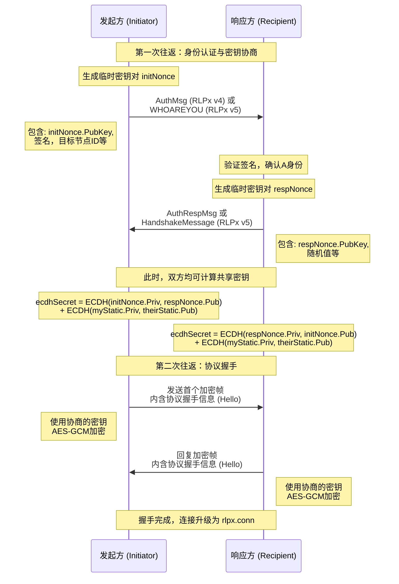

本文是理解 Geth 节点间安全通信的基石。所有上层协议（eth, snap）的消息都通过 RLPx 建立的加密通道进行传输。核心代码位于 `p2p/rlpx.go` 和 `crypto/ecies/` 目录下。

---

### **专题三：RLPx安全传输协议与加密握手流程**

#### **1. 概述与目标**

RLPx 不仅仅是一个加密层，它是一个完整的会话管理协议。其主要目标有三个：
1.  **身份认证**：确保正在通信的对方拥有其声称的私钥。
2.  **密钥协商**：为本次会话协商出一个临时的、前向安全的对称密钥。
3.  **安全传输**：为后续所有通信提供机密性、完整性和可认证性。

#### **2. 核心握手流程**

RLPx 握手是一个两次往返的协议，下图详细描述了其完整的步骤：



**流程关键点解析：**

1.  **第一次往返（Auth/AuthResp）**:
    *   **目的**：在不暴露长期私钥的情况下，证明各自的身份并协商出共享密钥。
    *   **密码学基础**：基于 **ECIES (Elliptic Curve Integrated Encryption Scheme)**，使用 `secp256k1` 曲线。
    *   **密钥协商**：双方使用临时生成的 `nonce` 密钥对和各自的静态密钥对，通过 **ECDH (Elliptic-curve Diffie–Hellman)** 计算，最终推导出相同的共享密钥 `ecdhSecret`。这个过程确保了**前向安全性**——即使节点的长期私钥日后被泄露，也无法解密过去的通信。

2.  **第二次往返（Protocol Handshake）**:
    *   **目的**：在已加密的通道上，交换应用程序级别的信息，协商后续通信所使用的具体协议。
    *   **信息内容**：包括客户端名称、版本、支持的协议列表及版本号、监听端口等。这些信息被封装在 `protoHandshake` 结构体中。
    *   **通道升级**：自此，底层的 TCP 连接被包装为一个 `rlpx.conn` 对象，后续所有的读写操作都通过这个安全的 `conn` 进行。

#### **3. 核心数据结构与加密帧格式**

**3.1 安全连接：`rlpx.conn` (`p2p/rlpx.go`)**

这是握手成功后，代表安全连接的核心对象。

```go
// conn 代表一个经过RLPx加密的连接。
type conn struct {
    // 底层的TCP连接
    fd net.Conn
    // 加密/解密所需的对称密钥和状态
    session *sessionState
}

// sessionState 包含对称加密的状态
type sessionState struct {
    // 用于解密从对端读取数据的密钥
    readKey []byte
    // 用于加密向对端写入数据的密钥
    writeKey []byte
    // 用于消息认证的哈希状态 (egress-mac, ingress-mac)
    // ... 
}
```

**3.2 帧格式 (Frame Format)**

所有应用层消息（如 `eth` 协议的交易、区块）都被封装成帧进行传输。RLPx 帧的结构如下：

```
+-------------------------+----------------------+-----------------------+
| Frame Header (16 bytes) | Frame Payload (N bytes) | MAC (16 bytes)     |
+-------------------------+----------------------+-----------------------+
|      AES-GCM Ciphertext & Authentication Tag                           |
```

*   **帧头**：也被加密，包含负载数据的长度等信息。
*   **负载**：实际的应用程序数据，经过序列化（通常是 RLP 编码）后，使用 **AES-GCM** 模式进行加密和认证。
*   **MAC**：AES-GCM 生成的认证标签，用于验证帧在传输过程中未被篡改。

**读写接口**：
`rlpx.conn` 为上层提供了两个核心方法：
*   `ReadMsg() (Msg, error)`: 从连接中读取一个完整的帧，解密、验证 MAC，并反序列化为 `p2p.Msg` 对象。
*   `WriteMsg(Msg) error`: 将 `p2p.Msg` 对象序列化，加密，封装成帧，并写入连接。

#### **4. 关键源代码文件路径**

*   **RLPx 核心实现**:
    *   `p2p/rlpx.go`: 包含 `conn` 结构体定义、`doEncHandshake`（加密握手）、`doProtoHandshake`（协议握手）以及 `ReadMsg`/`WriteMsg` 方法。
*   **加密与握手消息**:
    *   `p2p/rlpx.go`: 包含 `authMsgV4`, `authRespV4` 等握手消息的结构定义。
    *   `crypto/ecies/ecies.go`: 提供 ECIES 加密/解密功能，用于握手消息的编解码。
*   **协议握手**:
    *   `p2p/protocol.go`: 包含 `protoHandshake` 结构体定义。

#### **5. 总结**

RLPx 协议是 Geth P2P 网络安全的守护神。它通过一个精心设计的两次握手协议，将一条不安全的 TCP 连接升级为一条经过认证、加密和完整性保护的安全通道。

1.  **安全性**：结合了非对称加密（ECIES）用于身份认证和密钥协商，以及对称加密（AES-GCM）用于高效、安全的数据传输，同时提供了前向安全性。
2.  **抽象性**：通过 `rlpx.conn` 的 `ReadMsg`/`WriteMsg` 接口，它向上层协议隐藏了所有加密解密的复杂性，使得协议开发者可以像使用普通连接一样使用它。
3.  **可靠性**：每个帧都带有 MAC 校验，有效防止了数据在传输过程中被篡改或损坏。

正是有了 RLPx 这一坚固的基础，我们才能放心地在其之上构建 `eth`、`snap` 等复杂的应用协议。
