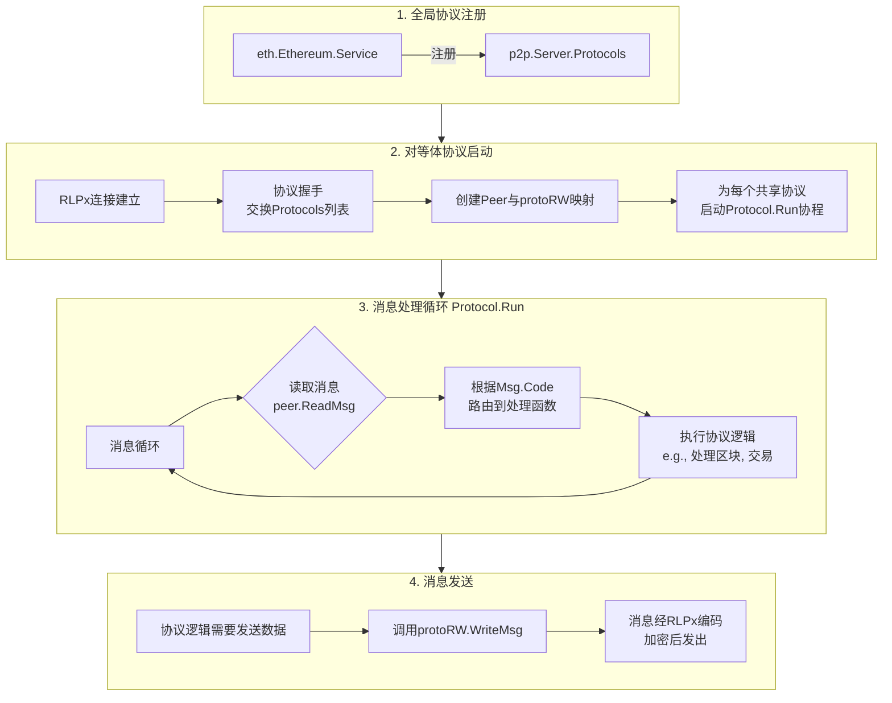

这个专题是理解 Geth 如何在一个单一的物理连接上，优雅地处理多种不同业务协议（如 `eth`, `snap`）的核心。它解决了消息的“路由”问题。

---

### **协议多路复用与消息处理循环剖析**

#### **1. 概述与目标**

当两个 Geth 节点通过 RLPx 建立安全连接后，它们需要在这个单一的连接上同时处理多种不同的逻辑任务，例如：
*   同步区块链数据（`eth` 协议）
*   同步状态快照数据（`snap` 协议）
*   未来的其他扩展协议

**协议多路复用的目标**是：
1.  **协商能力**：在连接初期，双方告知对方自己支持哪些协议及其版本。
2.  **逻辑隔离**：为每个协议提供独立的、并发的消息处理环境，避免互相阻塞。
3.  **精确路由**：将接收到的消息根据其协议和消息码，准确地分发给对应的处理函数。

#### **2. 核心流程：从协议注册到消息处理**

整个多路复用机制是一个从全局注册到每个对等体独立运行的完整管道。



**流程关键点解析：**

**2.1 全局协议注册**
*   在 Geth 启动时，各个上层服务（如 `eth.Ethereum`）会创建自己的 `p2p.Protocol` 实例，并通过 `p2p.Config` 注册到 `p2p.Server`。
*   一个典型的 `eth` 协议配置如下：
    ```go
    Protocol = p2p.Protocol{
        Name:    "eth",
        Version: 68, // 代表eth/68
        Length:  17, // 此协议定义了17种不同的消息码
        Run:     func(peer *p2p.Peer, rw p2p.MsgReadWriter) error { ... },
        // ... 
    }
    ```
    *   `Length` 字段至关重要，它定义了该协议的消息码空间（例如 0-16）。这确保了不同协议的消息码不会冲突。

**2.2 对等体协议启动**
1.  **协议握手**：在 RLPx 连接建立后，双方会立即交换 `protoHandshake`，其中包含各自支持的协议列表。
2.  **创建 `protoRW`**：对于每一个双方都支持的协议，`Peer` 会为其创建一个 `protoRW` 实例。这个对象实现了 `MsgReadWriter` 接口，是协议与网络连接之间的桥梁。
3.  **启动 `Run` 协程**：`Server` 为每个成功的协议调用其 `Run` 方法，并传入对应的 `protoRW`。**每个协议都在独立的 Go 协程中运行**，实现了并发处理。

**2.3 消息处理循环 (`Protocol.Run`)**
*   这是在独立协程中运行的**无限循环**，核心是不断地调用 `rw.ReadMsg()`。
*   `ReadMsg()` 会阻塞，直到从网络连接中读取到一个完整的、属于该协议的消息。
*   读取到的 `p2p.Msg` 对象包含：
    *   `Code`: 消息类型（如 `NewBlockMsg = 0x07`）。
    *   `Size`: 负载数据大小。
    *   `Payload`: 实际的 RLP 编码数据。
*   根据 `Code`，一个 `switch-case` 语句（或类似的调度器）会将 `Payload` 反序列化，并调用相应的处理函数。

**2.4 消息发送**
*   当协议逻辑需要发送消息时（例如，广播一个新交易），它会调用 `rw.WriteMsg(msg)`。
*   `protoRW.WriteMsg` 会正确地将消息码设置在协议自己的偏移空间内，然后通过底层的 `rlpx.conn` 将消息加密并发送出去。

#### **3. 核心数据结构**

**3.1 协议描述符：`p2p.Protocol` (`p2p/protocol.go`)**
```go
type Protocol struct {
    Name    string
    Version uint
    Length  uint64 // 协议的消息码数量，用于计算偏移量
    Run     func(peer *Peer, rw MsgReadWriter) error // 主循环函数
    // ...
}
```

**3.2 协议读写器：`protoRW` (`p2p/peer.go`)**
这是一个关键结构，它实现了 `MsgReadWriter` 接口，并负责处理协议偏移量。
```go
// protoRW 是协议专属的消息读写器。
type protoRW struct {
    Protocol
    offset uint64 // 该协议的消息码起始偏移量，例如eth协议为0，snap协议为eth.Length
    in     chan Msg // 传入消息的通道
    w      MsgWriter // 底层的写入器，通常是 *rlpx.conn
}
```
*   **偏移量机制**：这是多路复用的核心。假设 `eth` 协议的 `Length` 是 17，那么 `eth` 协议的消息码范围是 `[0, 16]`。而 `snap` 协议的偏移量就是 17，它的消息码范围是 `[17, 17+snap.Length)`。这样，当底层 `rlpx.conn` 读到一条 `Code=18` 的消息时，它知道该将其路由到 `snap` 协议的 `protoRW`，并且 `snap` 协议在处理时会将 `Code` 减去 `offset` (17)，得到协议内的真实消息码 (1)。

**3.3 消息结构：`p2p.Msg` (`p2p/message.go`)**
```go
type Msg struct {
    Code    uint64 // 网络层面的消息码（已包含偏移量）
    Size    uint32 // 负载大小
    Payload io.Reader // 负载数据的流式读取器
}
```

#### **4. 关键源代码文件路径**

*   **协议框架**:
    *   `p2p/protocol.go`：`Protocol` 结构体定义。
    *   `p2p/peer.go`：`protoRW` 结构体及其 `ReadMsg`, `WriteMsg` 方法，以及 `Peer.startProtocols` 方法。
*   **协议实现示例**:
    *   `eth/protocols/eth/handler.go`：`eth` 协议的 `Run` 函数（名为 `handle`）的实现，包含了完整的消息循环和分发逻辑。
    *   `eth/protocols/snap/handler.go`：`snap` 协议的实现。
*   **消息流**:
    *   `p2p/server.go`：`Server.runPeer` 方法，它负责在协议握手后启动 `Peer.startProtocols`。

#### **5. 总结**

Geth 的协议多路复用机制是一个经典的生产者-消费者模型，其设计精巧之处在于：

1.  **清晰的职责分离**：`p2p.Server` 负责连接和协议的生命周期管理，而 `p2p.Protocol` 负责具体的业务逻辑。
2.  **高效的并发模型**：每个协议一个协程，避免了单个繁忙协议阻塞其他协议，极大地提高了连接利用率和系统吞吐量。
3.  **优雅的路由方案**：通过 `Length` 和 `offset` 的简单计算，完美解决了多协议消息码空间的划分和路由问题，无需复杂的路由表。
4.  **灵活的扩展性**：要添加一个新协议，只需实现 `p2p.Protocol` 接口并将其注册到服务器即可，对现有代码侵入性极小。

这套机制是 Geth P2P 网络能够稳定、高效地支持以太坊复杂数据同步需求的根本保障。