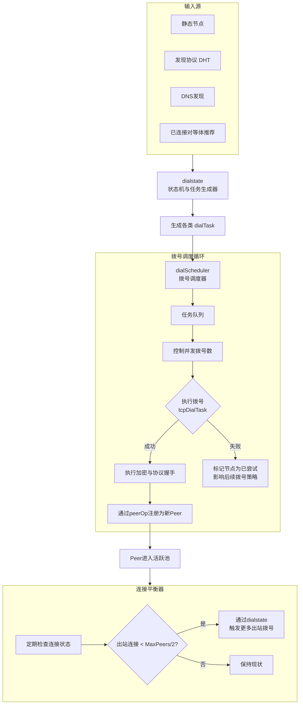
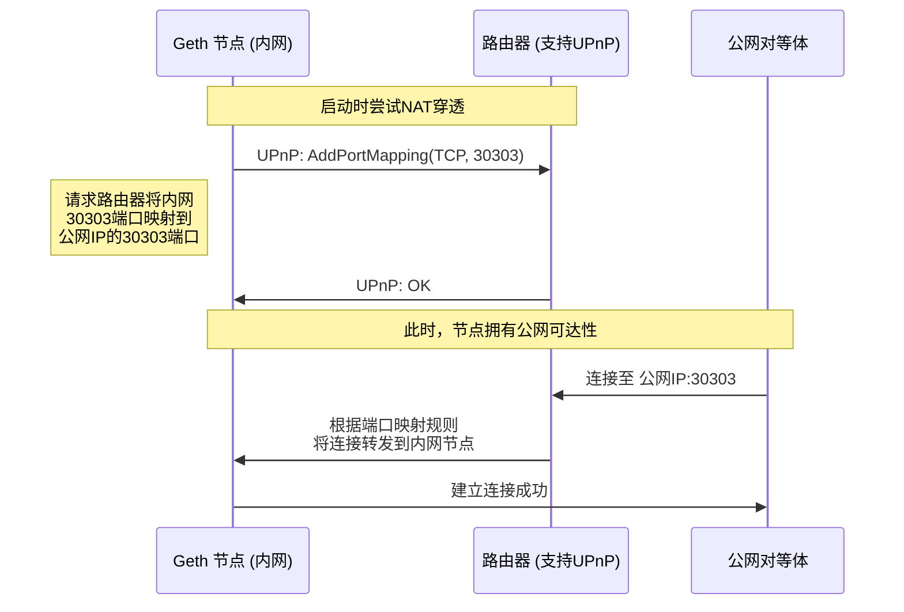

本专题关注的是 Geth 如何智能地管理其网络连接，包括主动与谁连接、如何避免过度连接、以及如何应对各种网络环境（如 NAT）。这是保证节点网络健康、高效和稳定的关键。

---

### **连接策略、拨号调度与网络优化**

#### **1. 概述与目标**

Geth 节点不能盲目地与所有发现的节点建立连接。资源（如带宽、文件描述符、内存）是有限的。因此，它需要一套精密的策略来管理连接。

**核心目标：**
1.  **建立健康拓扑**：努力维持一个连接良好的网络，确保区块和交易能够快速广播。
2.  **资源管理**：在规定的 `MaxPeers` 限制内运行，防止资源耗尽。
3.  **连接平衡**：维持入站和出站连接的平衡，避免节点角色失衡。
4.  **弹性与稳定性**：快速剔除失效节点，并尝试替换它们，保持网络池的活力。
5.  **穿透NAT**：使家庭网络或私有网络中的节点能够被公开访问，增强网络的去中心化程度。

#### **2. 核心架构与流程**

连接管理是一个由多个组件协同工作的动态过程，其核心是 `dialScheduler`。

**流程关键点解析：**

**2.1 拨号任务来源 (`dialstate`)**
`dialstate` 是一个状态机，它从多个来源获取节点信息，并生成不同类型的拨号任务：
*   **`staticDialTask`**：针对配置文件中 `--static-nodes` 指定的节点。这些节点享有最高优先级，会持续尝试连接。
*   **`discoverDialTask`**：从节点发现 DHT (`discover.Table`) 中获取的随机节点。这是新连接的主要来源。
*   **`dnsDialTask`**：通过 DNS 发现协议获取的节点列表。

**2.2 拨号调度器 (`dialScheduler`)**
调度器是执行引擎，它管理一个任务队列，并负责：
*   **并发控制**：通过 `maxDynDial` 等配置限制同时进行的动态拨号数量，防止网络拥塞。
*   **任务调度**：从队列中取出任务并执行。它使用一个 **拨号组** 的概念，对同一IP段的并发拨号进行限制，防止过度连接单个网络。
*   **状态管理**：记录拨号成功与失败的历史。对于频繁失败的节点，会实施 **指数退避** 策略，避免无意义的重复尝试。

**2.3 连接平衡策略**
这是策略的核心。Geth 努力维持：
`出站连接数 ≈ 入站连接数 ≈ MaxPeers / 2`

*   **检查机制**：定期检查当前的连接比例。
*   **动态调整**：如果出站连接过少，`dialstate` 会被触发生成更多的出站拨号任务。反之，则会减少。这确保了节点既是客户端也是服务器，形成了更健康的对等网络。

**2.4 主动连接与被动接受**
一个健康的节点应该同时具备这两种连接：
*   **出站连接**：主动选择连接到的节点，有助于连接到网络中的稳定骨干节点。
*   **入站连接**：被其他节点连接，这代表了节点在网络中的声誉和可用性。为了能接受入站连接，节点需要解决 **NAT 穿透** 问题。

#### **3. NAT穿透与UPnP**

对于位于家庭路由器后的节点，其IP是私有的，无法被公网直接访问。Geth 使用 NAT 穿透技术来解决这个问题。

*   **实现**：代码在 `p2p/nat/nat.go` 中。它使用 **UPnP** 或 **NAT-PMP** 协议与本地路由器通信，自动配置端口转发规则。
*   **重要性**：成功的 NAT 穿透极大地提升了节点的可连接性，使其能接受更多入站连接，从而更有效地为网络做贡献（如广播交易和区块）。

#### **4. 关键源代码文件路径**

*   **拨号调度核心**:
    *   `p2p/dial.go`：包含 `dialScheduler` 结构体和其主要循环 `loop`。
    *   `p2p/dialstate.go`：包含 `dialstate` 状态机和各种 `dialTask` 的定义（如 `staticDialTask`, `discoverDialTask`）。
*   **连接平衡逻辑**:
    *   `p2p/server.go`：在 `Server.run` 方法中，有定期检查连接计数并触发拨号的逻辑。
*   **NAT穿透**:
    *   `p2p/nat/nat.go`：定义了 `Interface` 和具体的 UPnP、PMP 实现。
*   **静态节点与DNS发现**:
    *   `p2p/nodes.go`：解析和管理静态节点。
    *   `p2p/dnsdisc`：DNS 发现的客户端实现。

#### **5. 总结**

Geth 的连接策略和拨号调度是一个高度自适应和智能的系统。它不仅仅是简单地建立连接，而是通过一套复杂的策略来优化整个节点的网络位置和健康状况。

1.  **多源发现**：结合静态、动态发现和DNS，确保连接源的多样性。
2.  **智能调度**：通过并发控制、频率限制和退避算法，高效且友好地管理拨号行为。
3.  **平衡优先**：强制性的出站/入站连接平衡策略，是构建健壮、去中心化 P2P 网络的关键。
4.  **环境适应**：通过 NAT 穿透技术，克服了常见的网络环境障碍，使更多节点能成为合格的网络公民。

这套精密的系统确保了 Geth 节点能够在全球范围内自组织成一个高效、稳定且具有弹性的以太坊网络。