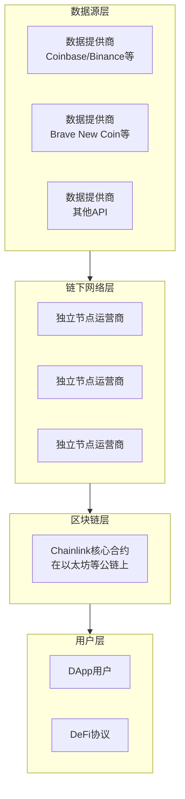
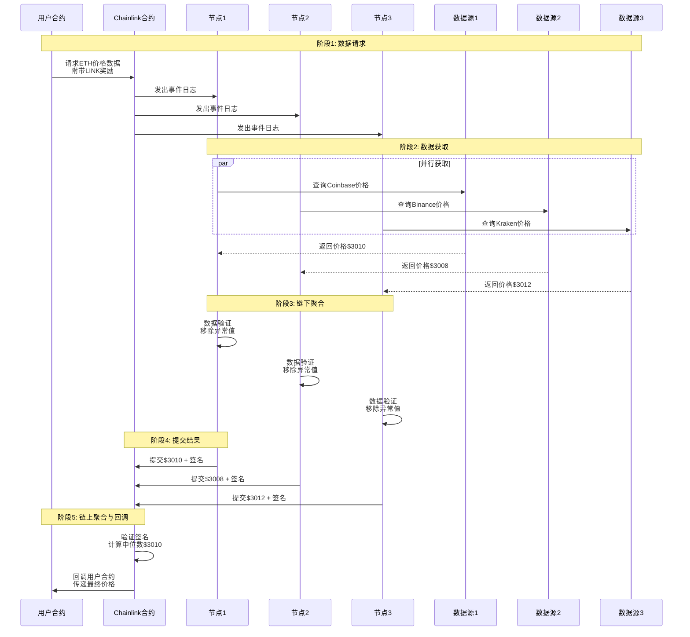

## 1. Chainlink 的本质：一个去中心化的预言机网络

**最准确的描述**：Chainlink 是一个**建立在现有区块链（如以太坊）之上的去中心化预言机网络**。

它利用区块链的安全性和去中心化特性，为智能合约提供可靠的外部数据。

---

## 2. Chainlink 的四个核心层次



### 层次一：链上核心合约（智能合约）

这些是部署在以太坊等区块链上的**智能合约**，负责协调整个网络。

#### 主要合约类型：

**1. 预言机合约**
```solidity
// 简化版的 Chainlink 预言机合约逻辑
contract ChainlinkOracle {
    address[] public authorizedNodes;
    uint256 public requiredResponses;
    
    mapping(bytes32 => Query) public pendingQueries;
    
    struct Query {
        address caller;
        string jobId;
        uint256 payment;
        uint256 expiration;
        string callbackFunction;
        mapping(address => bytes) responses;
        address[] responders;
    }
    
    function fulfillOracleRequest(
        bytes32 _requestId,
        uint256 _payment,
        address _callbackAddress,
        bytes4 _callbackFunctionId,
        uint256 _expiration,
        bytes32 _data
    ) external onlyAuthorizedNode {
        // 验证节点授权
        require(isAuthorizedNode(msg.sender), "Unauthorized node");
        
        // 记录响应
        pendingQueries[_requestId].responses[msg.sender] = _data;
        pendingQueries[_requestId].responders.push(msg.sender);
        
        // 当达到足够响应数量时聚合结果
        if (pendingQueries[_requestId].responders.length >= requiredResponses) {
            _aggregateAndCallback(_requestId);
        }
    }
}
```

**2. 价格馈送合约（最常用）**
```solidity
// Chainlink 价格数据合约
contract AggregatorV3Interface {
    // 核心数据接口
    function latestRoundData() external view returns (
        uint80 roundId,
        int256 answer,      // 价格 * 10^8
        uint256 startedAt,
        uint256 updatedAt,
        uint80 answeredInRound
    );
    
    function decimals() external view returns (uint8);
    function description() external view returns (string memory);
    function version() external view returns (uint256);
}

// 实际使用示例
contract PriceConsumer {
    AggregatorV3Interface internal priceFeed;
    
    constructor(address _priceFeed) {
        priceFeed = AggregatorV3Interface(_priceFeed);
    }
    
    function getLatestPrice() public view returns (int) {
        (
            uint80 roundId, 
            int price,
            uint startedAt,
            uint timeStamp,
            uint80 answeredInRound
        ) = priceFeed.latestRoundData();
        return price;
    }
}
```

### 层次二：链下节点网络（去中心化服务）

这是 Chainlink 的"工作引擎" - 由众多独立的节点运营商组成。

#### 节点架构：
```python
# 简化的 Chainlink 节点核心逻辑
class ChainlinkNode:
    def __init__(self, node_private_key, blockchain_rpc):
        self.private_key = node_private_key
        self.w3 = Web3(Web3.HTTPProvider(blockchain_rpc))
        self.jobs = {}
        
    def run_job(self, job_spec):
        """执行一个数据获取任务"""
        try:
            # 1. 从多个数据源获取数据
            data_sources = job_spec['data_sources']
            all_responses = []
            
            for source in data_sources:
                data = self.fetch_from_source(source)
                all_responses.append(data)
            
            # 2. 数据清洗和验证
            cleaned_data = self.validate_and_clean(all_responses)
            
            # 3. 聚合结果（计算中位数等）
            final_result = self.aggregate_results(cleaned_data)
            
            # 4. 签名并提交到区块链
            self.submit_to_blockchain(job_spec['request_id'], final_result)
            
        except Exception as e:
            self.handle_error(e, job_spec['request_id'])
    
    def fetch_from_source(self, source_config):
        """从单个数据源获取数据"""
        if source_config['type'] == 'http_get':
            response = requests.get(
                source_config['url'],
                headers=source_config.get('headers', {}),
                timeout=10
            )
            return self.parse_response(response, source_config['path'])
        
        elif source_config['type'] == 'websocket':
            # WebSocket 实时数据流
            return self.websocket_fetch(source_config)
```

### 层次三：数据提供商（传统数据服务）

Chainlink 节点从这些**中心化或去中心化的数据源**获取原始数据：

- **交易所API**：Binance, Coinbase, Kraken
- **金融数据提供商**：Brave New Coin, Kaiko
- **传统API**：各种Web API

---

## 3. Chainlink 的工作流程：完整的去中心化数据流



---

## 4. Chainlink 的关键特性：为什么它是"去中心化的"

### 节点去中心化
```solidity
// 节点选择和管理是去中心化的
contract NodeRegistry {
    struct Node {
        address nodeAddress;
        uint256 stakeAmount;    // 质押的LINK代币
        uint256 reputationScore;
        bool isActive;
        uint256[] supportedJobs;
    }
    
    mapping(address => Node) public nodes;
    address[] public activeNodes;
    
    function selectNodesForJob(bytes32 jobId, uint256 count) 
        external view returns (address[] memory selectedNodes) {
        
        // 基于声誉、质押量等算法选择节点
        // 这不是由中心方控制，而是由智能合约逻辑控制
        selectedNodes = new address[](count);
        uint256 selectedCount = 0;
        
        for (uint i = 0; i < activeNodes.length && selectedCount < count; i++) {
            Node storage node = nodes[activeNodes[i]];
            if (node.isActive && _supportsJob(node, jobId)) {
                selectedNodes[selectedCount] = activeNodes[i];
                selectedCount++;
            }
        }
    }
}
```

### 数据源去中心化
每个节点从**多个独立数据源**获取数据，防止单点数据操纵。

### 聚合机制去中心化
- **多节点响应**：需要多个独立节点提交数据
- **链上聚合**：在智能合约中计算最终结果（如中位数）
- **抗操纵**：恶意节点无法单独影响最终结果

---

## 5. 与"中心化服务"的关键区别

| 特性 | 中心化预言机 | Chainlink |
|------|-------------|-----------|
| **控制权** | 单一实体控制 | 多个独立节点运营商 |
| **数据源** | 单一或少数数据源 | 多个独立数据源 |
| **故障点** | 单点故障 | 抗单点故障 |
| **透明度** | 不透明 | 所有操作在链上可验证 |
| **抗审查** | 可被审查 | 去中心化，抗审查 |
| **激励机制** | 公司利润驱动 | LINK代币经济激励 |

---

## 总结

**Chainlink 是一个：**

✅ **智能合约系统** - 在以太坊等公链上运行的协调合约  
✅ **去中心化节点网络** - 由独立运营商组成的链下计算网络  
✅ **数据聚合协议** - 将多源数据聚合成可靠结果的机制  
✅ **经济生态系统** - 由 LINK 代币激励的安全模型  

**Chainlink 不是一个：**

❌ **独立的区块链** - 它建立在现有公链之上  
❌ **中心化服务** - 没有单一控制实体  
❌ **简单的数据API** - 而是包含完整密码学证明的信任机制  

简单来说：**Chainlink = 链上智能合约（协调层）+ 链下去中心化节点网络（执行层）+ 多源数据提供商（数据层）**。这个三层架构共同构成了一个安全、可靠且去中心化的预言机解决方案。

> 其实Chainlink对外的形态就是一个智能合约，其内部实现(所谓的喂价)，就是通过多个分布式服务节点完成的。只是这多个分布式节点可能属于第三方或多个服务商提供，所以也可以认为是取中心化的结构。
> 