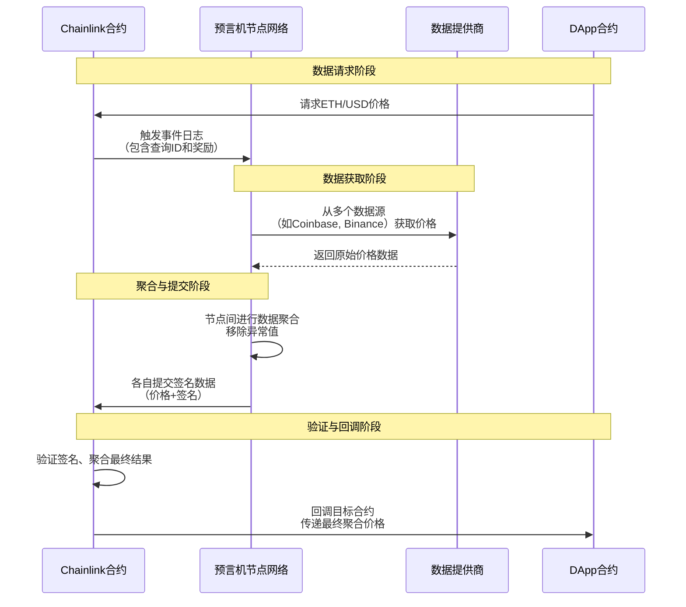

## 1. 价格预言机 - Chainlink

Chainlink 是当前 DeFi 生态中最重要的**去中心化预言机网络**，负责将现实世界和链下数据可靠地传输到区块链上。

### 核心架构与工作原理



### 技术实现细节

#### Chainlink 数据源架构
```solidity
// Chainlink 价格反馈合约的核心逻辑简化版
contract ChainlinkPriceFeed {
    // 最新轮次数据
    struct RoundData {
        uint80 roundId;
        int256 answer;      // 价格 * 10^8
        uint256 startedAt;
        uint256 updatedAt;
        uint80 answeredInRound;
    }
    
    // 关键状态变量
    uint8 public decimals;
    string public description;
    uint256 public version;
    
    mapping(uint80 => RoundData) public rounds;
    uint80 public latestRoundId;
    
    // 获取最新价格的主要接口
    function latestRoundData() external view returns (
        uint80 roundId,
        int256 answer,
        uint256 startedAt,
        uint256 updatedAt,
        uint80 answeredInRound
    ) {
        RoundData memory round = rounds[latestRoundId];
        return (
            round.roundId,
            round.answer,
            round.startedAt,
            round.updatedAt,
            round.answeredInRound
        );
    }
    
    // 由预言机节点网络更新的函数
    function submitRoundData(
        uint80 _roundId,
        int256 _answer,
        uint256 _timestamp,
        uint80 _answeredInRound
    ) external onlyOracle {
        rounds[_roundId] = RoundData({
            roundId: _roundId,
            answer: _answer,
            startedAt: _timestamp,
            updatedAt: block.timestamp,
            answeredInRound: _answeredInRound
        });
        latestRoundId = _roundId;
    }
}
```

#### 在 DeFi 协议中的集成示例
```solidity
contract LendingProtocol {
    ChainlinkPriceFeed public ethPriceFeed;
    uint256 public constant LIQUIDATION_THRESHOLD = 80; // 80%
    
    // 初始化时设置预言机地址
    constructor(address _priceFeed) {
        ethPriceFeed = ChainlinkPriceFeed(_priceFeed);
    }
    
    // 检查抵押品是否充足
    function checkHealth(address user) public view returns (bool isHealthy) {
        uint256 collateralValue = getCollateralValue(user);
        uint256 debtValue = getDebtValue(user);
        
        // 获取最新的ETH价格
        (, int256 ethPrice, , , ) = ethPriceFeed.latestRoundData();
        require(ethPrice > 0, "Invalid price");
        
        uint256 healthFactor = (collateralValue * uint256(ethPrice)) / debtValue;
        return healthFactor > LIQUIDATION_THRESHOLD;
    }
    
    // 执行清算
    function liquidate(address user) external {
        require(!checkHealth(user), "User is not underwater");
        // ... 清算逻辑
    }
}
```

### Chainlink 的优势与安全特性

1. **去中心化节点网络**
   - 多个独立节点运营商
   - 地理分布和客户端多样性
   - 抗单点故障

2. **数据源聚合**
   - 从多个高质量数据源获取
   - 移除异常值，计算加权平均
   - 防止单一数据源被操纵

3. **密码学安全**
   - 节点对数据进行签名
   - 链上验证签名真实性
   - 防止数据篡改

---

## 2. 自建 TWAP 服务

TWAP（时间加权平均价格）是 DEX 原生的价格预言机解决方案，特别适合需要抗操纵价格场景。

### TWAP 深度技术解析

#### 累积器机制
```solidity
// Uniswap V2 TWAP 实现核心
contract UniswapV2Pair {
    uint256 public price0CumulativeLast;
    uint256 public price1CumulativeLast;
    uint32 public blockTimestampLast;
    
    // 储备金
    uint112 private reserve0;
    uint112 private reserve1;
    
    function _update(uint256 balance0, uint256 balance1) internal {
        uint32 blockTimestamp = uint32(block.timestamp % 2**32);
        uint32 timeElapsed = blockTimestamp - blockTimestampLast;
        
        if (timeElapsed > 0 && reserve0 != 0 && reserve1 != 0) {
            // 更新累积价格 = 价格 * 时间
            price0CumulativeLast += uint256(
                UQ112x112.encode(reserve1).uqdiv(reserve0)
            ) * timeElapsed;
            
            price1CumulativeLast += uint256(
                UQ112x112.encode(reserve0).uqdiv(reserve1)
            ) * timeElapsed;
        }
        
        // 更新储备金和时间戳
        reserve0 = uint112(balance0);
        reserve1 = uint112(balance1);
        blockTimestampLast = blockTimestamp;
    }
}
```

#### TWAP 计算服务
```solidity
// 自建 TWAP 预言机服务
contract TWAPOracle {
    struct Observation {
        uint256 timestamp;
        uint256 price0Cumulative;
        uint256 price1Cumulative;
    }
    
    address public immutable pair;
    Observation[] public observations;
    
    constructor(address _pair) {
        pair = _pair;
        // 初始化第一个观察点
        _update();
    }
    
    // 更新价格观察点
    function update() external {
        _update();
    }
    
    function _update() internal {
        (uint256 price0Cumulative, uint256 price1Cumulative,) = 
            UniswapV2Pair(pair).getReserves();
        
        observations.push(Observation({
            timestamp: block.timestamp,
            price0Cumulative: price0Cumulative,
            price1Cumulative: price1Cumulative
        }));
        
        // 保持最近1000个观察点
        if (observations.length > 1000) {
            for (uint i = 0; i < observations.length - 1000; i++) {
                delete observations[i];
            }
        }
    }
    
    // 计算指定时间窗口的 TWAP
    function consult(
        address token, 
        uint256 amountIn, 
        uint256 window
    ) external view returns (uint256 amountOut) {
        require(observations.length >= 2, "Insufficient observations");
        
        uint256 currentIndex = observations.length - 1;
        uint256 previousIndex = currentIndex - 1;
        
        // 找到窗口期开始时的观察点
        while (previousIndex > 0 && 
               observations[currentIndex].timestamp - observations[previousIndex].timestamp < window) {
            previousIndex--;
        }
        
        Observation memory older = observations[previousIndex];
        Observation memory current = observations[currentIndex];
        
        uint256 timeElapsed = current.timestamp - older.timestamp;
        require(timeElapsed >= window, "Window too large");
        
        if (token == token0) {
            uint256 priceCumulativeDiff = current.price0Cumulative - older.price0Cumulative;
            uint256 averagePrice = priceCumulativeDiff / timeElapsed;
            amountOut = amountIn * averagePrice / (2**112);
        } else {
            uint256 priceCumulativeDiff = current.price1Cumulative - older.price1Cumulative;
            uint256 averagePrice = priceCumulativeDiff / timeElapsed;
            amountOut = amountIn * averagePrice / (2**112);
        }
    }
}
```

### 链下 TWAP 服务架构

对于需要高性能查询的场景，可以在链下构建 TWAP 服务：

```python
import asyncio
import psycopg2
from web3 import Web3
from datetime import datetime, timedelta

class TWAPService:
    def __init__(self, db_connection, w3_provider):
        self.db = db_connection
        self.w3 = w3_provider
        self.cache = {}
    
    async def start_twap_calculation(self):
        """启动TWAP计算服务"""
        while True:
            try:
                await self._update_reserves()
                await self._calculate_twap_windows()
                await asyncio.sleep(12)  # 每个区块更新一次
            except Exception as e:
                print(f"TWAP calculation error: {e}")
                await asyncio.sleep(60)
    
    async def _update_reserves(self):
        """更新所有交易对的储备金数据"""
        pairs = await self.get_active_pairs()
        
        for pair in pairs:
            contract = self.w3.eth.contract(
                address=pair['address'],
                abi=UNISWAP_PAIR_ABI
            )
            
            reserves = contract.functions.getReserves().call()
            block_number = self.w3.eth.block_number
            timestamp = self.w3.eth.get_block(block_number)['timestamp']
            
            # 存储到数据库
            await self.store_reserves(
                pair['address'],
                reserves[0],
                reserves[1],
                timestamp,
                block_number
            )
    
    async def get_twap_price(self, pair_address, window_minutes=30):
        """获取指定时间窗口的TWAP价格"""
        cache_key = f"{pair_address}_{window_minutes}"
        
        # 检查缓存
        if cache_key in self.cache:
            cached_data = self.cache[cache_key]
            if datetime.now() - cached_data['timestamp'] < timedelta(seconds=30):
                return cached_data['price']
        
        # 从数据库计算TWAP
        query = """
        SELECT 
            AVG(price) as twap_price,
            COUNT(*) as sample_count
        FROM (
            SELECT 
                reserve1 / reserve0 as price,
                timestamp
            FROM pair_reserves 
            WHERE pair_address = %s 
            AND timestamp >= NOW() - INTERVAL '%s minutes'
            ORDER BY timestamp
        ) price_history
        """
        
        result = await self.db.fetch_one(query, pair_address, window_minutes)
        
        if result and result['sample_count'] > 0:
            price = float(result['twap_price'])
            # 更新缓存
            self.cache[cache_key] = {
                'price': price,
                'timestamp': datetime.now()
            }
            return price
        
        return None
```

---

## 3. 路径优化器 - 1inch Pathfinder

路径优化器负责为交易找到最优的执行路径，考虑不同 DEX 的流动性、手续费和价格影响。

### 路径查找算法核心

```python
from typing import List, Dict, Tuple
import heapq
import asyncio

class PathFinder:
    def __init__(self, dex_registry, token_registry):
        self.dex_registry = dex_registry
        self.token_registry = token_registry
        self.graph = {}  #  token -> [(dex, target_token, liquidity)]
    
    async def build_liquidity_graph(self):
        """构建流动性图"""
        for dex in self.dex_registry.get_all_dexes():
            pairs = await dex.get_active_pairs()
            
            for pair in pairs:
                token_a, token_b = pair.tokens
                liquidity = pair.reserve0 * pair.reserve1  # 简单流动性度量
                
                # 添加双向边
                self._add_edge(token_a, token_b, dex, liquidity)
                self._add_edge(token_b, token_a, dex, liquidity)
    
    def _add_edge(self, from_token, to_token, dex, liquidity):
        if from_token not in self.graph:
            self.graph[from_token] = []
        self.graph[from_token].append((dex, to_token, liquidity))
    
    async def find_optimal_path(
        self, 
        from_token: str, 
        to_token: str, 
        amount_in: int,
        max_hops: int = 4
    ) -> Dict:
        """寻找最优交易路径"""
        
        # 使用改进的Dijkstra算法，考虑价格和手续费
        heap = []
        heapq.heappush(heap, (0, amount_in, 0, [from_token], []))
        
        best_path = None
        best_output = 0
        
        visited = set()
        
        while heap:
            current_cost, current_amount, hops, path, dex_path = heapq.heappop(heap)
            
            current_token = path[-1]
            state_key = (current_token, current_amount, hops)
            
            if state_key in visited:
                continue
            visited.add(state_key)
            
            if current_token == to_token:
                if current_amount > best_output:
                    best_output = current_amount
                    best_path = {
                        'path': path,
                        'dex_path': dex_path,
                        'amount_out': current_amount,
                        'hops': hops
                    }
                continue
            
            if hops >= max_hops:
                continue
            
            # 探索所有可能的下一步
            for dex, next_token, liquidity in self.graph.get(current_token, []):
                if next_token in path:  # 避免循环
                    continue
                
                try:
                    # 模拟通过该DEX交易
                    amount_out = await dex.simulate_swap(
                        current_token, 
                        next_token, 
                        current_amount
                    )
                    
                    if amount_out > 0:
                        # 计算"成本"：使用负的amount_out，因为我们要最大化输出
                        cost = -amount_out
                        
                        new_path = path + [next_token]
                        new_dex_path = dex_path + [dex]
                        
                        heapq.heappush(heap, (
                            cost,
                            amount_out,
                            hops + 1,
                            new_path,
                            new_dex_path
                        ))
                        
                except Exception as e:
                    print(f"Simulation failed for {dex.name}: {e}")
                    continue
        
        return best_path
```

### 多路径拆分算法

对于大额交易，单一路径可能滑点过高，需要拆分到多个路径：

```python
class MultiPathFinder:
    async def find_multi_path_split(
        self, 
        from_token: str, 
        to_token: str, 
        total_amount: int,
        max_paths: int = 3
    ) -> List[Dict]:
        """寻找多路径拆分方案"""
        
        # 1. 首先找到前N个最佳路径
        candidate_paths = []
        
        for _ in range(20):  # 探索多个候选
            path = await self.find_optimal_path(from_token, to_token, total_amount)
            if path and path not in candidate_paths:
                candidate_paths.append(path)
        
        # 按输出金额排序
        candidate_paths.sort(key=lambda x: x['amount_out'], reverse=True)
        top_paths = candidate_paths[:max_paths * 2]
        
        # 2. 使用线性规划优化拆分比例
        optimized_split = await self.optimize_split_ratio(top_paths, total_amount)
        
        return optimized_split
    
    async def optimize_split_ratio(self, paths: List[Dict], total_amount: int) -> List[Dict]:
        """优化各路径的分配比例"""
        from scipy.optimize import minimize
        import numpy as np
        
        # 构建价格影响函数
        def price_impact_function(amounts):
            total_output = 0
            for i, path in enumerate(paths):
                # 模拟通过该路径交易指定数量
                output = self.simulate_swap_with_slippage(
                    path, amounts[i]
                )
                total_output += output
            
            # 我们要最大化总输出，所以返回负值
            return -total_output
        
        # 约束条件：分配总额等于总输入量
        constraints = {
            'type': 'eq',
            'fun': lambda x: np.sum(x) - total_amount
        }
        
        # 边界条件：每个路径分配非负
        bounds = [(0, total_amount) for _ in range(len(paths))]
        
        # 初始猜测：平均分配
        x0 = np.array([total_amount / len(paths)] * len(paths))
        
        # 优化
        result = minimize(
            price_impact_function,
            x0,
            method='SLSQP',
            bounds=bounds,
            constraints=constraints
        )
        
        # 构建结果
        optimized_paths = []
        for i, path in enumerate(paths):
            if result.x[i] > total_amount * 0.01:  # 只包含分配超过1%的路径
                optimized_paths.append({
                    'path': path['path'],
                    'dex_path': path['dex_path'],
                    'amount_in': int(result.x[i]),
                    'expected_out': self.simulate_swap_with_slippage(path, int(result.x[i]))
                })
        
        return optimized_paths
```

### 实时路径监控与更新

```python
class RealTimePathOptimizer:
    def __init__(self):
        self.path_cache = {}
        self.last_update = {}
    
    async def get_best_quote(self, from_token, to_token, amount_in):
        """获取实时最优报价"""
        cache_key = f"{from_token}_{to_token}_{amount_in}"
        
        # 检查缓存是否有效（5秒内）
        if (cache_key in self.path_cache and 
            time.time() - self.last_update.get(cache_key, 0) < 5):
            return self.path_cache[cache_key]
        
        # 并行查询多个DEX
        tasks = []
        for dex in self.dex_registry.get_all_dexes():
            task = self._get_dex_quote(dex, from_token, to_token, amount_in)
            tasks.append(task)
        
        quotes = await asyncio.gather(*tasks, return_exceptions=True)
        
        # 过滤有效报价并选择最佳
        valid_quotes = []
        for quote in quotes:
            if isinstance(quote, dict) and quote['success']:
                valid_quotes.append(quote)
        
        if valid_quotes:
            best_quote = max(valid_quotes, key=lambda x: x['amount_out'])
            
            # 更新缓存
            self.path_cache[cache_key] = best_quote
            self.last_update[cache_key] = time.time()
            
            return best_quote
        
        return None
    
    async def _get_dex_quote(self, dex, from_token, to_token, amount_in):
        """获取单个DEX的报价"""
        try:
            # 直接路径报价
            direct_quote = await dex.get_quote(from_token, to_token, amount_in)
            
            # 多跳路径报价
            multi_hop_quotes = await self._find_multi_hop_quotes(
                dex, from_token, to_token, amount_in
            )
            
            # 选择最佳报价
            all_quotes = [direct_quote] + multi_hop_quotes
            valid_quotes = [q for q in all_quotes if q['amount_out'] > 0]
            
            if valid_quotes:
                best = max(valid_quotes, key=lambda x: x['amount_out'])
                return {
                    'success': True,
                    'dex': dex.name,
                    'amount_out': best['amount_out'],
                    'path': best['path'],
                    'gas_estimate': best.get('gas_estimate', 0)
                }
            
        except Exception as e:
            print(f"Quote failed for {dex.name}: {e}")
        
        return {'success': False}
```

## 总结

这三类价格服务各有侧重：

1. **Chainlink** - 提供**可靠的外部价格基准**，适合清算、定价等安全关键场景
2. **自建 TWAP** - 提供**抗操纵的链上平均价格**，适合需要防MEV的场景  
3. **路径优化器** - 提供**最优执行价格**，为用户节省交易成本

在现代 DEX 架构中，这三者通常协同工作：
- 使用 Chainlink 作为价格基准和安全后备
- 使用 TWAP 为高级交易策略提供数据
- 使用路径优化器确保用户获得最佳成交价

这种多层次的价格服务体系共同构成了健壮、高效且用户友好的 DeFi 交易基础设施。