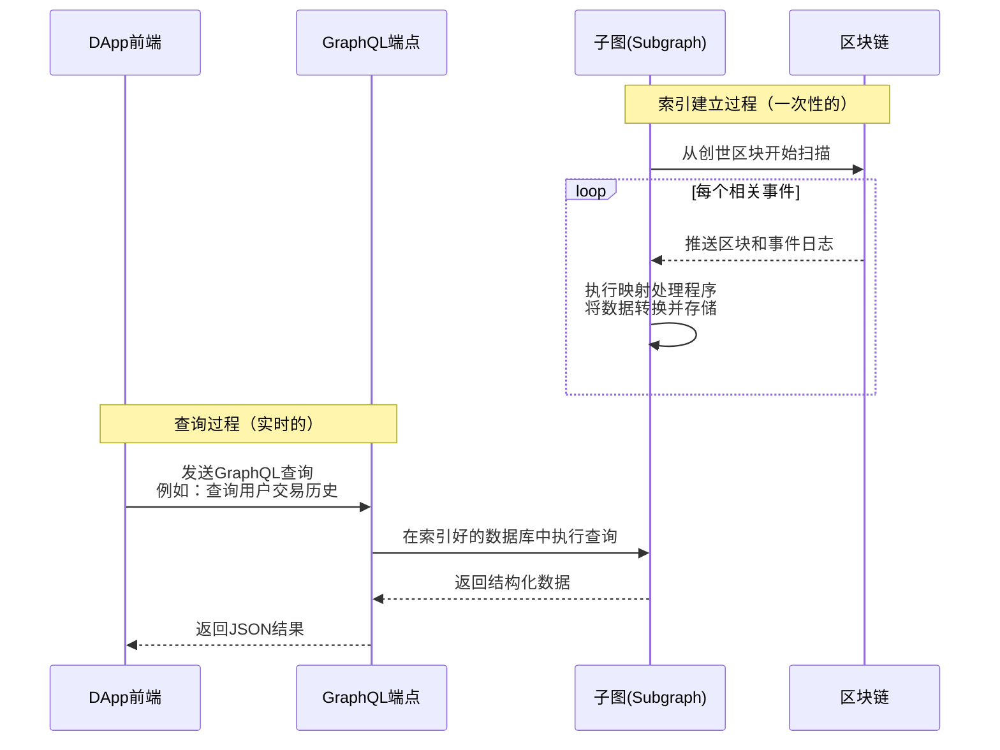
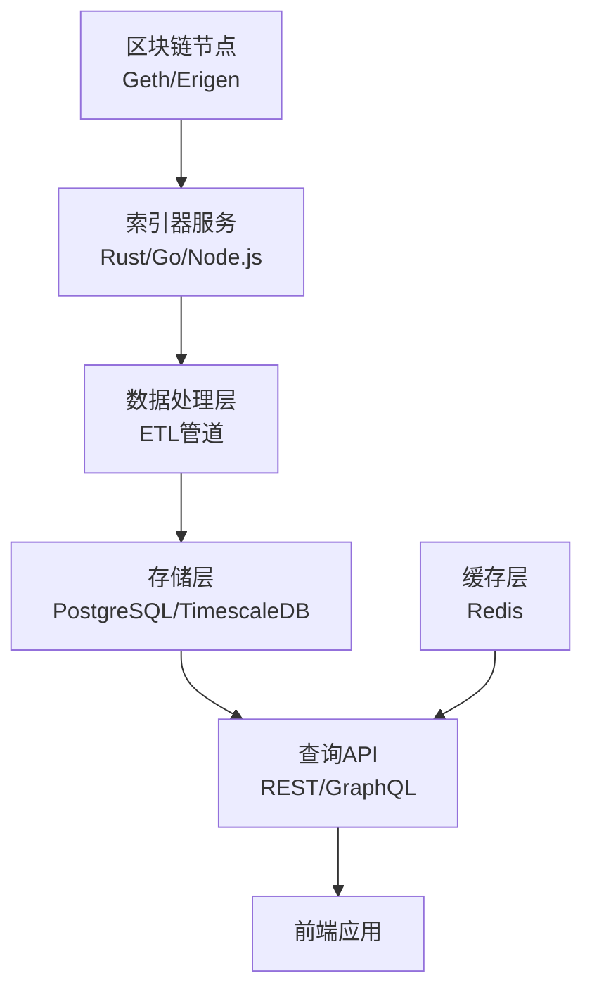

## 数据索引服务：DEX 的"搜索引擎"

**核心问题**：区块链本身是为确定性状态机设计的，而不是为了高效查询。直接从链上（通过 RPC）获取以下信息非常缓慢且昂贵：
- "过去24小时这个交易对的交易量是多少？"
- "这个地址所有的流动性提供历史？"
- "按照交易量排序前10的交易对是哪些？"

数据索引服务就是为了解决这个问题而生的。

---

## 1. The Graph - 去中心化索引协议

The Graph 是目前 DeFi 领域最主流的索引解决方案，可以理解为"区块链的 Google"。

### 工作原理



### 核心概念

**子图**：一个完整的索引配置，包含三个部分：
1. **子图清单**：定义要索引的区块链、合约地址、关注的事件
2. **模式**：定义要存储的数据实体及其关系
3. **映射**：将链上事件转换为实体数据的处理逻辑

### 实际示例：Uniswap V2 子图

```graphql
# 前端查询示例：获取ETH-USDC交易对信息
{
  pair(id: "0xb4e16d0168e52d35cacd2c6185b44281ec28c9dc") {
    id
    token0 {
      symbol
      name
    }
    token1 {
      symbol
      name
    }
    reserve0
    reserve1
    reserveUSD
    volumeUSD
    txCount
  }
  
  # 获取该交易对最近的交易
  swaps(
    first: 10
    where: { pair: "0xb4e16d0168e52d35cacd2c6185b44281ec28c9dc" }
    orderBy: timestamp
    orderDirection: desc
  ) {
    amount0In
    amount0Out
    amount1In
    amount1Out
    amountUSD
    timestamp
  }
}
```

### 优缺点分析

**优点**：
- **标准化**：几乎所有主流 DEX 都有官方维护的子图
- **无需维护基础设施**：使用托管服务即可
- **查询性能优秀**：专门的 GraphQL 端点，响应快速
- **去中心化**：有去中心化网络版本，抗审查

**缺点**：
- **黑盒操作**：对数据处理逻辑控制有限
- **成本**：查询量大会产生费用
- **灵活性限制**：复杂业务逻辑难以实现

---

## 2. 自建 Indexer - 完全控制方案

当 The Graph 无法满足定制化需求或需要更高性能时，团队会选择自建索引器。

### 技术架构选择



### 实现细节

#### 使用 Rust 构建的高性能索引器
```rust
// 简化示例：处理 Swap 事件
#[derive(Debug, Clone)]
pub struct SwapEvent {
    pub sender: Address,
    pub amount0_in: U256,
    pub amount1_in: U256,
    pub amount0_out: U256,
    pub amount1_out: U256,
    pub to: Address,
}

pub async fn process_swap_event(
    pool: &PgPool,
    event: &SwapEvent,
    block: &Block,
    tx_hash: H256,
) -> Result<(), anyhow::Error> {
    // 1. 解析交易对地址
    let pair_address = get_pair_address_from_tx(tx_hash).await?;
    
    // 2. 更新交易对储备金
    update_pair_reserves(pool, &pair_address, event).await?;
    
    // 3. 记录交易历史
    record_swap_transaction(pool, event, block, tx_hash, &pair_address).await?;
    
    // 4. 更新24小时交易量统计
    update_volume_metrics(pool, &pair_address, event).await?;
    
    Ok(())
}
```

#### 数据库 schema 设计要点
```sql
-- 交易对表
CREATE TABLE pairs (
    id SERIAL PRIMARY KEY,
    address VARCHAR(42) UNIQUE NOT NULL,
    token0 VARCHAR(42) NOT NULL,
    token1 VARCHAR(42) NOT NULL,
    reserve0 NUMERIC(78, 18),
    reserve1 NUMERIC(78, 18),
    reserve_usd NUMERIC(20, 2),
    volume_24h NUMERIC(20, 2),
    updated_at TIMESTAMP DEFAULT NOW()
);

-- 交易历史表（分区表优化）
CREATE TABLE swaps (
    id BIGSERIAL,
    pair_address VARCHAR(42) NOT NULL,
    tx_hash VARCHAR(66) NOT NULL,
    amount0_in NUMERIC(78, 18),
    amount1_in NUMERIC(78, 18),
    amount0_out NUMERIC(78, 18),
    amount1_out NUMERIC(78, 18),
    amount_usd NUMERIC(20, 2),
    block_number BIGINT NOT NULL,
    block_timestamp TIMESTAMP NOT NULL
) PARTITION BY RANGE (block_timestamp);

-- 创建每日分区
CREATE TABLE swaps_2024_01_01 PARTITION OF swaps 
    FOR VALUES FROM ('2024-01-01') TO ('2024-01-02');
```

### 处理区块重组

这是自建索引器最复杂的技术挑战。

```python
class ReorgHandler:
    def __init__(self, db, max_reorg_depth=100):
        self.db = db
        self.max_reorg_depth = max_reorg_depth
    
    async def handle_reorg(self, new_head_block: int):
        """处理区块重组"""
        current_head = await self.get_current_head_block()
        
        if new_head_block < current_head:
            # 检测到重组，需要回滚
            depth = current_head - new_head_block
            if depth > self.max_reorg_depth:
                raise Exception("Reorg too deep, manual intervention required")
            
            logger.info(f"Detected reorg of {depth} blocks")
            await self.rollback_blocks(depth)
    
    async def rollback_blocks(self, depth: int):
        """回滚指定数量的区块"""
        start_block = await self.get_current_head_block() - depth + 1
        
        # 按顺序回滚相关数据
        await self.rollback_swaps(start_block)
        await self.rollback_pair_states(start_block)
        await self.rollback_volume_metrics(start_block)
        
        # 更新最新区块指针
        await self.update_head_block(start_block - 1)
```

---

## 3. ETH Logs + PostgreSQL - 高性能定制方案

这是大型交易所和专业交易平台常用的方案，在灵活性和性能之间取得最佳平衡。

### 架构特点

1. **事件驱动的数据处理**：
```python
# 使用 web3.py 监听事件
from web3 import Web3

def setup_event_listeners(w3, db):
    # 设置过滤器监听 Swap 事件
    swap_filter = w3.eth.filter({
        'address': UNISWAP_FACTORY_ADDRESS,
        'topics': [SWAP_EVENT_TOPIC]
    })
    
    while True:
        for event in swap_filter.get_new_entries():
            process_swap_event(event, db)
        time.sleep(1)
```

2. **物化视图优化查询**：
```sql
-- 为热门查询创建物化视图
CREATE MATERIALIZED VIEW pair_volume_24h AS
SELECT 
    pair_address,
    SUM(amount_usd) as volume_usd,
    COUNT(*) as trade_count
FROM swaps 
WHERE block_timestamp >= NOW() - INTERVAL '24 hours'
GROUP BY pair_address;

-- 定期刷新（每5分钟）
REFRESH MATERIALIZED VIEW CONCURRENTLY pair_volume_24h;
```

3. **TimescaleDB 用于时间序列数据**：
```sql
-- 将交易表转换为超表
SELECT create_hypertable('swaps', 'block_timestamp');

-- 时间序列聚合查询（性能极佳）
SELECT 
    time_bucket('1 hour', block_timestamp) as bucket,
    pair_address,
    SUM(amount_usd) as hourly_volume
FROM swaps
WHERE block_timestamp >= NOW() - INTERVAL '7 days'
GROUP BY bucket, pair_address
ORDER BY bucket DESC;
```

---

## 技术选型建议

| 场景 | 推荐方案 | 理由 |
|------|----------|------|
| **快速上线 MVP** | The Graph 托管服务 | 开发速度快，无需基础设施维护 |
| **中等规模 DEX** | The Graph + 自建补充索引器 | 平衡开发效率与定制需求 |
| **大型交易所** | 自建索引器（Rust/Go）+ PostgreSQL/TimescaleDB | 极致性能，完全控制 |
| **专业交易分析** | 多链索引器 + 列式数据库（ClickHouse） | 处理海量历史数据分析 |

## 最佳实践

1. **始终处理区块重组**：在生产环境中必须实现完善的重组处理逻辑
2. **监控索引延迟**：设置警报监控索引器与最新区块的差距
3. **数据库优化**：使用连接池、适当索引、查询优化
4. **错误处理与重试**：对 RPC 调用实现指数退避重试机制
5. **数据验证**：定期将索引数据与链上状态进行交叉验证

数据索引服务是现代 DEX 不可或缺的基础设施，它直接影响用户体验、交易决策和平台可靠性。选择合适的技术方案需要权衡开发资源、性能需求和长期维护成本。