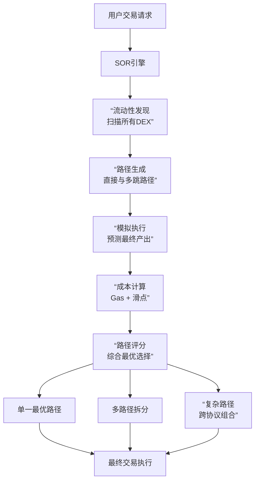

好的，我们来深入探讨现代 DEX 和聚合器用来优化交易执行、保护用户免受损失的核心技术。这些技术共同构成了当今 DeFi 交易的基础设施。

---

## 1. Smart Order Routing - 智能订单路由

SOR 是聚合器的大脑，它的任务是在众多流动性来源中为用户的交易找到最佳执行路径。

### 工作原理深度解析



### 技术实现：多维度评分算法

```python
class SmartOrderRouter:
    def __init__(self, dex_registry, gas_calculator):
        self.dex_registry = dex_registry
        self.gas_calculator = gas_calculator
        
    async def find_optimal_route(self, token_in, token_out, amount_in):
        """寻找最优交易路径"""
        
        # 获取所有可能的流动性源
        liquidity_sources = await self.discover_liquidity_sources(token_in, token_out)
        
        routes = []
        
        # 评估每个可能的路径
        for source in liquidity_sources:
            route = await self.evaluate_route(source, token_in, token_out, amount_in)
            if route and route['expected_output'] > 0:
                routes.append(route)
        
        # 多维度评分
        scored_routes = []
        for route in routes:
            score = self.calculate_route_score(route)
            scored_routes.append((score, route))
        
        # 返回最佳路径
        scored_routes.sort(reverse=True)
        return scored_routes[0][1] if scored_routes else None
    
    def calculate_route_score(self, route):
        """计算路径综合评分"""
        base_score = route['expected_output']
        
        # 惩罚高Gas消耗
        gas_penalty = route['gas_estimate'] * self.gas_calculator.get_gas_price()
        
        # 奖励高可靠性来源
        reliability_bonus = route['liquidity_source']['reliability'] * 0.01
        
        # 惩罚复杂路径（更多跳数 = 更多失败点）
        complexity_penalty = len(route['path']) * 0.001
        
        final_score = base_score - gas_penalty + reliability_bonus - complexity_penalty
        return final_score
```

### 实时市场数据集成

```python
class RealTimeMarketData:
    async def get_effective_exchange_rates(self, token_in, token_out, amount_in):
        """获取实时有效汇率，考虑流动性深度"""
        
        rates = {}
        
        # 并行查询所有DEX
        tasks = []
        for dex in self.supported_dexes:
            task = self.get_dex_quote(dex, token_in, token_out, amount_in)
            tasks.append(task)
        
        results = await asyncio.gather(*tasks, return_exceptions=True)
        
        for i, result in enumerate(results):
            if isinstance(result, dict) and result['success']:
                dex = self.supported_dexes[i]
                rates[dex.name] = {
                    'rate': result['amount_out'] / amount_in,
                    'liquidity_depth': result.get('liquidity_depth', 0),
                    'slippage': result.get('slippage', 0),
                    'timestamp': time.time()
                }
        
        return rates
```

---

## 2. 多路径分拆交易

对于大额交易，单一DEX无法承受高滑点，需要将交易拆分到多个路径。

### 拆分算法实现

```python
class MultiPathSplitter:
    def __init__(self, max_paths=5, min_split_ratio=0.01):
        self.max_paths = max_paths
        self.min_split_ratio = min_split_ratio  # 最小分配比例1%
    
    async def optimize_split(self, token_in, token_out, total_amount):
        """优化多路径拆分方案"""
        
        # 1. 发现候选路径
        candidate_paths = await self.find_candidate_paths(token_in, token_out, total_amount)
        
        if not candidate_paths:
            return None
        
        # 2. 构建优化问题
        def objective_function(split_ratios):
            """目标函数：最大化总输出"""
            total_output = 0
            for i, path in enumerate(candidate_paths):
                amount_allocated = split_ratios[i] * total_amount
                if amount_allocated > 0:
                    # 考虑各路径的价格影响函数
                    output = self.simulate_with_slippage(path, amount_allocated)
                    total_output += output
            return -total_output  # 负号因为我们要最小化目标
        
        # 3. 约束条件
        constraints = [
            # 分配总和为100%
            {'type': 'eq', 'fun': lambda x: np.sum(x) - 1.0},
            # 每个路径分配非负
            {'type': 'ineq', 'fun': lambda x: x}
        ]
        
        # 4. 边界条件
        bounds = [(0, 1) for _ in range(len(candidate_paths))]
        
        # 5. 初始猜测：按流动性比例分配
        initial_guess = self.get_liquidity_based_split(candidate_paths)
        
        # 6. 求解优化问题
        result = minimize(
            objective_function,
            initial_guess,
            method='SLSQP',
            bounds=bounds,
            constraints=constraints
        )
        
        return self.format_split_result(result, candidate_paths, total_amount)
```

### 价格影响建模

```python
def calculate_slippage(self, pool, amount_in, direction):
    """精确计算Uniswap V2/V3风格AMM的滑点"""
    
    if pool.version == 'v2':
        return self.v2_slippage(pool, amount_in, direction)
    elif pool.version == 'v3':
        return self.v3_slippage(pool, amount_in, direction)
    
def v2_slippage(self, pool, amount_in, direction):
    """V2恒定乘积滑点计算"""
    if direction == 'in':
        x, y = pool.reserve0, pool.reserve1
    else:
        x, y = pool.reserve1, pool.reserve0
    
    # 恒定乘积公式
    k = x * y
    new_x = x + amount_in
    new_y = k / new_x
    output = y - new_y
    
    # 计算价格影响
    initial_price = y / x
    final_price = new_y / new_x
    price_impact = (initial_price - final_price) / initial_price
    
    return {
        'output': output,
        'price_impact': price_impact,
        'effective_price': output / amount_in
    }
```

---

## 3. 模拟执行交易

在真正上链前预先模拟交易结果，防止失败和优化执行。

### Staticcall 模拟系统

```python
class TransactionSimulator:
    def __init__(self, web3_provider, network_id):
        self.w3 = web3_provider
        self.network_id = network_id
        
    async def simulate_swap(self, swap_transaction, block_number='latest'):
        """模拟交易执行"""
        
        try:
            # 创建模拟调用
            simulation_result = await self.w3.eth.call(
                {
                    'from': swap_transaction['from'],
                    'to': swap_transaction['to'],
                    'data': swap_transaction['data'],
                    'value': swap_transaction.get('value', 0),
                    'gas': swap_transaction.get('gas', 10_000_000)
                },
                block_identifier=block_number
            )
            
            # 解析模拟结果
            decoded_result = self.decode_simulation_result(
                simulation_result, 
                swap_transaction['expected_output_type']
            )
            
            return {
                'success': True,
                'output_amount': decoded_result['amount_out'],
                'gas_used': decoded_result.get('gas_used', 0),
                'error': None
            }
            
        except Exception as e:
            return {
                'success': False,
                'output_amount': 0,
                'gas_used': 0,
                'error': str(e)
            }
    
    async def batch_simulate(self, transactions, concurrency=10):
        """批量模拟交易，提高效率"""
        
        semaphore = asyncio.Semaphore(concurrency)
        
        async def simulate_with_semaphore(tx):
            async with semaphore:
                return await self.simulate_swap(tx)
        
        tasks = [simulate_with_semaphore(tx) for tx in transactions]
        return await asyncio.gather(*tasks)
```

### Tenderly Simulation API 集成

```python
class TenderlySimulator:
    def __init__(self, api_key, project_slug):
        self.api_key = api_key
        self.project_slug = project_slug
        self.base_url = "https://api.tenderly.co/api/v1"
        
    async def simulate_complex_bundle(self, transactions, state_overrides=None):
        """使用Tenderly模拟复杂交易包"""
        
        simulation_payload = {
            "network_id": "1",  # 以太坊主网
            "from": transactions[0]['from'],
            "to": transactions[0]['to'],
            "input": transactions[0]['data'],
            "gas": 8000000,
            "gas_price": "0",
            "value": transactions[0].get('value', '0'),
            "save": True,
            "save_if_fails": True,
            "state_objects": state_overrides or {}
        }
        
        headers = {
            "X-Access-Key": self.api_key,
            "Content-Type": "application/json"
        }
        
        async with aiohttp.ClientSession() as session:
            async with session.post(
                f"{self.base_url}/account/{self.project_slug}/project/{self.project_slug}/simulate",
                json=simulation_payload,
                headers=headers
            ) as response:
                result = await response.json()
                
                return self.parse_tenderly_result(result)
    
    def parse_tenderly_result(self, result):
        """解析Tenderly模拟结果"""
        
        simulation = result.get('simulation', {})
        transaction = simulation.get('transaction', {})
        
        return {
            'success': transaction.get('status', False),
            'gas_used': transaction.get('gas_used', 0),
            'output': transaction.get('transaction_info', {}).get('call_trace', {}),
            'logs': simulation.get('logs', []),
            'error': simulation.get('error_message'),
            'simulation_url': result.get('share_url')
        }
```

---

## 4. MEV 防护技术

### Flashbots 集成保护

```python
class MEVProtectionService:
    def __init__(self, flashbots_private_key, provider_url):
        self.flashbots_private_key = flashbots_private_key
        self.provider_url = provider_url
        self.w3 = Web3(Web3.HTTPProvider(provider_url))
        
    async def submit_private_transaction(self, signed_transaction, options=None):
        """通过Flashbots提交私有交易"""
        
        flashbots = Flashbots(self.w3, self.flashbots_private_key)
        
        # 构建交易包
        bundle = [
            {
                "signed_transaction": signed_transaction.rawTransaction.hex(),
                "can_revert": False
            }
        ]
        
        # 目标区块范围
        target_blocks = list(range(
            await self.w3.eth.block_number + 1,
            await self.w3.eth.block_number + 4  # 未来3个区块
        ))
        
        # 提交到Flashbots中继
        for block in target_blocks:
            try:
                result = await flashbots.simulate_bundle(bundle, block)
                if result['success']:
                    submission_result = await flashbots.send_bundle(bundle, block)
                    return {
                        'success': True,
                        'bundle_hash': submission_result['bundleHash'],
                        'target_block': block,
                        'simulation_success': True
                    }
            except Exception as e:
                continue
        
        return {'success': False, 'error': 'Failed to submit to any target block'}
    
    def detect_sandwich_risk(self, token, amount, direction):
        """检测三明治攻击风险"""
        
        risk_factors = []
        
        # 1. 检查交易规模 vs 池子深度
        pool_depth = self.get_pool_depth(token)
        size_ratio = amount / pool_depth
        if size_ratio > 0.05:  # 超过池子5%
            risk_factors.append(f"Large size ratio: {size_ratio:.2%}")
        
        # 2. 检查近期MEV活动
        mev_activity = self.get_recent_mev_activity(token)
        if mev_activity['sandwich_count'] > 0:
            risk_factors.append("Recent sandwich activity detected")
        
        # 3. 检查Gas价格竞争
        if self.is_high_gas_environment():
            risk_factors.append("High gas environment")
        
        risk_score = len(risk_factors)
        
        return {
            'risk_score': risk_score,
            'factors': risk_factors,
            'recommendation': self.get_risk_recommendation(risk_score)
        }
```

### 私有 RPC 保护策略

```python
class PrivateRPCClient:
    def __init__(self, private_rpc_endpoints):
        self.endpoints = private_rpc_endpoints
        self.current_endpoint = 0
        
    async def send_transaction_private(self, signed_tx):
        """通过私有RPC发送交易，避免公开内存池"""
        
        # 随机选择私有RPC端点
        endpoint = self.get_next_endpoint()
        
        payload = {
            "jsonrpc": "2.0",
            "method": "eth_sendRawTransaction",
            "params": [signed_tx.rawTransaction.hex()],
            "id": 1
        }
        
        try:
            async with aiohttp.ClientSession() as session:
                async with session.post(
                    endpoint,
                    json=payload,
                    headers={'Content-Type': 'application/json'}
                ) as response:
                    
                    result = await response.json()
                    
                    if 'error' in result:
                        return {'success': False, 'error': result['error']}
                    else:
                        return {
                            'success': True, 
                            'tx_hash': result['result'],
                            'via_private_rpc': True
                        }
                        
        except Exception as e:
            return {'success': False, 'error': str(e)}
    
    def get_next_endpoint(self):
        """轮询选择RPC端点"""
        endpoint = self.endpoints[self.current_endpoint]
        self.current_endpoint = (self.current_endpoint + 1) % len(self.endpoints)
        return endpoint
```

---

## 5. 三明治攻击防护

### 实时监控与防护

```python
class SandwichProtection:
    def __init__(self, mev_detector, transaction_optimizer):
        self.mev_detector = mev_detector
        self.transaction_optimizer = transaction_optimizer
        
    async def protect_transaction(self, transaction_params):
        """保护交易免受三明治攻击"""
        
        # 1. 风险评估
        risk_assessment = self.mev_detector.assess_sandwich_risk(
            transaction_params['token_in'],
            transaction_params['amount_in'],
            transaction_params['token_out']
        )
        
        protection_strategies = []
        
        # 2. 根据风险等级应用防护策略
        if risk_assessment['risk_score'] >= 3:
            # 高风险：使用最大保护
            protection_strategies.extend([
                'private_mempool',
                'slippage_optimization', 
                'amount_splitting',
                'deadline_reduction'
            ])
        elif risk_assessment['risk_score'] >= 2:
            # 中等风险：标准保护
            protection_strategies.extend([
                'slippage_optimization',
                'deadline_reduction'
            ])
        
        # 3. 应用防护策略
        protected_tx = transaction_params.copy()
        
        for strategy in protection_strategies:
            protected_tx = await self.apply_protection_strategy(strategy, protected_tx)
        
        # 4. 最终模拟验证
        simulation = await self.transaction_optimizer.simulate(protected_tx)
        if not simulation['success']:
            raise Exception(f"Protected transaction simulation failed: {simulation['error']}")
        
        return {
            'protected_transaction': protected_tx,
            'original_risk': risk_assessment,
            'applied_protections': protection_strategies,
            'simulation_result': simulation
        }
    
    async def apply_protection_strategy(self, strategy, transaction):
        """应用具体的防护策略"""
        
        if strategy == 'slippage_optimization':
            # 动态计算最优滑点容忍
            optimal_slippage = await self.calculate_optimal_slippage(transaction)
            transaction['slippage_tolerance'] = optimal_slippage
            
        elif strategy == 'amount_splitting':
            # 拆分大额交易
            if transaction['amount_in'] > self.LARGE_TRADE_THRESHOLD:
                splits = await self.calculate_optimal_splits(transaction)
                transaction['split_strategy'] = splits
                
        elif strategy == 'deadline_reduction':
            # 缩短交易有效期
            transaction['deadline'] = int(time.time()) + 120  # 2分钟
            
        elif strategy == 'private_mempool':
            # 标记使用私有内存池
            transaction['use_private_mempool'] = True
            
        return transaction
```

---

这些技术共同构成了现代 DEX 和聚合器的核心竞争力：在保证用户资金安全的同时，提供最优的交易执行价格。随着 MEV 竞争的加剧，这些防护和优化技术变得越来越重要。