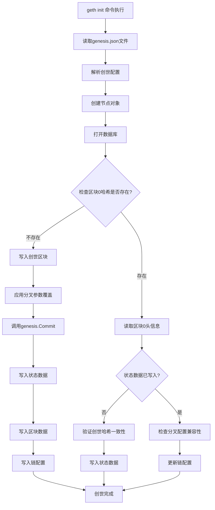

# Geth创世流程解析
生成创世区块，是区块链节点部署的第一步，需要使用包含固定配置的创世文件，通过geth init命令创建0区块内容。并且要求同一条链上所有节点的创世区块哈希必须完全一致。

## 1. 创世配置

创世对象配置如下：
```go
// chain/core/genesis.go
// 创世对象确定了0区块头信息，以及生成的创世区块的状态数据
// 也可以通过链配置指定分叉信息
type Genesis struct {
	// 链配置参数，定义共识算法、硬分叉规则等
	Config     *params.ChainConfig `json:"config"`
	// 随机数，用于工作量证明挖矿
	Nonce      uint64              `json:"nonce"`
	// 创世块时间戳（Unix时间戳）
	Timestamp  uint64              `json:"timestamp"`
	// 额外数据字段，可用于存储任意数据
	ExtraData  []byte              `json:"extraData"`
	// 每个区块的初始Gas限制
	GasLimit   uint64              `json:"gasLimit"   gencodec:"required"`
	// 初始挖矿难度（仅适用于PoW共识）
	Difficulty *big.Int            `json:"difficulty" gencodec:"required"`
	// 混合哈希，用于工作量证明
	Mixhash    common.Hash         `json:"mixHash"`
	// 创世块矿工地址，接收区块奖励
	Coinbase   common.Address      `json:"coinbase"`
	// 初始账户分配，定义创世时的账户余额和合约代码
	Alloc      types.GenesisAlloc  `json:"alloc"      gencodec:"required"`

	// 以下字段主要用于共识测试，在实际创世块中不建议使用，也不要在genesis.json中填写
	
	// 区块号（创世块应为0）
	Number        uint64      `json:"number"`
	// 已使用的Gas量
	GasUsed       uint64      `json:"gasUsed"`
	// 父区块哈希（创世块没有父区块）
	ParentHash    common.Hash `json:"parentHash"`
	// 基础费用（EIP-1559引入，用于费用市场机制）
	BaseFee       *big.Int    `json:"baseFeePerGas"` // EIP-1559
	// 超额Blob Gas（EIP-4844引入，用于blob交易）
	ExcessBlobGas *uint64     `json:"excessBlobGas"` // EIP-4844
	// 已使用的Blob Gas（EIP-4844引入）
	BlobGasUsed   *uint64     `json:"blobGasUsed"`   // EIP-4844
}
```

首先是链配置，主要用来定义链的基本信息，如ID，分叉信息、共识信息，结构简化如下：
```go
// chain/params/config.go
// 链配置是存储在数据库中的，并不在区块内，所以不影响区块哈希，而且可以后继更改
type ChainConfig struct {
	ChainID *big.Int `json:"chainId"` // 链的唯一标识，也用来防止重放攻击

    // 下面是早期基于区块的分叉信息
	HomesteadBlock *big.Int `json:"homesteadBlock,omitempty"` // Homestead switch block (nil = no fork, 0 = already homestead)
	// ...

    // 下面是基于时间的分叉信息
	ShanghaiTime *uint64 `json:"shanghaiTime,omitempty"` // Shanghai switch time (nil = no fork, 0 = already on shanghai)
	// ...


    // 链最终总难度，以太坊中用来进行共识升级判断的（总难度值达到后升级为PoS）
	TerminalTotalDifficulty *big.Int `json:"terminalTotalDifficulty,omitempty"`

    // 标识共识是否已经升级，如果已经升级成功，则使用独立的共识系统
	TerminalTotalDifficultyPassed bool `json:"terminalTotalDifficultyPassed,omitempty"`

	// 下面则是共识配置，一般只会配置一个
	Congress *CongressConfig `json:"congress,omitempty"`
    // ...
}
```

然后就是Alloc，在创世文件中定义初始状态，一般用来分配初始账户、合约等，结构如下：

```go
// chain/core/types/account.go
type GenesisAlloc map[common.Address]Account

type Account struct {
    // 代码，只有合约账户才需要
	Code    []byte                      `json:"code,omitempty"`
    // 初始数据状态，也是合约账户设置的
	Storage map[common.Hash]common.Hash `json:"storage,omitempty"`
    // 初始账户余额，EOA和合约账户都可以设置
	Balance *big.Int                    `json:"balance" gencodec:"required"`
    // 该账户的初始nonce
	Nonce   uint64                      `json:"nonce,omitempty"`

	// 这个测试用的，千万别在创世文件中放密钥，因为这个文件内容是公开的
	PrivateKey []byte `json:"secretKey,omitempty"`
}
```

## 2. 创世命令

创世命令是geth命令的一个子命令，其注册流程如下：

```go
// cmd/geth/chaincmd.go
	initCommand = &cli.Command{
		Action:    initGenesis,
		Name:      "init",
		Usage:     "Bootstrap and initialize a new genesis block",
		ArgsUsage: "<genesisPath>",
		Flags: flags.Merge([]cli.Flag{
			utils.CachePreimagesFlag,
			utils.OverrideShanghai,
			utils.OverrideCancun,
			utils.OverrideVerkle,
		}, utils.DatabaseFlags),
		Description: `
The init command initializes a new genesis block and definition for the network.
This is a destructive action and changes the network in which you will be
participating.

It expects the genesis file as argument.`,
	}
```

## 3. 创世流程

进入initGenesis方法，即开始执行创世流程，如下：

```go
// 读取JSON格式的创世文件，并写入0区块
func initGenesis(ctx *cli.Context) error {
	// 参数检查，必须指定genesis文件
	file, err := os.Open(genesisPath)
	if err != nil {
		utils.Fatalf("Failed to read genesis file: %v", err)
	}
	defer file.Close()

    // 初始化创世对象并从文件反序列化
	genesis := new(core.Genesis)
	if err := json.NewDecoder(file).Decode(genesis); err != nil {
		utils.Fatalf("invalid genesis file: %v", err)
	}

    // 创建节点对象，里面会初始化数据库，可以参考 geth启动流程解析03 中的节点初始化流程
	stack, _ := makeConfigNode(ctx)
	defer stack.Close()

    // 这里设置分叉参数覆盖
	var overrides core.ChainOverrides
	if ctx.IsSet(utils.OverrideShanghai.Name) {
		v := ctx.Uint64(utils.OverrideShanghai.Name)
		overrides.OverrideShanghai = &v
	}
	// ...

    // 分别操作全节点数据库和轻节点数据库
	for _, name := range []string{"chaindata", "lightchaindata"} {
        // 打开数据库（包括ancient），前面geth启动流程中已经分析过
		chaindb, err := stack.OpenDatabaseWithFreezer(name, 0, 0, ctx.String(utils.AncientFlag.Name), "", false)
		if err != nil {
			utils.Fatalf("Failed to open database: %v", err)
		}
		defer chaindb.Close()

        // 数据库封装
		triedb := utils.MakeTrieDatabase(ctx, chaindb, ctx.Bool(utils.CachePreimagesFlag.Name), false, genesis.IsVerkle())
		defer triedb.Close()

        // 设置并写入数据库
		_, hash, err := core.SetupGenesisBlockWithOverride(chaindb, triedb, genesis, &overrides)
		if err != nil {
			utils.Fatalf("Failed to write genesis block: %v", err)
		}
		log.Info("Successfully wrote genesis state", "database", name, "hash", hash)
	}
	return nil
}
```

具体的数据写入逻辑在这里：
```go
// chain/core/genesis.go
func SetupGenesisBlockWithOverride(db ethdb.Database, triedb *triedb.Database, genesis *Genesis, overrides *ChainOverrides) (*params.ChainConfig, common.Hash, error) {
	// 1.入参合法性检查

    // 读取已有的区块0的哈希信息
	stored := rawdb.ReadCanonicalHash(db, 0)
    // 如果区块0哈希不存在，则直接写入
	if (stored == common.Hash{}) {
        // 也没有指定genesis，写个啥
		if genesis == nil {
			log.Info("Writing default main-net genesis block")
            // 啥都没有，就写入代码中硬编码的主网创世配置
			genesis = DefaultGenesisBlock()
		} else {
			log.Info("Writing custom genesis block")
		}
        // 把override传入的参数写入genesis.Config对象
		applyOverrides(genesis.Config)

        // 这一步是具体区块数据写入逻辑，也会包含链配置数据，下面会补充
		block, err := genesis.Commit(db, triedb)
		if err != nil {
			return genesis.Config, common.Hash{}, err
		}
		return genesis.Config, block.Hash(), nil
	}

    // 如果区块0哈希已经存在，根据哈希读取区块头
	header := rawdb.ReadHeader(db, stored, 0)
    // 如果已经存在区块0，但是状态数据没写入，这里可以再次写入
	if header.Root != types.EmptyRootHash && !triedb.Initialized(header.Root) {
		if genesis == nil {
			genesis = DefaultGenesisBlock()
		}
        // 同上
		applyOverrides(genesis.Config)
        // 使用内存创世对象生成区块哈希
		hash := genesis.ToBlock().Hash()
        // 和数据库中的对比，如果不一致，无法创世
		if hash != stored {
			return genesis.Config, hash, &GenesisMismatchError{stored, hash}
		}
        
        // 这一步是具体区块数据写入逻辑，也会包含链配置数据，下面会补充
		block, err := genesis.Commit(db, triedb)
		if err != nil {
			return genesis.Config, hash, err
		}
		return genesis.Config, block.Hash(), nil
	}

	// 这里再次检查创世区块（已经创世，且状态数据已经写入，才会走到这个流程）
	if genesis != nil {
		applyOverrides(genesis.Config)
		hash := genesis.ToBlock().Hash()
        // 再次确认哈希一致
		if hash != stored {
			return genesis.Config, hash, &GenesisMismatchError{stored, hash}
		}
	}
	// 这里会使用存储的哈希，匹配不同网络的创世配置信息（主网、测试网等）
	newcfg := genesis.configOrDefault(stored)
	applyOverrides(newcfg)

    // 检查分叉规则是否冲突（后面的分叉必须依赖前面的分叉启用）
	if err := newcfg.CheckConfigForkOrder(); err != nil {
		return newcfg, common.Hash{}, err
	}

    // 读取恢复数据库中的链配置
	storedcfg := rawdb.ReadChainConfig(db, stored)
	if storedcfg == nil {
		log.Warn("Found genesis block without chain config")
        // 如果数据库中没有，则写入并返回
		rawdb.WriteChainConfig(db, stored, newcfg)
		return newcfg, stored, nil
	}
    // 序列化读取出来的链配置
	storedData, _ := json.Marshal(storedcfg)

    // 如果未指定创世配置，且又不是主网，这里只生效分叉配置
	if genesis == nil && stored != params.MainnetGenesisHash {
		newcfg = storedcfg
		applyOverrides(newcfg)
	}

    // 走到这里，说需要区块头存在，读取区块头
	head := rawdb.ReadHeadHeader(db)
	if head == nil {
		return newcfg, stored, errors.New("missing head header")
	}
    // 检查区块分叉配置兼容性
	compatErr := storedcfg.CheckCompatible(newcfg, head.Number.Uint64(), head.Time)
	if compatErr != nil && ((head.Number.Uint64() != 0 && compatErr.RewindToBlock != 0) || (head.Time != 0 && compatErr.RewindToTime != 0)) {
		return newcfg, stored, compatErr
	}

	// 如果合并覆盖参数后和创世配置不同，则更新本地数据库
	if newData, _ := json.Marshal(newcfg); !bytes.Equal(storedData, newData) {
		rawdb.WriteChainConfig(db, stored, newcfg)
	}
	return newcfg, stored, nil
}


// 这个方法会写入区块和状态数据，也会写如链配置数据
func (g *Genesis) Commit(db ethdb.Database, triedb *triedb.Database) (*types.Block, error) {
    // 将创世配置转换为区块0
	block := g.ToBlock()
	if block.Number().Sign() != 0 {
		return nil, errors.New("can't commit genesis block with number > 0")
	}
	config := g.Config
	if config == nil {
		config = params.AllEthashProtocolChanges
	}
	if err := config.CheckConfigForkOrder(); err != nil {
		return nil, err
	}
	if config.Clique != nil && len(block.Extra()) < 32+crypto.SignatureLength {
		return nil, errors.New("can't start clique chain without signers")
	}

    // 这一步将创世文件中Alloc中的数据持久化到状态数据中
	if err := flushAlloc(&g.Alloc, db, triedb, block.Hash()); err != nil {
		return nil, err
	}
    // 写入区块和收据数据
	rawdb.WriteTd(db, block.Hash(), block.NumberU64(), block.Difficulty())
	rawdb.WriteBlock(db, block)
	rawdb.WriteReceipts(db, block.Hash(), block.NumberU64(), nil)
	rawdb.WriteCanonicalHash(db, block.Hash(), block.NumberU64())
	rawdb.WriteHeadBlockHash(db, block.Hash())
	rawdb.WriteHeadFastBlockHash(db, block.Hash())
	rawdb.WriteHeadHeaderHash(db, block.Hash())
    // 写入链配置数据
	rawdb.WriteChainConfig(db, block.Hash(), config)
	return block, nil
}
```

## 4. 流程总结

根据前面的详细分析，Geth创世流程的整体流程图如下：



### 创世流程关键步骤说明：

1. **命令入口**：`geth init <genesisPath>` 命令触发创世流程
2. **配置解析**：读取并解析JSON格式的创世配置文件
3. **数据库初始化**：打开chaindata和lightchaindata数据库
4. **创世区块检查**：
   - 如果区块0哈希不存在：直接写入创世区块
   - 如果区块0哈希存在：验证状态数据完整性
5. **数据写入**：
   - 状态数据：通过`flushAlloc`写入初始账户分配
   - 区块数据：写入区块头、收据、哈希等信息
   - 链配置：写入ChainConfig到数据库
6. **配置验证**：检查分叉规则兼容性和配置一致性

### 小结
创世流程相对比较简单，但是处理数据这一块稍微复杂一些，因为可以重复执行创世，但又需要保证区块状态不被破坏。
