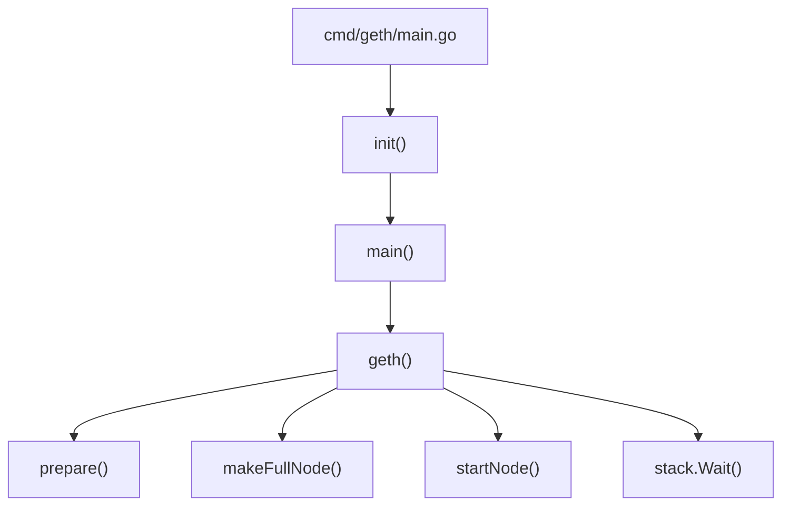

# Geth启动流程解析

## 引言

Geth是以太坊官方的Go语言实现，是接入以太坊网络的重要工具。了解其启动流程有助于我们深入理解以太坊的内部工作机制。本文将详细分析Geth的启动流程及各个环节的实际工作内容。本地代码中做了一些注解，但是看起来不够系统，所以整理成文档，给自己留一个笔记。以后忘记时也能回头参考。

## 启动主流程

Geth启动入口及几个主要方法：



### 1. 程序入口

Geth的程序入口在`cmd/geth/main.go`文件中

这里定义了一个名为app的cli.App对象，并在 init 方法中注册了所有子命令，启动 geth 进程的主命令就在 geth 方法中，另外还注册了一大堆子命令，包括创世、账号管理等，以后会再深入分析。

```go
var app = flags.NewApp("the go-ethereum command line interface")

// 这个方法是 Go 自动调用的，注册 geth命令和子命令的实现逻辑
func init() {
	// Initialize the CLI app and start Geth
	app.Action = geth // 这个是启动主函数
	app.Commands = []*cli.Command{
		// See chaincmd.go:
		initCommand, // 创世命令
        // ...other commands
    }
}
```

还有下面的 main 方法，他会用到上面定义的命令行 app 对象，这里它无关紧要，启动命令行工具逻辑而已，不用关注。
```go
func main() {
	if err := app.Run(os.Args); err != nil {
		fmt.Fprintln(os.Stderr, err)
		os.Exit(1)
	}
}
```

### 2. 启动主函数geth()

当没有指定子命令时，默认会执行geth()函数：

```go
func geth(ctx *cli.Context) error {
	prepare(ctx)
	stack, backend := makeFullNode(ctx)
	defer stack.Close()

	startNode(ctx, stack, backend, false)
	stack.Wait()
	return nil
}
```

此函数执行了完整的节点启动流程，主要包括四个步骤：
1. prepare(ctx) - 准备工作
2. makeFullNode(ctx) - 创建完整节点
3. startNode(ctx, stack, backend, false) - 启动节点
4. stack.Wait() - 等待中断信号

下面我们逐一分析这几个关键步骤。

### 3. prepare()函数

prepare函数不包含什么复杂的逻辑，主要就是一些前置条件检查，各种参数检查，下面是我魔改增加注释的代码：

```go
func prepare(ctx *cli.Context) {
	// If we're running a known preset, log it for convenience.
	switch {
    // 各种测试网络开关检查
	case ctx.IsSet(utils.GoerliFlag.Name):
		log.Info("Starting Geth on Görli testnet...")
    // case .....
    // 检查是否是主网
	case !ctx.IsSet(utils.NetworkIdFlag.Name):
		log.Info("Starting Geth on Ethereum mainnet...")
	}
    // 下面的逻辑是在没有明确指定--cachecache参数，且是主网时，设置缓存默认值4096
    // .....
	ctx.Set(utils.CacheFlag.Name, strconv.Itoa(4096))
    // .....

	// 这里处理指标监控、导出等功能，当前不准备分析（后面我准备单独章节分析 geth 的监控体系）
	utils.SetupMetrics(ctx)

	// 主动搜集系统的一些运行指标
	go metrics.CollectProcessMetrics(3 * time.Second)
}
```

> 注意，这个方法并没有返回值，但是它直接修改了cli.Context对象内的取值，会影响后续逻辑。
> 
### 4. makeFullNode()函数 - 创建完整节点

这是启动流程中最核心的部分，负责创建并配置完整的以太坊节点：

```go
func makeFullNode(ctx *cli.Context) (*node.Node, ethapi.Backend) {
	// 加载配置
	stack, cfg := makeConfigNode(ctx)
	// 注册以太坊服务
	backend, eth := utils.RegisterEthService(stack, &cfg.Eth)
	// 注册其他可选服务(不同版本的代码，这里有不少变动，大致逻辑如此)
    // 这里面注册的东西后面都值得单独分析成文，这里就暂时不深入，东西太多了
	registerShhService(stack, &cfg.Shh)
	registerEthStatsService(stack, backend, cfg.Ethstats.URL)
	registerGraphQLService(stack, backend, cfg.Node)
	registerFilterAPI(stack, backend)
	registerCliqueService(stack, &cfg.Node, &cfg.Eth)
	
	// 如果启用了dashboard，则注册相关服务
	if ctx.GlobalBool(utils.DashboardEnabledFlag.Name) {
		registerDashboard(stack, &cfg.Dashboard, gitCommit, gitDate)
	}
	
	return stack, backend
}
```

makeFullNode主要做了两件事：
1. 调用makeConfigNode(ctx)创建基础节点配置和容器
2. 注册各类服务，主要是以太坊核心服务

#### 4.1 makeConfigNode() - 创建基础配置

下面是makeConfigNode()的魔改代码，里面涉及的一些参数，后面会细化，到时做个链接过来。

```go
func makeConfigNode(ctx *cli.Context) (*node.Node, gethConfig) {
    // 创建默认配置
	cfg := gethConfig{
		Eth:     ethconfig.Defaults,
		Node:    defaultNodeConfig(),
		Metrics: metrics.DefaultConfig,
	}
	// 加载配置文件并合并配置
	if err := loadConfig(file, &cfg); err != nil {
		utils.Fatalf("%v", err)
	}

	// 应用命令行标志，根据命令行参数更新 cfg 配置对象
	utils.SetNodeConfig(ctx, &cfg.Node)

	// 创建Node实例(P2P 节点，并提供 RPC 服务)
	stack, err := node.New(&cfg.Node)
	if err != nil {
		Fatalf("Failed to create the protocol stack: %v", err)
	}
	
	// 应用Eth 服务配置
	utils.SetEthConfig(ctx, stack, &cfg.Eth)
	
	// 应用其他配置
	utils.SetShhConfig(ctx, stack, &cfg.Shh)
	utils.SetDashboardConfig(ctx, &cfg.Dashboard)
	
	return stack, cfg
}
```

#### 4.2 RegisterEthService() - 注册以太坊核心服务

```go
func RegisterEthService(stack *node.Node, cfg *ethconfig.Config) (ethapi.Backend, *eth.Ethereum) {
	// 创建Ethereum实例
	backend, err := eth.New(stack, cfg)
	if err != nil {
		Fatalf("Failed to register the Ethereum service: %v", err)
	}
	
	// 注册debug API
    stack.RegisterAPIs(tracers.APIs(backend.APIBackend))
	
    // 注意这里返回来两个对象，一个是APIBackend，一个就是Ethereum实例
	return backend.APIBackend, backend
}
```

### 5. startNode()函数 - 启动节点

```go
func startNode(ctx *cli.Context, stack *node.Node, backend ethapi.Backend, isConsole bool) {
	// 启动Node
	if err := stack.Start(); err != nil {
		Fatalf("Error starting protocol stack: %v", err)
	}
	
	// 解锁账户（如果配置）
	unlockAccounts(ctx, stack)
	
	// 启动挖矿（如果配置）
	startMining(ctx, stack, backend)
}
```

startNode函数主要完成：
1. 调用stack.Start()启动所有已注册的服务
2. 解锁指定账户（如果有配置）
3. 启动挖矿服务（如果有配置）

### 6. stack.Wait() - 等待中断信号

最后调用stack.Wait()使程序保持运行状态，直到收到中断信号（如Ctrl+C），然后进行清理工作并退出。

## 总结

Geth的启动流程虽然看起来简单，但背后涉及了大量的初始化工作：

1. **配置加载** - 解析命令行参数，加载配置文件
2. **节点创建** - 创建核心Node容器，初始化数据目录和网络
3. **服务注册** - 注册以太坊核心服务及其他可选服务
4. **节点启动** - 启动所有已注册的服务，包括网络、RPC等
5. **运行等待** - 等待外部中断信号

每个环节都有其特定的职责，共同构成了Geth完整的启动流程。