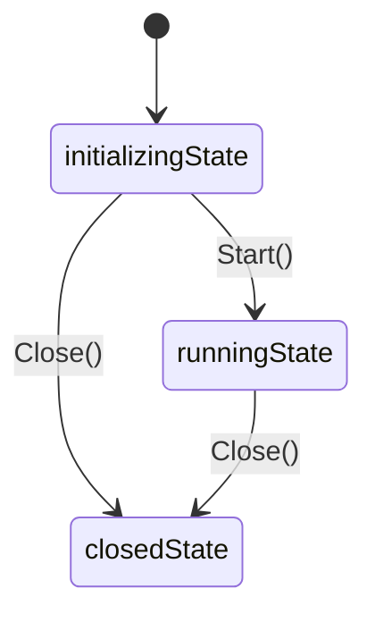

# Geth启动流程解析 - 第三篇：Node节点创建与初始化

## 引言

Node是以太坊节点的核心容器，负责管理各种服务的生命周期。在Geth启动过程中，创建和初始化Node实例是非常关键的一步。本文将深入分析Node的创建过程及其内部机制。

## Node结构分析

Node结构体是Geth中最重要的容器组件：

```go
// node/node.go
type Node struct {
	// 并发锁
	eventmux *event.TypeMux 
	// node配置信息（可参考上一章节的节点配置内容）
	config   *Config
	// 帐号管理器
	accman   *accounts.Manager
	// 日志记录
	log           log.Logger
	keyDir        string        // keystore 存放目录
	keyDirTemp    bool          // 如果为true，生成的keystore目录为临时，停止后会删除
	dirLock       *flock.Flock  // 目录并发锁，避免多个实例使用
	stop          chan struct{} // 终止信号接收Channel

	server        *p2p.Server   // P2P 网络层服务实例
	startStopLock sync.Mutex    // 启动停止锁（这个是在通用锁之上附加）
	state         int           // node生命周期状态 (initializingState/runningState/closedState)

	// 节点内部逻辑通用锁
	lock          sync.Mutex
	lifecycles    []Lifecycle // 所有注册的 backends, services, 和一些辅助的服务lifecycle

    // RPC相关
	rpcAPIs       []rpc.API   // node提供的 APIs
	http          *httpServer //
	ws            *httpServer //
	httpAuth      *httpServer //
	wsAuth        *httpServer //
	ipc           *ipcServer  // ipc http server
	inprocHandler *rpc.Server // In-process RPC 请求处理器

	databases map[*closeTrackingDB]struct{} // node使用的多个数据库
}
```

## Node创建过程

Node的创建主要通过New函数完成：

```go
// node/node.go
// 创建一个P2P 节点, 支持协议注册
func New(conf *Config) (*Node, error) {
	// 克隆一个配置对象，避免Node运行过程中受影响
	confCopy := *conf
	conf = &confCopy

	// 1. 验证配置，这里确保数据目录存在
	if conf.DataDir != "" {
		absdatadir, err := filepath.Abs(conf.DataDir)
		if err != nil {
			return nil, err
		}
		conf.DataDir = absdatadir
	}
	// 确认日志配置
	if conf.Logger == nil {
		conf.Logger = log.New()
	}

	// 2. 创建Node实例
	// 下面这几步检查，确认实例名称不包含特殊字符和可能冲突的关键字，如keystore/.ipc，避免覆盖关键文件
	if strings.ContainsAny(conf.Name, `/\`) {
		return nil, errors.New(`Config.Name must not contain '/' or '\'`)
	}
	if conf.Name == datadirDefaultKeyStore {
		return nil, errors.New(`Config.Name cannot be "` + datadirDefaultKeyStore + `"`)
	}
	if strings.HasSuffix(conf.Name, ".ipc") {
		return nil, errors.New(`Config.Name cannot end in ".ipc"`)
	}
	// 创建RPC服务实例（TODO RPC服务逻辑，后面单独分析）
	server := rpc.NewServer()
	// 设置rpc服务的批量请求和响应限制，附上默认值
	// BatchRequestLimit:    1000,
	// BatchResponseMaxSize: 25 * 1000 * 1000,
	server.SetBatchLimits(conf.BatchRequestLimit, conf.BatchResponseMaxSize)
	// 创建node实例对象
	node := &Node{
		config:        conf,
		inprocHandler: server,
		eventmux:      new(event.TypeMux),
		log:           conf.Logger,
		stop:          make(chan struct{}),
		// 这里使用P2P配置创建一个p2p服务实例（TODO p2p协议逻辑，也需要后面单独分析）
		server:        &p2p.Server{Config: conf.P2P},
		databases:     make(map[*closeTrackingDB]struct{}),
	}
	
	// 3. 注册内置的 APIs.
	node.rpcAPIs = append(node.rpcAPIs, node.apis()...)

	// 4. 初始化数据目录
	if err := node.openDataDir(); err != nil {
		return nil, err
	}
	// 获取或创建keystore目录（如果配置直接使用，否则使用datadir/keystore，如果datadir也没配置就创建临时目录go-ethereum-keystore）
	keyDir, isEphem, err := conf.GetKeyStoreDir()
	if err != nil {
		return nil, err
	}
	node.keyDir = keyDir
	node.keyDirTemp = isEphem

	// 5. 创建一个空的账户管理器(下面的流程会进行设置)
	node.accman = accounts.NewManager(&accounts.Config{InsecureUnlockAllowed: conf.InsecureUnlockAllowed})
	
	// 6. 初始化P2P服务器
	// 这一步会读取nodekey（如果没有，它会自动创建一个，类似bootnode -genkey 的效果）
	node.server.Config.PrivateKey = node.config.NodeKey()
	node.server.Config.Name = node.config.NodeName()
	node.server.Config.Logger = node.log
	// 检查历史无效的配置文件（如datadir下的static-nodes.json，新版本已经失效，需要从配置文件的P2P.StaticNodes中读取）
	node.config.checkLegacyFiles()
	// 配置节点数据库（用来存储发现的P2P节点信息）
	if node.server.Config.NodeDatabase == "" {
		node.server.Config.NodeDatabase = node.config.NodeDB()
	}
	
	// 7. 配置 RPC 服务
	node.http = newHTTPServer(node.log, conf.HTTPTimeouts)
	node.httpAuth = newHTTPServer(node.log, conf.HTTPTimeouts)
	node.ws = newHTTPServer(node.log, rpc.DefaultHTTPTimeouts)
	node.wsAuth = newHTTPServer(node.log, rpc.DefaultHTTPTimeouts)
	node.ipc = newIPCServer(node.log, conf.IPCEndpoint())

	return node, nil
}
```
### 1. 内置rpcAPIs - RPC服务注册

```go
// node/api.go
// Node内置的RPC APIs
func (n *Node) apis() []rpc.API {
	return []rpc.API{
		{
			Namespace: "admin",
			Service:   &adminAPI{n},
		}, {
			Namespace: "debug",
			Service:   debug.Handler,
		}, {
			Namespace: "web3",
			Service:   &web3API{n},
		},
	}
}
```
内置服务主要是包含了 admin/debug/web3 几个名称空间下的服务接口，具体接口可以查看源代码内容。注意，这些接口注册的是In-Proc，就是通过geth控制台可以访问的接口。

以下是三个 namespace 支持的方法列表：

#### admin namespace 方法列表 (adminAPI 结构体)

- **AddPeer(url string) (bool, error)** - 添加对等节点
- **RemovePeer(url string) (bool, error)** - 移除对等节点  
- **AddTrustedPeer(url string) (bool, error)** - 添加可信对等节点
- **RemoveTrustedPeer(url string) (bool, error)** - 移除可信对等节点
- **PeerEvents(ctx context.Context) (*rpc.Subscription, error)** - 订阅对等节点事件
- **StartHTTP(host *string, port *int, cors *string, apis *string, vhosts *string) (bool, error)** - 启动 HTTP RPC 服务器
- **StartRPC(host *string, port *int, cors *string, apis *string, vhosts *string) (bool, error)** - 启动 RPC 服务器 (已弃用，使用 StartHTTP)
- **StopHTTP() (bool, error)** - 停止 HTTP 服务器
- **StopRPC() (bool, error)** - 停止 RPC 服务器 (已弃用，使用 StopHTTP)
- **StartWS(host *string, port *int, allowedOrigins *string, apis *string) (bool, error)** - 启动 WebSocket RPC 服务器
- **StopWS() (bool, error)** - 停止 WebSocket 服务器
- **Peers() ([]*p2p.PeerInfo, error)** - 获取所有对等节点信息
- **NodeInfo() (*p2p.NodeInfo, error)** - 获取本节点信息
- **Datadir() string** - 获取数据目录路径

#### debug namespace 方法列表 (HandlerT 结构体)
- **Verbosity(level int)** - 设置日志详细级别
- **Vmodule(pattern string) error** - 设置日志详细模式
- **MemStats() *runtime.MemStats** - 获取内存统计信息
- **GcStats() *debug.GCStats** - 获取 GC 统计信息
- **CpuProfile(file string, nsec uint) error** - CPU 性能分析
- **StartCPUProfile(file string) error** - 开始 CPU 性能分析
- **StopCPUProfile() error** - 停止 CPU 性能分析
- **GoTrace(file string, nsec uint) error** - Go 跟踪
- **BlockProfile(file string, nsec uint) error** - 阻塞性能分析
- **SetBlockProfileRate(rate int)** - 设置阻塞性能分析率
- **WriteBlockProfile(file string) error** - 写入阻塞性能分析文件
- **MutexProfile(file string, nsec uint) error** - 互斥锁性能分析
- **SetMutexProfileFraction(rate int)** - 设置互斥锁性能分析率
- **WriteMutexProfile(file string) error** - 写入互斥锁性能分析文件
- **WriteMemProfile(file string) error** - 写入内存性能分析文件
- **Stacks(filter *string) string** - 获取所有 goroutine 堆栈信息
- **FreeOSMemory()** - 强制垃圾回收
- **SetGCPercent(v int) int** - 设置垃圾回收百分比

#### web3 namespace 方法列表 (web3API 结构体)

- **ClientVersion() string** - 获取客户端版本
- **Sha3(input hexutil.Bytes) hexutil.Bytes** - 计算 SHA3 哈希值

这些方法提供了节点管理、调试工具和 Web3 实用程序的功能。


### 2. openDataDir() - 数据目录初始化

```go
func (n *Node) openDataDir() error {
	// 如果是内存数据库模式，则不创建实际目录
	if n.config.DataDir == "" {
		return nil
	}
    // 使用 --datadir 参数和name (这个目录默认为geth)生成数据目录
	instdir := filepath.Join(n.config.DataDir, n.config.name())
	if err := os.MkdirAll(instdir, 0700); err != nil {
		return err
	}
    // 使用锁文件锁定当前的数据目录，防止并发访问误用数据目录
	n.dirLock = flock.New(filepath.Join(instdir, "LOCK"))
	// 这里就会进行并发检查，如果已经有一个geth进程占用这个目录，那么就会失败
	if locked, err := n.dirLock.TryLock(); err != nil {
		return err
	} else if !locked {
		return ErrDatadirUsed
	}
	return nil
}
```

### 3. accounts.NewManager() - 账户管理器初始化

```go
// accounts/manager.go
// 创建一个账户管理器，用于交易签名或出块（一般只有矿工节点才会需要）
func NewManager(config *Config, backends ...Backend) *Manager {
    // 获取所有初始化账户（注意上面调用时并没有传递backends 参数，所以这里为空）
	var wallets []Wallet
	for _, backend := range backends {
		wallets = merge(wallets, backend.Wallets()...)
	}

    // 监听账户更新
	updates := make(chan WalletEvent, managerSubBufferSize)

	// 监听所有注册的后端服务
	subs := make([]event.Subscription, len(backends))
	for i, backend := range backends {
		subs[i] = backend.Subscribe(updates)
	}

	// 组装账户管理器
	am := &Manager{
		config:      config,
		backends:    make(map[reflect.Type][]Backend),
		updaters:    subs,
		updates:     updates,
		newBackends: make(chan newBackendEvent),
		wallets:     wallets,
		quit:        make(chan chan error),
		term:        make(chan struct{}),
	}
	// 按backend类型分类存放
	for _, backend := range backends {
		kind := reflect.TypeOf(backend)
		am.backends[kind] = append(am.backends[kind], backend)
	}

    // 启动一个协程，监听账户更新事件
	go am.update()

	return am
}
```

backend后端服务指的是实现了下面这个账户Backend接口的所有对象，钱包专项后面有专题研究（TODO）：
```go
// accounts/accounts.go
// Backend是一个 Wallet Provider，它拥有一个或多个账户，可以用来签名，可能是各种硬件、软件服务等
type Backend interface {
	// 返回这个服务控制的账户列表，默认账户未打开
	Wallets() []Wallet

	// 注册生成钱包的异步时间
	Subscribe(sink chan<- WalletEvent) event.Subscription
}
```

### 4. P2P服务器初始化

```go
	// 创建P2P服务器实例
	node.server = p2p.NewServer(node.config.P2P)
// 这里配置 P2P 服务器节点的 NodeKey 和 Name，如果参数没有指定的话会自动生成一个
	node.server.Config.PrivateKey = node.config.NodeKey()
	node.server.Config.Name = node.config.NodeName()
	node.server.Config.Logger = node.log
    // 这里会检测是否有旧版本的配置文件 static-nodes.json 和 trusted-nodes.json，新版本中已经不允许使用，即使存在也不会生效
	node.config.checkLegacyFiles()
    // 如果没有指定数据库目录，则使用默认的nodes 目录存储p2p 节点信息
	if node.server.Config.NodeDatabase == "" {
		node.server.Config.NodeDatabase = node.config.NodeDB()
	}
```

P2P服务器的配置定义：

```go
// node/config.go
type Config struct {
	// P2P 网络配置参数
	P2P p2p.Config
	// ...
}
```

P2P 服务配置结构(TODO 后面这个也需要专题细化)：
```go
// p2p/server.go
type Config struct {
	// 节点 secp256k1 私钥
	PrivateKey *ecdsa.PrivateKey `toml:"-"`

	// 最多支持多少个对端节点
	MaxPeers int
    // ...
}
```

## 服务注册机制

Node通过Register()方法注册各种服务：

```go
// eth/backend.go
	// 注册 RPC APIs
	stack.RegisterAPIs(eth.APIs())
	// 这里注册p2p的同步协议包括eth和snap，这里是入口
	stack.RegisterProtocols(eth.Protocols())
	// eth也满足生命周期管理接口，也需要注册
	stack.RegisterLifecycle(eth)
```
### 1. RPC API注册
在makeFullNode()中，通过utils.RegisterEthService()等函数注册各种服务：

```go
// 注册Ethereum client到节点中
func RegisterEthService(stack *node.Node, cfg *ethconfig.Config) (ethapi.Backend, *eth.Ethereum) {
	backend, err := eth.New(stack, cfg)
	if err != nil {
		Fatalf("Failed to register the Ethereum service: %v", err)
	}
    // 注册 debug API
	stack.RegisterAPIs(tracers.APIs(backend.APIBackend))
	return backend.APIBackend, backend
}
```

注册API服务接口逻辑比较简单，和前面的 注册内置rpcAPIs 逻辑一样，都是添加到node对象的rpcAPIs列表中：
```go
// RegisterAPIs registers the APIs a service provides on the node.
func (n *Node) RegisterAPIs(apis []rpc.API) {
	n.lock.Lock()
	defer n.lock.Unlock()

	if n.state != initializingState {
		panic("can't register APIs on running/stopped node")
	}
	n.rpcAPIs = append(n.rpcAPIs, apis...)
}
```

上面分别注册了eth.APIs()和tracers.APIs(backend.APIBackend)，这里没必要列出注册了哪些具体的接口，大致看一下名称空间就行，具体的方法列表可以到代码里去看：
```go
func (s *Ethereum) APIs() []rpc.API {
	apis := ethapi.GetAPIs(s.APIBackend)
	apis = append(apis, s.engine.APIs(s.BlockChain())...)
	return append(apis, []rpc.API{
		{
			Namespace: "eth",
			Service:   NewEthereumAPI(s),
		}, {
			Namespace: "miner",
			Service:   NewMinerAPI(s),
		}, {
			Namespace: "eth",
			Service:   downloader.NewDownloaderAPI(s.handler.downloader, s.blockchain, s.eventMux),
		}, {
			Namespace: "admin",
			Service:   NewAdminAPI(s),
		}, {
			Namespace: "debug",
			Service:   NewDebugAPI(s),
		}, {
			Namespace: "net",
			Service:   s.netRPCService,
		},
	}...)
}
```
### 2. Protocols协议注册

支持注册实现了p2p.Protocol接口的各种协议版本实现

```go
// RegisterProtocols adds backend's protocols to the node's p2p server.
func (n *Node) RegisterProtocols(protocols []p2p.Protocol) {
	n.lock.Lock()
	defer n.lock.Unlock()

	// 必须是在node初始化的时候进行注册，启动之后就不行了
	if n.state != initializingState {
		panic("can't register protocols on running/stopped node")
	}
	n.server.Protocols = append(n.server.Protocols, protocols...)
}
```

### 3. Lifecycle生命周期注册

支持注册实现了Lifecycle接口的各种服务，这个接口的逻辑比较简单，就两个接口方法Start/Stop，用于Node统一管理所有附加的服务：

```go
// RegisterLifecycle registers the given Lifecycle on the node.
func (n *Node) RegisterLifecycle(lifecycle Lifecycle) {
	n.lock.Lock()
	defer n.lock.Unlock()

	// 这个也是只能在初始化的时候注册，启动后就不行
	if n.state != initializingState {
		panic("can't register lifecycle on running/stopped node")
	}
	// 而且同一个生命周期实例，只允许注册一次，不允许重复（主要是避免状态混乱，如多次启动）
	if containsLifecycle(n.lifecycles, lifecycle) {
		panic(fmt.Sprintf("attempt to register lifecycle %T more than once", lifecycle))
	}
	n.lifecycles = append(n.lifecycles, lifecycle)
}
```

## 启动Node服务
通过node.Start()启动Node服务，它会带动一系列的服务启动：

```go
// 启动node服务，会启动上面注册的一些列的lifecycles, RPC services 和 p2p protocols
// 注意！node生命周期内只允许启动一次
func (n *Node) Start() error {
	// 启停锁控制
	n.startStopLock.Lock()
	defer n.startStopLock.Unlock()

	// 通用锁控制（避免和node内的其它逻辑并发）和node生命周期状态检查
	n.lock.Lock()
	switch n.state {
	case runningState:
		n.lock.Unlock()
		return ErrNodeRunning
	case closedState:
		n.lock.Unlock()
		return ErrNodeStopped
	}
	n.state = runningState

	// 1. 启动当前节点的p2p服务、RPC服务
	err := n.openEndpoints()
	lifecycles := make([]Lifecycle, len(n.lifecycles))
	copy(lifecycles, n.lifecycles)
	n.lock.Unlock()

	if err != nil {
		n.doClose(nil)
		return err
	}

	// 2. 启动所有注册的生命周期 lifecycles.
	var started []Lifecycle
	for _, lifecycle := range lifecycles {
		if err = lifecycle.Start(); err != nil {
			break
		}
		started = append(started, lifecycle)
	}
	// 如果有任何启动错误，终止node启动（当期节点启动失败）
	if err != nil {
		n.stopServices(started)
		n.doClose(nil)
	}
	return err
}
```

###  1. 启动RPC 服务
> 这里只简单说明RPC服务启动，p2p的先不介绍了，后面的p2p专题再介绍（TODO）。

```go
// node/node.go
// 在启动时配置各种RPC endpoints
func (n *Node) startRPC() error {
	// 首先过滤掉 personal api，避免私钥暴露给外部
	var apis []rpc.API
	for _, api := range n.rpcAPIs {
		if api.Namespace == "personal" {
			if n.config.EnablePersonal {
				log.Warn("Deprecated personal namespace activated")
			} else {
				continue
			}
		}
		apis = append(apis, api)
	}
    // 启动进程内服务
	if err := n.startInProc(apis); err != nil {
		return err
	}

	// 配置并启动 IPC.
	// ...

    // 配置各种外部 RPC 服务
	var (
		servers           []*httpServer
		openAPIs, allAPIs = n.getAPIs()
	)

	// 配置HTTP.
    // ...

    // 配置WS.
    // ...

    // 配置http 和 ws认证服务
	// ...

	// 配置公开的HTTP.
	if n.config.HTTPHost != "" {
		// Configure legacy unauthenticated HTTP.
		if err := initHttp(n.http, n.config.HTTPPort); err != nil {
			return err
		}
	}
	// 配置公开的 WebSocket.
	if n.config.WSHost != "" {
		// legacy unauthenticated
		if err := initWS(n.config.WSPort); err != nil {
			return err
		}
	}
	// 配置认证 API
	if len(openAPIs) != len(allAPIs) {
		jwtSecret, err := n.obtainJWTSecret(n.config.JWTSecret)
		if err != nil {
			return err
		}
		if err := initAuth(n.config.AuthPort, jwtSecret); err != nil {
			return err
		}
	}
	// 启动上面配置的各种 RPC 服务
	for _, server := range servers {
		if err := server.start(); err != nil {
			return err
		}
	}
	return nil
}
```

### 2. 启动生命周期 Lifecycle

这个逻辑超简单，不用附代码了，就是循环调用各个Lifecycle对象的Start()方法即可，出错就返回。


## Node状态管理

Node的生命周期比较简单，只有三个状态，默认就是初始化状态，就是对象创建到各种配置、注册的阶段，然后就是启动，成功就进入运行状态，失败就结束。

Node使用状态机来管理其生命周期：

```go
const (
	initializingState = iota
	runningState
	closedState
)
```

以下是Node状态机的可视化表示：



## 总结

Node作为Geth的核心容器，承担着以下重要职责：

1. **资源配置管理** - 管理数据目录、数据库连接等资源
2. **服务生命周期管理** - 注册、启动、停止各种服务
3. **网络通信管理** - 管理P2P网络和各种RPC服务
4. **账户管理** - 通过账户管理器管理钱包和密钥
5. **状态协调** - 通过状态机协调各组件的状态

Node的设计体现了良好的模块化思想，将复杂的区块链节点功能分解为多个相对独立的服务，通过统一的容器进行管理，提高了代码的可维护性和可扩展性。

> 注：涉及到的东西太多了，一不小心就深入了另一个模块，只能加了TODO，这样就欠了一屁股债，后面慢慢还吧。我感觉文章后面还得回过头来再返工修改，好像条理还不是很清晰。
> 