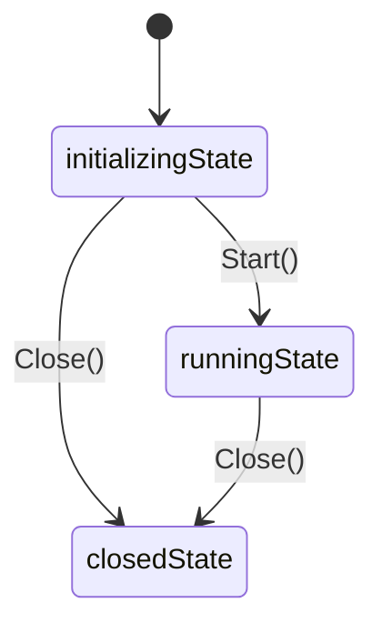

# Geth启动流程解析 - 第三篇：Node节点创建与初始化

## 引言

Node是以太坊节点的核心容器，负责管理各种服务的生命周期。在Geth启动过程中，创建和初始化Node实例是非常关键的一步。本文将深入分析Node的创建过程及其内部机制。

## Node结构分析

Node结构体是Geth中最重要的容器组件：

```go
// node/node.go
type Node struct {
	eventmux *event.TypeMux // Legacy event mux, deprecate for `feed`
	config   *Config
	accman   *accounts.Manager
	database ethdb.Database // 数据库实例
	server   *p2p.Server    // P2P服务器
	// 各种服务注册信息
	serviceFuncs []ServiceFunc
	services map[reflect.Type]Service
	
	// 状态管理
	stateLock sync.RWMutex
	state     int // 节点状态 (unknown, closed, opening, open)

	lifecycles    []Lifecycle // All registered backends, services, and auxiliary services that have a lifecycle
    // RPC相关
	rpcAPIs       []rpc.API   // List of APIs currently provided by the node
	http          *httpServer //
	ws            *httpServer //
	httpAuth      *httpServer //
	wsAuth        *httpServer //
	ipc           *ipcServer  // Stores information about the ipc http server
	inprocHandler *rpc.Server // In-process RPC request handler to process the API requests

}
```

## Node创建过程

Node的创建主要通过New函数完成：

```go
// node/node.go
// 创建一个P2P 节点, 支持协议注册
func New(conf *Config) (*Node, error) {
	// 1. 验证配置，这里确保数据目录存在
	if conf.DataDir != "" {
		absdatadir, err := filepath.Abs(conf.DataDir)
		if err != nil {
			return nil, err
		}
		conf.DataDir = absdatadir
	}
	
	// 2. 创建Node实例
	server := rpc.NewServer()
	server.SetBatchLimits(conf.BatchRequestLimit, conf.BatchResponseMaxSize)
	node := &Node{
		config:        conf,
		inprocHandler: server,
		eventmux:      new(event.TypeMux),
		log:           conf.Logger,
		stop:          make(chan struct{}),
		server:        &p2p.Server{Config: conf.P2P},
		databases:     make(map[*closeTrackingDB]struct{}),
	}
	
	// 3. 注册内置的 APIs.
	node.rpcAPIs = append(node.rpcAPIs, node.apis()...)

	// 4. 初始化数据目录
	if err := node.openDataDir(); err != nil {
		return nil, err
	}
	
	// 5. 创建一个空的账户管理器
	node.accman = accounts.NewManager(&accounts.Config{InsecureUnlockAllowed: conf.InsecureUnlockAllowed})
	
	// 6. 初始化P2P服务器
	node.server.Config.PrivateKey = node.config.NodeKey()
	node.server.Config.Name = node.config.NodeName()
	node.server.Config.Logger = node.log
	node.config.checkLegacyFiles()
	if node.server.Config.NodeDatabase == "" {
		node.server.Config.NodeDatabase = node.config.NodeDB()
	}
	
	// 7. 配置 RPC 服务
	node.http = newHTTPServer(node.log, conf.HTTPTimeouts)
	node.httpAuth = newHTTPServer(node.log, conf.HTTPTimeouts)
	node.ws = newHTTPServer(node.log, rpc.DefaultHTTPTimeouts)
	node.wsAuth = newHTTPServer(node.log, rpc.DefaultHTTPTimeouts)
	node.ipc = newIPCServer(node.log, conf.IPCEndpoint())

	return node, nil
}
```

### 1. openDataDir() - 数据目录初始化

```go
func (n *Node) openDataDir() error {
	// 如果是内存数据库模式，则不创建实际目录
	if n.config.DataDir == "" {
		return nil
	}
    // 使用 --datadir 参数和name (这个目录默认为geth)生成数据目录
	instdir := filepath.Join(n.config.DataDir, n.config.name())
	if err := os.MkdirAll(instdir, 0700); err != nil {
		return err
	}
    // 使用锁文件锁定当前的数据目录，防止并发访问误用数据目录
	n.dirLock = flock.New(filepath.Join(instdir, "LOCK"))

	if locked, err := n.dirLock.TryLock(); err != nil {
		return err
	} else if !locked {
		return ErrDatadirUsed
	}
	return nil
}
```

### 2. accounts.NewManager() - 账户管理器初始化

```go
// accounts/manager.go
// 创建一个账户管理器，用于交易签名或出块（一般只有矿工节点才会需要）
func NewManager(config *Config, backends ...Backend) *Manager {
    // 获取所有初始化账户（注意上面调用时并没有传递backends 参数，所以这里为空）
	var wallets []Wallet
	for _, backend := range backends {
		wallets = merge(wallets, backend.Wallets()...)
	}

    // 监听账户更新
	updates := make(chan WalletEvent, managerSubBufferSize)

	subs := make([]event.Subscription, len(backends))
	for i, backend := range backends {
		subs[i] = backend.Subscribe(updates)
	}
	// Assemble the account manager and return
	am := &Manager{
		config:      config,
		backends:    make(map[reflect.Type][]Backend),
		updaters:    subs,
		updates:     updates,
		newBackends: make(chan newBackendEvent),
		wallets:     wallets,
		quit:        make(chan chan error),
		term:        make(chan struct{}),
	}
	for _, backend := range backends {
		kind := reflect.TypeOf(backend)
		am.backends[kind] = append(am.backends[kind], backend)
	}

    // 启动一个协程，监听账户更新事件
	go am.update()

	return am
}
```

### 3. P2P服务器初始化

```go
// 创建P2P服务器实例
node.server = p2p.NewServer(node.config.P2P)
// 这里配置 P2P 服务器节点的 NodeKey 和 Name，如果参数没有指定的话会自动生成一个
	node.server.Config.PrivateKey = node.config.NodeKey()
	node.server.Config.Name = node.config.NodeName()
	node.server.Config.Logger = node.log
    // 这里会检测是否有旧版本的配置文件 static-nodes.json 和 trusted-nodes.json，新版本中已经不允许使用，即使存在也不会生效
	node.config.checkLegacyFiles()
    // 如果没有指定数据库目录，则使用默认的nodes 目录存储p2p 节点信息
	if node.server.Config.NodeDatabase == "" {
		node.server.Config.NodeDatabase = node.config.NodeDB()
	}
```

P2P服务器的配置定义：

```go
// node/config.go
type Config struct {
	// P2P 网络配置参数
	P2P p2p.Config
	// ...
}
```

P2P 服务配置结构：
```go
// p2p/server.go
type Config struct {
	// This field must be set to a valid secp256k1 private key.
	PrivateKey *ecdsa.PrivateKey `toml:"-"`

	// MaxPeers is the maximum number of peers that can be
	// connected. It must be greater than zero.
	MaxPeers int
    // ...
}
```

## 服务注册机制

Node通过Register()方法注册各种服务：

```go
// eth/backend.go
	// 注册 RPC APIs
	stack.RegisterAPIs(eth.APIs())
	// 这里注册p2p的同步协议包括eth和snap，这里是入口
	stack.RegisterProtocols(eth.Protocols())
	// eth也满足生命周期管理接口，也需要注册
	stack.RegisterLifecycle(eth)
```

在makeFullNode()中，通过utils.RegisterEthService()等函数注册各种服务：

```go
// 注册Ethereum client到节点中
func RegisterEthService(stack *node.Node, cfg *ethconfig.Config) (ethapi.Backend, *eth.Ethereum) {
	backend, err := eth.New(stack, cfg)
	if err != nil {
		Fatalf("Failed to register the Ethereum service: %v", err)
	}
    // 注册 debug API
	stack.RegisterAPIs(tracers.APIs(backend.APIBackend))
	return backend.APIBackend, backend
}
```

## RPC服务初始化

Node还负责初始化各种RPC服务：

###  初始化 RPC 服务

```go
// node/node.go
// 在启动时配置各种RPC endpoints
func (n *Node) startRPC() error {
	// 首先过滤掉 personal api，避免私钥暴露给外部
	var apis []rpc.API
	for _, api := range n.rpcAPIs {
		if api.Namespace == "personal" {
			if n.config.EnablePersonal {
				log.Warn("Deprecated personal namespace activated")
			} else {
				continue
			}
		}
		apis = append(apis, api)
	}
    // 启动进程内服务
	if err := n.startInProc(apis); err != nil {
		return err
	}

	// 配置并启动 IPC.
	// ...

    // 配置各种外部 RPC 服务
	var (
		servers           []*httpServer
		openAPIs, allAPIs = n.getAPIs()
	)

	// 配置HTTP.
    // ...

    // 配置WS.
    // ...

    // 配置http 和 ws认证服务
	// ...

	// 配置公开的HTTP.
	if n.config.HTTPHost != "" {
		// Configure legacy unauthenticated HTTP.
		if err := initHttp(n.http, n.config.HTTPPort); err != nil {
			return err
		}
	}
	// 配置公开的 WebSocket.
	if n.config.WSHost != "" {
		// legacy unauthenticated
		if err := initWS(n.config.WSPort); err != nil {
			return err
		}
	}
	// 配置认证 API
	if len(openAPIs) != len(allAPIs) {
		jwtSecret, err := n.obtainJWTSecret(n.config.JWTSecret)
		if err != nil {
			return err
		}
		if err := initAuth(n.config.AuthPort, jwtSecret); err != nil {
			return err
		}
	}
	// 启动上面配置的各种 RPC 服务
	for _, server := range servers {
		if err := server.start(); err != nil {
			return err
		}
	}
	return nil
}
```

## Node状态管理

Node使用状态机来管理其生命周期：

```go
const (
	initializingState = iota
	runningState
	closedState
)
```

以下是Node状态机的可视化表示：



## 总结

Node作为Geth的核心容器，承担着以下重要职责：

1. **资源配置管理** - 管理数据目录、数据库连接等资源
2. **服务生命周期管理** - 注册、启动、停止各种服务
3. **网络通信管理** - 管理P2P网络和各种RPC服务
4. **账户管理** - 通过账户管理器管理钱包和密钥
5. **状态协调** - 通过状态机协调各组件的状态

Node的设计体现了良好的模块化思想，将复杂的区块链节点功能分解为多个相对独立的服务，通过统一的容器进行管理，提高了代码的可维护性和可扩展性。