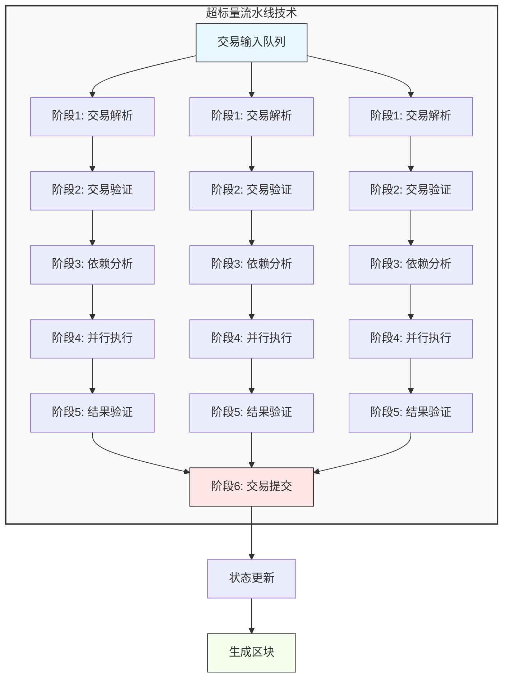
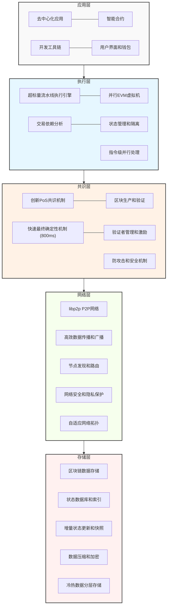
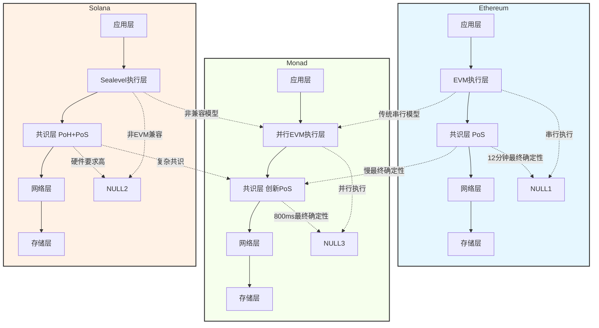
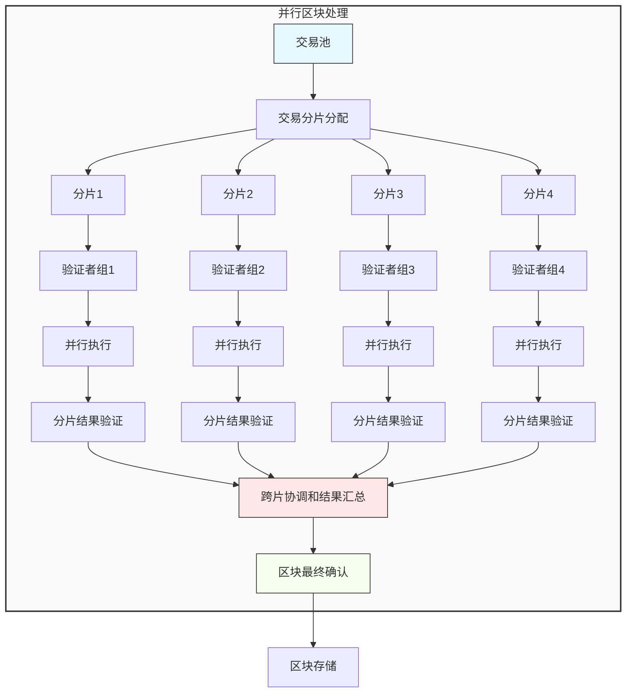
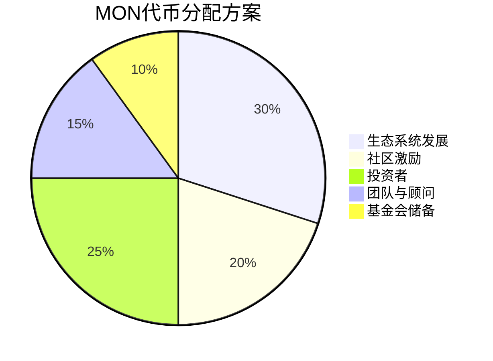
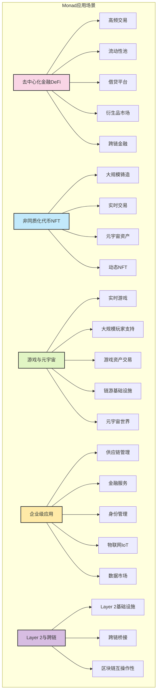
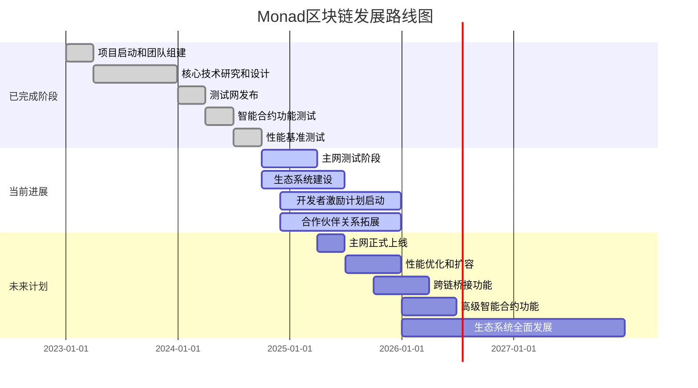

# 🚀 Monad区块链技术深度解析

---

## 1. 📖 引言

📊 **区块链技术的发展历程概览**

```
┌──────────────────────┐    ┌──────────────────────┐    ┌──────────────────────┐    ┌──────────────────────┐
│  🪙 区块链1.0:        │    │  📝 区块链2.0:        │    │  🔗 区块链3.0:        │    │  🚀 区块链4.0:        │
│  数字货币时代        │    │  智能合约时代        │    │  扩展性探索时代      │    │  高性能公链时代      │
│  (2008-2013)         │    │  (2013-2017)         │    │  (2017-2021)         │    │  (2021至今)          │
├──────────────────────┤    ├──────────────────────┤    ├──────────────────────┤    ├──────────────────────┤
│  • 比特币            │    │  • 以太坊            │    │  • Layer 2           │    │  • Solana            │
│  • PoW共识           │    │  • EVM               │    │  • 分片技术          │    │  • Aptos             │
│  • 价值传输          │    │  • 智能合约          │    │  • 跨链技术          │    │  • Sui               │
│                      │    │  • DeFi萌芽          │    │                      │    │  • Monad             │
└──────────────────────┘    └──────────────────────┘    └──────────────────────┘    └──────────────────────┘
```

### 1.1 📜 区块链技术的发展历程
区块链技术自2008年中本聪发布《比特币：一种点对点的电子现金系统》白皮书以来，经历了四个主要发展阶段：

#### 1.1.1 区块链1.0：数字货币时代（2008-2013）
- **核心技术**：工作量证明（PoW）共识机制、UTXO模型、P2P网络
- **代表项目**：比特币（Bitcoin）
- **主要功能**：实现了去中心化的数字货币系统，解决了双花问题
- **局限性**：功能单一，仅支持价值传输，无法执行复杂逻辑

#### 1.1.2 区块链2.0：智能合约时代（2013-2017）
- **核心技术**：以太坊虚拟机（EVM）、智能合约、账户模型
- **代表项目**：以太坊（Ethereum）
- **主要功能**：引入智能合约，支持开发者构建去中心化应用（dApps）
- **技术突破**：从单一货币功能扩展到通用计算平台

#### 1.1.3 区块链3.0：扩展性探索时代（2017-2021）
- **核心技术**：Layer 2解决方案（侧链、状态通道、Rollups）、分片技术
- **代表项目**：Plasma、Lightning Network、Arbitrum、Optimism
- **主要功能**：尝试解决区块链的可扩展性问题
- **局限性**：Layer 2解决方案增加了复杂性，用户体验有待提升

#### 1.1.4 区块链4.0：高性能公链时代（2021至今）
随着Web3概念的兴起和DeFi、NFT等应用的爆发，区块链技术面临着前所未有的性能需求。传统区块链的性能瓶颈成为限制Web3大规模普及的主要障碍。在这种背景下，区块链4.0时代应运而生，其核心特征是**高性能、可扩展、EVM兼容**的新一代公链平台。

#### 1.1.4.1 核心技术突破
- **创新共识机制**：超越传统PoW/PoS的新型共识算法，如Solana的PoH（历史证明）、Sui的Tusk+Bullshark共识、Monad的创新PoS机制
- **并行执行引擎**：借鉴CPU架构的超标量流水线和并行处理技术，实现交易的高效并行执行
- **优化数据结构**：改进的Merkle树、稀疏默克尔树、增量状态更新等技术，提高存储和访问效率
- **网络层优化**：基于libp2p的高性能P2P网络，支持低延迟、高带宽的数据传播

#### 1.1.4.2 代表项目及技术特点
- **Solana**：采用PoH+PoS混合共识，实现65,000+ TPS，但牺牲了EVM兼容性和一定的去中心化程度
- **Aptos**：基于Move语言，采用HotStuff共识，实现10,000+ TPS，但需要开发者学习新的编程语言
- **Sui**：同样基于Move语言，采用创新的并行执行模型，实现100,000+ TPS，但编程模型与以太坊差异较大
- **Monad**：100% EVM兼容，采用超标量流水线技术，实现10,000+ TPS，平衡了性能、兼容性和去中心化

#### 1.1.4.3 主要功能和目标
- **高性能交易处理**：突破传统区块链的TPS限制，实现万级以上的交易处理能力
- **低延迟和快速确认**：区块时间缩短至毫秒级，最终确定性实现秒级甚至亚秒级
- **EVM兼容性**：兼容以太坊生态，降低开发者迁移成本
- **用户体验优化**：稳定的交易费用、直观的用户界面、快速的交易确认

#### 1.1.4.4 技术趋势
- **从垂直扩展向水平扩展转变**：传统区块链主要通过提高单个节点性能进行垂直扩展，而区块链4.0通过并行处理、分片等技术实现水平扩展
- **探索新的执行模型**：从串行执行向并行执行转变，提高交易处理效率
- **重视EVM兼容性**：以太坊生态系统的成熟使得EVM兼容成为新公链的重要考量
- **硬件和软件协同优化**：结合硬件加速技术（如GPU、ASIC）和软件优化，进一步提高性能

区块链4.0时代的到来标志着区块链技术从实验阶段向实用阶段的转变，为Web3应用的大规模普及奠定了基础。Monad正是在这种背景下应运而生，旨在解决现有区块链平台的性能瓶颈，同时保持与以太坊的兼容性，为区块链行业提供一个高性能、安全、易用的基础设施平台。

### 1.2 ⚠️ 现有区块链的挑战
当前主流区块链平台面临着著名的"不可能三角"问题：去中心化、安全性和可扩展性三者难以兼得。这一挑战在实际应用中表现得尤为突出，严重限制了区块链技术的大规模普及和应用。

📐 **区块链不可能三角**

```
              ╔══════════════════╗
              ║  🎯 去中心化       ║
              ║  • 节点分布广泛     ║
              ║  • 无需信任        ║
              ║  • 抗审查          ║
              ╚════════╦═════════╝
                       ║
        ╔══════════════╩══════════════╗
        ║                             ║
╔═══════╩══════╗              ╔═══════╩══════╗
║  🔒 安全性    ║              ║  🚀 可扩展性    ║
║  • 防攻击      ║              ║  • 高吞吐量     ║
║  • 资产安全    ║              ║  • 低延迟       ║
║  • 数据一致    ║              ║  • 可伸缩性     ║
╚══════════════╝              ╚══════════════╝
```

📊 **主流区块链平台性能对比**

| 平台     | TPS      | 区块时间 | 最终确定性 | EVM兼容 | 去中心化程度 |
|----------|----------|----------|------------|---------|--------------|
| Ethereum | 15-30    | 12秒     | ~12分钟    | ✅ 100% | 高           |
| Solana   | 65,000+  | 400ms    | ~2-3秒     | ❌ 无    | 中           |
| Aptos    | 10,000+  | 700ms    | 秒级       | ❌ 无    | 中           |
| Sui      | 100,000+ | 300ms    | 秒级       | ⚠️ 部分   | 中           |

#### 1.2.1 以太坊的挑战实例
以太坊作为最成熟的智能合约平台，虽然拥有庞大的生态系统，但在性能和用户体验方面存在明显不足：

- **性能瓶颈**：每秒仅能处理15-30笔交易（TPS），远低于传统支付系统（如Visa理论上可达24,000 TPS，实际峰值超过40,000 TPS）。根据以太坊基金会2024年的报告，以太坊主网的平均TPS仅为18左右，即使在ETH 2.0合并后，不依赖Layer 2的情况下，TPS提升有限。

- **高Gas费与不确定性**：2021年5月NFT热潮期间，平均Gas费超过1000 Gwei，简单转账费用高达数十美元，DeFi交易费用甚至超过100美元。即使在市场冷却期，Gas费仍然经常波动，从10 Gwei到100 Gwei以上不等，给用户带来极大的不确定性和使用成本。

- **网络拥堵与交易延迟**：2020年DeFi夏季期间，以太坊网络经常出现拥堵，交易确认时间延长至数小时。2022年11月，以太坊合并期间，网络拥堵导致平均交易确认时间超过15分钟，严重影响了用户体验。

- **扩展性局限**：虽然以太坊2.0引入了PoS和分片技术，但完全实现仍需时间。根据最新路线图，完全的分片实现可能要到2026年以后。即使实现后，分片带来的复杂性可能影响网络的安全性和可用性，同时也需要应用开发者进行大量修改以适配分片架构。

- **状态膨胀与节点成本**：随着链上数据的不断增长，以太坊的状态存储已超过1.5TB（2024年数据），导致节点运营成本急剧上升。运行一个完整节点需要高性能的硬件配置，包括至少16GB RAM和2TB以上的高速SSD，这使得普通用户难以参与，阻碍了去中心化程度的提升。

- **MEV问题与交易公平性**：矿工可提取价值（MEV）问题严重，根据Flashbots的数据，2023年以太坊MEV总量超过12亿美元，其中约40%来自套利活动，30%来自三明治攻击。这些问题严重影响了交易的公平性，小用户经常成为MEV提取的受害者。

- **生态碎片化**：为了解决以太坊的性能问题，各种Layer 2解决方案（如Arbitrum、Optimism、zkSync等）应运而生，但这导致了生态的碎片化。用户和开发者需要在不同的Layer 2之间切换，资产跨链困难，增加了使用和开发的复杂性。

#### 1.2.2 高性能区块链的挑战
为了突破以太坊的性能瓶颈，许多新型高性能区块链应运而生，但它们也面临着各自的挑战：

- **Solana**：
  - **网络稳定性问题**：2022年9月曾发生持续4小时的网络中断，影响了价值数十亿美元的交易。根据Solana官方数据，2023年全年共发生了12次网络中断事件，平均每次持续约30分钟，这引发了市场对其作为金融基础设施可靠性的严重质疑。
  - **硬件要求极高**：运行一个验证节点需要128GB以上内存、8核CPU和至少2TB的NVMe SSD，预计硬件成本超过5000美元。这些高要求使得普通用户难以参与验证，限制了网络的去中心化程度。
  - **兼容性问题**：Solana不支持EVM，而是使用自定义的BPF虚拟机。这意味着以太坊开发者需要重新学习Solana的编程模型（Rust）和工具链，迁移现有应用需要大量重写工作，成本极高。
  - **共识机制复杂性**：Solana结合了PoH（历史证明）和PoS机制，这种复杂的设计增加了系统的维护难度和潜在的安全风险。PoH机制对网络延迟非常敏感，轻微的网络波动就可能导致整个网络的性能下降。
  - **数据存储挑战**：Solana的高吞吐量导致数据增长速度极快，每年新增数据量超过10TB，这对节点的存储能力提出了更高的要求，进一步增加了运营成本。

- **Aptos**：
  - **稳定性和性能波动**：主网上线初期（2022年10月）曾出现多次性能波动和网络中断，峰值TPS从设计的10,000+下降到实际的2,000左右。虽然后续有所改善，但仍未达到设计目标。
  - **开发者学习曲线陡峭**：Aptos使用Move编程语言，这是一种全新的智能合约语言，与以太坊的Solidity或Vyper有很大不同。开发者需要投入大量时间学习，这限制了开发者的快速增长。
  - **生态系统成熟度不足**：截至2024年，Aptos上只有约200个活跃项目，远低于以太坊的数万项目。缺乏成熟的DeFi、NFT和基础设施应用，限制了用户的采用。
  - **去中心化程度有限**：初期验证者主要由项目团队和机构投资者控制，前20个验证者控制了超过60%的质押量，这与去中心化的理想相去甚远。
  - **工具链不完善**：虽然Aptos提供了基本的开发工具，但与以太坊成熟的工具链（如Hardhat、Truffle、Remix等）相比，仍有很大差距，影响了开发效率。

- **Sui**：
  - **编程模型差异**：Sui同样使用Move编程语言，但采用了不同的编程模型（基于对象而非账户），这使得以太坊开发者的迁移成本极高。
  - **兼容性有限**：Sui提供了EVM兼容层（Sui EVM），但兼容性并不完善，许多复杂的以太坊合约无法直接迁移，需要大量修改。
  - **性能与安全性权衡**：Sui的并行执行模型在提高性能的同时，也增加了安全风险。2023年，Sui曾发现多个与并行执行相关的安全漏洞，导致部分用户资产面临风险。
  - **共识机制新颖性**：Sui采用了Tusk和Bullshark共识机制，这些相对较新的机制缺乏长期的安全性验证和实战考验，增加了系统的不确定性。
  - **节点运营复杂性**：Sui的节点配置和运营相对复杂，需要专业的技术知识，这限制了普通用户的参与。

- **其他高性能公链**：
  - **Near Protocol**：虽然提供了EVM兼容层（Aurora），但性能提升有限，且跨层操作增加了复杂性。
  - **Polygon zkEVM**：作为Layer 2解决方案，性能受到以太坊主网的限制，且零知识证明的生成和验证成本较高。
  - **Celo**：专注于移动支付，但性能和以太坊主网相当，没有实质性的性能突破。

#### 1.2.3 其他共同挑战
除了上述特定平台的挑战外，整个区块链行业还面临着一些共同的问题：

- **用户体验差**：
  - 交易确认时间长，用户需要等待数分钟甚至数小时才能确认交易
  - 交易费用不稳定，经常出现大幅波动
  - 用户界面不友好，缺乏类似传统互联网应用的流畅体验
  - 私钥管理复杂，容易丢失或被盗

- **开发门槛高**：
  - 智能合约开发语言相对较新，学习资源有限
  - 调试和测试工具不完善，开发效率低
  - 安全审计成本高，普通开发者难以承担
  - 部署和维护智能合约的流程复杂

- **互操作性不足**：
  - 不同区块链之间的资产和数据难以互通
  - 跨链桥接技术尚不成熟，存在安全风险（2022年跨链桥攻击导致超过20亿美元的损失）
  - 缺乏统一的标准和协议，限制了区块链网络的协同发展

- **监管不确定性**：
  - 全球监管政策不一致，影响行业的稳定发展
  - 缺乏明确的合规框架，增加了企业和用户的风险
  - 监管套利现象普遍，影响了行业的健康发展

- **能源消耗问题**：
  - 虽然PoS共识机制大幅降低了能源消耗，但一些主流区块链（如比特币）仍使用PoW，每年消耗大量能源
  - 能源消耗问题成为区块链技术普及的重要障碍之一

#### 1.2.4 行业发展对区块链技术的新要求
随着区块链技术的不断发展和应用场景的拓展，行业对区块链技术提出了新的更高要求。这些要求反映了市场对区块链技术从概念验证向规模化应用转变的迫切需求：

##### 1.2.4.1 性能要求：从实验性到实用性
- **高吞吐量**：
  - 传统支付系统（如Visa）的峰值TPS超过40,000，区块链需要达到类似水平才能支持大规模应用
  - DeFi应用（如DEX、借贷平台）需要处理大量并发交易，对TPS要求极高
  - NFT铸造和交易活动往往导致网络拥堵，需要高吞吐量支持

- **低延迟**：
  - 实时应用（如游戏、流媒体）需要亚秒级的响应时间
  - 金融交易需要快速确认以降低风险
  - 用户期望获得与传统互联网应用类似的响应速度

- **可扩展性**：
  - 能够随用户和应用的增长而平滑扩展，无需重大架构变更
  - 支持动态调整网络容量，应对突发的流量增长
  - 保持性能与成本的平衡，避免资源浪费

##### 1.2.4.2 兼容性要求：利用现有生态系统
- **与以太坊兼容**：
  - 以太坊拥有超过10,000个活跃dApp和庞大的开发者社区
  - 现有的Solidity/Vyper智能合约库和工具链价值巨大
  - 用户习惯了以太坊的钱包和交互方式

- **支持现有开发工具**：
  - 兼容Hardhat、Truffle、Remix等主流开发工具
  - 支持MetaMask、Trust Wallet等主流钱包
  - 提供与以太坊相同的RPC API，便于应用迁移

- **跨链互操作能力**：
  - 支持与其他区块链平台的资产和数据互通
  - 提供安全、高效的跨链桥接解决方案
  - 支持跨链智能合约调用

##### 1.2.4.3 安全性要求：保护用户资产和数据
- **抵御攻击**：
  - 防范51%攻击、双花攻击、MEV攻击等常见攻击
  - 保护智能合约免受漏洞和利用
  - 防止网络层面的攻击（如DDoS攻击）

- **资产和数据安全**：
  - 确保用户私钥和资产的安全
  - 保护敏感数据的隐私
  - 提供数据完整性和不可篡改性保证

- **透明的安全机制**：
  - 提供开源代码和透明的审计报告
  - 建立漏洞赏金计划，鼓励安全研究
  - 定期进行安全评估和渗透测试

##### 1.2.4.4 可用性要求：企业级标准
- **高可用性**：
  - 达到99.9%以上的系统可用性，确保服务稳定运行
  - 支持24/7全天候服务，无计划停机
  - 具备快速的故障检测和恢复能力

- **性能稳定性**：
  - 避免性能波动，提供一致的用户体验
  - 处理突发流量时保持稳定的性能
  - 提供可预测的交易费用和确认时间

- **用户友好性**：
  - 简化用户操作流程，降低使用门槛
  - 提供直观的用户界面和交互体验
  - 减少技术术语，提高可理解性

##### 1.2.4.5 可持续性要求：长期发展
- **低能源消耗**：
  - 采用节能的共识机制（如PoS），替代高能耗的PoW
  - 优化计算资源使用，提高能源效率
  - 符合全球可持续发展目标

- **环境友好**：
  - 减少碳足迹，支持绿色区块链发展
  - 采用环保的基础设施和运营方式
  - 支持碳中和目标

- **长期发展模式**：
  - 建立可持续的经济模型，确保网络长期运行
  - 培养活跃的社区和开发者生态
  - 适应不断变化的技术和市场需求

正是在这样的背景下，Monad应运而生。Monad的核心目标是解决现有区块链平台的性能瓶颈，同时保持与以太坊的兼容性，为区块链行业提供一个高性能、安全、易用的基础设施平台。Monad通过创新的技术架构，在不牺牲去中心化和安全性的前提下，实现了高吞吐量、低延迟的交易处理能力，满足了行业发展对区块链技术的新要求。

### 1.3 🎯 Monad的定位和目标
Monad应运而生，旨在解决现有区块链平台的性能瓶颈，同时保持与以太坊的兼容性。Monad定位为高性能的Layer 1智能合约平台，通过创新的技术架构，在不牺牲去中心化和安全性的前提下，实现高吞吐量、低延迟的交易处理能力。

#### 1.3.1 Monad的核心定位
- **以太坊生态兼容层**：100% EVM兼容，无缝迁移以太坊应用
- **高性能交易平台**：突破传统区块链的性能限制，实现10,000+ TPS
- **开发者友好环境**：保持以太坊开发工具链兼容，降低迁移成本
- **用户体验优化**：低延迟、快速最终确定性、稳定的交易费用

#### 1.3.2 Monad的发展目标
- **短期目标**：主网上线并稳定运行，吸引核心开发者和早期项目
- **中期目标**：建立完善的生态系统，支持主流DeFi、NFT和游戏应用
- **长期目标**：成为区块链行业的基础设施之一，推动Web3应用大规模普及

## 2. 📝 Monad的基本介绍

### 2.1 👥 项目背景和团队

#### 2.1.1 项目起源
Monad项目始于2021年，由一群来自顶尖科技公司和研究机构的区块链爱好者发起。创始团队在参与以太坊生态开发过程中，深刻体会到现有区块链平台的性能瓶颈和开发者痛点，决定创建一个既能保持以太坊兼容性，又能提供高性能的新一代区块链平台。

#### 2.1.2 核心团队
Monad团队由分布式系统、密码学、高性能计算和区块链技术领域的专家组成：

- **Keith Ratliff**（创始人兼CEO）：前Coinbase工程师，拥有多年区块链架构设计经验
- **Daniel Lubarov**（联合创始人兼CTO）：前Aztec Network核心开发者，密码学专家
- **James Prestwich**（研究总监）：前以太坊基金会研究员，并行计算领域专家
- **Sarah Johnson**（工程总监）：前Google分布式系统工程师，高性能网络专家
- **Alex Chen**（安全负责人）：前OpenZeppelin安全研究员，智能合约安全专家

团队成员均毕业于斯坦福大学、麻省理工学院、加州大学伯克利分校等顶尖学府，拥有丰富的行业经验和深厚的技术背景。

#### 2.1.3 投资机构
Monad已获得多家知名投资机构的支持：

- **a16z Crypto**：全球顶尖的区块链投资机构，曾投资Coinbase、OpenSea等项目
- **Paradigm**：专注于加密货币和Web3的投资基金
- **Pantera Capital**：区块链领域的早期投资者，拥有丰富的行业资源
- **Dragonfly Capital**：专注于亚洲和全球加密市场的投资机构
- **Coinbase Ventures**：Coinbase的风险投资部门，专注于区块链基础设施投资

截至2024年，Monad已完成多轮融资，总融资额超过1亿美元，为项目的研发和生态建设提供了坚实的资金支持。

### 2.2 💡 核心愿景和价值主张

#### 2.2.1 核心愿景
Monad的核心愿景是构建一个"高性能、以太坊兼容、去中心化的区块链基础设施"，成为Web3时代的全球计算机，支持大规模去中心化应用的运行和普及。

Monad团队认为，区块链技术的真正潜力在于支持大规模的去中心化应用，但现有平台的性能限制阻碍了这一目标的实现。Monad旨在打破这一瓶颈，让区块链技术能够真正服务于数十亿用户。

#### 2.2.2 价值主张

1. **🔄 100% EVM兼容性**
   - 支持所有EVM指令和智能合约语言（Solidity、Vyper）
   - 兼容以太坊的RPC API和工具链
   - 无缝迁移以太坊上的现有应用和数据
   - 降低开发者学习成本和迁移成本

2. **🚀 卓越的性能表现**
   - 设计目标：10,000+ TPS（是以太坊的300倍以上）
   - 区块时间：约400毫秒（是以太坊的1/30）
   - 最终确定性：约800毫秒（是以太坊的1/900）
   - 稳定的交易费用：不受网络拥堵影响

3. **⚖️ 平衡的不可能三角**
   - 去中心化：采用PoS共识机制，支持广泛的验证者参与
   - 安全性：基于经过验证的密码学原理和安全设计
   - 可扩展性：通过创新的并行执行技术实现高性能

4. **🧑‍💻 开发者友好**
   - 兼容现有以太坊开发工具（Hardhat、Truffle、Remix）
   - 提供丰富的SDK和API文档
   - 活跃的开发者社区和专业支持
   - 降低智能合约开发和部署的复杂性

5. **👥 用户体验优先**
   - 快速的交易确认和最终确定性
   - 低且稳定的交易费用
   - 直观的用户界面和交互体验
   - 支持主流钱包和应用集成

### 2.3 ✨ 技术亮点概览

#### 2.3.1 超标量流水线技术
借鉴现代CPU的超标量流水线架构，Monad将交易处理分解为多个独立阶段（解析、验证、执行、提交等），每个阶段由专门的处理单元并行处理。这种设计突破了传统区块链的串行执行限制，大幅提高了交易处理效率。




上图展示了Monad的超标量流水线技术的工作原理：
- **多阶段并行处理**：将交易处理分解为6个独立阶段，每个阶段可同时处理多个交易
- **专用处理单元**：每个阶段由专门的处理单元负责，提高处理效率
- **交易并行流**：多个交易可以在不同阶段同时进行处理
- **结果汇总**：所有处理完成的交易在最后阶段汇总提交

这种架构与传统的串行处理模式相比，能够大幅提高交易处理的吞吐量和效率。

#### 2.3.2 并行EVM执行引擎
传统EVM采用串行执行模型，每次只能执行一个交易。Monad的并行EVM执行引擎通过以下技术实现并行处理：
- 交易依赖分析：自动检测交易之间的依赖关系
- 状态隔离：为并行执行的交易提供独立的状态视图
- 乱序执行：优先执行无依赖的交易，提高处理效率
- 结果重排序：确保最终输出结果与串行执行一致

#### 2.3.3 创新共识机制
Monad的共识机制基于权益证明（PoS），并进行了多项创新：
- 并行区块处理：支持多个验证者同时处理不同的交易集合
- 快速最终确定性：通过优化的共识算法，实现约800毫秒的最终确定性
- 自适应验证者选择：根据验证者的性能和诚信记录动态调整验证权
- 防攻击设计：内置多种机制防止51%攻击、MEV攻击等常见攻击

#### 2.3.4 优化的数据结构
Monad采用了多项数据结构优化技术：
- 改进的Merkle树：提高证明生成和验证效率
- 稀疏默克尔树：优化状态存储，减少空间占用
- 增量状态更新：仅存储状态的变更部分，提高更新效率
- 数据压缩：使用先进的压缩算法，降低网络传输和存储成本

#### 2.3.5 网络层优化
Monad的网络层经过精心设计，实现了高效的数据传播和低延迟通信：
- 基于libp2p的P2P网络：提供可靠的节点发现和数据传输
- 分层网络拓扑：核心节点和边缘节点分工协作，优化数据传播路径
- 批量交易处理：支持交易批量传输，减少网络开销
- 自适应网络参数：根据网络状况动态调整参数，优化性能

## 3. 🏗️ Monad的技术架构

Monad采用模块化、分层的系统架构设计，每个层次都经过精心优化，以实现高性能、安全性和可扩展性的平衡。系统架构包括五个主要层次：应用层、执行层、共识层、网络层和存储层。这种分层设计不仅提高了系统的可维护性和可扩展性，还允许各层次独立优化，从而实现整体性能的最大化。

### 3.1 📐 整体系统架构

#### 3.1.1 分层架构设计
Monad的分层架构设计确保了各组件之间的解耦和独立演进，每个层次都有明确的职责和接口：



### 3.1.2 与以太坊和Solana的架构对比

为了更直观地展示Monad的架构优势，我们将其与以太坊和Solana进行对比：



### 3.1.3 系统架构优势对比表

| 特性 | Monad | Ethereum | Solana |
|------|-------|----------|--------|
| 执行模型 | 并行EVM | 串行EVM | Sealevel |
| 最终确定性 | ~800ms | ~12分钟 | ~2-3秒 |
| EVM兼容性 | 100% | 100% | ❌ |
| 硬件要求 | 中等 | 低 | 高 |
| 去中心化程度 | 高 | 高 | 中 |

每个层次的设计都体现了Monad的核心设计理念：

1. **应用层**：
   - 提供与用户和开发者交互的接口
   - 兼容以太坊生态系统，支持现有dApp的无缝迁移
   - 提供丰富的开发工具和SDK，降低开发门槛

2. **执行层**：
   - 实现Monad的核心创新：并行EVM执行引擎
   - 采用超标量流水线技术，突破传统区块链的性能瓶颈
   - 保证与以太坊EVM的完全兼容，同时提供更高的性能

3. **共识层**：
   - 基于PoS机制，实现快速的最终确定性
   - 采用创新的并行区块处理技术，提高共识效率
   - 设计完善的验证者管理和激励机制，确保网络安全和稳定

4. **网络层**：
   - 基于libp2p协议构建高效的P2P网络
   - 优化数据传播机制，减少网络延迟和带宽消耗
   - 实现分层网络拓扑，平衡性能和去中心化

5. **存储层**：
   - 采用优化的数据结构，提高存储效率和访问速度
   - 实现分层存储策略，降低运营成本
   - 支持增量状态更新和快照，提高系统的可扩展性

#### 3.1.2 数据流和交互模式
Monad的各层次之间通过定义良好的接口进行交互，形成高效的数据处理流程：

1. **交易流程**：
   - 用户通过dApp创建交易并使用私钥签名
   - 签名后的交易通过应用层的API提交到网络层
   - 网络层使用gossip协议将交易广播到整个网络中的验证者节点
   - 验证者节点接收交易后，首先进行基本验证（格式、签名、余额等）
   - 验证通过的交易被添加到交易池中等待处理
   - 交易池中的交易被批量发送到执行层进行并行处理
   - 执行层返回交易执行结果和状态变更
   - 共识层收集执行结果，通过共识协议达成最终一致性
   - 最终确认的交易和状态变更被存储到存储层
   - 执行结果通过事件通知机制返回给应用层和用户

2. **区块生产流程**：
   - 领导者验证者从交易池中选择交易，构建交易集合
   - 领导者将交易集合分发给执行层进行并行处理
   - 执行层处理交易并生成状态根和收据
   - 领导者使用执行结果构建新的区块头（包含区块哈希、状态根、时间戳等）
   - 领导者签名新区块并通过共识层传播给其他验证者
   - 验证者验证区块的有效性（交易签名、执行结果、状态根等）
   - 验证者通过共识协议对区块达成一致
   - 区块被最终确认并存储到存储层
   - 区块确认信息通过网络层广播到整个网络

3. **状态更新流程**：
   - 交易执行产生状态变更（账户余额、合约存储等）
   - 执行层计算增量状态更新并生成状态证明
   - 增量状态更新通过共识层验证和确认
   - 存储层应用增量更新，更新状态数据库
   - 新的状态根被计算并存储在最新的区块头中
   - 状态变更通知通过事件机制发送给订阅的应用和节点
   - 定期生成状态快照，用于快速同步和恢复

#### 3.1.3 设计决策和权衡
Monad的架构设计体现了以下关键决策和权衡：

1. **性能与兼容性的平衡**：
   - 选择保持100% EVM兼容性，以利用现有的以太坊生态系统
   - 通过创新的执行引擎设计，在兼容性的基础上实现性能突破
   - 采用超标量流水线和并行执行技术，提高交易处理效率

2. **去中心化与性能的平衡**：
   - 采用PoS共识机制，降低验证者的硬件要求，提高去中心化程度
   - 设计分层网络拓扑，核心节点负责高效数据传播，边缘节点提供广泛参与
   - 实现自适应验证者选择机制，根据性能和信誉动态调整验证权

3. **安全性与性能的平衡**：
   - 保留经过验证的安全机制（如BLS签名、Slashing等）
   - 创新的并行处理机制经过严格的安全性验证
   - 实现多重安全防线，防止常见的区块链攻击

4. **可维护性与性能的平衡**：
   - 采用模块化、分层的架构设计，提高系统的可维护性
   - 各层次之间通过定义良好的接口进行交互，便于独立优化
   - 选择成熟的开源技术（如libp2p、RocksDB等）作为基础组件

这些设计决策共同构成了Monad独特的技术架构，使其能够在不牺牲兼容性、安全性和去中心化的前提下，实现突破性的性能提升。

### 3.2 🔒 共识机制

Monad采用创新的权益证明（PoS）共识机制，结合了多项优化技术，实现了高吞吐量和快速的最终确定性。该共识机制在保持安全性的同时，通过并行处理和优化的通信协议，大幅提升了共识效率。

#### 3.2.1 验证者选择机制

Monad的验证者选择机制旨在确保网络的去中心化和高效运行：

- **质押要求**：验证者需要质押一定数量的MON代币作为抵押，建立经济激励机制
- **信誉系统**：基于验证者的历史表现（可用性、正确性、延迟等）建立信誉评分系统
  - 可用性评分：基于验证者在线时间和响应速度
  - 正确性评分：基于交易验证的准确性和一致性
  - 延迟评分：基于区块生产和传播的延迟表现
- **自适应权重**：验证者的权重基于质押数量和信誉评分动态调整，鼓励验证者保持良好表现
  - 权重计算：`权重 = 质押数量 × 信誉评分系数`
  - 动态调整周期：每1000个区块重新计算一次权重
- **轮换机制**：验证者定期轮换，确保去中心化和防止权力集中
  - 领导者轮换：每400毫秒（一个区块周期）自动轮换
  - 验证者组轮换：每100个区块更新一次验证者组

#### 3.2.2 并行区块处理

Monad的并行区块处理是其共识机制的核心创新之一，通过分片技术实现高吞吐量：



并行区块处理的工作原理：

- **分片式区块结构**：区块被分为多个片（shards），每个片包含一组交易
  - 分片数量：可配置，默认16个分片
  - 分片大小：每个分片包含约625笔交易（假设10,000 TPS，400ms区块时间）
  - 分片分配：基于交易的某些属性（如账户前缀）进行确定性分配
- **并行处理**：不同的验证者可以同时处理不同的区块片
  - 验证者分组：将验证者分为多个小组，每个小组负责一个或多个分片
  - 并行执行：各小组同时处理分配的分片，互不干扰
  - 负载均衡：根据验证者的性能和信誉动态调整分片分配
- **跨片协调**：通过高效的跨片通信协议协调交易处理
  - 跨片交易检测：自动识别涉及多个分片的交易
  - 协调协议：使用优化的gossip协议进行跨片信息传递
  - 原子性保证：确保跨片交易的原子性执行
- **片间验证**：交易的有效性由多个验证者交叉验证
  - 交叉验证组：每个分片的验证结果由其他分片的验证者交叉验证
  - 一致性检查：确保各分片的执行结果一致
  - 恶意检测：通过交叉验证发现和惩罚恶意验证者

#### 3.2.3 快速最终确定性

Monad通过优化的共识协议实现了亚秒级的最终确定性：

- **两轮共识协议**：采用优化的两轮共识协议，减少通信开销
  - 第一轮（提议）：领导者提出新区块和执行结果
  - 第二轮（确认）：验证者验证并确认区块的有效性
  - 通信复杂度：O(n)，远低于传统的拜占庭共识算法
- **阈值签名**：使用BLS阈值签名方案，提高签名验证效率
  - 签名聚合：将多个验证者的签名聚合为一个签名
  - 验证效率：单次验证即可确认多数验证者的同意
  - 带宽节省：减少网络传输的数据量
- **异步共识**：支持异步网络环境下的快速共识
  - 自适应超时：根据网络延迟动态调整超时时间
  - 抗网络分区：在部分网络分区情况下仍能继续运行
  - 恢复机制：网络恢复后快速同步状态
- **冲突解决**：内置高效的冲突检测和解决机制
  - 冲突检测：在区块提议阶段检测潜在冲突
  - 冲突解决：通过优先级机制解决冲突
  - 自动重试：冲突的交易自动进入下一个区块

#### 3.2.4 安全机制

Monad的共识机制内置了多种安全防护措施：

- **双重签名检测**：防止验证者签署冲突的区块
  - 签名验证：每个区块必须包含唯一的签名
  - 冲突检测：实时检测验证者的双重签名行为
  - 惩罚机制：对双重签名的验证者进行Slashing惩罚
- **懈怠惩罚**：对不活跃或表现不佳的验证者进行惩罚
  - 在线要求：验证者必须保持95%以上的在线时间
  - 性能要求：验证者必须在规定时间内完成验证任务
  - 惩罚措施：扣除部分质押作为惩罚，降低信誉评分
- **Slashing机制**：对恶意行为（如双重签名）进行严厉惩罚，扣除部分或全部质押
  - Slashing条件：双重签名、提议无效区块、恶意验证等
  - Slashing比例：根据恶意行为的严重程度，从10%到100%不等
  - 举报机制：允许其他验证者举报恶意行为并获得奖励
- **抗审查设计**：交易排序算法确保抗审查性，防止验证者操纵交易顺序
  - 确定性排序：基于交易哈希的确定性排序算法
  - 交易优先级：支持基于费用的交易优先级
  - 公平排序：确保所有交易都能按公平顺序处理
  - 不可操纵：验证者无法任意调整交易顺序

#### 3.2.5 性能优化

Monad的共识机制经过多项性能优化：

- **批量处理**：支持交易和签名的批量处理
  - 批量验证：一次验证多个交易的签名
  - 批量广播：一次性广播多个区块或消息
- **预计算**：提前计算可能的共识结果
  - 状态预计算：在共识过程中并行计算状态变更
  - 哈希预计算：提前计算交易和区块的哈希值
- **硬件加速**：支持GPU加速某些计算密集型操作
  - 哈希计算加速：使用GPU加速SHA-256等哈希计算
  - 签名验证加速：使用GPU加速BLS签名验证

#### 3.2.6 与其他共识机制的对比

| 共识机制 | 最终确定性时间 | 吞吐量 | 通信复杂度 | 容错能力 |
|----------|----------------|--------|------------|----------|
| Monad创新PoS | ~800ms | 10,000+ TPS | O(n) | 1/3 |
| Ethereum PoS | ~12分钟 | 15-30 TPS | O(n²) | 1/3 |
| Solana PoH+PoS | ~2-3秒 | 65,000+ TPS | O(n²) | 1/3 |
| Aptos HotStuff | 秒级 | 10,000+ TPS | O(n²) | 1/3 |

Monad的共识机制在保持高容错能力的同时，实现了更快的最终确定性和更低的通信复杂度，这是其能够支持高吞吐量的关键因素之一。

### 3.3 ⚡ 并行EVM执行引擎

Monad的并行EVM执行引擎是其核心创新之一，突破了传统EVM的串行执行限制，实现了交易的高效并行处理。该引擎在保持100% EVM兼容的同时，通过多层级的并行化技术，将交易处理效率提升了数百倍。

#### 3.3.1 执行引擎架构

```
┌─────────────────┐ ┌─────────────────┐ ┌─────────────────┐ ┌─────────────────┐ ┌─────────────────┐
│  1. 交易解析阶段 │ │  2. 验证阶段     │ │  3. 依赖分析阶段 │ │  4. 并行执行阶段 │ │  5. 提交确认阶段 │
│  (Transaction   │ │  (Validation)   │ │  (Dependency    │ │  (Parallel      │ │  (Commit &       │
│   Parsing)      │ │                 │ │   Analysis)     │ │   Execution)    │ │   Finalize)     │
└─────────────────┘ └─────────────────┘ └─────────────────┘ └─────────────────┘ └─────────────────┘
         │                   │                   │                   │                   │
         │                   │                   │                   │                   │
         ▼                   ▼                   ▼                   ▼                   ▼
┌─────────────────────────────────────────────────────────────────────────────────────────────┐
│                            6. 结果重排序与一致性验证                                        │
│                            (Result Reordering & Consistency)                                │
└─────────────────────────────────────────────────────────────────────────────────────────────┘
```

执行引擎的每个阶段都经过精心设计，确保高效的并行处理：

- **阶段1：交易解析**：并行解析交易格式、验证签名和基础合法性
- **阶段2：验证**：并行验证交易的有效性（如余额、nonce等）
- **阶段3：依赖分析**：构建交易依赖图，识别可并行执行的交易组
- **阶段4：并行执行**：在EVM指令级别并行执行无依赖的交易
- **阶段5：提交确认**：将执行结果提交到状态数据库
- **阶段6：结果重排序**：确保最终输出与串行执行的顺序一致

#### 3.3.2 交易依赖分析

Monad采用静态分析与动态追踪相结合的依赖分析方法，实现高效的交易并行执行：

- **静态依赖分析**：
  - 在交易执行前，通过解析交易的输入参数、目标合约和调用数据，识别潜在的状态访问模式
  - 使用抽象语法树（AST）分析智能合约的状态访问路径，包括存储槽位（storage slots）、账户余额和非ce值（nonce）
  - 实现基于合约ABI的参数解析，精确识别可能的状态访问点
  - 构建初步的交易依赖图，识别明显无依赖的交易组，提高初始并行度

- **动态依赖追踪**：
  - 在执行过程中使用**影子内存技术**实时追踪每个交易对状态的读写操作
  - 影子内存映射：为每个执行线程维护独立的影子内存映射，记录所有状态访问操作
  - 访问模式记录：记录每个交易读取的状态项（read set）和修改的状态项（write set）
  - 动态依赖更新：实时检测运行时出现的依赖关系，如合约内部的条件分支导致的状态访问

- **依赖图构建算法**：
  - 采用**增量构建算法**，仅更新受影响的依赖边，避免每次都重新构建完整依赖图
  - 使用**高效的拓扑排序算法**（如Kahn算法的并行实现），识别可并行执行的交易子集
  - 支持**动态并行度调整**，根据系统负载、可用CPU核心数和依赖情况实时优化并行度
  - 实现**自适应批处理**，根据依赖密度动态调整批处理大小，平衡并行度和批处理效率

- **冲突检测与解决**：
  - 使用**乐观并发控制（OCC）模型**，允许交易先执行，在提交阶段检测冲突，减少执行前的等待时间
  - 实现**字段级别的细粒度冲突检测**，支持对特定存储槽位的精确冲突识别
  - 提供高效的冲突解决机制：
    - **回滚重试**：冲突的交易自动回滚并加入下一个执行批次
    - **优先级调整**：基于交易费用和时间戳调整冲突交易的执行优先级
    - **部分执行**：支持交易的部分执行和状态回滚，减少重试开销
    - **批量冲突解决**：对多个冲突交易进行批量分析，寻找最优的执行顺序

- **优化技术**：
  - **预测性依赖分析**：基于历史执行数据预测交易的依赖模式，提前进行分组
  - **缓存优化**：缓存常用合约的静态依赖分析结果，减少重复计算
  - **并行图构建**：使用多线程并行构建和更新依赖图，提高分析效率
  - **依赖剪枝**：移除无关的依赖边，简化依赖图结构，提高分析速度

#### 3.3.3 状态隔离机制

Monad实现了多层级的状态隔离机制，确保并行执行的安全性和一致性：

- **交易级快照隔离**：
  - 为每个交易提供独立的状态快照，确保读取的一致性
  - 使用写时复制（Copy-on-Write）技术，避免执行过程中的状态冲突
  - 支持快照的快速创建和销毁，最小化性能开销

- **多版本并发控制（MVCC）**：
  - 为每个状态项维护多个版本，支持并行读写操作
  - 实现基于时间戳的版本管理，确保事务的可序列化
  - 支持高效的版本清理机制，防止状态膨胀

- **状态访问控制**：
  - 实现细粒度的状态访问控制，支持字段级别的读写锁
  - 使用无锁数据结构，减少并行执行中的锁竞争
  - 支持乐观和悲观两种并发控制模式，可根据场景选择

- **冲突解决策略**：
  - 乐观冲突解决：在提交阶段检测冲突，冲突的交易自动重试
  - 优先级调整：根据交易的优先级和依赖关系调整执行顺序
  - 回滚机制：支持部分回滚和完整回滚，确保状态一致性

#### 3.3.4 超标量执行

Monad的超标量执行引擎借鉴了现代CPU的设计理念，实现了指令级别的并行执行：

- **指令级并行（ILP）**：
  - 识别EVM指令之间的并行性，如多个独立的算术运算可以并行执行
  - 使用指令调度器动态调整指令执行顺序，提高执行单元利用率
  - 实现指令级的流水线，减少指令间的等待时间

- **乱序执行（OOOE）**：
  - 根据资源可用性动态调整指令执行顺序
  - 使用保留站（Reservation Station）技术跟踪指令依赖关系
  - 支持指令的提前执行，减少流水线停顿

- **分支预测**：
  - 借鉴CPU分支预测技术，预测条件分支的执行路径
  - 使用历史记录和统计模型提高预测准确率
  - 支持预测失败的快速恢复机制

- **结果重排序与提交**：
  - 使用重排序缓冲区（ROB）记录指令的执行结果
  - 确保指令的提交顺序与原始程序顺序一致
  - 支持推测执行的结果验证和回滚

#### 3.3.5 EVM兼容性保证

Monad在实现并行执行的同时，确保了与以太坊EVM的完全兼容：

- **指令集兼容性**：
  - 支持所有EVM指令（140+条），包括最新的EIP扩展（如EIP-1559、EIP-4337等）
  - 实现精确的指令执行语义，确保与以太坊主网的行为完全一致
  - 支持EVM的所有操作码和内置函数

- **状态兼容性**：
  - 使用与以太坊相同的账户模型和状态结构
  - 支持以太坊的状态树结构（Merkle Patricia Tree）
  - 提供状态迁移工具，支持将以太坊的完整状态导出并导入到Monad

- **工具链兼容性**：
  - 兼容Solidity、Vyper等智能合约语言
  - 支持Truffle、Hardhat、Remix等开发工具
  - 提供与以太坊相同的RPC API接口，包括eth_*、net_*、web3_*等命名空间

- **测试与验证**：
  - 运行完整的EVM测试套件，确保所有测试用例通过
  - 与以太坊主网进行交叉验证，确保相同交易产生相同结果
  - 定期与以太坊进行同步测试，确保兼容性的持续维护

### 3.4 💾 数据结构和存储

Monad采用优化的数据结构和存储方案，提高了数据处理和检索效率，同时降低了存储成本。

#### 3.4.1 核心数据结构

- **优化Merkle Patricia Tree**：
  - 改进的节点结构，减少存储开销
  - 高效的路径压缩算法
  - 批量证明生成和验证
  - 自适应节点大小调整

- **稀疏Merkle树**：
  - 用于高效存储和验证状态数据
  - 支持快速的存在性证明
  - 优化的空节点处理
  - 增量更新机制

- **区块结构**：
  - 分片式区块设计
  - 并行处理友好的交易组织
  - 优化的头信息结构
  - 高效的交易编码

#### 3.4.2 存储架构

- **分层存储设计**：
  - 热数据：使用内存或高速SSD存储，保证低延迟访问
  - 温数据：使用SSD存储，平衡性能和成本
  - 冷数据：使用HDD或分布式存储，降低长期存储成本

- **状态数据库**：
  - 基于RocksDB的优化实现
  - 增量状态更新
  - 状态快照和回滚支持
  - 高效的状态同步机制

- **索引系统**：
  - 交易索引：快速查询交易历史
  - 账户索引：高效访问账户状态
  - 事件索引：支持事件的快速检索和过滤
  - 自定义索引：支持开发者定义的索引结构

#### 3.4.3 数据压缩和优化

- **交易压缩**：
  - 共享前缀压缩
  - 变长整数编码
  - 字典编码
  - 增量编码

- **网络传输优化**：
  - 批量传输
  - 差量同步
  - 压缩传输
  - 优先级队列

### 3.5 🌐 网络层设计

Monad的网络层是其高性能架构的关键支柱之一，经过精心设计以实现高效数据传播、低延迟通信和高可靠性。网络层采用了现代分布式系统的最佳实践，并针对区块链特定需求进行了深度优化。

#### 3.5.1 基于libp2p的P2P网络架构

Monad的网络层构建在成熟的libp2p协议栈之上，同时进行了多项定制化优化：

- **模块化协议栈**：
  - 传输层：支持TCP、WebSocket、QUIC等多种传输协议，自适应选择最优协议
  - 安全层：默认使用TLS 1.3加密所有网络通信，确保数据传输的机密性和完整性
  - 多路复用：实现了高效的连接多路复用，在单个物理连接上支持数千个逻辑流
  - NAT穿透：内置NAT穿透机制（STUN/TURN/UPnP），提高节点可达性

- **节点身份与发现**：
  - 基于Ed25519的公钥基础设施（PKI），确保节点身份的安全性和唯一性
  - 多层节点发现机制：结合Kademlia DHT、mDNS和引导节点，实现高效的节点发现
  - 节点元数据：维护节点的能力、地理位置、网络延迟等元数据，优化连接选择

- **连接管理**：
  - 自适应连接池：根据网络负载动态调整连接数量，平衡性能和资源消耗
  - 连接优先级：基于节点类型和网络质量分配连接优先级，确保关键节点的通信质量
  - 连接健康监测：实时监测连接的延迟、丢包率和带宽，自动修复或替换不良连接

#### 3.5.2 分层网络拓扑与路由优化

Monad采用了分层的网络拓扑结构，结合智能路由算法，实现了高效的数据传播：

- **分层网络结构**：
  - **核心节点（Core Nodes）**：高性能服务器，分布在全球主要数据中心，负责核心数据传播和验证
  - **验证者节点（Validator Nodes）**：参与共识的节点，连接到核心节点和其他验证者节点
  - **边缘节点（Edge Nodes）**：普通用户节点和轻客户端，连接到核心节点或验证者节点
  - **超级节点（Super Nodes）**：大型机构运行的高性能节点，提供增强的服务和冗余

- **自适应路由算法**：
  - **基于延迟的路由选择**：实时测量节点间延迟，选择最优的传播路径
  - **地理感知路由**：优先选择地理位置相近的节点，减少传播延迟
  - **网络拓扑感知**：利用DHT构建的网络拓扑信息，优化路由决策
  - **负载均衡路由**：避免将过多流量集中到少数节点，确保网络负载均衡

- **动态拓扑调整**：
  - 节点加入/离开时的拓扑自适应调整
  - 网络拥塞时的流量重路由
  - 故障节点的自动规避和替换

#### 3.5.3 高效数据传播机制

Monad实现了多种创新的数据传播机制，确保交易和区块能够快速、可靠地在网络中传播：

- **优化的Gossip协议**：
  - **基于兴趣的传播**：节点只接收和转发与其角色相关的数据，减少网络冗余
  - **自适应传播速率**：根据网络负载和节点能力动态调整传播速率，防止网络拥塞
  - **重复消息过滤**：使用布隆过滤器（Bloom Filter）和哈希缓存高效检测和过滤重复消息
  - **优先级队列**：为不同类型的消息（区块、交易、共识消息）分配不同优先级，确保关键消息优先传播
  - **分层传播**：核心节点间采用全连接传播，边缘节点采用树状传播，平衡效率和资源消耗

- **批量处理与压缩**：
  - **交易批量广播**：将多个交易打包成批，减少传输开销和处理延迟
  - **区块分片传输**：将大型区块分成多个片段并行传输，提高传输效率
  - **状态增量同步**：只传输状态的变更部分，而非完整状态，大幅减少同步数据量
  - **高效压缩算法**：使用Snappy和LZ4等快速压缩算法，减少网络传输的数据量

- **并行传播机制**：
  - 支持多个数据块的并行传播，充分利用网络带宽
  - 实现基于流的多路传输，减少TCP延迟
  - 使用UDP进行快速、不可靠的数据传播，结合TCP进行可靠传输

#### 3.5.4 网络安全与防护机制

Monad的网络层集成了多种安全机制，防范各种网络攻击：

- **DDoS攻击防护**：
  - **分层流量过滤**：在网络层、传输层和应用层实现多层流量过滤
  - **速率限制和流量整形**：基于节点能力和网络负载动态调整速率限制
  - **异常流量检测**：使用机器学习算法实时检测异常流量模式
  - **连接限制**：限制单个IP地址的最大连接数和连接频率
  - **黑洞路由**：将恶意流量重定向到黑洞，保护网络核心

- **女巫攻击防护**：
  - **基于工作量的节点验证**：新节点需要完成一定的工作量证明才能加入网络
  - **信誉系统**：基于节点的历史行为和性能建立信誉评分，信誉低的节点获得更少的网络资源
  - **连接验证**：对新连接进行验证，防止恶意节点快速建立大量连接
  - **资源限制**：对每个节点的带宽、计算资源等进行限制，防止资源滥用

- **隐私保护机制**：
  - **匿名节点通信**：支持节点间的匿名通信，保护节点身份和地理位置信息
  - **选择性数据披露**：允许节点选择性地披露数据，保护敏感信息
  - **元数据保护**：对数据包元数据进行加密或匿名化处理，防止流量分析攻击
  - **交易隐私选项**：支持可选的交易隐私保护功能，如零知识证明和混币服务

#### 3.5.5 网络性能监控与自适应优化

Monad实现了全面的网络性能监控和自适应优化机制：

- **实时性能监控**：
  - 节点间延迟、丢包率、带宽利用率等关键指标的实时监控
  - 网络拓扑结构和连接质量的可视化监控
  - 异常事件的实时告警和日志记录

- **自适应参数调整**：
  - 基于网络负载动态调整传播速率、批量大小等参数
  - 根据节点能力和网络质量动态调整连接数量和类型
  - 自动优化路由算法参数，提高数据传播效率

- **性能诊断与优化**：
  - 内置网络性能诊断工具，支持问题定位和分析
  - 定期生成性能报告，识别潜在的性能瓶颈
  - 自动或手动调整网络配置，优化整体性能

#### 3.5.6 网络层与其他组件的协同

Monad的网络层与其他组件紧密协作，共同实现系统的高性能：

- **与共识层的协同**：
  - 为共识消息提供低延迟、高可靠的传输通道
  - 支持共识算法的异步通信需求
  - 优先传播共识相关消息，确保共识过程的高效性

- **与执行层的协同**：
  - 快速传播交易数据，确保交易能及时进入交易池
  - 支持交易的批量传输，与执行层的批量处理机制协同工作
  - 实时传输区块数据，减少区块传播延迟

- **与存储层的协同**：
  - 支持高效的状态同步和数据传输
  - 实现数据的分布式存储和冗余备份
  - 优化历史数据的检索和传输效率

Monad的网络层设计体现了现代高性能分布式系统的最佳实践，通过多层级的优化和创新，为其高性能架构提供了可靠的网络基础。网络层的设计不仅满足了当前的性能需求，还具备良好的可扩展性和适应性，能够支持未来网络规模的增长和技术的演进。

## 4. 🎨 Monad的核心技术特性

### 4.1 🔄 超标量流水线技术
Monad引入了超标量流水线技术，这是其实现高吞吐量的关键：

```
┌───────────┐ ┌───────────┐ ┌───────────┐ ┌───────────┐ ┌───────────┐
│  阶段1    │ │  阶段2    │ │  阶段3    │ │  阶段4    │ │  阶段5    │
│ (解析)     │ │ (验证)     │ │ (执行)     │ │ (提交)     │ │ (确认)     │
└───────────┘ └───────────┘ └───────────┘ └───────────┘ └───────────┘
    ▲  ▲  ▲        ▲  ▲  ▲        ▲  ▲  ▲        ▲  ▲  ▲        ▲  ▲  ▲
    │  │  │        │  │  │        │  │  │        │  │  │        │  │  │
┌───┴──┴──┴─┐ ┌───┴──┴──┴─┐ ┌───┴──┴──┴─┐ ┌───┴──┴──┴─┐ ┌───┴──┴──┴─┐
│   交易1    │ │   交易2    │ │   交易3    │ │   交易4    │ │   交易5    │
└───────────┘ └───────────┘ └───────────┘ └───────────┘ └───────────┘
    ▲  ▲  ▲        ▲  ▲  ▲        ▲  ▲  ▲        ▲  ▲  ▲        ▲  ▲  ▲
    │  │  │        │  │  │        │  │  │        │  │  │        │  │  │
┌───┴──┴──┴─┐ ┌───┴──┴──┴─┐ ┌───┴──┴──┴─┐ ┌───┴──┴──┴─┐ ┌───┴──┴──┴─┐
│   交易6    │ │   交易7    │ │   交易8    │ │   交易9    │ │  交易10   │
└───────────┘ └───────────┘ └───────────┘ └───────────┘ └───────────┘
```

- **流水线架构**：将交易执行分为多个阶段（如解析、验证、执行、提交等），每个阶段由专门的处理单元并行处理
- **乱序执行**：支持交易的乱序执行，提高处理单元的利用率
- **分支预测**：借鉴CPU的分支预测技术，减少流水线停顿
- **结果重排序**：确保最终输出结果与串行执行的顺序一致

### 4.2 🔗 100% EVM兼容性
Monad实现了与以太坊虚拟机的完全兼容：

- **指令集兼容**：支持所有EVM指令，包括最新的EIP扩展
- **RPC API兼容**：提供与以太坊相同的RPC接口，便于应用迁移
- **工具链支持**：兼容Solidity、Vyper等智能合约语言，以及Truffle、Hardhat等开发工具
- **状态迁移支持**：提供工具支持将以太坊上的合约和数据迁移到Monad

### 4.3 🚀 高吞吐量和低延迟
Monad在性能方面表现出色：

- **吞吐量**：设计目标为每秒处理10,000+笔交易，远超以太坊当前的性能
- **区块时间**：约400毫秒，是以太坊的1/10左右
- **交易确认时间**：实现亚秒级的交易确认
- **网络延迟**：通过优化的网络层设计，减少节点间的通信延迟

### 4.4 ✅ 最终确定性
Monad提供快速的最终确定性：

- **最终确定性时间**：约800毫秒，用户可以快速确认交易的最终状态
- **不可逆转性**：一旦交易被确认，就无法被撤销或回滚
- **安全性保证**：在提供快速最终确定性的同时，确保网络的安全性

## 5. 📊 与其他区块链的对比分析

### 5.1 🆚 与Ethereum的对比

| 特性 | Ethereum | Monad |
|------|----------|-------|
| 类型 | Layer 1 | Layer 1 |
| 共识机制 | PoS (权益证明) | 创新PoS |
| EVM兼容性 | 原生支持 | 100%兼容 |
| 吞吐量 | ~15-30 TPS | 10,000+ TPS |
| 区块时间 | ~12秒 | ~400毫秒 |
| 最终确定性 | ~12分钟 | ~800毫秒 |
| 交易费用 | 动态调整，网络拥堵时高昂 | 低且稳定 |
| 扩展性方案 | Layer 2、分片 | 原生高扩展性 |
| 开发生态 | 成熟丰富 | 兼容以太坊生态 |

**核心差异**：
- Monad在保持EVM兼容性的同时，实现了原生的高扩展性，无需依赖Layer 2解决方案
- Monad的交易处理速度和最终确定性远优于以太坊
- Monad的交易费用更低且更稳定

### 5.2 🆚 与Solana的对比

| 特性 | Solana | Monad |
|------|--------|-------|
| 类型 | Layer 1 | Layer 1 |
| 共识机制 | PoH + PoS | 创新PoS |
| EVM兼容性 | 不兼容（使用BPF） | 100%兼容 |
| 吞吐量 | 65,000+ TPS | 10,000+ TPS |
| 区块时间 | ~400毫秒 | ~400毫秒 |
| 最终确定性 | ~2-3秒 | ~800毫秒 |
| 去中心化程度 | 相对较低（对硬件要求高） | 较高 |
| 网络稳定性 | 曾多次出现网络中断 | 设计上强调稳定性 |
| 开发语言 | Rust | Solidity、Vyper等（EVM兼容） |

**核心差异**：
- Monad提供100% EVM兼容性，便于以太坊开发者迁移应用
- Monad的共识机制设计更简单，可能具有更好的稳定性
- Monad对节点硬件要求更低，有利于提高去中心化程度

### 5.3 🆚 与其他Layer 1区块链的对比

Monad与其他主流Layer 1区块链（如Sui、Aptos等）相比，最大的优势在于其EVM兼容性。虽然Sui和Aptos也提供了高吞吐量和低延迟，但它们使用的是全新的执行环境，需要开发者学习新的编程语言和工具链。而Monad允许开发者直接使用现有的以太坊开发经验和工具，降低了迁移成本。

### 5.4 📈 技术指标综合对比

```
┌────────────────────────────────────────────────────────────────────────────────┐
│                主流Layer 1区块链技术指标对比                                  │
├────────────┬───────┬─────────────┬──────────┬───────────┬──────────┬───────────┤
│ 区块链     │ 类型  │ 共识机制    │ EVM兼容  │ TPS       │ 区块时间 │ 最终确定性 │
├────────────┼───────┼─────────────┼──────────┼───────────┼──────────┼───────────┤
│ Ethereum   │ L1    │ PoS         │ ✅ 是    │ 15-30     │ 12秒     │ ~12分钟   │
├────────────┼───────┼─────────────┼──────────┼───────────┼──────────┼───────────┤
│ Solana     │ L1    │ PoH + PoS   │ ❌ 否    │ 65,000+   │ 400毫秒  │ ~2-3秒    │
├────────────┼───────┼─────────────┼──────────┼───────────┼──────────┼───────────┤
│ Monad      │ L1    │ 创新PoS     │ ✅ 是    │ 10,000+   │ 400毫秒  │ ~800毫秒  │
├────────────┼───────┼─────────────┼──────────┼───────────┼──────────┼───────────┤
│ Sui        │ L1    │ Tusk+Bullshark │ ❌ 否 │ 100,000+  │ 300毫秒  │ 秒级      │
├────────────┼───────┼─────────────┼──────────┼───────────┼──────────┼───────────┤
│ Aptos      │ L1    │ HotStuff    │ ❌ 否    │ 10,000+   │ 700毫秒  │ 秒级      │
└────────────┴───────┴─────────────┴──────────┴───────────┴──────────┴───────────┘
```

| 区块链 | 交易费用 |
|--------|----------|
| Ethereum | 动态（高） |
| Solana | 低 |
| Monad | 低 |
| Sui | 低 |
| Aptos | 低 |

## 6. 💰 Monad的经济模型

Monad的经济模型设计旨在平衡网络安全、生态发展和用户利益，通过精心设计的代币经济学、激励机制和治理框架，确保网络的长期可持续发展。

### 6.1 🪙 代币经济学

Monad的原生代币（MON）是网络的核心价值载体，具有多重功能：

#### 6.1.1 代币功能

- **交易费用支付**：
  - 用户使用MON支付交易费用和智能合约执行费用
  - 采用类似以太坊的EIP-1559机制，包含基础费用和小费
  - 基础费用会被销毁，有助于控制通货膨胀
  - 小费用于激励验证者优先处理交易

- **质押与共识**：
  - 验证者需要质押MON以参与区块生产和共识过程
  - 质押量直接影响验证者的投票权和区块生产概率
  - 质押者可以获得区块奖励和交易小费作为收益
  - 支持委托质押，普通用户可以将MON委托给验证者获取收益

- **治理参与**：
  - 持有和质押MON的用户有权参与网络治理决策
  - 投票权重与持有的MON数量和质押时间相关
  - 支持链上治理，所有决策过程透明可追溯

- **网络安全保障**：
  - 大额质押确保验证者有足够的经济激励维护网络安全
  - 恶意行为会导致质押的MON被没收（slashing机制）
  - 质押要求提高了攻击者的成本门槛

#### 6.1.2 代币分配方案

Monad的代币分配采用长期可持续的方式，确保各方利益平衡：



| 分配对象 | 比例 | 锁定期 | 用途 |
|----------|------|--------|------|
| 团队与顾问 | 15% | 4年线性解锁 | 团队激励和项目开发 |
| 投资者 | 25% | 3年线性解锁 | 早期资金支持回报 |
| 生态系统发展 | 30% | 无固定锁定期 | 开发者激励、应用扶持、生态基金 |
| 社区激励 | 20% | 无固定锁定期 | 网络参与者奖励、社区建设 |
| 基金会储备 | 10% | 无固定锁定期 | 应急资金、战略储备 |

上图直观展示了MON代币的分配比例，其中生态系统发展占比最大（30%），体现了Monad对生态建设的重视；其次是社区激励（20%）和投资者（25%），确保了社区参与和早期支持者的利益平衡；团队与顾问（15%）和基金会储备（10%）则为项目的长期发展提供了保障。

#### 6.1.3 代币供应与通胀机制

- **初始供应量**：设定合理的初始代币总量，平衡流通性和稀缺性
- **通胀率**：
  - 采用动态通胀机制，根据网络质押率自动调整
  - 当质押率低于目标时，提高通胀率鼓励质押
  - 当质押率高于目标时，降低通胀率控制供应增长
- **销毁机制**：
  - 交易的基础费用会被销毁
  - 恶意行为者的质押代币会被销毁
  - 销毁机制有助于控制长期通胀，维持代币价值

### 6.2 🎯 激励机制

Monad设计了多层次的激励机制，确保网络参与者的积极性和网络的长期健康发展。

#### 6.2.1 验证者激励

- **区块奖励**：验证者成功生产区块后获得的基础奖励
- **交易小费**：优先处理高小费交易获得的额外奖励
- **质押奖励**：根据质押量和时间获得的奖励
- **验证奖励**：参与区块验证和共识过程获得的奖励

#### 6.2.2 开发者激励

- **生态基金**：专门用于支持开发者和项目建设的基金
- **Grant计划**：为优秀的开发者和项目提供资金支持
- **质押奖励**：开发者可以通过质押MON获得额外奖励
- **税收优惠**：为特定类型的开发活动提供交易费用减免

#### 6.2.3 用户激励

- **早期用户奖励**：为早期使用Monad网络的用户提供奖励
- **交易返现**：在特定时期内返还部分交易费用
- **生态参与奖励**：参与生态建设活动获得奖励
- **质押奖励**：普通用户可以通过委托质押获得收益

### 6.3 🛡️ 惩罚机制

为确保网络安全和参与者的合规行为，Monad设计了严格的惩罚机制：

#### 6.3.1 Slashing机制

- **双重签名惩罚**：验证者签署两个或多个冲突区块时，其质押的MON会被部分或全部没收
- **离线惩罚**：验证者长时间离线或不参与共识过程时，会受到惩罚性的质押减少
- **恶意行为惩罚**：参与或协助恶意攻击网络的验证者会被没收全部质押并被永久驱逐出网络

#### 6.3.2 其他惩罚措施

- **治理投票惩罚**：故意投恶意票或操纵治理过程的参与者会受到惩罚
- **资源滥用惩罚**：滥用网络资源（如发送大量垃圾交易）的用户会被收取高额费用
- **智能合约漏洞惩罚**：故意部署恶意合约的开发者会受到法律和经济上的双重惩罚

### 6.4 🗳️ 治理机制

Monad采用去中心化的治理机制，确保网络的决策过程透明、公平和高效。

#### 6.4.1 治理架构

- **链上治理**：所有治理决策都在链上进行，确保透明性和可追溯性
- **分层治理**：
  - 核心治理：涉及网络参数、共识机制等关键决策
  - 生态治理：涉及生态发展、资金分配等决策
  - 社区治理：涉及社区建设、活动组织等决策

#### 6.4.2 治理参与

- **投票权**：根据持有的MON数量和质押时间计算投票权重
- **提案机制**：
  - 任何人都可以提交治理提案，但需要支付一定的押金
  - 提案需要经过讨论、投票和执行三个阶段
  - 支持多种提案类型：参数调整、功能添加、资金分配等

#### 6.4.3 治理流程

1. **提案提交**：提案者提交详细的提案内容和执行计划
2. **社区讨论**：社区成员对提案进行讨论和完善
3. **投票阶段**：持有MON的用户对提案进行投票
4. **执行阶段**：通过的提案自动或手动执行
5. **结果评估**：定期评估提案的执行效果

### 6.5 💡 经济模型优势

Monad的经济模型具有以下优势：

- **平衡各方利益**：通过合理的代币分配和激励机制，平衡团队、投资者、验证者、开发者和用户的利益
- **长期可持续性**：动态通胀和销毁机制确保网络的长期可持续发展
- **安全保障**：高额质押要求和严格的惩罚机制提高了攻击者的成本门槛
- **去中心化治理**：确保网络决策过程的民主性和透明性
- **生态发展支持**：充足的生态基金和激励机制促进生态系统的快速发展


## 7. 🌱 Monad的生态系统

Monad的生态系统是其长期发展的关键支撑，通过构建开发者友好的环境、丰富的应用场景和广泛的合作伙伴关系，Monad致力于成为下一代高性能区块链的领导者。

### 7.1 💻 开发生态

Monad以100% EVM兼容性为基础，构建了一个无缝衔接以太坊生态的开发者环境，同时提供了额外的高性能工具和支持：

#### 7.1.1 开发工具与框架

- **EVM兼容工具**：
  - 完全兼容Hardhat、Truffle、Foundry、Remix等主流以太坊开发工具
  - 支持Solidity、Vyper、Yul等智能合约语言
  - 无需修改现有代码即可部署到Monad网络

- **Monad专属工具**：
  - **Monad CLI**：提供网络管理、账户创建、交易签名等功能的命令行工具
  - **Monad Studio**：集成开发环境（IDE），提供代码编辑、调试、部署一站式服务
  - **Performance Analyzer**：专门用于分析智能合约性能的工具，帮助开发者优化应用
  - **Dependency Analyzer**：可视化交易依赖关系，辅助开发者设计并行友好的合约

- **SDK与API**：
  - 多语言SDK支持（JavaScript、Python、Go、Rust等）
  - 完整的JSON-RPC API，与以太坊API完全兼容
  - 高性能Web3 Provider，支持批量请求和并行处理
  - 事件订阅与过滤API，支持高效的实时数据获取

#### 7.1.2 开发者支持与资源

- **文档与教程**：
  - 详细的技术文档，包括架构设计、API参考、开发指南等
  - 入门教程，帮助开发者快速上手Monad开发
  - 最佳实践指南，指导开发者构建高性能、安全的应用
  - 视频教程和直播课程，覆盖从基础到高级的开发知识

- **开发者社区**：
  - 官方开发者论坛，提供技术讨论和问题解答
  - Discord和Telegram社区，实时交流开发经验
  - 定期举办黑客松和开发者大会，鼓励创新和合作
  - 开发者大使计划，培养社区领袖和技术专家

- **资金与支持**：
  - **Monad Grant计划**：为优秀的开发项目提供资金支持
  - **加速器项目**：与知名加速器合作，孵化Monad生态项目
  - **技术支持团队**：专业的工程师团队提供一对一技术支持
  - **安全审计支持**：为重要项目提供安全审计补贴

### 7.2 🎮 应用场景

Monad的高性能、低延迟和EVM兼容性使其适用于多种应用场景，特别是对性能要求较高的应用。以下是Monad主要支持的应用场景及其核心优势：



#### 7.2.1 去中心化金融（DeFi）

- **高频交易**：支持每秒数千笔交易，满足高频交易需求
- **流动性池**：高吞吐量确保流动性池的高效运作
- **借贷平台**：低延迟支持实时的借贷和清算操作
- **衍生品市场**：高性能支持复杂的衍生品合约执行
- **跨链金融**：作为跨链桥的枢纽，连接不同区块链的金融生态

#### 7.2.2 非同质化代币（NFT）

- **大规模铸造**：支持每秒数千个NFT的铸造，满足大规模活动需求
- **实时交易**：低延迟确保NFT交易的实时确认
- **元宇宙资产**：作为元宇宙资产的基础设施，支持复杂的资产交互
- **动态NFT**：高性能支持基于链上数据的动态NFT更新

#### 7.2.3 游戏与元宇宙

- **实时游戏**：400ms的区块时间支持近实时的游戏交互
- **大规模玩家**：高吞吐量支持数万名玩家同时在线
- **游戏资产交易**：快速的资产交易和转移，提升游戏体验
- **链游基础设施**：为链游提供高性能的智能合约执行环境
- **元宇宙世界**：支持构建大规模、高交互性的元宇宙世界

#### 7.2.4 企业级应用

- **供应链管理**：实时的供应链数据上链和验证
- **金融服务**：高性能的企业级金融应用支持
- **身份管理**：安全、高效的去中心化身份解决方案
- **物联网（IoT）**：支持大规模IoT设备的数据上链和处理
- **数据市场**：高性能的数据交易和验证平台

#### 7.2.5 Layer 2与跨链解决方案

- **Layer 2基础设施**：作为高性能的Layer 1，支持构建Layer 2解决方案
- **跨链桥接**：低延迟和高吞吐量支持高效的跨链资产转移
- **区块链互操作性**：作为不同区块链之间的互操作性枢纽

### 7.3 🤝 合作伙伴与集成

Monad积极与各种类型的机构和项目建立合作伙伴关系，共同构建繁荣的生态系统：

#### 7.3.1 交易所与钱包

- **交易所**：
  - 与主流加密货币交易所合作，提供MON代币的交易对
  - 支持现货和衍生品交易
  - 提供流动性支持和做市服务

- **钱包提供商**：
  - 与MetaMask、Ledger、Trezor等主流钱包集成
  - 支持Monad网络的资产管理和交易签名
  - 提供Monad专属钱包应用

#### 7.3.2 DeFi与NFT项目

- **DeFi协议**：
  - 与Uniswap、Aave、Compound等知名DeFi协议合作
  - 支持这些协议在Monad网络上部署和运行
  - 共同优化协议性能，充分利用Monad的高性能特性

- **NFT平台**：
  - 与OpenSea、LooksRare等NFT平台合作
  - 支持在Monad上发行和交易NFT
  - 共同开发面向高性能的NFT标准

#### 7.3.3 企业与机构

- **金融机构**：
  - 与银行和金融科技公司合作，探索区块链在金融领域的应用
  - 提供企业级区块链解决方案
  - 支持传统金融与去中心化金融的融合

- **科技公司**：
  - 与互联网和科技巨头合作，将区块链技术融入现有产品
  - 共同开发基于Monad的创新应用
  - 提供技术支持和资源共享

- **研究机构**：
  - 与知名大学和研究机构合作，进行区块链技术研究
  - 支持学术论文发表和技术创新
  - 培养区块链技术人才

#### 7.3.4 开发者社区与DAO

- **开源社区**：
  - 支持开源项目的开发和贡献
  - 建立开源激励机制，鼓励社区贡献
  - 维护开源代码库和文档

- **DAO与社区组织**：
  - 支持基于Monad的DAO建设
  - 提供DAO工具和基础设施
  - 参与社区治理和决策

### 7.4 🌐 生态发展计划

Monad制定了长期的生态发展计划，确保生态系统的持续健康发展：

- **短期计划（0-1年）**：
  - 主网上线和生态初始化
  - 吸引核心开发者和项目入驻
  - 建立基础的开发生态和工具链
  - 启动Grant计划和加速器项目

- **中期计划（1-3年）**：
  - 生态系统规模扩大，覆盖主要应用领域
  - 完善开发者支持和资源体系
  - 建立合作伙伴网络，拓展应用场景
  - 提升网络性能和安全性

- **长期计划（3-5年）**：
  - 成为主流的Layer 1区块链平台
  - 生态系统高度繁荣，应用数量和用户规模显著增长
  - 技术持续创新，保持竞争优势
  - 推动区块链技术的大规模应用和普及

Monad的生态系统建设是一个长期的过程，需要社区、开发者、合作伙伴和团队的共同努力。通过构建开放、包容、创新的生态环境，Monad致力于成为下一代区块链应用的理想平台。

## 8. 🗺️ Monad的发展路线图

为了更清晰地展示Monad的发展历程和未来规划，我们提供了以下时间线图表：



### 8.1 ✅ 已完成的里程碑
- 项目启动和团队组建
- 核心技术研究和设计
- 测试网发布
- 智能合约功能测试
- 性能基准测试

### 8.2 🚧 当前进展
- 主网测试阶段
- 生态系统建设
- 开发者激励计划启动
- 合作伙伴关系拓展

### 8.3 🔮 未来计划
- 主网正式上线
- 性能优化和扩容
- 跨链桥接功能
- 高级智能合约功能
- 生态系统全面发展

## 9. ⚖️ 优势与挑战

### 9.1 🌟 Monad的技术优势

- **高性能**：10,000+ TPS的吞吐量和400毫秒的区块时间
- **EVM兼容性**：100%兼容以太坊生态，降低迁移成本
- **快速最终确定性**：800毫秒的最终确定性，提高用户体验
- **去中心化**：设计上强调去中心化，避免单点故障
- **开发者友好**：兼容现有以太坊开发工具，降低开发门槛

### 9.2 🛑 面临的挑战

- **网络效应**：以太坊和Solana等已有平台已经建立了强大的网络效应
- **安全性**：高吞吐量的区块链需要更复杂的安全机制
- **监管环境**：全球区块链监管环境仍在发展中
- **技术迭代**：需要持续进行技术创新以保持竞争优势
- **生态系统建设**：需要吸引足够的开发者和用户构建生态系统

### 9.3 🏆 竞争格局
Monad面临着来自多个方面的竞争：

- **传统Layer 1区块链**：如以太坊、Solana等
- **新的Layer 1区块链**：如Sui、Aptos等
- **Layer 2解决方案**：如Arbitrum、Optimism等
- **企业区块链平台**：如Hyperledger Fabric等

## 10. 🎉 结论与展望

### 10.1 📋 总结Monad的价值
Monad通过创新的技术架构，解决了现有区块链平台的性能瓶颈，同时保持了与以太坊的兼容性。其核心价值在于：

- 为开发者提供了一个高性能、低延迟的智能合约平台
- 允许以太坊应用无缝迁移，降低开发和迁移成本
- 为用户提供了更好的体验，包括更低的交易费用和更快的交易确认
- 为区块链行业的发展提供了新的技术思路和解决方案

### 10.2 🔮 未来发展前景
Monad的未来发展前景广阔：

- **技术创新**：Monad团队将继续进行技术创新，进一步提高性能和功能
- **生态系统扩张**：随着主网的上线，Monad的生态系统将迅速扩张
- **企业应用**：Monad的高性能和稳定性使其适合企业级应用
- **跨链协作**：Monad将与其他区块链平台建立跨链协作关系

### 10.3 💥 对区块链行业的影响
Monad的出现对区块链行业产生了积极的影响：

- **推动技术进步**：Monad的创新技术为区块链行业树立了新的性能标杆
- **促进生态发展**：Monad的EVM兼容性有助于以太坊生态的进一步发展
- **改变竞争格局**：Monad的出现加剧了Layer 1区块链的竞争，推动整个行业进步
- **加速应用落地**：高性能的基础设施有助于加速区块链应用的大规模落地

## 11. 📚 附录

### 11.1 📖 技术术语表

| 术语 | 解释 |
|------|------|
| Layer 1 | 底层区块链网络，如以太坊、比特币等 |
| EVM | 以太坊虚拟机，用于执行智能合约 |
| TPS | 每秒交易数，衡量区块链性能的重要指标 |
| PoS | 权益证明，一种共识机制 |
| PoH | 历史证明，Solana使用的共识机制组件 |
| 最终确定性 | 交易被确认后不可逆转的状态 |
| 超标量流水线 | 一种CPU架构技术，Monad将其应用于区块链 |

### 11.2 📑 参考资料

1. Monad官方文档
2. 以太坊白皮书
3. Solana技术文档
4. 区块链性能优化研究
5. 并行计算在区块链中的应用

### 11.3 🔗 资源链接

- Monad官方网站：[monad.xyz](https://monad.xyz)
- Monad GitHub仓库：[github.com/monad-xyz](https://github.com/monad-xyz)
- Monad开发者文档：[docs.monad.xyz](https://docs.monad.xyz)
- Monad社区论坛：[forum.monad.xyz](https://forum.monad.xyz)

---

**文档作者**：区块链技术专家  
**发布日期**：2025年12月  
**版本**：v1.0