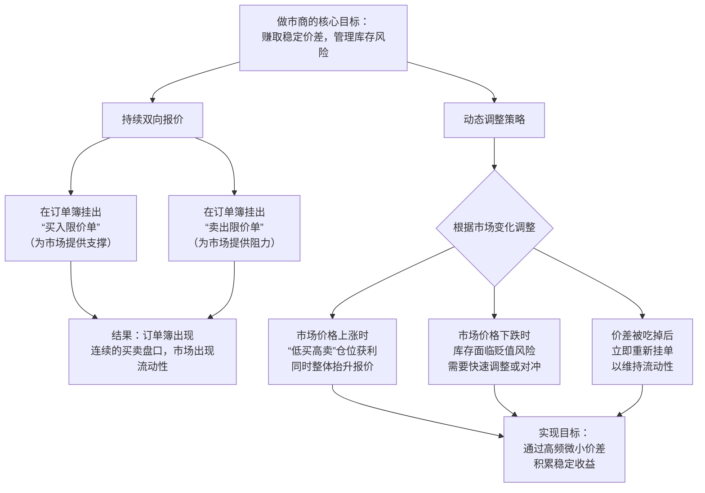
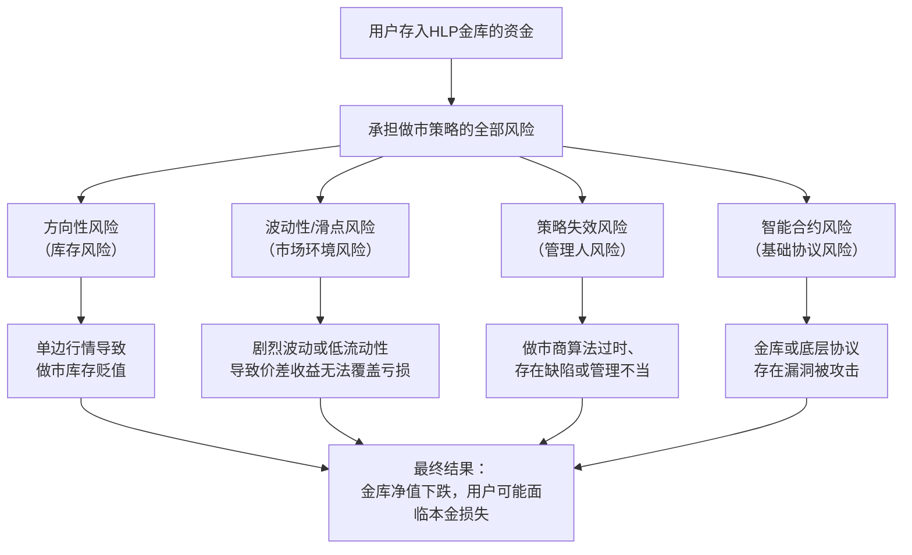
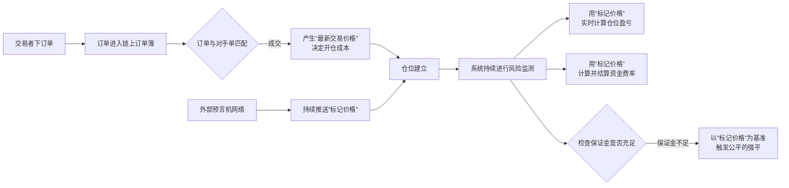

关于Hyperliquid是否有官方为每个交易对提供流动性池，答案很明确：**没有。**

这是一个关键设计选择，它源于Hyperliquid作为**链上中央限价订单簿** 交易所的本质，其目标是在去中心化环境下复现中心化交易所的订单簿体验。

### 📊 详解：Hyperliquid的流动性来源与机制
为了让你清晰地理解其流动性如何运作，这里将它与依赖AMM（自动做市商）池的模式进行对比：

| 特性 | **Hyperliquid模式 (链上订单簿)** | **基于AMM的DEX模式 (如Uniswap)** |
| :--- | :--- | :--- |
| **流动性形式** | **订单簿挂单**。由**做市商和普通交易者**提供的买卖限价订单构成。 | **流动性池**。由**流动性提供者**将成对的资产存入一个共享的智能合约池中。 |
| **价格发现** | **订单驱动**。价格由市场参与者主动挂出的买卖订单直接决定。 | **算法驱动**。价格根据池中资产的比例和恒定乘积公式等算法自动计算。 |
| **交易对手** | 交易者与订单簿上的**特定对手方订单**成交。 | 交易者与**共享的流动性池**进行交易。 |
| **滑点** | 取决于订单簿特定价位的**挂单深度**。 | 取决于交易量相对于**流动性池大小的比例**。 |

**Hyperliquid的具体流动性激励**：
为了激励做市商提供深度，Hyperliquid设计了**HLP（Hyperliquid Liquidity Provider）金库**。
1.  **用户将资产（如USDC）存入HLP金库**，相当于为整个平台的做市活动提供弹药。
2.  **专业的做市商策略**可以使用这些聚合的资金，在Hyperliquid的各个市场进行报价，提供买卖深度。
3.  做市商通过**吃单者的交易手续费**和**资金费率**赚取收益，并将大部分利润（约97%）**返还给HLP金库的存款用户**。
4.  因此，**HLP不是一个针对“每个交易对”的独立池子，而是一个为“全平台所有市场”提供流动性的中央资本池**。

### 💡 为什么选择订单簿模式而非AMM池？
Hyperliquid选择链上订单簿模式主要基于以下考量：
1.  **追求专业交易体验**：订单簿模式是专业交易员和机构熟悉的范式，提供更精确的限价订单、更低的滑点（在深度足够时）和更灵活的交易策略。
2.  **避免无偿损失**：流动性提供者无需像在AMM池中那样承担因市场波动而产生的无偿损失风险。HLP参与者主要承担的是做市策略本身的风险。
3.  **实现资本效率**：订单簿的流动性是“按需”提供的，资金集中在买卖盘口，而不像AMM池中大部分资金在远离市价的地方闲置。

### 💎 总结
因此，对于你的问题，可以得出以下结论：
1.  **无官方交易对池子**：Hyperliquid**没有**类似Uniswap那样的、为每个交易对设立的官方AMM流动性池。
2.  **流动性的核心是HLP**：平台流动性的核心支柱是**HLP金库**，它是一个支持全平台做市的统一资本池。
3.  **流动性由市场创造**：每个交易对的订单簿深度，最终依赖于做市商利用HLP资金或自有资本进行的主动做市行为。

简单来说，在Hyperliquid上交易，你面对的是一个**由做市商驱动的、充满买卖挂单的透明订单簿**，而不是一个与算法池进行兑换的机制。如果你想了解如何参与HLP金库，或者其与Aster、dYdX等平台流动性模型的更深层对比，我可以为你进一步分析。
好的，这是一个非常核心的金融概念。用最通俗的方式解释：**做市商就是市场的“流动性批发商”和“即时交易对手”**。

他们的核心工作不是预测价格涨跌来“炒币”，而是**通过持续地同时报出“买入价”和“卖出价”**，为市场提供即时买卖的可能，并从买卖价差中赚取利润。

### 🏪 一个简单的类比：街边便利店
想象一下街边一家便利店：
*   **你（交易者）**：想随时买一瓶水或卖掉手里的水。
*   **便利店（做市商）**：
    *   它永远挂出两个牌子：**“收购矿泉水，1.9元/瓶”** （买入价，Bid）和 **“出售矿泉水，2.1元/瓶”** （卖出价，Ask）。
    *   你想卖水，它就按1.9元收购；你想买水，它就按2.1元卖给你。
    *   无论你是否交易，便利店都提供这个“买卖服务”，让你随时能成交。它赚的就是这**0.2元的价差**。

**做市商在金融市场（尤其是Hyperliquid这样的订单簿交易所）里干的，就是同样的事，只不过是在电子订单簿上自动化、大规模地进行。**

### ⚙️ 做市商在Hyperliquid等订单簿交易所的具体运作机制
在Hyperliquid上，做市商的工作完全透明，体现在公开的订单簿上。他们的核心操作可以分解为以下流程：

上图展示了做市商从目标到行动，再到动态调整的完整逻辑闭环。他们通过算法自动执行这些操作，每秒可能进行成千上万次。

### 💡 做市商对市场和交易所为何至关重要？
1.  **提供流动性**：让普通交易者随时都能买卖，而不是等待一个刚好反向的交易对手出现。没有做市商的市场，订单簿会又薄又稀疏，买卖困难。
2.  **减小市场波动**：他们的买卖挂单像“缓冲垫”，能吸收突如其来的大额买卖冲击，让价格变化更平滑。
3.  **提高价格发现效率**：他们通过快速调整报价，使价格能及时反映最新的市场信息。
4.  **交易所的合作伙伴**：对于像Hyperliquid这样的交易所，丰富的流动性是吸引用户的核心。因此交易所会通过**更低的交易手续费、直接的激励或像HLP这样的资金支持**来吸引优秀的做市商。

### 📊 收益与风险
| 做市商的收益来源 | 做市商面临的主要风险 |
| :--- | :--- |
| **1. 买卖价差**：最主要的利润，赚取买入价和卖出价之间的微小差额。 | **1. 库存风险（方向性风险）**：价格朝单一方向快速变动时，持有的“库存”资产会贬值。例如，在价格暴跌时手里囤了大量币。 |
| **2. 交易所激励**：如手续费返还、奖励等。 | **2. 信息不对称风险**：被拥有更快信息或更强预测能力的交易者（如大型机构）反复“收割”。 |
| **3. 资金费率**：在永续合约市场中，可以通过持仓平衡来赚取资金费率。 | **3. 技术风险**：网络延迟、系统故障可能导致无法及时撤单或调整，造成重大损失。 |

### 💎 总结
所以，做市商本质上是市场的**“服务商”和“风险管理者”**。他们通过提供“随时可交易”的流动性服务来赚取价差，其存在让市场变得更高效、更稳定。

在Hyperliquid的语境下，**HLP金库**可以看作一个**将普通用户资金聚合起来，交给专业做市商策略去运作的基金**。用户通过HLP间接成为了做市商的“资金提供方”，并分享其收益。

希望这个科普能帮你理解。如果你对做市商的具体算法策略，或者HLP的收益分配细节感兴趣，我们可以继续深入。

成为专业做市商门槛很高，但通过Hyperliquid的HLP金库，普通用户能以“资金提供者”角色参与做市并分享收益。这确实存在风险，关键在于理解**风险从何而来以及如何管理**。

下面我将从两个角度为你解析：一是如何“成为”做市商，二是参与HLP金库的风险本质。

### 🛠️ 如何“成为”做市商：两条路径

| 路径 | 角色定位 | 具体要求与方式 | 适合人群 |
| :--- | :--- | :--- | :--- |
| **1. 成为专业做市商** | **流动性提供方/策略执行方** | 1. **强大的技术能力**：编写低延迟、高频率的做市算法。 2. **深厚的资本**：自有资金雄厚，以承受库存风险。 3. **接入与许可**：申请接入交易所，通常需通过资质审核。 4. **风险管理体系**：有完善的风控模型实时监控。 | 专业量化团队、金融机构。 |
| **2. 成为HLP金库存款人** | **资金提供方/收益分享方** | 1. **拥有资产**：将USDC等资产存入HLP金库。 2. **选择策略**：将资金分配给一个或多个公开的**做市商策略**。 3. **被动赚取收益**：坐享做市策略产生的利润分成（约97%归存款人）。 | 所有Hyperliquid用户，想被动获取做市收益。 |

对于绝大多数人，**参与HLP金库是唯一现实的方式**。你无需自己运行算法，而是“雇佣”专业做市商为你打工。

### ⚠️ HLP金库资金的风险详解
将资金存入HLP金库**并非无风险储蓄**。你的资金直接承担了做市商所面临的市场风险。主要风险来源如下：

### 🛡️ 如何管理与评估风险？
虽然风险存在，但可以通过以下方式管理和评估：

1.  **理解风险本质**：HLP收益来自**风险溢价**，预期回报越高，通常意味着策略承担的风险越大。
2.  **分散策略**：不要将所有资金投入一个做市商策略。Hyperliquid允许你将资金分配给多个策略，以分散风险。
3.  **审查策略记录**：仔细研究每个做市商策略的**历史表现（APY）、最大回撤、管理资金规模**等。长期稳定的记录比短期高收益更重要。
4.  **明确自身定位**：你是将HLP视为一个**有波动的、预期年化收益较高的风险投资产品**，而不是一个保本保息的银行账户。
5.  **从少量资金开始**：在完全理解其波动模式前，先用小部分可支配资产进行尝试。

### 💎 核心结论
1.  **如何参与**：对于普通用户，**存入HLP金库并选择做市商策略**是参与做市、分享收益的主要方式。
2.  **风险性质**：**有风险，且是本金损失风险**。风险直接源自做市活动本身（市场风险）以及策略管理人的能力。
3.  **风险与回报**：HLP的潜在较高收益，正是对你所承担的做市风险的补偿。其净值曲线不会是一条直线，而是会随着市场波动起伏。

在决定参与前，务必在Hyperliquid应用内仔细阅读相关说明，并只投入你能承受损失的资金。如果你想了解如何具体查看和比较不同的做市商策略，我可以进一步解释。

这是一个非常关键的问题，它触及了Hyperliquid这类**链上订单簿DEX**与传统AMM DEX在价格机制上的核心区别。

简单直接的答案是：**是的，Hyperliquid的合约交易价格确实由链上订单簿的买卖订单直接促成，但这并不妨碍它依然高度依赖外部价格预言机。** 预言机的价格（标记价格）并不用于直接交易，而是承担着**风险管理和确保公平性**的、与交易并行的关键职能。

为了让你更清晰地理解，我们可以用一个对比表格来区分这两种价格的用途：

| 价格类型 | 如何产生 | 核心用途 |
| :--- | :--- | :--- |
| **交易/最新价格** | 由**链上订单簿**中最新成交的买卖订单**直接促成**。这是市场的实时成交价。 | **执行交易**：决定你开仓、平仓的实际成交价格。 |
| **标记价格** | 由**去中心化预言机网络**（如Pyth Network）从多个主流交易所（如币安、Coinbase）聚合的现货指数价格。 | **风险计算**：用于计算所有未平仓仓位的**浮动盈亏**、**决定资金费率**以及**触发强平**。这是系统的“公平参考价”。 |

### ⚙️ 为什么必须引入预言机？—— 三大核心原因
即使拥有活跃的链上订单簿，引入外部预言机也是必须的，主要基于以下三个无法由内部订单簿解决的风险：

1.  **防止市场操纵与确保强平公平**
    *   **问题**：在缺乏深度的小市值合约上，一个大户可能用少量资金在链上订单簿进行一笔偏离主流市场价的交易（例如，瞬间拉高价格），如果直接用这个价格强平对手，就构成了**操纵和掠夺**。
    *   **解决方案**：**标记价格**来自多个大型交易所的现货指数，体量巨大，极难被操纵。强平、资金费率等关键风控操作都依据此价格，确保了公平性。

2.  **实现稳定的资金费率机制**
    *   **问题**：永续合约需要锚定现货价格，资金费率是多空双方之间支付的平衡机制。
    *   **解决方案**：资金费率的计算基准必须是能**真实反映全球现货市场价格**的标记价格，而不是可能因为合约本身杠杆情绪而短期偏离的链上交易价格。

3.  **提供准确且抗攻击的盈亏计算**
    *   **问题**：你的仓位盈亏如果只根据流动性可能不足的链上交易价格计算，会导致净值剧烈、不准确地波动。
    *   **解决方案**：所有仓位的**未实现盈亏**都以稳定、可靠的标记价格为标准进行实时计算，这为用户和整个系统提供了稳定、可信的风险评估依据。

### 🔄 两种价格的协同工作流程
让我们以一次“开仓并持有”的过程为例，看看这两种价格如何协同工作：

### 💎 核心结论
所以，我们可以这样总结Hyperliquid的双重价格机制：

1.  **交易驱动，预言机护航**：链上订单簿负责**价格发现和交易执行**的活力与效率；外部预言机负责**风险管理和结算公平**的稳定与公正。
2.  **各司其职，不可或缺**：没有活跃的订单簿，就没有流畅的交易体验；没有可靠的预言机，整个高杠杆金融系统就会暴露在操纵和不公的风险之下，无法持续。

这正是在去中心化环境中构建一个健壮的衍生品交易所所必需的、精妙的“制衡”设计。