# Hyperliquid 技术架构与实现机制分析

## 1. 简介

### 1.1 Hyperliquid 概述

Hyperliquid 是一个高性能的去中心化交易平台，专注于提供高效、透明的链上交易服务，特别是在永续合约领域表现出色。作为一个独立的 Layer 1 (L1) 区块链，Hyperliquid 从底层设计上进行了优化，以支持高性能交易和 DeFi 应用。

Hyperliquid 的核心价值在于：
- 完全链上的中央限价订单簿 (CLOB) 实现
- 极高的交易处理吞吐量 (每秒可达 20 万笔订单)
- 亚秒级的区块最终性
- 支持超过 100 种资产的交易
- 兼容以太坊虚拟机 (EVM) 的智能合约层

### 1.2 核心组件

Hyperliquid 平台由两个主要组件构成：

| 组件 | 功能描述 |
|------|----------|
| **HyperCore** | 高性能交易引擎，专为高频交易优化的定制化 L1 区块链 |
| **HyperVM** | 兼容 EVM 的智能合约层，允许开发者部署和执行智能合约 |

## 2. HyperCore 技术架构

### 2.1 设计目标

HyperCore 作为 Hyperliquid 的核心交易引擎，其设计目标是：
- 实现高性能的链上交易处理
- 支持完全透明的中央限价订单簿
- 提供亚秒级的区块最终性
- 确保交易的公平性和安全性

### 2.2 核心组件

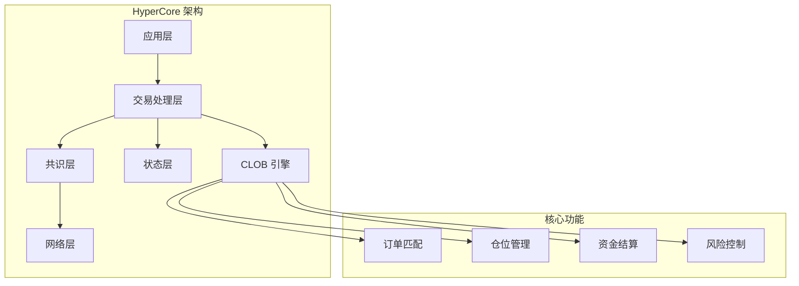

HyperCore 的核心组件包括：

1. **交易处理层**：负责接收、验证和处理交易请求
2. **CLOB 引擎**：实现完全链上的中央限价订单簿，支持高效的订单匹配
3. **共识层**：确保网络中所有节点的状态一致性
4. **网络层**：负责节点间的通信和数据传输
5. **状态层**：管理网络的全局状态，包括账户余额、订单状态等

### 2.3 高性能实现机制

HyperCore 采用了多种技术来实现高性能，其中最核心的是**状态机复制**机制：

#### 核心原理：状态机复制
Hyperliquid的验证者网络遵循 **“状态机复制”** 范式，这是实现高性能和一致性的基础：
1.  **相同的确定性状态机**：所有验证者节点运行**完全相同的HyperCore状态机代码**（其中内置了订单簿引擎）。
2.  **相同的输入顺序**：所有验证者通过**HyperBFT共识**，对用户提交的交易（订单、取消、清算等）**达成完全一致的执行顺序**。
3.  **相同的结果状态**：由于状态机是确定性的，且输入顺序一致，**每个验证者独立执行这些交易后，必然产生完全相同的结果状态**，包括完全相同的订单簿快照。

这个过程确保了无论你连接到哪一个验证者节点，查询到的订单簿深度、市场价格和你的仓位信息都是一致的。

#### 性能保障实现
为解决每个节点都维护全量订单簿并进行撮合计算可能带来的性能瓶颈，Hyperliquid采用了以下优化：

| 潜在性能瓶颈 | Hyperliquid的解决方案 |
| :--- | :--- |
| **数据同步延迟** | **高效的共识算法（HyperBFT）**：在少数（几十个）高性能、低延迟的验证者节点间达成共识，速度快，保证了订单状态的快速同步。 |
| **撮合计算开销** | **原生的、极致优化的订单簿引擎**：用Rust等系统级语言编写，专为高频订单匹配优化，计算效率极高。每个验证者独立执行相同的撮合逻辑，计算负担可控。 |
| **内存与存储** | **专注于衍生品交易**：状态数据模型比通用区块链（如以太坊）简单很多，主要就是订单、仓位、保证金。这使得全量状态可以常驻内存，实现微秒级访问。 |

除了状态机复制机制外，HyperCore还采用了以下高性能技术：

1. **定制化 L1 区块链**：从头设计的区块链架构，专门针对交易场景优化
2. **高效的订单匹配算法**：优化的中央限价订单簿实现，支持高并发订单处理
3. **亚秒级区块最终性**：快速的共识机制，确保交易能够快速确认
4. **并行处理技术**：支持多线程交易处理，提高整体吞吐量

### 2.4 链上 CLOB 实现

HyperCore 的一大特色是完全链上的中央限价订单簿 (CLOB) 实现，其中**每一个验证者节点上都拥有全网全量、实时同步的订单簿信息**，这是其作为链上 CLOB 的基石。

#### 订单匹配机制

Hyperliquid的中央限价订单簿采用**纯粹的价格和时间优先级机制**，与交易者的杠杆倍数、持仓方向无关。匹配过程的唯一依据是：

1.  **价格优先**：最优的买价和卖价优先匹配。
2.  **时间优先**：在相同价格下，先进入订单簿的订单优先匹配。

##### 核心原则：订单匹配与仓位结算解耦

**杠杆倍数、开仓方向（多/空）在匹配过程中完全不被考虑**。它们只影响**交易者个人账户的风险参数**（如保证金要求和强平价格）。

订单匹配的本质是“货物”（合约数量）的转移，而杠杆只是购买这批“货物”时所采用的“付款方式”（保证金比例）。买卖双方完全可以用不同的“付款方式”购买同一批货物。

##### 订单匹配流程详解

以下是一个典型的订单匹配流程示例，展示了10倍空仓和5倍多仓如何在同一价格下成交：

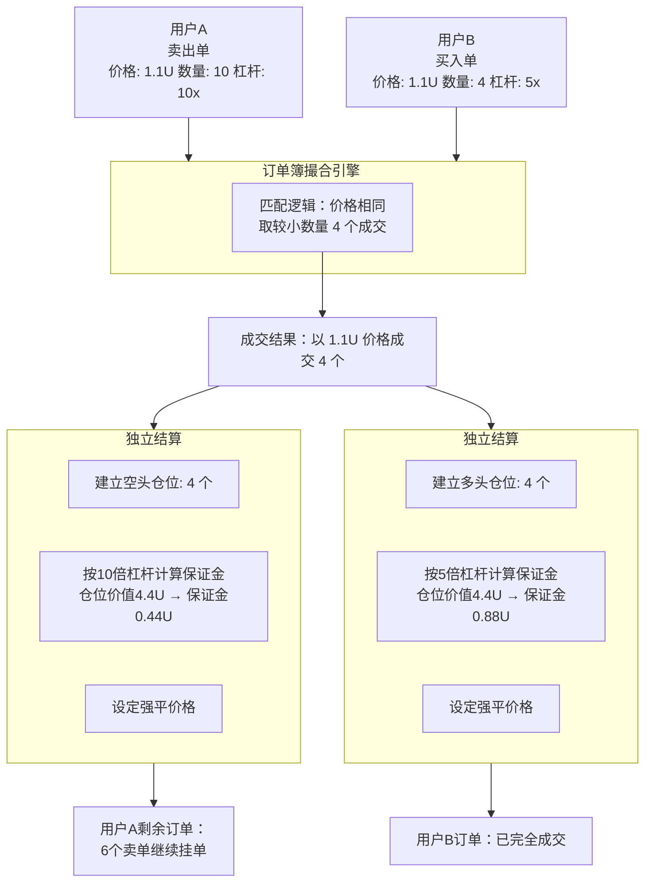

##### 收益兑现机制

当用户持有盈利仓位，即使原对手盘爆仓，其后续收益仍有保障，收益来源包括：

1.  **路径一：平仓时，与整个市场为对手**
    *   当用户想要平仓时，其平仓单会与订单簿上任何一个反向订单匹配，无论这个反向订单来自新入场的交易者、另一个平仓的交易者还是做市商。

2.  **路径二：对手爆仓时，由系统和清算网络偿付**
    *   在对手盘爆仓的瞬间，系统已经完成了收益的初次结算。对手的损失（即用户的等额盈利）按以下顺序分配：
        1.  对手的剩余保证金。
        2.  清算人/保险基金垫付（如果对手的保证金不足以覆盖全部亏损）。

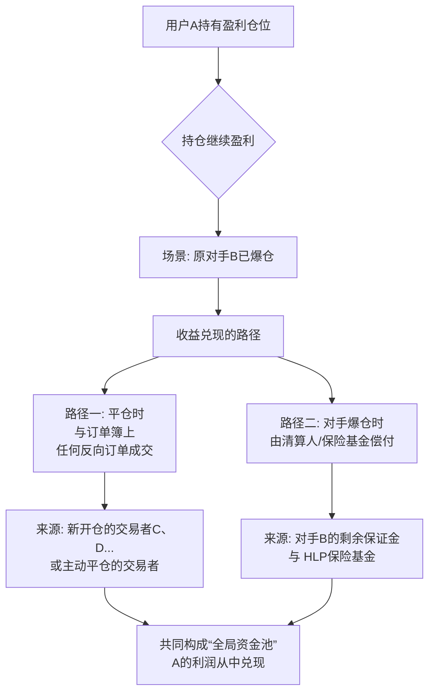

#### 流动性来源与机制

Hyperliquid作为链上中央限价订单簿交易所，**没有**官方为每个交易对提供的流动性池。其流动性来源于做市商和普通交易者提供的买卖限价订单，这种设计源于其在去中心化环境下复现中心化交易所订单簿体验的目标。

| 特性 | **Hyperliquid模式 (链上订单簿)** | **基于AMM的DEX模式 (如Uniswap)** |
| :--- | :--- | :--- |
| **流动性形式** | **订单簿挂单**。由**做市商和普通交易者**提供的买卖限价订单构成。 | **流动性池**。由**流动性提供者**将成对的资产存入一个共享的智能合约池中。 |
| **价格发现** | **订单驱动**。价格由市场参与者主动挂出的买卖订单直接决定。 | **算法驱动**。价格根据池中资产的比例和恒定乘积公式等算法自动计算。 |
| **交易对手** | 交易者与订单簿上的**特定对手方订单**成交。 | 交易者与**共享的流动性池**进行交易。 |
| **滑点** | 取决于订单簿特定价位的**挂单深度**。 | 取决于交易量相对于**流动性池大小的比例**。 |

#### HLP金库机制

为了激励做市商提供深度，Hyperliquid设计了**HLP（Hyperliquid Liquidity Provider）金库**：
1.  **用户将资产（如USDC）存入HLP金库**，相当于为整个平台的做市活动提供弹药。
2.  **专业的做市商策略**可以使用这些聚合的资金，在Hyperliquid的各个市场进行报价，提供买卖深度。
3.  做市商通过**吃单者的交易手续费**和**资金费率**赚取收益，并将大部分利润（约97%）**返还给HLP金库的存款用户**。
4.  因此，**HLP不是一个针对“每个交易对”的独立池子，而是一个为“全平台所有市场”提供流动性的中央资本池**。

#### HLP与杠杆交易的关系

HLP金库是Hyperliquid支持高杠杆交易的核心基础之一。技术上，Hyperliquid可以实现极高的杠杆倍数，但实际可用的杠杆水平受到四大支柱的约束：

| 约束支柱 | 具体内容 | 对杠杆的影响 |
| :--- | :--- | :--- |
| **HLP保险基金规模** | HLP金库中的资产构成了平台的保险基金，用于应对极端市场情况下的系统性风险。 | 保险基金规模越大，平台能支持的杠杆水平越高，因为有足够的资金缓冲来吸收潜在损失。 |
| **市场深度** | 由HLP支持的做市商提供的订单簿深度，反映了市场的流动性状况。 | 深度越深，大笔订单对价格的影响越小，平台可以安全地提供更高杠杆。 |
| **清算网络效率** | 验证者节点的清算执行速度和准确性，决定了风险暴露的持续时间。 | 清算效率越高，风险敞口时间越短，允许更高的杠杆水平。 |
| **协议风险参数设计** | 包括初始保证金率、维持保证金率等风险控制参数。 | 更保守的参数设置会降低可用杠杆，但提高系统稳定性；更激进的参数则相反。 |

这四大支柱相互协同，共同决定了Hyperliquid在不同市场和不同时期能够安全提供的实际杠杆水平。HLP金库作为流动性聚合池，是这一杠杆约束体系的基础，直接影响前两个支柱的表现。

#### 为什么选择订单簿模式而非AMM池？

Hyperliquid选择链上订单簿模式主要基于以下考量：
1.  **追求专业交易体验**：订单簿模式是专业交易员和机构熟悉的范式，提供更精确的限价订单、更低的滑点（在深度足够时）和更灵活的交易策略。
2.  **避免无偿损失**：流动性提供者无需像在AMM池中那样承担因市场波动而产生的无偿损失风险。HLP参与者主要承担的是做市策略本身的风险。
3.  **实现资本效率**：订单簿的流动性是“按需”提供的，资金集中在买卖盘口，而不像AMM池中大部分资金在远离市价的地方闲置。

#### 做市商机制详解

做市商是Hyperliquid链上订单簿流动性的核心提供者，他们通过持续提供买卖报价，确保市场的流动性和交易效率。

##### 做市商的基本概念

做市商本质上是市场的“流动性批发商”和“即时交易对手”。他们的核心工作不是预测价格涨跌，而是**通过持续地同时报出“买入价”和“卖出价”**，为市场提供即时买卖的可能，并从买卖价差中赚取利润。

**一个简单的类比：街边便利店**
*   **你（交易者）**：想随时买一瓶水或卖掉手里的水。
*   **便利店（做市商）**：
    *   它永远挂出两个牌子：**“收购矿泉水，1.9元/瓶”** （买入价，Bid）和 **“出售矿泉水，2.1元/瓶”** （卖出价，Ask）。
    *   你想卖水，它就按1.9元收购；你想买水，它就按2.1元卖给你。
    *   无论你是否交易，便利店都提供这个“买卖服务”，让你随时能成交。它赚的就是这**0.2元的价差**。

做市商在Hyperliquid等订单簿交易所里干的，就是同样的事，只不过是在电子订单簿上自动化、大规模地进行。

##### 做市商在Hyperliquid的运作机制

在Hyperliquid上，做市商的工作完全透明，体现在公开的订单簿上。他们的核心操作可以分解为以下流程：

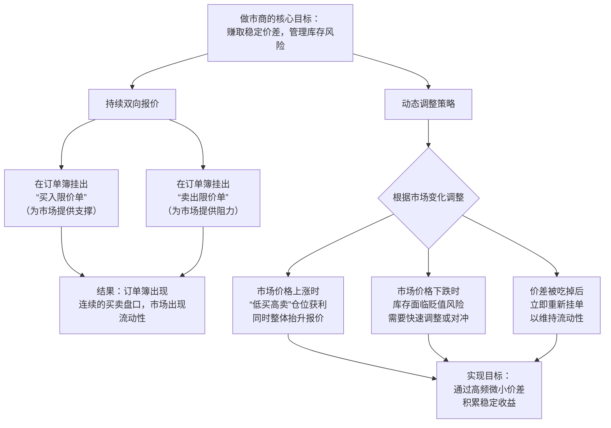

做市商通过算法自动执行这些操作，每秒可能进行成千上万次。

##### 做市商对市场的重要性

1.  **提供流动性**：让普通交易者随时都能买卖，而不是等待一个刚好反向的交易对手出现。没有做市商的市场，订单簿会又薄又稀疏，买卖困难。
2.  **减小市场波动**：他们的买卖挂单像“缓冲垫”，能吸收突如其来的大额买卖冲击，让价格变化更平滑。
3.  **提高价格发现效率**：他们通过快速调整报价，使价格能及时反映最新的市场信息。
4.  **交易所的合作伙伴**：对于像Hyperliquid这样的交易所，丰富的流动性是吸引用户的核心。因此交易所会通过**更低的交易手续费、直接的激励或像HLP这样的资金支持**来吸引优秀的做市商。

##### 做市商的收益与风险

| 做市商的收益来源 | 做市商面临的主要风险 |
| :--- | :--- |
| **1. 买卖价差**：最主要的利润，赚取买入价和卖出价之间的微小差额。 | **1. 库存风险（方向性风险）**：价格朝单一方向快速变动时，持有的“库存”资产会贬值。例如，在价格暴跌时手里囤了大量币。 |
| **2. 交易所激励**：如手续费返还、奖励等。 | **2. 信息不对称风险**：被拥有更快信息或更强预测能力的交易者（如大型机构）反复“收割”。 |
| **3. 资金费率**：在永续合约市场中，可以通过持仓平衡来赚取资金费率。 | **3. 技术风险**：网络延迟、系统故障可能导致无法及时撤单或调整，造成重大损失。 |

#### 用户参与做市的路径

成为专业做市商门槛很高，但通过Hyperliquid的HLP金库，普通用户能以“资金提供者”角色参与做市并分享收益。

##### 两条参与路径

| 路径 | 角色定位 | 具体要求与方式 | 适合人群 |
| :--- | :--- | :--- | :--- |
| **1. 成为专业做市商** | **流动性提供方/策略执行方** | 1. **强大的技术能力**：编写低延迟、高频率的做市算法。 2. **深厚的资本**：自有资金雄厚，以承受库存风险。 3. **接入与许可**：申请接入交易所，通常需通过资质审核。 4. **风险管理体系**：有完善的风控模型实时监控。 | 专业量化团队、金融机构。 |
| **2. 成为HLP金库存款人** | **资金提供方/收益分享方** | 1. **拥有资产**：将USDC等资产存入HLP金库。 2. **选择策略**：将资金分配给一个或多个公开的**做市商策略**。 3. **被动赚取收益**：坐享做市策略产生的利润分成（约97%归存款人）。 | 所有Hyperliquid用户，想被动获取做市收益。 |

对于绝大多数人，**参与HLP金库是唯一现实的方式**。你无需自己运行算法，而是“雇佣”专业做市商为你打工。

##### HLP金库资金的风险详解

将资金存入HLP金库**并非无风险储蓄**。你的资金直接承担了做市商所面临的市场风险。主要风险来源如下：

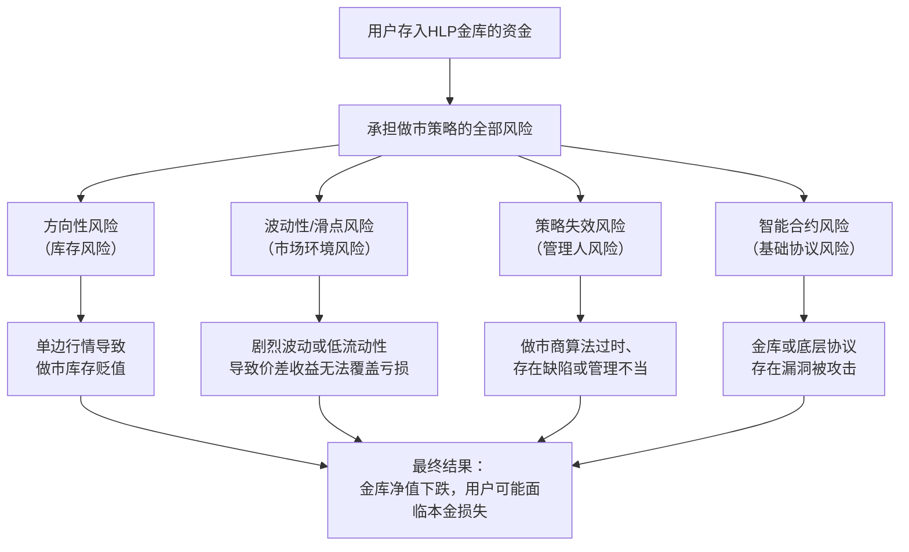

##### 风险评估与管理

1.  **理解风险本质**：HLP收益来自**风险溢价**，预期回报越高，通常意味着策略承担的风险越大。
2.  **分散策略**：不要将所有资金投入一个做市商策略。Hyperliquid允许你将资金分配给多个策略，以分散风险。
3.  **审查策略记录**：仔细研究每个做市商策略的**历史表现（APY）、最大回撤、管理资金规模**等。长期稳定的记录比短期高收益更重要。
4.  **明确自身定位**：你是将HLP视为一个**有波动的、预期年化收益较高的风险投资产品**，而不是一个保本保息的银行账户。
5.  **从少量资金开始**：在完全理解其波动模式前，先用小部分可支配资产进行尝试。

通过做市商机制和HLP金库，Hyperliquid成功在链上构建了深度流动性。接下来，我们将深入分析HyperCore的链上CLOB实现的核心匹配机制：

### 订单匹配机制：价格与时间优先

在Hyperliquid的中央限价订单簿中，匹配的唯一依据是：
1. **价格优先**：最优的买价和卖价优先匹配
2. **时间优先**：在相同价格下，先进入订单簿的订单优先匹配

**杠杆倍数、开仓方向（多/空）在匹配过程中完全不被考虑**。它们只影响交易者个人账户的风险参数（如保证金要求和强平价格）。

#### 订单匹配与仓位结算的解耦

Hyperliquid将"交易达成"与"仓位结算"这两个逻辑完全解耦，分步处理：
- **匹配阶段**：只处理价格和数量，不考虑杠杆和开仓方向
- **结算阶段**：成交后，各自独立计算杠杆和风险参数

#### 具体匹配流程

假设当前某代币标记价格为1.0U：
1. **订单进入订单簿**：
   - 用户A：下"1.1U卖出"的限价单，开10倍空仓
   - 用户B：下"1.1U买入"的限价单，开5倍多仓

2. **订单匹配阶段**：
   - 系统看到：在1.1U价位上，有一个卖出10个的订单和一个买入4个的订单
   - 匹配逻辑：价格相同，按时间优先，匹配两者中较小的数量（4个）
   - 匹配结果：立即成交4个

3. **成交后结算阶段**：
   - 用户A：以1.1U价格卖出开仓，建立4个空头仓位，按10倍杠杆计算保证金
   - 用户B：以1.1U价格买入开仓，建立4个多头仓位，按5倍杠杆计算保证金
   - 用户A剩余的6个卖单继续挂在订单簿上

#### 可视化理解

### 链上 CLOB 实现特点

HyperCore 的链上 CLOB 实现具有以下特点：

- 所有订单都直接记录在区块链上，确保完全透明
- 订单匹配过程在链上执行，保证交易的公平性
- 支持复杂的订单类型，如限价单、市价单、止损单等
- 提供实时的市场深度数据

#### 全量订单簿的必要性

每个验证者节点都持有全量订单簿信息，这是由“去中心化交易所”的根本需求决定的：

1.  **一致性是信任的基础**：如果不同节点看到不同的订单簿，就会出现套利漏洞、交易不公平和结算风险。**全量复制是保证全网交易环境一致、公平的唯一方法**。
2.  **容错与抗审查的关键**：即使部分验证者节点宕机或作恶，只要超过2/3的节点诚实运行，网络就能继续运作，订单簿数据依然完整、可用。没有任何单一节点可以垄断或篡改订单信息。
3.  **实现链上订单簿的承诺**：Hyperliquid的核心卖点就是“**链上**”的订单簿。这意味着订单的提交、排队、撮合、撤销的整个生命周期都必须由区块链共识来保证，其状态必须是全局可见且不可篡改的。每个验证者持有全量信息是实现这一点的必要条件。

#### 与其它模型的对比

为了加深理解，我们可以对比三种常见的订单簿实现模式：

| 模式 | 订单簿位置 | 一致性保证 | 典型代表 | Hyperliquid的定位 |
| :--- | :--- | :--- | :--- | :--- |
| **中心化交易所** | 交易所的中央服务器 | 由运营商单方面保证，用户需信任。 | Binance, Coinbase | **完全相反**。Hyperliquid通过去中心化验证者网络取代了单一服务器。 |
| **链下订单簿+链上结算** | 链下服务器（由运营商或委员会维护） | 依赖运营者的诚实或复杂的链下共识，存在信任假设。 | dYdX（旧版本）， 大多数传统“DEX” | **更彻底的去中心化**。Hyperliquid将订单簿本身置于链上共识之下，消除了对链下订单簿运营者的信任。 |
| **Hyperliquid链上CLOB** | 所有验证者节点的内存中，状态全局共识 | 由HyperBFT共识算法和状态机复制机制保证，无需信任单一实体。 | Hyperliquid | **链上原生**。订单簿的整个生命周期都在链上共识的保护下。 |

### 2.5 节点类型与角色

Hyperliquid 网络中有两种主要节点类型，它们承担不同的角色和功能：

| 特性 | **验证者节点** | **全节点** | 
| :--- | :--- | :--- | 
| **核心角色** | **网络的决策与执行引擎** | **网络的数据与访问中继** | 
| **共识参与** | **是**。运行HyperBFT共识，投票决定区块顺序和内容。 | **否**。不参与投票，只接受并同步验证者达成共识的区块。 | 
| **状态维护** | **维护完整的、最新的全球状态**。包括所有账户的保证金、持仓、订单簿。执行所有交易和智能合约。 | **维护一份完整的、只读的状态副本**。它从验证者节点同步数据，可以验证所有数据的正确性，但自身不执行交易。 | 
| **硬件与成本** | 要求**极高**。需要高性能服务器、稳定的网络和大量质押的HYPE代币（目前为50万枚），以保障网络安全和性能。 | 要求**较低**。普通云服务器即可运行，主要成本是存储和带宽，无质押要求。 | 
| **对等性** | 在共识层是**对等的**，每个验证者一票（或按权益加权）。 | **不对等**，是网络的客户端和服务提供方。 | 
| **类比** | **证券交易所的中央清算系统**。负责最终的成交确认、资金划转和登记。 | **券商的交易终端和服务器**。它向中央系统发送订单、接收实时行情和成交回报，并展示给客户。 | 

**简单总结：验证者节点是"做决定并记账的人"，全节点是"同步账本并提供查询服务的人"。**

## 3. HyperVM 技术架构

### 3.1 EVM 兼容性设计

HyperVM (也称为 HyperEVM) 是建立在 HyperCore 之上的通用智能合约层，其核心设计特点是兼容以太坊虚拟机 (EVM)：

- 支持以太坊的 Solidity 编程语言
- 兼容以太坊的智能合约标准 (如 ERC-20、ERC-721 等)
- 允许直接迁移以太坊上的应用程序
- 提供与以太坊类似的开发工具链支持

### 3.2 智能合约执行机制

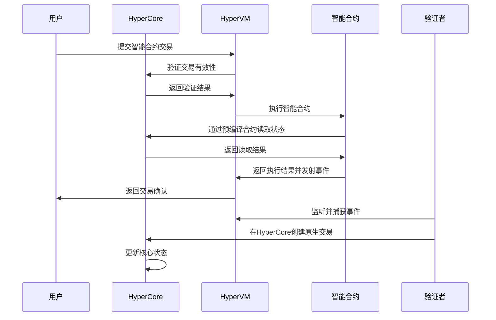

HyperVM 的智能合约执行流程：

1. 用户提交智能合约交易
2. 交易被发送到 HyperVM 层
3. HyperVM 向 HyperCore 验证交易有效性
4. 智能合约在 HyperVM 中执行：
   - 可以通过预编译合约读取 HyperCore 中的核心状态
   - 执行合约内部逻辑，更新自身的 EVM 状态
5. 合约执行完成，返回结果并发射事件（如有）
6. 用户收到交易确认
7. 验证者监听并捕获事件
8. 验证者在 HyperCore 层创建原生交易
9. HyperCore 执行原生交易，更新核心状态

### 3.3 与 HyperCore 的集成方式

HyperVM 与 HyperCore 通过定义良好的接口进行集成，实现了高效的数据交换和状态协作：

- **逻辑状态隔离**：HyperVM 无法直接修改 HyperCore 的核心状态，两层保持独立的状态存储
- **预编译合约访问**：HyperVM 通过预编译合约以只读方式访问 HyperCore 的核心状态
- **事件驱动的影响机制**：HyperVM 通过发射事件表达意图，由验证者在 HyperCore 层创建原生交易实现状态更新
- **共享的安全模型**：继承 HyperCore 的安全机制，确保智能合约执行的安全性
- **高效的通信机制**：两层之间采用优化的通信协议，减少延迟

## 4. HyperCore 与 HyperVM 协作机制

### 4.1 交易处理流程

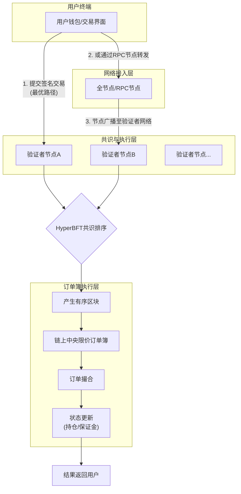

HyperCore 和 HyperVM 协作完成交易处理的流程：

1. 用户提交交易请求，有两种主要提交路径：
   - **首选路径（最优）**：专业的交易客户端或做市商系统会**直接连接到一个或多个验证者节点的入口（RPC端点）**，将签名后的交易直接发送过去。这跳过了任何中间中继，实现了最小网络延迟。
   - **备用路径（通用）**：普通用户通过钱包或网页前端发送交易，这些前端通常连接到一个公共的或自己搭建的**全节点/RPC节点**，再由该节点将交易广播到验证者网络。

2. 系统根据交易类型将其路由到相应的处理层：
   - **交易类请求 (如订单操作)**：直接发送到 HyperCore，通过**纯原生路径**高效处理
   - **智能合约请求**：发送到 HyperVM，通过 EVM 执行环境处理

#### 普通交易的纯 HyperCore 路径

对于**普通的现货交易或永续合约交易**（即用户直接通过交易界面下的单笔市价单、限价单），其**整个生命周期完全在 HyperCore 原生层内完成，根本不会涉及 HyperEVM 虚拟机**。这是 Hyperliquid 实现极致性能的核心设计。

##### 对比：直接交易 vs. 通过智能合约交易

| 特性 | **普通现货/永续交易** | **通过 HyperEVM 智能合约的交易** |
| :--- | :--- | :--- |
| **执行路径** | **纯 HyperCore 原生路径** | **HyperEVM -> 事件 -> HyperCore** |
| **性能** | **极高**。从下单、撮合到结算，全程使用为交易优化的原生代码（Rust），延迟在**毫秒级**。 | **较低**。需要经过EVM执行、事件发射、事件解析等多步骤，延迟增加，Gas成本更高。 |
| **状态更新** | 直接原子性地更新 HyperCore 中的**核心状态**（如订单簿、用户仓位和保证金）。 | 先更新EVM合约内部状态，再通过事件触发HyperCore更新核心状态（两步非原子操作）。 |
| **开发复杂度** | 无。用户直接使用前端。 | 高。需要开发者编写、部署并审计智能合约。 |
| **适用场景** | **绝大多数普通用户的直接交易**。追求速度和成本。 | **复杂的链上策略**。如自动止损、跟单、组合保证金、结构化产品等需要可编程逻辑的场景。 |

##### 普通交易的纯 HyperCore 路径详解

当你在 Hyperliquid 界面上点击“买入”或“卖出”时，其技术流程如下：

1.  **交易构造**：你的钱包（如集成后的 MetaMask）对一笔包含**市场、方向、数量、价格、Nonce**等信息的交易进行签名。
2.  **交易提交**：签名后的交易被直接发送到 Hyperliquid 的验证者节点（或通过RPC节点转发）。
3.  **共识排序**：该交易进入验证者的内存池，并通过 **HyperBFT 共识**被确定性地排序到一个区块中。
4.  **原生执行**：区块内的交易被 **HyperCore 的原生执行引擎**按序处理：
    *   **订单簿匹配**：引擎将订单提交到**链上中央限价订单簿**，根据价格-时间优先规则进行撮合。
    *   **状态结算**：成交后，引擎直接、原子性地更新相关用户的**保证金余额**和**持仓数量**，并更新订单簿深度。
5.  **结果返回**：交易结果（成功或失败）被记录在区块中，并返回给你的前端界面。

**整个过程中，HyperEVM 完全没有被唤醒或参与**。这条路径是为最核心、最高频的交易行为量身打造的“高速公路”。

#### 设计哲学：分离关注点

Hyperliquid 的架构清晰地分离了两种需求：
*   **对性能的终极追求**：由 **HyperCore** 负责，通过原生代码实现。
*   **对灵活性的需求**：由 **HyperEVM** 负责，通过图灵完备的智能合约实现。

这就像在一家高度自动化的工厂里：
*   **HyperCore** 是**全自动化的核心生产线**，以最高效率处理标准产品（标准订单）。
*   **HyperEVM** 是**旁边的研发实验室和定制车间**，允许工程师（开发者）设计复杂的、非标准的生产流程（交易策略），当定制流程需要用到核心生产线时，就向它发送标准化的工作指令（事件）。

#### 智能合约交易路径

4. HyperVM 处理智能合约请求：
   - 执行智能合约代码
   - 通过预编译合约读取 HyperCore 的核心状态
   - 更新 HyperVM 自身的智能合约状态
   - 如有需要，发射事件表达对核心状态的影响意图

5. 验证者监听并捕获 HyperVM 发射的事件

6. 验证者根据事件内容在 HyperCore 层创建原生交易

7. HyperCore 处理这些原生交易，更新相应的核心状态

8. 所有状态更新（包括 HyperCore 和 HyperVM 的状态）都被记录到区块链中

9. 新区块通过共识机制确认

10. 交易完成，用户收到确认信息

**无论哪条路径，最终所有待处理的交易都会汇集到验证者节点的内存池中，等待进入共识流程。**

### 4.2 状态隔离与状态同步

为了兼顾高性能和可编程性，Hyperliquid 对状态进行了**逻辑隔离**，这是理解其设计的关键。

#### 核心状态隔离

| 状态类型 | 存储位置 | 描述与示例 |
| :--- | :--- | :--- |
| **交易核心状态** | **HyperCore (原生层)** | 这是系统的**主状态**，包括： • 用户在所有市场的**保证金余额** • 用户的**持仓**（多/空头寸） • 全市场的**订单簿**（买/卖盘） • **全局风险参数**（如清算线） |
| **智能合约状态** | **HyperEVM 环境内** | 这是**独立于 HyperCore 的 EVM 状态**，包括： • 部署在 HyperEVM 上的**合约代码** • 合约内部的**变量存储**（如一个借贷池的总存款量） • 用户与这些合约交互产生的**EVM层余额和状态** |

### 4.3 交互方式：读取与影响，而非直接写入

这种隔离决定了 HyperEVM **无法直接修改** HyperCore 的核心状态。它们之间的交互是**单向和间接**的：

1.  **HyperEVM → 读取 → HyperCore (状态)**：通过**预编译合约**，EVM 合约可以**只读**方式查询 HyperCore 的实时状态（例如，获取某个交易对的当前价格和你的仓位）。这是一个简单的数据读取。

2.  **HyperEVM → 影响 → HyperCore (行为)**：通过**发射事件**，EVM 合约可以向系统发出一个**意图**。验证者节点捕获这个意图后，会**在 HyperCore 层原生地创建并执行一笔标准的链上交易**。这个交易的结果（如开仓、平仓）才会更新 HyperCore 的核心状态。

### 4.4 具体例子：通过策略合约开仓

假设你调用一个 HyperEVM 上的“自动止损”合约，我们看看状态如何流动：

1.  你调用合约，合约**通过预编译合约读取** HyperCore 中你当前 BTC 仓位的标记价格。
2.  合约逻辑判断需要开一个对冲订单，于是它**在自己的 EVM 状态里记录**一条日志（智能合约状态更新）。
3.  同时，合约**发射一个包含订单参数的事件**。
4.  验证者捕获事件，**在 HyperCore 层创建一笔合法的交易订单**，提交到链上订单簿。
5.  订单被撮合后，**HyperCore 的核心状态被更新**：你的持仓发生了变化。
6.  **此时，HyperEVM 合约内部状态和 HyperCore 核心状态是各自独立的**。合约只知道它发出了一个指令，而实际的仓位变化体现在 HyperCore 中。

### 4.5 资产转移机制

Hyperliquid 支持 HyperCore 和 HyperVM 之间的资产转移功能：

- 首批支持的代币为 HYPE (Hyperliquid 的原生代币)
- HYPE 作为 HyperEVM 的原生 Gas 代币
- 通过系统地址在两端进行转移
- 转移过程完全透明且安全

## 5. 高性能实现机制分析

### 5.1 定制化 L1 区块链架构

Hyperliquid 采用定制化的 L1 区块链架构，而非在现有区块链上构建应用层，这是其实现高性能的基础：

- **优化的区块结构**：专为交易数据设计的区块格式，减少开销
- **轻量级节点**：支持轻量级节点，降低参与门槛
- **模块化设计**：各组件独立设计，便于优化和扩展

### 5.2 并行处理技术

HyperCore 采用并行处理技术来提高交易吞吐量：

- **多线程交易处理**：支持同时处理多个交易请求
- **分区处理**：将市场数据分区，并行处理不同市场的订单
- **流水线执行**：采用流水线技术，提高交易处理效率

### 5.3 快速共识机制

Hyperliquid 实现亚秒级最终性的关键在于其快速的共识机制：

- **HyperBFT 共识算法**：基于 BFT 共识算法进行了深度优化，专为高性能交易场景设计
- **减少共识轮次**：减少达成共识所需的轮次，降低延迟
- **高效的区块传播**：优化的区块传播机制，确保快速同步

### 5.4 网络优化

Hyperliquid 在网络层面也进行了优化：

- **高效的 P2P 网络**：优化的节点发现和数据传播机制
- **低延迟通信**：采用高性能的网络协议，减少通信延迟
- **网络分区容忍**：具备良好的网络分区容忍能力，确保系统稳定性

### 5.5 CLOB 引擎优化

Hyperliquid 的链上 CLOB 引擎采用了多种优化技术，其中内存与持久化的分工是实现高性能的关键设计：

- **高效的订单匹配算法**：优化的价格时间优先级匹配算法
- **内存中的订单簿**：在内存中维护订单簿，提高访问速度
- **批量处理**：批量处理订单，减少系统开销

#### 内存与持久化设计

HyperCore 内部采用了内存与持久化存储分离的设计，其核心流程可以概括为：

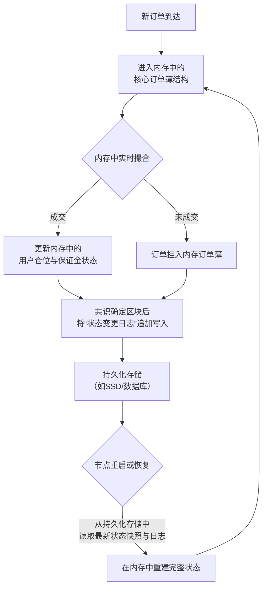

**关键点解读：**

*   **实时交易路径（图左）**：所有影响性能的关键操作（订单管理、撮合、持仓计算）都发生在**内存**中。这是实现**微秒级延迟**的唯一方式。
*   **持久化路径（图右）**：持久化存储（如SSD、数据库）用于：
    1.  **记录日志**：在共识确定一个区块后，将该区块引起的**状态变更指令或日志**顺序写入磁盘。这保证了数据的持久性和可审计性。
    2.  **存储快照**：定期将内存中的完整状态（订单簿+账户余额）生成快照保存到磁盘。
    3.  **用于恢复**：当节点重启时，**先加载最新的快照到内存，再重放快照之后的日志**，从而在内存中快速重建出最新的、可用的完整状态。

#### 性能与持久性的平衡

HyperCore 通过这种设计实现了性能与持久性的完美平衡：

| 操作 | 内存访问延迟 | SSD访问延迟 | 性能差距 |
| :--- | :--- | :--- | :--- |
| 随机读取 | 约100纳秒 | 约100微秒 | **相差约1，000倍** |
| 顺序写入 | 极快 | 较快 | 差距相对较小，但仍在百倍量级 |

这种设计使得 HyperCore 能够获得中心化交易所级别的性能，同时通过区块链的共识机制和节点间的状态复制，保证了数据的去中心化、一致性和最终持久性，避免了中心化交易所"数据库故障则一切丢失"的单点风险。

**简单说，HyperCore 就像一家顶级券商的高频交易系统，把所有订单簿放在超快的"内存"里运作；但同时，它又给这套系统配备了一个由多个独立机房（验证节点）共同维护的、实时同步的"分布式日志备份系统"，从而既拥有了速度，又拥有了区块链的可靠性和透明度。**

### 5.6 状态隔离对性能的影响

状态隔离是 Hyperliquid 实现高性能的核心设计之一，它带来了以下性能优势：

1. **HyperCore 专注于交易性能**：通过将核心交易状态与智能合约状态分离，HyperCore 可以专注于优化交易处理流程，无需处理复杂的 EVM 执行逻辑。

2. **减少状态一致性开销**：由于 HyperEVM 无法直接修改 HyperCore 的核心状态，避免了复杂的跨环境状态一致性检查，降低了系统开销。

3. **独立优化空间**：两层状态可以独立进行优化，HyperCore 可以针对交易性能进行极致优化，而 HyperVM 可以专注于 EVM 兼容性和可编程性。

4. **降低延迟**：核心交易状态的修改无需经过 EVM 执行的完整流程，减少了交易确认的延迟。

5. **提高吞吐量**：HyperCore 可以并行处理更多的交易请求，而不会被复杂的智能合约执行所阻塞。

这种设计本质上是为了解决"在保证核心功能极致性能的同时，如何开放可编程性"这一难题，通过状态隔离实现了高性能与灵活性的平衡。

### 5.7 订单汇总与高性能实现机制

这正是 Hyperliquid 设计的精髓所在。高性能订单簿并非通过"不汇总"实现，而是通过**极致的"链上汇总"** 和**精简的共识机制**实现的。

#### 传统区块链与 Hyperliquid 的性能对比

| 传统区块链（如以太坊）的瓶颈 | Hyperliquid的解决方案 | 
| :--- | :--- | 
| **全局状态庞杂**：每个节点需要处理并存储所有无关的状态（如NFT、游戏数据）。 | **状态专注**：HyperCore状态机**只专注于交易核心数据**（订单、仓位、保证金），数据结构为高频交易极致优化。 | 
| **共识开销大**：在数千个全球节点间达成共识，网络延迟高。 | **精简验证者集合**：在几十个高性能、低延迟的验证者节点间运行**HyperBFT共识**，达成共识的速度极快（亚秒级）。 | 
| **执行与共识耦合**：每个节点重复执行所有交易来验证，计算是瓶颈。 | **明确角色分离**：**只有验证者节点执行交易**。全节点无需重复计算，只需验证结果，这使得网络可以支持大量只读的全节点而不影响性能。 | 
| **订单簿在链下**：大多数DEX的订单簿在链下服务器，存在信任风险。 | **订单簿完全在链上**：订单的提交、撮合、撤销全部在HyperCore状态机内完成，由共识保障，**实现了去中心化的信任和中心化交易所的性能**。 | 

#### 订单汇总的实现

**"汇总"发生在两个地方：** 
1. **在验证者的内存池中**：来自全网的所有订单请求首先在这里临时汇总。
2. **在共识产生的区块中**：验证者通过HyperBFT共识，就"**下一个区块包含哪些订单、按什么顺序处理**"达成一致。这个**有序的订单列表就是最终的、全局认可的汇总**。

一旦区块被最终确定，其中的订单就会被**HyperCore的原生订单簿引擎**按序处理（价格优先、时间优先），瞬间完成撮合和状态更新。由于整个流程（从共识到执行）都在高度优化的同一套代码和少数节点内完成，所以能实现接近中心化交易所的吞吐量和延迟。

#### 交易同步机制

交易并非简单地"同步"，而是通过其共识机制（HyperBFT）被所有验证者节点"共同排序和执行"。这个过程不是被动的数据复制，而是主动的共识达成，速度极快。

我们用三个阶段来拆解这个"快速同步"的过程：

##### 第一阶段：提议与接收（亚秒级）

当一笔签名交易被用户直接提交给**某个验证者节点（假设为V1）**后：

1.  **V1** 收到交易，首先进行基础验证（如签名有效性）。
2.  验证通过后，**V1** 会**立即**将其放入自己的**交易内存池**中。
3.  与此同时，**V1 会通过高效的点对点（P2P）网络，将这笔交易广播给所有其他已知的验证者节点**。

**关键点**：在Hyperliquid这种少数已知验证者节点组成的网络中，这个P2P广播是极其迅速的，通常在几十到几百毫秒内，全网所有验证者节点的内存池中都会拥有这笔待处理的交易。

##### 第二阶段：共识排序与打包（核心，亚秒级完成）

这是实现"快速同步"的核心，而不是传统的数据同步。整个过程由 **HyperBFT共识算法**驱动。

假设现在 **V1** 是当前轮的**提案者**（负责打包区块），其流程如下：
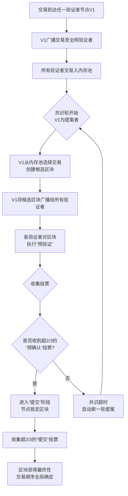

1.  **打包**：作为提案者的 **V1**，会从自己和全网验证者共享的内存池中，按一定规则（如Gas价格、到达时间）选择一批交易，打包成一个"候选区块"。
2.  **广播与预执行**：**V1** 将这个候选区块广播给所有其他验证者。其他验证者收到后，会**并行地预执行**区块内的交易，以验证其正确性（例如，检查保证金是否充足）。
3.  **投票**：如果预执行通过，验证者们会对此区块进行**投票**。
4.  **最终确定**：一旦收到超过 **2/3** 验证者的同意投票，这个区块及其内部交易的**顺序就被最终确定下来，且不可逆转**。这个过程通常在**亚秒级内完成**。

##### 第三阶段：状态执行与更新（并行，瞬时）

区块被最终确定后，**所有验证者节点会独立地、确定性地执行这个区块中已被共识确定的交易**。

1.  **执行**：每个验证者节点运行自己本地的 **HyperCore 状态机**，按照区块中确定的顺序，逐一执行每笔交易（进行订单撮合、更新保证金等）。
2.  **结果一致**：由于所有节点从同一个初始状态开始，执行相同的确定性代码和相同的交易序列，因此执行后产生的**新状态（包括最新的订单簿）完全一致**。
3.  **更新**：每个节点将自己的状态更新到这个新版本。至此，"同步"完成。

##### 交易同步的本质

关键在于，这根本不是传统意义上的"数据同步后各自处理"，而是 **"对处理顺序达成共识后并行处理"**。

| 传统数据库主从同步 | Hyperliquid的共识驱动模型 |
| :--- | :--- |
| **模式**：主节点处理完交易后，将**结果数据**同步给从节点。 | **模式**：所有节点对**待处理的交易顺序**达成共识，然后**各自独立处理**。 |
| **瓶颈**：主节点是性能瓶颈；同步有延迟，从节点状态滞后。 | **优势**：**无单点瓶颈**；处理是并行的；状态在共识完成后即刻在所有节点上同时生成，**无滞后**。 |
| **类比**：一份文件由主编辑好后，复印分发给其他人。 | **类比**：所有编辑同时对一份修改清单（交易顺序）投票，通过后，每个人根据清单**同时修改自己手里的原件**，得到一模一样的新文件。 |

**一句话总结：Hyperliquid通过将验证者节点数量控制在合理范围、并为其配备专为交易优化的软件栈，使得"链上共识"本身的速度足以支持一个实时、高性能的中央限价订单簿。** 这是其与基于AMM的通用链DEX（如Uniswap）最根本的区别。

### 5.8 价格机制：链上订单簿与预言机的协同

这是一个非常关键的问题，它触及了Hyperliquid这类**链上订单簿DEX**与传统AMM DEX在价格机制上的核心区别。

简单直接的答案是：**是的，Hyperliquid的合约交易价格确实由链上订单簿的买卖订单直接促成，但这并不妨碍它依然高度依赖外部价格预言机。** 预言机的价格（标记价格）并不用于直接交易，而是承担着**风险管理和确保公平性**的、与交易并行的关键职能。

#### 双重价格机制

为了让你更清晰地理解，我们可以用一个对比表格来区分这两种价格的用途：

| 价格类型 | 如何产生 | 核心用途 |
| :--- | :--- | :--- |
| **交易/最新价格** | 由**链上订单簿**中最新成交的买卖订单**直接促成**。这是市场的实时成交价。 | **执行交易**：决定你开仓、平仓的实际成交价格。 |
| **标记价格** | 由**去中心化预言机网络**（如Pyth Network）从多个主流交易所（如币安、Coinbase）聚合的现货指数价格。 | **风险计算**：用于计算所有未平仓仓位的**浮动盈亏**、**决定资金费率**以及**触发强平**。这是系统的“公平参考价”。 |

#### 为什么必须引入预言机？

即使拥有活跃的链上订单簿，引入外部预言机也是必须的，主要基于以下三个无法由内部订单簿解决的风险：

1.  **防止市场操纵与确保强平公平**
    *   **问题**：在缺乏深度的小市值合约上，一个大户可能用少量资金在链上订单簿进行一笔偏离主流市场价的交易（例如，瞬间拉高价格），如果直接用这个价格强平对手，就构成了**操纵和掠夺**。
    *   **解决方案**：**标记价格**来自多个大型交易所的现货指数，体量巨大，极难被操纵。强平、资金费率等关键风控操作都依据此价格，确保了公平性。

2.  **实现稳定的资金费率机制**
    *   **问题**：永续合约需要锚定现货价格，资金费率是多空双方之间支付的平衡机制。
    *   **解决方案**：资金费率的计算基准必须是能**真实反映全球现货市场价格**的标记价格，而不是可能因为合约本身杠杆情绪而短期偏离的链上交易价格。

3.  **提供准确且抗攻击的盈亏计算**
    *   **问题**：你的仓位盈亏如果只根据流动性可能不足的链上交易价格计算，会导致净值剧烈、不准确地波动。
    *   **解决方案**：所有仓位的**未实现盈亏**都以稳定、可靠的标记价格为标准进行实时计算，这为用户和整个系统提供了稳定、可信的风险评估依据。

#### 两种价格的协同工作流程

让我们以一次“开仓并持有”的过程为例，看看这两种价格如何协同工作：
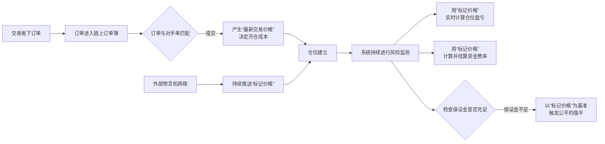

#### 核心结论

所以，我们可以这样总结Hyperliquid的双重价格机制：

1.  **交易驱动，预言机护航**：链上订单簿负责**价格发现和交易执行**的活力与效率；外部预言机负责**风险管理和结算公平**的稳定与公正。
2.  **各司其职，不可或缺**：没有活跃的订单簿，就没有流畅的交易体验；没有可靠的预言机，整个高杠杆金融系统就会暴露在操纵和不公的风险之下，无法持续。

这正是在去中心化环境中构建一个健壮的衍生品交易所所必需的、精妙的“制衡”设计。

### 5.9 区块最终性与安全模型

这是一个非常核心且深刻的问题，直接关系到对Hyperliquid这类高性能链上交易所安全模型和最终性的理解。 

简单直接的结论是：**对于一个像Hyperliquid这样采用即时最终性BFT共识（HyperBFT）的区块链，已经确认的区块在理论上和实践中都极不可能发生回滚。** 因此，已经成交的订单在数学上被认为是**绝对不可撤销和不可逆转的**。 

下面我将分点详细解释这个结论，并说明其背后的原理、以及万一发生极端情况的处理逻辑。 

#### 1. HyperBFT 共识机制详解

HyperBFT共识机制是Hyperliquid实现高性能（约400毫秒出块、即时最终性）的核心。它是**基于HotStuff框架的、高度优化的BFT类共识算法**，将复杂的全局共识问题转化为一个由轮流领导者驱动的、高效的多轮投票流水线，并最大限度地减少网络通信开销和等待时间。

##### 1.1 四阶段流水线投票流程

HyperBFT通过一个结构化的四阶段流程，在有限数量的验证者间达成快速且不可逆的共识：

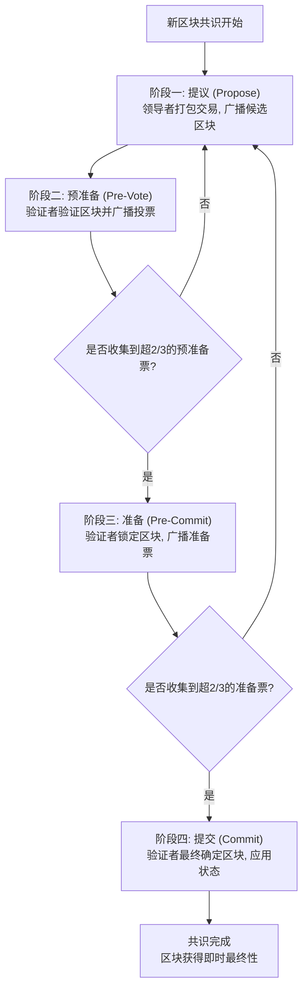

##### 1.2 实现快速共识的四大优化

1.  **流水线化处理**
    *   四个阶段（提议、预准备、准备、提交）是高度流水线化的。当验证者在对第N个区块进行"提交"阶段操作时，可以同时在对第N+1个区块进行"预准备"投票。
    *   就像工厂的装配线，不同区块的共识阶段重叠进行，极大提升了吞吐量和资源利用率，减少了空闲等待时间。

2.  **领导者轮换与门限签名**
    *   **领导者机制**：每一轮都有一个明确的领导者负责打包和提议区块，避免了无领导算法中的协调开销。
    *   **门限签名**：验证者投票可能采用**门限签名**技术。收集到超过2/3的投票后，可以聚合生成一个**简短的、可快速验证的聚合签名**，附在区块上。这极大减少了网络传输和验证的数据量。

3.  **网络与假设优化**
    *   **节点数量可控**：Hyperliquid的验证者节点数量是有限且已知的（如21个）。在少量、高质量的网络节点间达成共识，远比在成千上万个全球匿名节点间（如比特币、以太坊PoW）要快得多。
    *   **弱同步网络假设**：HyperBFT这类算法通常假设网络延迟有界（弱同步网络），在此假设下可以设计出更高效、轮次更少的协议，而不必像比特币那样为对抗极端的网络异步做保守设计。

4.  **确定性快速路径**
    *   **机制**：当领导者诚实且网络良好时，共识可以在最少的通信轮次（如上述四阶段）内完成。这是一种"乐观情况"下的快速路径。
    *   **应对异常**：如果领导者宕机或作恶，协议会通过"视图更换"机制快速切换到下一个领导者，而视图更换的协议本身也经过优化，以最小化停机时间。

##### 1.3 与经典共识的对比

| 共识类型 | 代表 | 核心速度瓶颈 | 最终性 |
| :--- | :--- | :--- | :--- |
| **工作量证明** | 比特币 | 等待10分钟防止链重组，全球节点同步慢。 | **概率最终性**，缓慢 |
| **经典BFT** | PBFT | 所有节点间需要O(n²)的复杂通信，节点数多时急剧变慢。 | **即时最终性**，但规模受限 |
| **HotStuff类** | **HyperBFT**, Facebook的LibraBFT | 线性通信复杂度(O(n))，流水线优化，门限签名。 | **即时最终性**，高效快速 |

##### 1.4 验证者预执行验证机制

为了平衡共识速度与交易有效性检查，HyperBFT实现了**验证者预执行验证机制**，将轻量级检查与完整执行分离：

#### 验证者的双重角色与核心目标

在投票时，验证者需要确保两件事：
1.  **区块的有效性**：区块中的交易在语法、签名和基础逻辑上是合法的。
2.  **状态的确定性**：所有诚实节点对同一区块执行后，结果必须完全相同。

验证者投票的核心目的是**对“交易顺序”达成共识**，而不是在投票阶段就完成最终的状态计算。

#### 预执行验证的核心内容

验证者在投票前会进行一种**轻量级、沙盒环境下的模拟执行**，主要验证以下方面：

| 验证类别 | 具体内容 | 目的 |
| :--- | :--- | :--- |
| **基础格式与签名** | 检查交易格式、签名有效性、Nonce是否正确。 | 过滤掉明显非法的垃圾交易。 |
| **局部状态读取检查** | 模拟执行交易，但只读取必要的状态，并检查关键约束是否满足（例如，用户的保证金是否足以开仓）。 | 确保交易可能成功，避免将明显会失败的交易打包进区块，浪费资源。 |
| **确定性验证** | 确保交易的执行路径是确定性的，不依赖任何外部或不确定因素。 | 保证所有节点重放时结果一致。 |

#### 预执行与完整执行的区别

**预执行**的最重要特征是：
- 不会将模拟执行的结果写回到主状态数据库
- 在沙盒环境或检查点快照中进行计算
- 仅用于可行性检查，不改变全局状态

#### 为什么不做“完整的本地执行”？

如果在投票前每个验证者都完整执行并更新状态，将带来无法接受的性能瓶颈：

1.  **性能毁灭性下降**：完整执行（尤其是涉及复杂计算的交易）需要时间。如果21个验证者都串行或并行执行一遍，400毫秒的出块时间目标根本无法实现。
2.  **资源巨大浪费**：如果该区块最终因共识失败（例如，领导者作恶）而被废弃，所有验证者为此进行的完整计算就白费了。
3.  **违背共识逻辑**：共识的第一目标是**对顺序达成一致**。一旦顺序被投票确定，**所有节点有充分的时间去独立地、确定性地执行这些交易**，并得到相同的终态。把沉重的执行负担放在**投票前**，是本末倒置。

#### 执行顺序：共识之后的完整执行

Hyperliquid的标准执行流程是：

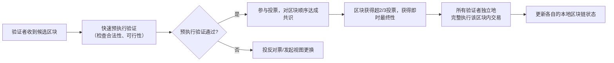

这种**先快速共识排序，后确定执行**的范式，是Hyperliquid能够兼顾即时最终性和高吞吐量的基石。它将最耗时的计算（执行）从关键的共识路径中剥离了出去。

#### 2. 核心原理：即时最终性 vs. 概率最终性 
要理解这一点，首先要区分两种不同的区块链最终性模型： 

| 特性 | **概率最终性** | **即时最终性** | 
| :--- | :--- | :--- | 
| **代表网络** | 比特币、以太坊（PoW） | **Hyperliquid**, Cosmos, BSC, 其他基于BFT-PoS的链 | 
| **工作原理** | 新产生的区块可以被后来的更长链替代。交易随着后续区块的增加而**变得越来越安全**，但理论上始终存在被逆转的微小概率。 | 区块一旦在共识轮次中获得超过2/3验证者的投票确认，就会**立即最终确定**。从数学和协议层面，它已经**不可更改**，无法被后续任何区块替代。 | 
| **用户感知** | "需要等待6个确认（比特币）或12+个确认（以太坊）才安全。" | **"1个确认即最终"**。交易出现在区块中即表示完全敲定。 | 
| **安全性基础** | 算力竞争，依赖诚实算力超过50%。 | **验证者质押经济安全**，依赖诚实验证者权益超过2/3。 | 

**结论**：Hyperliquid属于**即时最终性**网络。当你在界面上看到交易"已确认"，其技术含义与在以太坊上等待了数十个区块确认一样，意味着**已达成全网不可篡改的共识**。 

#### 3. "区块回滚"在Hyperliquid语境下的含义 

在即时最终性网络中，通常所说的"回滚"并非指像比特币那样重组链，而是指以下两种极其罕见且严重的场景： 

1.  **协议级故障与紧急治理回滚**：区块链底层代码出现灾难性漏洞，导致资产可以被无限制创造或盗取。此时，核心开发团队和社区需要通过**链下治理**达成一致，手动编写一个修复版本，并让所有节点从出问题的区块之前的一个状态**重新开始**。这本质上是**一次全新的、有争议的链重启**，而不是协议的常规操作。 
2.  **>1/3验证者集体作恶**：如果超过三分之一的验证者节点（按权益计算）联合起来故意违反协议，理论上可以导致网络**暂停**或产生**分叉**。但这会触发严厉的**罚没机制**，作恶验证者的全部或大部分质押代币（HYPE）将被销毁，导致其蒙受巨大经济损失。 

#### 4. 如果发生极端"回滚"，对已成交订单的处理 

在发生上述那种需要全网重启的、堪比"区块链核灾难"的极端情况下，如何处理已经成交的订单，**没有任何技术协议可以自动决定**。这将完全由**社区和治理**来决定，通常面临两种选择： 

| 处理方案 | 具体操作 | 优点 | 缺点 | 
| :--- | :--- | :--- | :--- | 
| **状态回滚** | 将链的状态恢复到漏洞发生前的最后一个"好"区块。**所有在该"好"区块之后成交的订单和交易将被抹去**，就像从未发生过。 | 可以彻底清除漏洞造成的所有非法状态变更（如异常增发的资产）。 | **极不公平且破坏信任**。在回滚窗口期内，所有合法用户的盈利交易、止损单、套利操作全部失效，而损失却可能被保留，造成巨大混乱。 | 
| **状态修补** | 链继续从当前高度运行，但通过升级的智能合约或协议规则，**有选择性地修补被漏洞影响的部分状态**（例如，仅追回被盗资金），同时**尽量保留所有合法的交易结果**。 | 对诚实用户的干扰最小，保持了交易的完整性和可信度。 | 技术实现上**极其复杂**，需要精确识别恶意和合法交易，可能无法完全修复所有损害。 | 

**历史教训**：在区块链历史上，最著名的回滚案例是**The DAO事件后的以太坊硬分叉**（选择了状态回滚，并因此分裂出了ETC），以及**币安链（BSC）曾因漏洞进行的紧急升级**（更倾向于状态修补）。每一次都是艰难的、充满争议的社区决策。 

#### 💎 最终结论 

对于Hyperliquid的用户和交易者，你可以建立如下认知： 
1.  **常态下无需担忧**：在Hyperliquid网络正常运行期间，任何显示"已确认"或"已成交"的订单，其安全性由**即时最终性**保证，**等同于绝对不可能回滚**。 
2.  **极端情况非技术问题**：你问题中设想的"回滚已成交订单"的场景，只可能发生在需要**全体社区进行紧急链下治理**的灾难性事件中。届时，如何处理订单将是一个**社会共识和治理决策问题**，而非技术自动执行的结果。 
3.  **信任基础**：你对"成交不可撤销"的信任，最终建立在**HyperBFT共识算法的数学保证**以及**验证者质押的经济激励**之上，而不是某个公司的信誉。 

因此，你可以像信任一个顶级中心化交易所的结算系统一样，信任Hyperliquid链上成交的最终性，而其底层提供的是一种更透明、由密码学和经济学保障的去中心化信任。

## 6. 与其他区块链平台的对比

### 6.1 性能对比

| 平台 | 吞吐量 | 区块最终性 | 特点 |
|------|--------|------------|------|
| Hyperliquid | 200,000 TPS | 亚秒级 | 专为交易优化 |
| Ethereum | 15-30 TPS | 12 分钟 | 通用智能合约平台 |
| Solana | 65,000 TPS | 400ms | 高性能但硬件要求高 |
| Arbitrum | 约 4,000 TPS | 取决于以太坊 | 以太坊 Layer 2 |

### 6.2 架构对比

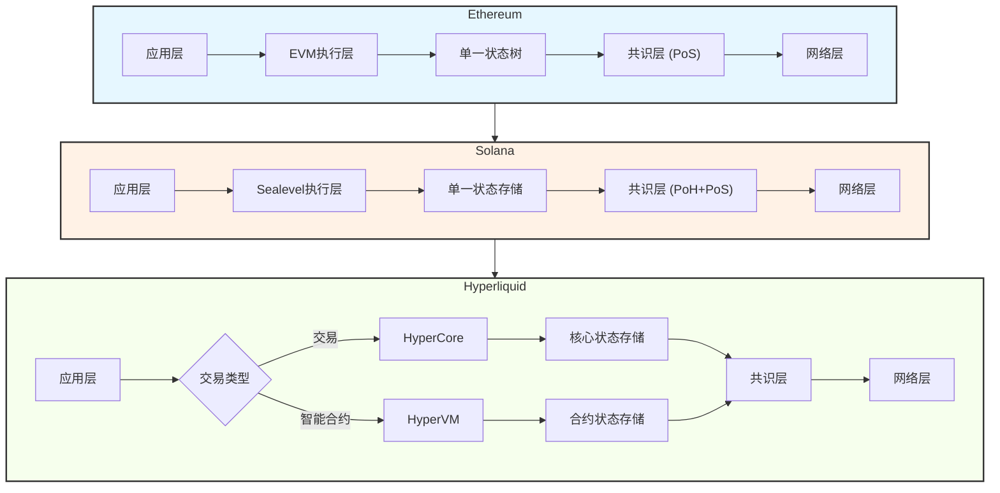

### 6.3 功能对比

| 功能 | Hyperliquid | Ethereum | Solana |
|------|-------------|----------|--------|
| EVM 兼容性 | 支持 | 原生 | 不支持 |
| 链上 CLOB | 支持 | 第三方实现 | 部分支持 |
| 交易费用 | 低 | 高 | 低 |
| 开发工具 | 与以太坊兼容 | 丰富 | 专用工具 |

### 6.4 与以太坊的终极对比：状态管理理念

为了更清楚地理解 Hyperliquid 的设计，这里是与以太坊最本质的区别：

| 概念 | **以太坊** | **Hyperliquid** |
| :--- | :--- | :--- |
| **状态存储** | **单一、统一的状态树**。所有账户余额、合约代码和数据都存储在同一个全局 StateDB 中。 | **逻辑分离的双层状态**。交易核心状态在 HyperCore，合约内部状态在 HyperEVM。 |
| **执行与更新** | **原子性**。一笔交易调用合约，合约代码执行并直接修改全局状态，所有更改在一个区块内原子性生效。 | **非原子性的协作**。EVM合约执行（更新自己的状态）和它对核心交易的影响（通过事件触发另一笔交易）是**两个分离的步骤**，可能存在于不同区块。 |
| **类比** | **一台电脑的硬盘**，所有文件和程序数据都存放在这一个统一的存储系统中。 | **一台专业设备的“控制面板”与“核心引擎”**。你在控制面板（HyperEVM）上操作按钮，面板记录你的操作日志（EVM状态），然后发送信号给核心引擎（HyperCore），引擎真正运转并改变设备的核心工作状态。 |

## 7. 总结与展望

### 7.1 核心优势

Hyperliquid 作为一个专注于交易的高性能区块链平台，具有以下核心优势：

1. **极高的性能**：每秒 20 万笔订单的处理能力和亚秒级的最终性
2. **完全透明**：所有交易和订单都记录在链上，确保公平性
3. **EVM 兼容**：允许轻松迁移以太坊上的应用程序
4. **丰富的功能**：支持多种交易类型和资产

### 7.2 技术挑战

尽管 Hyperliquid 在性能方面表现出色，但仍面临一些技术挑战：

1. **可扩展性**：如何在保持高性能的同时支持更多的用户和应用
2. **安全性**：作为一个相对较新的平台，需要持续增强安全性
3. **去中心化程度**：需要在性能和去中心化程度之间找到平衡

### 7.3 未来展望

Hyperliquid 作为一个新兴的区块链平台，具有广阔的发展前景：

1. **生态系统扩展**：通过 HyperEVM 吸引更多开发者构建应用
2. **功能增强**：不断完善交易功能和智能合约能力
3. **跨链集成**：与其他区块链平台实现互操作
4. **用户体验优化**：提高平台的易用性，吸引更多用户

## 8. 参考文献

1. Hyperliquid 官方文档
2. Hyperliquid GitHub 仓库
3. 相关技术博客和分析文章
4. 行业报告和性能测试数据