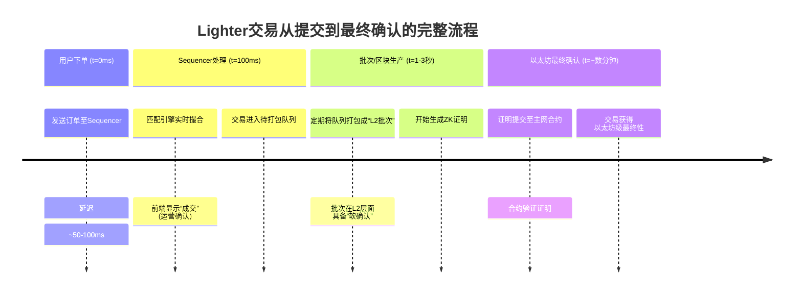

# Lighter: 基于ZK-Rollup的高性能去中心化永久合约交易所

## 1. 简介
Lighter是一个基于ZK-Rollup技术的去中心化永久合约交易所（Perpetual DEX），其设计目标是在保证去中心化和安全的前提下，最大限度地模拟传统金融高性能交易所的体验。

## 2. ZK-Rollup架构与安全模型

### 2.1 ZK-Rollup的"最终性"模型
Lighter采用ZK-Rollup（基于Scroll技术栈）架构，其核心运行模式如下：
*   **交易执行在链下**：用户在Lighter上的所有交易（开仓、平仓、杠杆调整）都在Lighter的链下服务器（Sequencer）上批量处理。
*   **生成有效性证明**：系统会为这一批交易的计算结果生成一个**零知识证明（ZK Proof）**，例如SNARK或STARK。
*   **主网锚定与最终确认**：这个**证明**连同新的状态根（一个代表所有用户余额和头寸的加密指纹）被提交到以太坊主网。以太坊上的智能合约会**验证这个证明**。

**核心点**：一旦证明在以太坊上被验证通过，那么它所代表的那一批交易和最终状态就获得了**以太坊级别的最终性**。要回滚这笔交易，意味着要回滚以太坊区块，这需要攻击以太坊网络本身（51%攻击），成本极高，可能性极低。

### 2.2 节点类型与角色
Lighter的ZK-Rollup网络由三种核心节点类型组成，各自承担不同的职责：

| 节点类型 | 主要职责 | 技术特点 |
| :--- | :--- | :--- |
| **Sequencer** | 1. 接收用户交易请求<br>2. 执行实时订单匹配<br>3. 构建和提交交易批次<br>4. 维护链下状态 | 高性能服务器，低延迟处理，当前为半中心化，有去中心化路线图 |
| **Prover** | 1. 为交易批次生成ZK证明<br>2. 优化证明生成效率<br>3. 与Sequencer协同工作 | 高计算资源需求，使用优化的证明生成算法（如SNARK） |
| **Verifier** | 1. 以太坊智能合约验证ZK证明<br>2. 确认状态根更新<br>3. 保障最终性 | 链上实现，无需额外硬件，由以太坊共识保护 |

#### Sequencer的工作原理
Sequencer作为网络的入口点，运行一个高性能的内存匹配引擎，能够在微秒级别处理订单。它维护着完整的中央限价订单簿（CLOB）状态，并按照价格-时间优先原则进行订单撮合。撮合完成后，Sequencer将交易打包成批次，为后续的证明生成做准备。

#### Prover的关键作用
Prover节点负责为Sequencer提交的交易批次生成零知识证明。这个过程需要大量的计算资源，Lighter采用了优化的证明生成算法（基于Scroll技术栈）来提高效率。生成的证明会被发送到以太坊主网上的Verifier合约进行验证。

#### Verifier的安全性保障
Verifier是部署在以太坊主网上的智能合约，它负责验证Prover提交的零知识证明。一旦证明通过验证，合约会更新状态根，使交易获得以太坊级别的最终性。Verifier的安全性由以太坊的共识机制保障，无需信任任何第三方。

**核心安全点**：一旦证明在以太坊上被验证通过，那么它所代表的那一批交易和最终状态就获得了**以太坊级别的最终性**。要回滚这笔交易，意味着要回滚以太坊区块，这需要攻击以太坊网络本身（51%攻击），成本极高，可能性极低。

### 2.3 重组风险分析
所谓的"重组"风险，只可能发生在以下两个**短暂的、未最终确认的环节**：

*   **Sequencer排序环节**：
    *   用户发送交易到Lighter的Sequencer。
    *   Sequencer可能会对交易进行排序、排除或插入。在这个环节，**Sequencer拥有中心化的控制权**。理论上，它可以审查或重排尚未被打包进批次的交易。
    *   **这是主要的用户体验风险点**，而不是区块链共识层的重组。为了避免这个问题，许多Rollup（包括Starknet、zkSync等）都在设计去中心化的Sequencer网络。

*   **证明生成和提交的延迟窗口**：
    *   交易被Sequencer纳入一个批次，但该批次的证明还未生成并提交到以太坊的这段时间（可能是几分钟到几小时）。此时，交易在应用层（Lighter前端）显示为"已处理"，但尚未获得主网最终性。
    *   如果Sequencer在这个窗口内作恶（比如尝试包含无效交易），它**无法生成有效的ZK证明**。因此，无效的状态更新根本无法提交到主网。
    *   如果Sequencer在这段时间内宕机，网络可能会切换到另一个节点来重新构建批次，这可能导致某些交易被延迟到下一个批次，但**不会导致已最终确认的状态回滚**。

### 2.4 与Optimistic Rollup的对比
*   **Optimistic Rollup（如Arbitrum、Optimism早期版本）**：它假设交易是有效的，提交后有一个**长达7天的挑战期**。在这7天内，如果有人发现欺诈并成功提交欺诈证明，交易**会被回滚**。所以它确实存在一个理论上的回滚窗口。
*   **ZK-Rollup（如Lighter, dYdX v4, zkSync Era）**：**没有挑战期**。状态更新在证明被验证的瞬间（约几分钟内）就获得最终性。**不存在事后因欺诈而回滚的可能性**。安全性由数学（密码学）保证，而不是由经济博弈（挑战者）保证。

## 3. CLOB（中央限价订单簿）实现

Lighter在ZK-Rollup上构建了一个**完全链上的中央限价订单簿**。其核心设计哲学是：**在保证去中心化和安全的前提下，最大限度地模拟传统金融高性能交易所的体验。**

### 3.1 实现CLOB的关键挑战与解决方案

| 挑战 | Lighter的解决方案 |
| :--- | :--- |
| **1. 性能与成本** | **ZK-Rollup链下执行**：订单匹配和簿记操作在链下的Sequencer进行，只有最终状态（余额、头寸）和证明提交到主网。这大幅降低了Gas成本，并允许高频操作。 |
| **2. 订单簿状态管理** | **高效的链上数据结构**：在Rollup合约中维护一个精简但完整的订单簿状态（买盘/卖盘队列）。使用了经过优化的数据结构和存储布局，以最小化ZK证明的计算开销。 |
| **3. 订单匹配引擎** | **高性能链下引擎**：Sequencer运行一个专业的、低延迟的匹配引擎。它处理订单接收、排序（价格优先、时间优先）、撮合和更新订单簿状态。这是性能和用户体验的核心。 |
| **4. 抗审查与去中心化** | **强制交易包含**：用户可以将交易直接提交到Lighter在以太坊主网的收件箱合约，强制Sequencer处理，防止审查。未来会向**去中心化Sequencer**网络演进。 |
| **5. 数据可用性与透明度** | **完整数据发布**：虽然计算在链下，但Lighter承诺将完整的交易和订单簿更新数据发布到以太坊作为**数据可用性层**。这使得任何人都能验证状态正确性，并作为全节点重建最新状态。 |

### 3.2 CLOB匹配引擎的位置与工作原理

**订单匹配完全在Sequencer内部完成**。这是一个高度优化的、集中式的匹配引擎：

- **实时内存订单簿**：Sequencer在内存中维护着完整的中央限价订单簿（CLOB）状态，包含所有买盘/卖盘队列。
- **专业匹配算法**：采用与传统交易所类似的**价格优先、时间优先**算法，在纳秒级别完成订单匹配。
- **完全链下执行**：从接收订单、更新订单簿到生成成交回报，整个过程都在链下完成，没有任何区块链延迟。

```plaintext
用户下单 -> 网络传输 -> Sequencer接收 -> 内存订单簿匹配 -> 返回成交确认
                    ↓
                （100毫秒内完成）
```

### 3.3 保证公平性和抗审查的机制

#### **a) 公开透明的订单流**
- 所有发送到Sequencer的订单都有时间戳记录
- 用户可以验证自己的订单是否被公平处理
- Sequencer必须公开其排序策略

#### **b) 强制包含机制**
- 用户可以将交易**直接发送到以太坊主网的收件箱合约**
- Sequencer **必须**从合约中提取并处理这些交易
- 这防止了Sequencer审查特定用户的交易

```solidity
// 简化的强制包含机制
function forceInclusion(Transaction calldata tx) public {
    // 用户直接将交易提交到主网合约
    inbox.push(tx);
    // Sequencer必须在一定时间内处理
    // 否则用户可以挑战并获得补偿
}
```

#### **c) ZK证明的约束**
ZK证明机制是防止Sequencer作恶的最终保障：
- **计算结果可验证**：即使匹配是在链下完成，Sequencer也必须为整个批次的交易生成有效的ZK证明
- **无法伪造结果**：如果Sequencer尝试提交错误的交易结果（如伪造成交价格或数量），它将无法生成有效的证明
- **强制正确性**：Verifier合约只会接受通过验证的证明，确保只有正确的交易结果能获得以太坊级最终性
- **透明可验证**：任何人都可以重新计算状态并验证证明的正确性，确保系统的透明性和可信度

## 4. 交易流程与最终性

Lighter的交易流程分为四个主要阶段，每个阶段对应不同的确认级别和风险：



### 4.1 交易接收与“运营确认”（约100毫秒内）
*   **过程**：用户点击下单后，订单直接发送到Lighter的**中心化/半中心化的Sequencer服务器**。
*   **Sequencer的作用**：它运行着高性能的匹配引擎。它**立即**检查订单（价格、数量、保证金），并尝试与订单簿上的对手方订单进行匹配。
*   **为什么能这么快**：这个过程完全发生在内存中，在一个经过极度优化的、类似传统证券交易所的系统中，没有任何区块链共识开销。
*   **“确认”的本质**：一旦匹配成功，Sequencer会**立即向用户前端（网页/App）返回一个确认信号**。此时，用户界面会显示“订单已成交”。这被称为 **“运营确认”**。
*   **风险**：这个确认**仅来自Sequencer的承诺**。在技术上，Sequencer可以作恶（例如，尽管它说成交了，但随后在打包时忽略交易）。然而，对于声誉良好的项目方来说，这样做是自毁长城。并且，系统有后续机制来惩罚或防止这种行为。

### 4.2 打包进“区块/批次”（1-3秒）
*   **过程**：Sequencer会持续接收交易。它不是每笔交易都处理一次，而是定期（比如每1-3秒）将过去一段时间内收到的所有交易打包成一个 **“批次”**（Batch），或者称为L2区块。
*   **这个“块”的作用**：这个批次是生成ZK证明和更新链上状态的基本单位。它被赋予一个批次号，并进入证明生成管道。
*   **此时的确认状态**：当交易被**正式排序并包含在一个确定的批次中**后，它就获得了更强的保证。回滚它需要回滚整个批次。但此时，这个批次本身还没有获得以太坊的认可。

### 4.3 最终确认（数分钟）
*   **过程**：生成这个批次对应的ZK证明需要大量的计算，通常需要几十秒到几分钟。证明生成后，会被提交到以太坊主网的验证合约。
*   **真正的最终性时刻**：**当且仅当以太坊主网合约成功验证了这个ZK证明**，并接受了该批次导致的状态根更新时，交易才获得了**以太坊级别的、不可逆的最终确认**。
*   **时间**：从用户下单到这个时刻，总共可能需要 **2到10分钟**，具体取决于证明生成速度和以太坊主网的拥堵情况。

## 5. 性能指标

### 5.1 Lighter的性能指标（当前/目标）
*   **出块时间**：大约为 **1-3 秒**。这是作为Rollup的"批次"提交间隔。Sequencer内部处理订单是实时的，但最终确定性需要等待这个批次被以太坊确认。
*   **交易延迟**：从用户下单到在前端显示成交，理想情况下可低至 **<100 毫秒**（链下Sequencer处理）。
*   **吞吐量**：理论TPS可达 **1,000+**（得益于链下执行和ZK证明的压缩能力），远超以太坊主网，足以支持活跃的CLOB交易。
*   **最终确认时间**：这是关键。交易在Sequencer处理后可视为"预确认"，但获得**以太坊级最终性**需要等待ZK证明在以太坊上验证，这通常需要**几分钟**（受限于以太坊区块时间和证明验证成本）。

## 6. 与Hyperliquid的比较

Lighter和Hyperliquid代表了两种截然不同的技术范式：ZK-Rollup L2与应用专用L1。

### 6.1 核心架构对比

| 特性 | **Lighter (基于Scroll的ZK-Rollup)** | **Hyperliquid (应用专用L1)** |
| :--- | :--- | :--- |
| **底层安全** | 继承以太坊 | 独立验证者网络 (Tendermint BFT) |
| **最终确认时间** | 数分钟 (以太坊验证后) | ~1秒 (L1 BFT共识) |
| **吞吐量** | 1,000+ TPS (理论) | 数万 TPS (定制化引擎) |
| **生态协同** | 以太坊L2生态互通 | 独立生态，依赖跨链桥 |
| **架构** | 二层扩展方案。结算、数据可用性和最终性都锚定在以太坊。 | 一层主权链。拥有自己的完整区块链栈（共识、执行、数据）。 |
| **技术栈** | EVM兼容。使用Solidity/Vyper，工具链与以太坊生态互通。 | 非EVM。使用Rust开发的专有执行环境（Hyperliquid VM），专注于交易效率。 |
| **跨链资产桥接** | **信任最小化桥**。资产存储在以太坊主网合约中，通过证明进出Rollup。安全性高。 | **需要跨链桥**。资产通过官方或第三方桥在以太坊和Hyperliquid链间转移，引入额外的信任和风险假设。 |
| **去中心化路径** | 最终依赖以太坊的去中心化。Sequencer去中心化是路线图目标。 | 需要建立和维持自己独立的验证者网络和治理社区。 |
| **性能设计重心** | 在保证以太坊安全的前提下优化性能，**性能和安全的平衡**。 | **极致追求性能**，为订单簿交易定制所有底层组件。 |

### 6.2 性能指标对比

#### **Hyperliquid的性能指标**
*   **出块时间**：极快，约为 **400毫秒**（0.4秒）。这是其作为高性能L1的核心优势。
*   **交易延迟**：端到端延迟极低，目标是达到与中心化交易所媲美的**亚秒级**体验。
*   **吞吐量**：非常高。其定制化的链和匹配引擎可以轻松处理数万TPS，专为高频订单流设计。
*   **最终确认时间**：**约1秒**。因为在一个区块被其BFT共识最终确定后，交易就完全确定了，无需等待其他链的确认。

### 6.3 总结对比

| 项目 | 架构 | 安全来源 | 性能优势 | 主要权衡 |
| :--- | :--- | :--- | :--- | :--- |
| **Lighter** | 以太坊ZK-Rollup | 以太坊 | **安全与生态**。继承了以太坊的强大安全性和丰富的生态资产与可组合性。 | 性能受限于以太坊的最终确认时间（几分钟），出块时间（1-3秒）也不及专用链。 |
| **Hyperliquid** | 专用衍生品L1 | 自身验证者网络 | **极致性能**。出块快（0.4秒）、最终确认快（~1秒），提供最接近CEX的链上体验。 | 承担独立的链安全风险，依赖跨链桥引入额外风险，生态建设更具挑战。 |

**核心思想区别**：
*   **Lighter** 认为：**以太坊的安全是无可替代的公共产品**，应该在它的基础上进行扩展。
*   **Hyperliquid** 认为：**为了达到顶级的交易体验，需要从底层开始完全定制，摆脱以太坊的任何约束**。

### 6.4 与Hyperliquid的关键区别
*   **Hyperliquid**：它的400毫秒出块时间，**既是运营确认时间，也是最终确认时间**。因为它的整个链（共识、执行、数据）都是自己控制的，一旦其BFT共识算法确认了一个区块（400毫秒后），交易就完全确定了，没有"等待上层链确认"这一环节。
*   **Lighter**：将"**快速体验**"（100ms运营确认）和"**安全最终性**"（数分钟以太坊确认）进行了分离。它用中心化组件（Sequencer）来提供体验，用去中心化底层（以太坊）来保障安全。

## 7. Sequencer去中心化路线图

Lighter目前采用中心化Sequencer架构以实现高性能，但团队计划逐步实现Sequencer的去中心化。这是一个分阶段的演进路径：

### 7.1 去中心化的四个阶段

1. **阶段1：单一官方Sequencer**（当前状态）
   - 单一节点处理所有交易
   - 提供最高性能（<100ms延迟）
   - 简化的运维和监控

2. **阶段2：许可式多Sequencer**（短期计划）
   - 白名单节点参与排序
   - 提高系统可用性和冗余
   - 仍然保持高性能

3. **阶段3：无需许可的Sequencer网络**（中期计划）
   - POS质押机制确保节点诚实
   - 轮流出块或分片处理
   - 性能与去中心化的平衡

4. **阶段4：完全去中心化匹配**（长期愿景）
   - 所有验证者参与匹配
   - 最高的去中心化程度
   - 性能可能有所下降（预期延迟>500ms）

### 7.2 去中心化面临的挑战

```python
# 去中心化匹配的性能瓶颈
class DecentralizedMatching:
    def process_order(self, order):
        # 问题1：共识延迟
        consensus_time = 200ms  # Tendermint/BFT 理论下限
        
        # 问题2：状态同步
        self.sync_order_book()  # 所有节点需要一致的订单簿
        
        # 问题3：冲突解决
        self.resolve_conflicts()  # 不同节点收到订单的时间差
        
        return total_latency >= 500ms  # 显著高于中心化方案
```

## 8. 与其他衍生品平台的对比

| 项目 | 匹配架构 | 去中心化程度 | 延迟 | 安全模型 |
|------|----------|------------|------|---------|
| **Lighter** | 中心化 Sequencer | 低 | 100ms | ZK证明 + 以太坊结算 |
| **dYdX v4** | 中心化 Sequencer | 低 | 100ms | 验证者签名 + Cosmos结算 |
| **Hyperliquid** | 去中心化验证者网络 | 高 | 400ms | BFT共识 + 自身L1 |
| **Aevo** | 链下匹配 + 链上结算 | 低 | 50ms | 多方计算 + 欺诈证明 |

## 9. 用户风险分析

### 9.1 最坏情况：Sequencer作恶

| 风险类型 | 发生概率 | 影响程度 | 缓解措施 |
|---------|---------|---------|---------|
| **交易审查** | 中 | 低 | 强制包含机制（forceInclusion） |
| **不公平排序** | 中 | 中 | 透明的时间戳记录和排序算法 |
| **服务器宕机** | 低 | 高 | 提款通道保持开放，资金安全 |
| **资产盗窃** | 极低 | 极高 | 资金在以太坊合约中，Sequencer无法触碰 |

### 9.2 与中心化交易所的本质区别

| 方面 | **传统 CEX** | **Lighter (Rollup CLOB)** |
|------|-------------|--------------------------|
| **资产托管** | 交易所完全控制 | 资产锁定在以太坊智能合约 |
| **订单匹配** | 不透明，可随意操纵 | ZK证明约束，必须遵守公开规则 |
| **数据可审计性** | 内部数据库，难以审计 | 所有交易数据发布到以太坊，可公开验证 |
| **退出机制** | 依赖交易所提现许可 | 强制提款：直接从合约提款 |

## 10. 核心特色功能

### 10.1 真正的中央限价订单簿
- **多种订单类型**：限价单、市价单、止损单/止盈单、IOC、FOK
- **透明的深度流动性**：完整的订单簿可见
- **价格发现机制**：市场驱动，无 oracle 依赖的定价

### 10.2 资本效率优化
```solidity
// 创新的保证金系统
struct MarginSystem {
    // 统一保证金账户
    mapping(address => uint256) unifiedMargin;
    
    // 跨仓位盈亏对冲
    bool crossPositionNetting;
    
    // 灵活的杠杆选择
    uint256 maxLeverage;
    
    // 动态维持保证金
    function calculateMaintenanceMargin() external;
}
```

## 11. 总结

Lighter代表了现代L2在"不可能三角"中寻找平衡的典范：**用中心化的组件（Sequencer）来承担性能责任，用去中心化的、安全的底层（以太坊）来承担最终的安全保障**。

### 11.1 核心优势
- **安全性**：继承以太坊的安全性，交易最终确认后几乎不可能回滚。
- **高性能**：链下执行和内存订单簿实现了低延迟（<100ms）和高吞吐量（1,000+ TPS）。
- **用户体验**：模拟传统交易所的交易体验，同时保持去中心化的优势。
- **生态协同**：与以太坊生态系统无缝集成，支持跨L2资产转移和交互。

### 11.2 主要权衡
- **最终确认时间**：需要等待以太坊验证ZK证明，最终确认时间较长（几分钟）。
- **临时中心化**：当前阶段依赖中心化Sequencer，虽然有强制包含机制保障，但仍有一定风险。
- **复杂性**：ZK-Rollup技术本身较为复杂，开发和维护成本较高。

### 11.3 未来展望

Lighter的设计思路体现了现代区块链项目在追求性能和安全性之间的平衡，为去中心化衍生品交易提供了一种新的可能路径。随着技术发展（更快的共识算法、硬件加速ZK证明），Lighter将逐步实现Sequencer的去中心化，进一步提升系统的安全性和去中心化程度，同时保持高性能的交易体验。

Lighter代表了DeFi衍生品赛道的未来方向：**在保证以太坊级安全的前提下，提供接近中心化交易所的交易体验**。