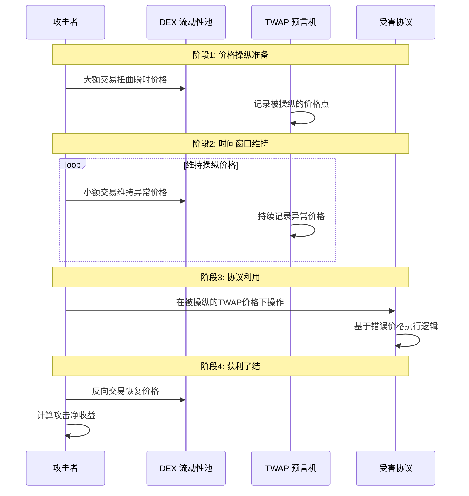

## 不正确 TWAP / 预言机操纵攻击深度分析

## 1. 攻击核心概念

### 1.1 什么是 TWAP 预言机操纵？

**TWAP 预言机操纵** 是指攻击者通过精心设计的交易模式，扭曲时间加权平均价格的计算结果，从而欺骗依赖该价格的 DeFi 协议。

### 1.2 攻击基本原理



---

## 2. TWAP 机制深度解析

### 2.1 TWAP 计算原理

**基本 TWAP 公式**：
```
TWAP = Σ(价格_i × 时间间隔_i) / Σ(时间间隔_i)
```

**具体实现**：
```solidity
// 简化的 TWAP 计算逻辑
function calculateTWAP() public view returns (uint256) {
    uint256 timeElapsed = currentTimestamp - previousTimestamp;
    uint256 priceCumulativeDiff = currentCumulativePrice - previousCumulativePrice;
    
    return priceCumulativeDiff / timeElapsed;
}
```

### 2.2 TWAP 参数脆弱性

| TWAP 参数 | 安全影响 | 攻击向量 |
|-----------|----------|----------|
| **时间窗口** | 窗口越短越易操纵 | 短时间高强度操纵 |
| **更新频率** | 低频更新易被操纵 | 在更新前突然操纵 |
| **数据源** | 单一来源风险高 | 针对低流动性池 |

---

## 3. 攻击类型与技术手法

### 3.1 瞬时价格尖峰攻击

**攻击原理**：在 TWAP 计算周期内制造短暂但剧烈的价格波动

**数学模型**：
```
假设 30分钟 TWAP，正常价格 $100
攻击者用 1分钟 将价格拉到 $500
TWAP = (29*100 + 1*500) / 30 = $113.33
价格被扭曲 13.33%
```

### 3.2 持续价格压制攻击

**攻击原理**：在整个时间窗口内维持略为异常的价格

**攻击场景**：
- 借贷协议：压制抵押品价格触发清算
- 合成资产：影响资产定价进行套利
- 衍生品：操纵结算价格获利

### 3.3 多周期组合攻击

**复杂攻击模式**：
1. **准备期**：积累头寸
2. **操纵期**：扭曲 TWAP 价格
3. **利用期**：在错误价格下操作
4. **退出期**：平仓获利

---

## 4. 真实案例分析

### 4.1 Harvest Finance 攻击（2020年10月）

**攻击详情**：
- **损失金额**：约 $2400 万美元
- **攻击时长**：7分钟
- **操纵对象**：Curve yPool 的虚拟价格
- **使用工具**：闪电贷 + 多步骤操纵

**攻击时间线**：
```
时间点     | 操作                    | 价格影响
----------|-------------------------|-----------
T+0:00    | 借入 2亿美元闪电贷       | -
T+0:30    | 大额存入 yPool          | 虚拟价格 +0.3%
T+2:00    | 利用扭曲价格提取代币     | 获利关键点
T+5:00    | 重复操作 6次            | 累计扭曲 2.1%
T+7:00    | 归还闪电贷              | 价格恢复
```

### 4.2 具体漏洞代码分析

```solidity
// 简化版的 Harvest Finance 漏洞
contract VulnerableVault {
    IERC20 public token;
    ICurvePool public curvePool;
    
    // 🚨 依赖可操纵的 LP 代币价格
    function getPricePerShare() public view returns (uint256) {
        // 直接从 Curve 池子获取虚拟价格
        uint256 virtualPrice = curvePool.get_virtual_price();
        return virtualPrice;
    }
    
    function deposit(uint256 _amount) external {
        token.transferFrom(msg.sender, address(this), _amount);
        
        // 基于当前价格计算份额
        uint256 shares = _amount * 1e18 / getPricePerShare();
        _mintShares(msg.sender, shares);
    }
    
    function withdraw(uint256 _shares) external {
        uint256 amount = _shares * getPricePerShare() / 1e18;
        _burnShares(msg.sender, _shares);
        token.transfer(msg.sender, amount);
    }
}
```

**攻击者利用代码**：
```solidity
contract HarvestAttacker {
    function executeAttack() external {
        // 1. 闪电贷借入大量稳定币
        uint256 loanAmount = 200_000_000 * 1e6; // 2亿美元
        flashLoan.borrow(USDC, loanAmount);
        
        // 2. 操纵 Curve 池虚拟价格
        for (uint i = 0; i < 6; i++) {
            // 大额存款暂时推高虚拟价格
            curvePool.add_liquidity([loanAmount/6, 0], 0);
            
            // 立即在 Harvest 存款，享受高价格
            vault.deposit(loanAmount/6);
            
            // 提取时获得更多代币
            vault.withdraw(vault.balanceOf(address(this)));
            
            // 移除流动性
            curvePool.remove_liquidity_one_coin(loanAmount/6, 0, 0);
        }
        
        // 3. 归还闪电贷
        flashLoan.repay(USDC, loanAmount);
    }
}
```

---

## 5. 复杂攻击技术深度解析

### 5.1 TWAP 窗口选择攻击

**攻击原理**：针对不同时间窗口的 TWAP 进行精确操纵

**技术实现**：
```solidity
// 攻击者的时间窗口分析
function analyzeTWAPWindow(address pool) external view returns (AttackPlan memory) {
    TWAPOracle oracle = TWAPOracle(pool);
    uint256 window = oracle.period();
    uint256 granularity = oracle.granularity();
    
    return AttackPlan({
        optimalManipulationSize: calculateOptimalSize(window, granularity),
        requiredDuration: (window * 2) / 3, // 控制 2/3 时间窗口
        estimatedCost: estimateManipulationCost(),
        expectedProfit: calculateExpectedProfit()
    });
}
```

### 5.2 多协议串联攻击

**高级攻击模式**：
```solidity
contract AdvancedOracleManipulator {
    function crossProtocolAttack() external {
        // 阶段1: 准备期 - 在各个协议建立头寸
        lendingProtocol.deposit(collateral);
        perpetualProtocol.openShortPosition();
        
        // 阶段2: 操纵期 - 扭曲 TWAP 价格
        manipulateTWAP(oraclePool, manipulationAmount);
        
        // 阶段3: 利用期 - 在多个协议同时获利
        lendingProtocol.borrow(undervaluedAsset);
        perpetualProtocol.liquidateProfitablePosition();
        syntheticProtocol.mintOvervaluedAsset();
        
        // 阶段4: 退出期 - 平仓并恢复价格
        restoreTWAP(oraclePool);
        realizeProfits();
    }
}
```

---

## 6. 防护措施与安全架构

### 6.1 稳健的 TWAP 设计

**安全参数配置**：
```solidity
contract RobustTWAPOracle {
    // ✅ 安全参数设置
    uint256 public constant MIN_WINDOW = 2 hours;     // 最小时间窗口
    uint256 public constant MIN_OBSERVATIONS = 10;    // 最小观察点数
    uint256 public constant MAX_DEVIATION = 5e16;     // 最大价格偏差 5%
    
    // ✅ 多数据源聚合
    function getRobustPrice() public view returns (uint256) {
        uint256[] memory prices = new uint256[](3);
        prices[0] = uniswapV2TWAP;
        prices[1] = uniswapV3TWAP;
        prices[2] = sushiswapTWAP;
        
        // 使用中位数抵抗异常值
        return median(prices);
    }
    
    // ✅ 异常检测机制
    function validatePrice(uint256 price) internal view {
        uint256 historicalMedian = getHistoricalMedian(24 hours);
        uint256 deviation = abs(price, historicalMedian) * 1e18 / historicalMedian;
        
        require(deviation <= MAX_DEVIATION, "Price deviation too large");
    }
}
```

### 6.2 多层价格验证

**防御性架构**：
```solidity
contract MultiLayerPriceOracle {
    // 第一层: TWAP 基础验证
    function getValidatedTWAP() external view returns (uint256) {
        uint256 twap = getTWAP();
        require(isValidTWAP(twap), "TWAP validation failed");
        return twap;
    }
    
    // 第二层: 多源价格对比
    function isValidTWAP(uint256 twap) internal view returns (bool) {
        uint256 spotPrice = getSpotPrice();
        uint256 deviation = calculateDeviation(twap, spotPrice);
        
        // 允许合理偏差，但拒绝明显操纵
        if (deviation > 20e16) return false; // 20% 偏差
        
        // 检查价格趋势一致性
        if (!isConsistentTrend(twap)) return false;
        
        return true;
    }
    
    // 第三层: 链下数据验证
    function crossCheckWithOffchain() internal view returns (bool) {
        // 可与 Chainlink 或其他可靠预言机对比
        uint256 chainlinkPrice = chainlinkOracle.latestAnswer();
        uint256 deviation = calculateDeviation(twap, chainlinkPrice);
        
        return deviation <= 10e16; // 10% 偏差阈值
    }
}
```

---

## 7. 检测与监控系统

### 7.1 实时异常检测

**监控指标**：
```solidity
contract OracleManipulationDetector {
    struct MonitoringMetrics {
        uint256 priceVolatility;      // 价格波动率
        uint256 tradeSizeRatio;       // 交易规模/流动性比率
        uint256 frequencyAnomaly;     // 交易频率异常
        uint256 volumeSpike;          // 交易量突增
    }
    
    function detectManipulation(address pool) external view returns (bool, string memory) {
        MonitoringMetrics memory metrics = calculateMetrics(pool);
        
        if (metrics.priceVolatility > 50e16) { // 50% 波动率
            return (true, "High price volatility detected");
        }
        
        if (metrics.tradeSizeRatio > 30e16) { // 交易占流动性 30%
            return (true, "Large trade size relative to liquidity");
        }
        
        if (metrics.volumeSpike > 1000e16) { // 交易量增长 10倍
            return (true, "Abnormal volume spike");
        }
        
        return (false, "Normal");
    }
}
```

### 7.2 机器学习预警模式

**高级检测特征**：
- **交易模式分析**：识别典型的操纵交易序列
- **时间相关性**：检测异常的时间聚集性
- **地址关联**：识别协同攻击的地址集群
- **资金流追踪**：监控闪电贷使用模式

---

## 8. 治理与应急响应

### 8.1 紧急关停机制

```solidity
contract EmergencyOracle {
    address public guardian;
    bool public paused;
    uint256 public lastManipulationAlert;
    
    modifier whenNotManipulated() {
        require(!paused, "Oracle paused due to manipulation suspicion");
        require(block.timestamp - lastManipulationAlert > 1 hours, "Recent manipulation alert");
        _;
    }
    
    function emergencyPause() external {
        require(msg.sender == guardian, "Only guardian");
        paused = true;
        emit OraclePaused(block.timestamp, "Suspected manipulation");
    }
    
    function validatePriceWithEmergency(uint256 price) external whenNotManipulated returns (bool) {
        if (detectManipulation(price)) {
            lastManipulationAlert = block.timestamp;
            return false;
        }
        return true;
    }
}
```

### 8.2 去中心化治理防护

**社区监督机制**：
- **价格委员会**：多签控制关键参数调整
- **白帽监控**：奖励发现操纵的白帽黑客
- **升级时间锁**：防止恶意参数修改

---

## 9. 总结与最佳实践

### 9.1 关键防护策略

| 防护层级 | 具体措施 | 效果等级 |
|----------|----------|----------|
| **协议设计** | 长TWAP窗口 + 多数据源 | 🟢 高效 |
| **实时监控** | 异常检测 + 自动警报 | 🟢 高效 |
| **应急响应** | 紧急关停 + 治理干预 | 🟡 中等 |
| **经济安全** | 流动性要求 + 费用机制 | 🟡 中等 |

### 9.2 实施建议

**对于预言机设计者**：
1. **✅ 使用长周期 TWAP**（≥ 2小时）
2. **✅ 实现多数据源聚合**
3. **✅ 设置合理的偏差阈值**
4. **✅ 部署实时监控系统**

**对于协议集成者**：
1. **✅ 验证预言机安全性**
2. **✅ 实施价格合理性检查**
3. **✅ 准备应急响应计划**
4. **✅ 定期安全审计**

**对于流动性提供者**：
1. **✅ 关注池子操纵风险**
2. **✅ 分散流动性提供**
3. **✅ 监控异常交易模式**

### 9.3 未来发展趋势

**技术演进方向**：
- **ZK-proof 预言机**：可验证的正确计算
- **去中心化数据源**：抵抗单点操纵
- **AI 增强检测**：更精准的异常识别
- **跨链价格聚合**：多链数据验证

TWAP 预言机操纵攻击代表了 DeFi 安全中算法安全与经济安全的复杂交叉点。有效的防护需要深入理解市场微观结构、算法特性和经济激励的综合知识。随着攻击技术的不断演进，防御策略也需要持续创新和升级。