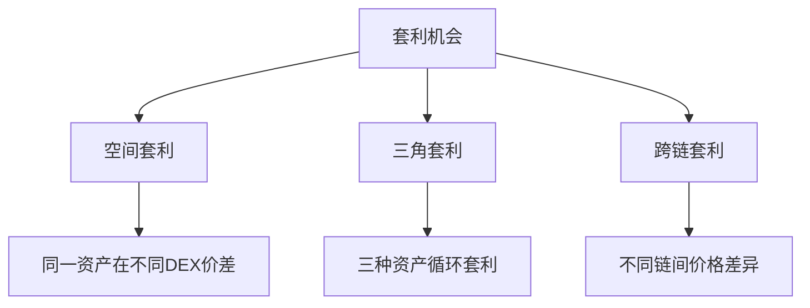
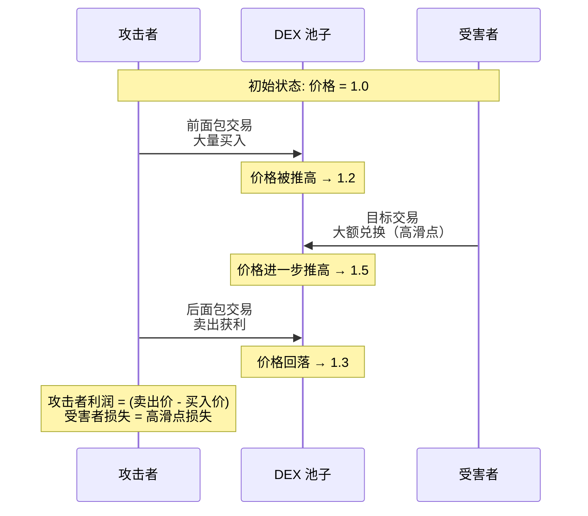

## 1. MEV 基础概念

### 1.1 什么是 MEV？

**MEV** 是指矿工（验证者）通过在其生产的区块中**排序、包含或排除交易**所能提取的超出标准区块奖励和Gas费用的最大价值。

```go
// MEV 机会的数据结构
type MEVOpportunity struct {
    Type        string    // "arbitrage", "sandwich", "liquidation"
    Profit      *big.Int  // 预计利润
    GasCost     *big.Int  // 执行成本
    Risk        float64   // 风险系数
    TimeWindow  int64     // 机会存在的时间窗口（毫秒）
}
```

---

## 2. 套利攻击

### 2.1 套利攻击概念

**套利攻击** 通过在不同交易所之间利用价格差异，低买高卖同一资产来获利。

### 2.2 套利机会类型



### 2.3 Golang 套利检测引擎

```go
package main

import (
    "context"
    "fmt"
    "math/big"
    "time"

    "github.com/ethereum/go-ethereum/common"
    "github.com/ethereum/go-ethereum/ethclient"
)

// 套利机会
type ArbitrageOpportunity struct {
    TokenIn      common.Address
    TokenOut     common.Address
    DexBuy       common.Address  // 买入的DEX
    DexSell      common.Address  // 卖出的DEX  
    BuyPrice     *big.Float
    SellPrice    *big.Float
    Profit       *big.Float
    Amount       *big.Int
    ExpectedGas  *big.Int
}

// 套利检测引擎
type ArbitrageDetector struct {
    ethClient    *ethclient.Client
    dexRouters   []common.Address
    tokenPairs   []TokenPair
}

type TokenPair struct {
    TokenA common.Address
    TokenB common.Address
}

func NewArbitrageDetector(ethURL string) (*ArbitrageDetector, error) {
    client, err := ethclient.Dial(ethURL)
    if err != nil {
        return nil, err
    }

    return &ArbitrageDetector{
        ethClient: client,
        dexRouters: []common.Address{
            common.HexToAddress("0x7a250d5630B4cF539739dF2C5dAcb4c659F2488D"), // Uniswap V2
            common.HexToAddress("0xd9e1cE17f2641f24aE83637ab66a2cca9C378B9F"), // SushiSwap
        },
    }, nil
}

// 检测套利机会
func (ad *ArbitrageDetector) DetectArbitrage(ctx context.Context, amount *big.Int) ([]ArbitrageOpportunity, error) {
    var opportunities []ArbitrageOpportunity

    for _, pair := range ad.tokenPairs {
        // 并行获取不同DEX的价格
        prices := ad.getPricesFromAllDEX(ctx, pair.TokenA, pair.TokenB, amount)
        
        // 寻找最佳买卖组合
        opportunity := ad.findBestArbitrage(prices, pair.TokenA, pair.TokenB, amount)
        if opportunity != nil && opportunity.Profit.Cmp(big.NewFloat(0)) > 0 {
            opportunities = append(opportunities, *opportunity)
        }
    }

    return opportunities, nil
}

// 获取所有DEX的价格
func (ad *ArbitrageDetector) getPricesFromAllDEX(ctx context.Context, tokenIn, tokenOut common.Address, amount *big.Int) map[common.Address]*big.Float {
    prices := make(map[common.Address]*big.Float)
    
    for _, router := range ad.dexRouters {
        price, err := ad.getPriceFromDEX(ctx, router, tokenIn, tokenOut, amount)
        if err == nil {
            prices[router] = price
        }
    }
    
    return prices
}

// 寻找最佳套利机会
func (ad *ArbitrageDetector) findBestArbitrage(
    prices map[common.Address]*big.Float,
    tokenIn, tokenOut common.Address,
    amount *big.Int,
) *ArbitrageOpportunity {
    
    var bestOpportunity *ArbitrageOpportunity
    maxProfit := big.NewFloat(0)

    // 寻找最低买入价和最高卖出价的组合
    for buyDex, buyPrice := range prices {
        for sellDex, sellPrice := range prices {
            if buyDex == sellDex {
                continue // 同一DEX无法套利
            }

            // 计算利润
            profit := new(big.Float).Sub(sellPrice, buyPrice)
            
            if profit.Cmp(maxProfit) > 0 {
                maxProfit.Set(profit)
                bestOpportunity = &ArbitrageOpportunity{
                    TokenIn:   tokenIn,
                    TokenOut:  tokenOut,
                    DexBuy:    buyDex,
                    DexSell:   sellDex,
                    BuyPrice:  buyPrice,
                    SellPrice: sellPrice,
                    Profit:    profit,
                    Amount:    amount,
                }
            }
        }
    }

    return bestOpportunity
}
```

### 2.4 套利执行器

```go
// 套利执行器
type ArbitrageExecutor struct {
    ethClient     *ethclient.Client
    privateKey    string
    flashbotsURL  string
}

func (ae *ArbitrageExecutor) ExecuteArbitrage(ctx context.Context, opportunity ArbitrageOpportunity) error {
    // 1. 构建套利交易
    transactions, err := ae.buildArbitrageTransactions(opportunity)
    if err != nil {
        return fmt.Errorf("failed to build arbitrage transactions: %v", err)
    }

    // 2. 模拟执行
    simulation, err := ae.simulateArbitrage(ctx, transactions)
    if err != nil || !simulation.Success {
        return fmt.Errorf("arbitrage simulation failed: %v", err)
    }

    // 3. 通过Flashbots发送Bundle（防止被抢跑）
    bundle := ae.createArbitrageBundle(transactions)
    result, err := ae.sendToFlashbots(ctx, bundle)
    if err != nil {
        return fmt.Errorf("failed to send arbitrage bundle: %v", err)
    }

    fmt.Printf("Arbitrage bundle submitted: %s, Expected profit: %s\n", 
        result.BundleHash, opportunity.Profit.String())
    
    return nil
}

// 构建套利交易序列
func (ae *ArbitrageExecutor) buildArbitrageTransactions(opportunity ArbitrageOpportunity) ([]*types.Transaction, error) {
    var txs []*types.Transaction
    
    // 交易1: 在低价DEX买入
    buyTx, err := ae.createBuyTransaction(opportunity.DexBuy, opportunity.TokenIn, opportunity.TokenOut, opportunity.Amount)
    if err != nil {
        return nil, err
    }
    txs = append(txs, buyTx)

    // 交易2: 在高价DEX卖出
    sellTx, err := ae.createSellTransaction(opportunity.DexSell, opportunity.TokenOut, opportunity.TokenIn, opportunity.Amount)
    if err != nil {
        return nil, err
    }
    txs = append(txs, sellTx)

    return txs, nil
}
```

---

## 3. 三明治攻击

### 3.1 三明治攻击概念

**三明治攻击** 是针对大额DEX交易的攻击，攻击者通过在该交易前后各插入一笔交易来获利：

1. **前面包**：在目标交易前买入，推高价格
2. **目标交易**：受害者的大额交易（承受高滑点）
3. **后面包**：在目标交易后卖出，锁定利润

### 3.2 攻击流程可视化



### 3.3 Golang 三明治攻击检测器

```go
// 三明治攻击机会
type SandwichOpportunity struct {
    VictimTx     common.Hash
    VictimAmount *big.Int
    TokenPair    TokenPair
    PoolAddress  common.Address
    ExpectedProfit *big.Float
    RiskLevel    string // "low", "medium", "high"
}

// 三明治检测器
type SandwichDetector struct {
    ethClient      *ethclient.Client
    mempoolWatcher *MempoolWatcher
    profitCalculator *ProfitCalculator
}

func (sd *SandwichDetector) WatchForSandwichOpportunities(ctx context.Context) {
    txCh := make(chan *types.Transaction)
    
    // 监听内存池中的大额交易
    go sd.mempoolWatcher.SubscribeLargeSwaps(txCh)
    
    for {
        select {
        case tx := <-txCh:
            opportunity, err := sd.analyzeSandwichPotential(tx)
            if err != nil {
                continue
            }
            
            if opportunity.ExpectedProfit.Cmp(big.NewFloat(0)) > 0 {
                fmt.Printf("Sandwich opportunity detected: %s, Profit: %s\n",
                    opportunity.VictimTx.Hex(), opportunity.ExpectedProfit.String())
                
                // 执行三明治攻击
                go sd.executeSandwichAttack(ctx, opportunity)
            }
            
        case <-ctx.Done():
            return
        }
    }
}

// 分析三明治攻击潜力
func (sd *SandwichDetector) analyzeSandwichPotential(victimTx *types.Transaction) (*SandwichOpportunity, error) {
    // 解析交易，确认是DEX兑换交易
    txData, err := sd.decodeSwapTransaction(victimTx)
    if err != nil {
        return nil, err
    }

    // 检查交易规模（只攻击大额交易）
    if txData.Amount.Cmp(big.NewInt(1000000000000000000)) < 0 { // 小于 1 ETH
        return nil, fmt.Errorf("transaction too small for sandwich")
    }

    // 计算预期利润
    profit, risk := sd.calculateSandwichProfit(txData)
    
    if profit.Cmp(big.NewFloat(0)) <= 0 {
        return nil, fmt.Errorf("not profitable")
    }

    return &SandwichOpportunity{
        VictimTx:      victimTx.Hash(),
        VictimAmount:  txData.Amount,
        TokenPair:     TokenPair{txData.TokenIn, txData.TokenOut},
        PoolAddress:   txData.PoolAddress,
        ExpectedProfit: profit,
        RiskLevel:     risk,
    }, nil
}
```

### 3.4 三明治攻击执行器

```go
// 三明治攻击执行器
type SandwichExecutor struct {
    ethClient     *ethclient.Client
    privateKey    string
    flashbotsURL  string
}

func (se *SandwichExecutor) ExecuteSandwichAttack(ctx context.Context, opportunity SandwichOpportunity) error {
    // 1. 构建三明治交易包
    bundle, err := se.buildSandwichBundle(opportunity)
    if err != nil {
        return fmt.Errorf("failed to build sandwich bundle: %v", err)
    }

    // 2. 模拟执行
    simulation, err := se.simulateSandwich(ctx, bundle)
    if err != nil || !simulation.Success {
        return fmt.Errorf("sandwich simulation failed: %v", err)
    }

    // 3. 通过Flashbots发送
    result, err := se.sendToFlashbots(ctx, bundle)
    if err != nil {
        return fmt.Errorf("failed to send sandwich bundle: %v", err)
    }

    fmt.Printf("Sandwich attack executed: %s, Expected profit: %s\n",
        result.BundleHash.Hex(), opportunity.ExpectedProfit.String())
    
    return nil
}

// 构建三明治Bundle
func (se *SandwichExecutor) buildSandwichBundle(opportunity SandwichOpportunity) (*FlashbotsBundle, error) {
    var transactions []*types.Transaction

    // 前面包交易：在受害者之前买入
    frontRunTx, err := se.createFrontRunTransaction(opportunity)
    if err != nil {
        return nil, err
    }
    transactions = append(transactions, frontRunTx)

    // 受害者交易（需要从内存池获取原始交易）
    victimTx, err := se.getVictimTransaction(opportunity.VictimTx)
    if err != nil {
        return nil, err
    }
    transactions = append(transactions, victimTx)

    // 后面包交易：在受害者之后卖出获利
    backRunTx, err := se.createBackRunTransaction(opportunity)
    if err != nil {
        return nil, err
    }
    transactions = append(transactions, backRunTx)

    return &FlashbotsBundle{
        Transactions: transactions,
        BlockNumber:  big.NewInt(time.Now().Unix() + 12), // 下一个区块
    }, nil
}

// 创建前面包交易
func (se *SandwichExecutor) createFrontRunTransaction(opportunity SandwichOpportunity) (*types.Transaction, error) {
    // 计算最优的前面包交易金额
    optimalAmount := se.calculateOptimalFrontRunAmount(opportunity)
    
    // 构建买入交易
    txData, err := se.encodeSwapTxData(opportunity.PoolAddress, opportunity.TokenPair.TokenA, opportunity.TokenPair.TokenB, optimalAmount)
    if err != nil {
        return nil, err
    }

    return types.NewTransaction(
        se.getNonce(),
        opportunity.PoolAddress,
        big.NewInt(0),
        300000, // Gas limit
        big.NewInt(20000000000), // Gas price
        txData,
    ), nil
}
```

### 3.5 利润计算器

```go
// 利润计算器
type ProfitCalculator struct {
    ethClient *ethclient.Client
}

// 计算三明治攻击预期利润
func (pc *ProfitCalculator) CalculateSandwichProfit(poolAddress common.Address, victimAmount *big.Int) (*big.Float, string) {
    // 获取当前池子状态
    poolState, err := pc.getPoolState(poolAddress)
    if err != nil {
        return big.NewFloat(0), "unknown"
    }

    // 计算价格影响
    priceImpact := pc.calculatePriceImpact(poolState, victimAmount)
    
    // 计算攻击者最优投入金额
    optimalAttackAmount := pc.calculateOptimalAttackAmount(poolState, victimAmount)
    
    // 计算预期利润
    expectedProfit := pc.estimateProfit(poolState, optimalAttackAmount, priceImpact)
    
    // 评估风险
    riskLevel := pc.assessRisk(poolState, victimAmount, expectedProfit)
    
    return expectedProfit, riskLevel
}

// 计算价格影响
func (pc *ProfitCalculator) calculatePriceImpact(poolState PoolState, amount *big.Int) *big.Float {
    // 基于恒定乘积公式计算
    k := new(big.Float).Mul(
        new(big.Float).SetInt(poolState.ReserveA),
        new(big.Float).SetInt(poolState.ReserveB),
    )
    
    newReserveA := new(big.Float).Add(
        new(big.Float).SetInt(poolState.ReserveA),
        new(big.Float).SetInt(amount),
    )
    
    newReserveB := new(big.Float).Quo(k, newReserveA)
    
    initialPrice := new(big.Float).Quo(
        new(big.Float).SetInt(poolState.ReserveB),
        new(big.Float).SetInt(poolState.ReserveA),
    )
    
    newPrice := new(big.Float).Quo(newReserveB, newReserveA)
    
    priceImpact := new(big.Float).Sub(newPrice, initialPrice)
    priceImpact.Quo(priceImpact, initialPrice)
    
    return priceImpact
}
```

---

## 4. 防护措施

### 4.1 用户防护策略

```go
// 交易防护服务
type TradeProtectionService struct {
    mevDetector    *MEVDetector
    flashbotsClient *FlashbotsClient
}

// 保护用户交易
func (tps *TradeProtectionService) ProtectSwap(
    tokenIn, tokenOut common.Address,
    amount *big.Int,
    maxSlippage float64,
) error {
    
    // 1. 检测MEV风险
    risk, err := tps.mevDetector.DetectMEVRisk(tokenIn, tokenOut, amount)
    if err != nil {
        return err
    }

    // 2. 根据风险等级采取防护措施
    switch risk.Level {
    case "high":
        // 使用私有交易 + 严格参数
        return tps.executePrivateSwap(tokenIn, tokenOut, amount, maxSlippage*0.5)
    case "medium":
        // 使用私有交易
        return tps.executePrivateSwap(tokenIn, tokenOut, amount, maxSlippage)
    case "low":
        // 普通交易
        return tps.executeNormalSwap(tokenIn, tokenOut, amount, maxSlippage)
    }

    return nil
}

// 执行私有交易
func (tps *TradeProtectionService) executePrivateSwap(
    tokenIn, tokenOut common.Address,
    amount *big.Int,
    maxSlippage float64,
) error {
    
    // 通过Flashbots发送私有交易
    tx, err := tps.buildSwapTransaction(tokenIn, tokenOut, amount, maxSlippage)
    if err != nil {
        return err
    }

    _, err = tps.flashbotsClient.SendPrivateTransaction(context.Background(), tx, map[string]interface{}{
        "maxBlockNumber": big.NewInt(time.Now().Unix() + 60), // 1分钟内必须上链
    })
    
    return err
}
```

### 4.2 DEX 防护机制

```go
// DEX 防护改进
type ProtectedDEX struct {
    maxTradeSize    *big.Int    // 单笔交易最大限制
    flashLoanLock   bool        // 闪电贷锁定
    timeDelay       uint64      // 交易时间延迟
}

// 添加交易限制
func (dex *ProtectedDEX) validateTradeSize(amount *big.Int) error {
    if amount.Cmp(dex.maxTradeSize) > 0 {
        return fmt.Errorf("trade size exceeds maximum limit")
    }
    return nil
}

// 实施时间延迟防护
func (dex *ProtectedDEX) applyTimeDelayProtection() {
    // 在交易执行前添加随机延迟
    // 增加三明治攻击的难度
    delay := rand.Intn(10) + 5 // 5-15秒随机延迟
    time.Sleep(time.Duration(delay) * time.Second)
}
```

---

## 5. 总结

### 5.1 关键区别

| 特性 | 套利攻击 | 三明治攻击 |
|------|----------|------------|
| **目标** | 利用市场价差 | 利用用户交易 |
| **受害者** | 无直接受害者 | 交易用户 |
| **利润来源** | 市场效率不足 | 用户滑点损失 |
| **交易数量** | 2+ 笔交易 | 3 笔交易 |
| **复杂度** | 中等 | 高 |

### 5.2 技术要点

1. **⚡ 速度至关重要**：两种攻击都依赖快速执行
2. **🔍 监控能力**：需要实时监控内存池和价格变化
3. **📊 精确计算**：利润依赖于精确的价格影响计算
4. **🛡️ 防护策略**：使用私有交易和交易限制

### 5.3 道德考量

- **套利攻击**：相对中性，提高市场效率
- **三明治攻击**：有明显的负面外部性，损害普通用户

这两种MEV策略代表了DeFi中复杂的博弈关系，理解它们对于开发安全的DeFi应用和保护用户资产至关重要。