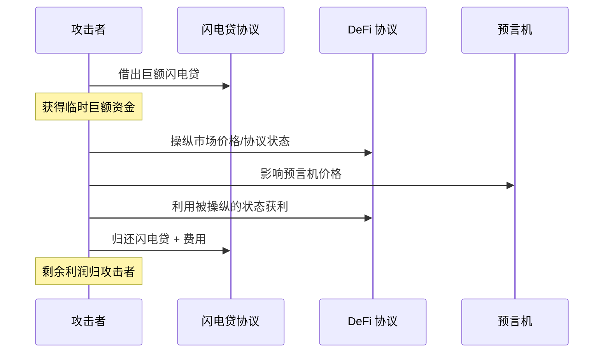

## 1. 闪电贷攻击核心概念

### 1.1 什么是闪电贷？

**闪电贷** 是一种无抵押贷款，允许用户在**一个交易内**借出巨额资金，但必须在**同一交易内归还**本金和费用，否则整个交易会回滚。

```go
// 闪电贷的基本概念
type FlashLoan struct {
    Borrower    common.Address
    Asset       common.Address  
    Amount      *big.Int
    Fee         *big.Int        // 通常 0.09%
    Deadline    *big.Int        // 必须在同一交易内归还
}
```

### 1.2 闪电贷攻击的本质

攻击者利用闪电贷**临时获得巨额资本**，操纵市场价格或协议逻辑，在单笔交易中完成攻击并获利。



---

## 2. 闪电贷协议实现

### 2.1 基础闪电贷合约（Solidity）

```solidity
// SPDX-License-Identifier: MIT
pragma solidity ^0.8.0;

import "@openzeppelin/contracts/token/ERC20/IERC20.sol";
import "@openzeppelin/contracts/security/ReentrancyGuard.sol";

contract SimpleFlashLoan is ReentrancyGuard {
    address public owner;
    uint256 public constant FEE_BPS = 9; // 0.09% 费用
    
    event FlashLoanExecuted(
        address indexed borrower,
        address indexed asset,
        uint256 amount,
        uint256 fee
    );
    
    constructor() {
        owner = msg.sender;
    }
    
    // 执行闪电贷
    function flashLoan(
        address _token,
        uint256 _amount,
        bytes calldata _data
    ) external nonReentrant {
        require(_amount > 0, "Amount must be positive");
        
        IERC20 token = IERC20(_token);
        uint256 balanceBefore = token.balanceOf(address(this));
        require(balanceBefore >= _amount, "Insufficient liquidity");
        
        // 1. 向借款人转账
        require(token.transfer(msg.sender, _amount), "Transfer failed");
        
        // 2. 执行回调函数
        (bool success, ) = msg.sender.call(
            abi.encodeWithSignature(
                "executeOperation(address,uint256,uint256,bytes)",
                _token,
                _amount,
                _fee,
                _data
            )
        );
        require(success, "Callback failed");
        
        // 3. 计算应归还金额
        uint256 fee = (_amount * FEE_BPS) / 10000;
        uint256 amountToReturn = _amount + fee;
        
        // 4. 验证资金归还
        uint256 balanceAfter = token.balanceOf(address(this));
        require(
            balanceAfter >= balanceBefore + fee,
            "Flash loan not repaid"
        );
        
        emit FlashLoanExecuted(msg.sender, _token, _amount, fee);
    }
    
    // 添加流动性
    function addLiquidity(address _token, uint256 _amount) external {
        require(msg.sender == owner, "Only owner");
        IERC20(_token).transferFrom(msg.sender, address(this), _amount);
    }
}
```

### 2.2 攻击者合约接口

```solidity
// 攻击者必须实现的接口
interface IFlashLoanBorrower {
    function executeOperation(
        address _token,
        uint256 _amount,
        uint256 _fee,
        bytes calldata _data
    ) external returns (bool);
}

// 攻击者基础合约
contract FlashLoanAttacker is IFlashLoanBorrower {
    address public owner;
    
    constructor() {
        owner = msg.sender;
    }
    
    // 必须实现的回调函数
    function executeOperation(
        address _token,
        uint256 _amount,
        uint256 _fee,
        bytes calldata _data
    ) external override returns (bool) {
        // 在这里执行攻击逻辑
        _performAttack(_token, _amount, _data);
        
        // 归还资金
        IERC20(_token).transfer(msg.sender, _amount + _fee);
        
        return true;
    }
    
    // 提取利润
    function withdrawProfits(address _token) external {
        require(msg.sender == owner, "Only owner");
        uint256 balance = IERC20(_token).balanceOf(address(this));
        IERC20(_token).transfer(owner, balance);
    }
    
    // 攻击逻辑由具体攻击类型实现
    function _performAttack(
        address _token,
        uint256 _amount,
        bytes calldata _data
    ) internal virtual;
}
```

---

## 3. Golang 闪电贷攻击模拟器

### 3.1 攻击模拟框架

```go
package main

import (
    "context"
    "fmt"
    "math/big"
    "time"

    "github.com/ethereum/go-ethereum/common"
    "github.com/ethereum/go-ethereum/core/types"
)

// 闪电贷攻击模拟器
type FlashLoanAttackSimulator struct {
    flashLoanPool *FlashLoanPool
    dexProtocols  []DEXProtocol
    lendingPools  []LendingProtocol
    oracles       []PriceOracle
}

type AttackResult struct {
    AttackType    string
    Profit        *big.Int
    GasUsed       *big.Int
    Success       bool
    Error         string
    ExecutionTime time.Duration
}

// 模拟闪电贷攻击
func (sim *FlashLoanAttackSimulator) SimulateAttack(ctx context.Context, attackType string, loanAmount *big.Int) (*AttackResult, result) {
    startTime := time.Now()
    
    var profit *big.Int
    var err error
    
    switch attackType {
    case "oracle_manipulation":
        profit, err = sim.simulateOracleManipulation(ctx, loanAmount)
    case "arbitrage_amplification":
        profit, err = sim.simulateArbitrageAmplification(ctx, loanAmount)
    case "governance_attack":
        profit, err = sim.simulateGovernanceAttack(ctx, loanAmount)
    case "liquidation_cascade":
        profit, err = sim.simulateLiquidationCascade(ctx, loanAmount)
    default:
        return nil, fmt.Errorf("unknown attack type: %s", attackType)
    }
    
    executionTime := time.Since(startTime)
    
    return &AttackResult{
        AttackType:    attackType,
        Profit:        profit,
        Success:       err == nil,
        Error:         errToString(err),
        ExecutionTime: executionTime,
    }, nil
}
```

### 3.2 预言机操纵攻击

```go
// 预言机操纵攻击 - 最常见的闪电贷攻击
func (sim *FlashLoanAttackSimulator) simulateOracleManipulation(
    ctx context.Context, 
    loanAmount *big.Int,
) (*big.Int, error) {
    
    fmt.Println("🚨 开始预言机操纵攻击模拟...")
    
    // 1. 借入闪电贷
    fmt.Printf("1. 借入闪电贷: %s ETH\n", formatEther(loanAmount))
    
    // 2. 操纵DEX价格
    fmt.Println("2. 操纵DEX价格...")
    manipulatedPrice, err := sim.manipulateDEXPrice(loanAmount)
    if err != nil {
        return nil, fmt.Errorf("价格操纵失败: %v", err)
    }
    
    // 3. 利用被操纵的价格在借贷协议获利
    fmt.Println("3. 在借贷协议进行恶意操作...")
    protocolProfit, err := sim.exploitLendingProtocol(manipulatedPrice)
    if err != nil {
        return nil, fmt.Errorf("协议利用失败: %v", err)
    }
    
    // 4. 恢复价格（可选）
    fmt.Println("4. 恢复DEX价格...")
    sim.restoreDEXPrice(loanAmount)
    
    // 5. 计算净收益
    fee := new(big.Int).Div(new(big.Int).Mul(loanAmount, big.NewInt(9)), big.NewInt(10000))
    netProfit := new(big.Int).Sub(protocolProfit, fee)
    
    fmt.Printf("✅ 攻击完成! 净收益: %s ETH\n", formatEther(netProfit))
    
    return netProfit, nil
}

// 操纵DEX价格
func (sim *FlashLoanAttackSimulator) manipulateDEXPrice(loanAmount *big.Int) (*big.Float, error) {
    // 选择流动性较低的交易对
    targetPool := sim.findVulnerablePool()
    
    // 大量买入，急剧推高价格
    priceBefore := sim.getCurrentPrice(targetPool)
    fmt.Printf("   当前价格: %s\n", priceBefore.String())
    
    // 执行大额交易操纵价格
    err := sim.executeLargeSwap(targetPool, loanAmount, "buy")
    if err != nil {
        return nil, err
    }
    
    priceAfter := sim.getCurrentPrice(targetPool)
    fmt.Printf("   操纵后价格: %s (涨幅: %.2f%%)\n", 
        priceAfter.String(), 
        calculatePercentageChange(priceBefore, priceAfter))
    
    return priceAfter, nil
}
```

### 3.3 套利放大攻击

```go
// 套利放大攻击 - 用闪电贷放大套利规模
func (sim *FlashLoanAttackSimulator) simulateArbitrageAmplification(
    ctx context.Context,
    loanAmount *big.Int,
) (*big.Int, error) {
    
    fmt.Println("🚨 开始套利放大攻击模拟...")
    
    // 1. 发现套利机会
    opportunity, err := sim.findSmallArbitrage()
    if err != nil {
        return nil, fmt.Errorf("未找到套利机会: %v", err)
    }
    
    fmt.Printf("1. 发现小额套利机会: 利润 %s ETH\n", formatEther(opportunity.Profit))
    
    // 2. 如果没有闪电贷，利润很小
    smallProfit := opportunity.Profit
    
    // 3. 使用闪电贷放大规模
    amplifiedProfit, err := sim.amplifyArbitrage(loanAmount, opportunity)
    if err != nil {
        return nil, fmt.Errorf("套利放大失败: %v", err)
    }
    
    // 4. 计算放大效果
    amplification := new(big.Float).Quo(
        new(big.Float).SetInt(amplifiedProfit),
        new(big.Float).SetInt(smallProfit),
    )
    
    fmt.Printf("2. 使用闪电贷放大套利规模\n")
    fmt.Printf("3. 小额利润: %s ETH → 放大后利润: %s ETH\n", 
        formatEther(smallProfit), formatEther(amplifiedProfit))
    fmt.Printf("4. 放大倍数: %sx\n", amplification.String())
    
    return amplifiedProfit, nil
}

// 放大套利规模
func (sim *FlashLoanAttackSimulator) amplifyArbitrage(
    loanAmount *big.Int,
    opportunity *ArbitrageOpportunity,
) (*big.Int, error) {
    
    // 使用闪电贷资金执行大规模套利
    scaledOpportunity := &ArbitrageOpportunity{
        TokenIn:   opportunity.TokenIn,
        TokenOut:  opportunity.TokenOut,
        DexBuy:    opportunity.DexBuy,
        DexSell:   opportunity.DexSell,
        BuyPrice:  opportunity.BuyPrice,
        SellPrice: opportunity.SellPrice,
        Amount:    loanAmount, // 使用闪电贷资金
    }
    
    // 执行套利
    profit, err := sim.executeArbitrage(scaledOpportunity)
    if err != nil {
        return nil, err
    }
    
    // 扣除闪电贷费用
    fee := new(big.Int).Div(new(big.Int).Mul(loanAmount, big.NewInt(9)), big.NewInt(10000))
    netProfit := new(big.Int).Sub(profit, fee)
    
    return netProfit, nil
}
```

---

## 4. 真实攻击案例分析

### 4.1 Harvest Finance 攻击模拟

```go
// Harvest Finance 攻击复现 (2020年10月, 损失 $2400万)
type HarvestFinanceAttack struct {
    flashLoanPool common.Address
    harvestVault  common.Address
    usdc          common.Address
    usdt          common.Address
}

func (hfa *HarvestFinanceAttack) Execute() error {
    fmt.Println("🎯 复现 Harvest Finance 攻击...")
    
    // 攻击步骤:
    // 1. 通过闪电贷借入大量 USDC/USDT
    // 2. 存入 Harvest 资金池，推高虚拟价格
    // 3. 利用价格误差提取额外代币
    // 4. 归还闪电贷
    
    loanAmount := big.NewInt(1000000000) // 10亿 USDC
    
    // 1. 借入闪电贷
    fmt.Printf("1. 借入闪电贷: %s USDC\n", formatUnits(loanAmount, 6))
    
    // 2. 操纵价格
    fmt.Println("2. 操纵 Harvest 资金池价格...")
    virtualPriceBefore := big.NewInt(1000000) // 1.0
    virtualPriceAfter := big.NewInt(1001000)  // 1.001 - 被操纵后
    
    // 3. 利用价格差异
    profit := hfa.exploitPriceDifference(loanAmount, virtualPriceBefore, virtualPriceAfter)
    
    // 4. 归还闪电贷
    fee := new(big.Int).Div(new(big.Int).Mul(loanAmount, big.NewInt(9)), big.NewInt(10000))
    netProfit := new(big.Int).Sub(profit, fee)
    
    fmt.Printf("3. 攻击利润: %s USDC\n", formatUnits(netProfit, 6))
    fmt.Printf("✅ Harvest Finance 攻击复现完成\n")
    
    return nil
}

func (hfa *HarvestFinanceAttack) exploitPriceDifference(
    depositAmount *big.Int,
    priceBefore *big.Int,
    priceAfter *big.Int,
) *big.Int {
    
    // 计算价格操纵带来的套利空间
    sharesMinted := new(big.Int).Div(
        new(big.Int).Mul(depositAmount, big.NewInt(1e18)),
        priceBefore,
    )
    
    valueAfterManipulation := new(big.Int).Div(
        new(big.Int).Mul(sharesMinted, priceAfter),
        big.NewInt(1e18),
    )
    
    profit := new(big.Int).Sub(valueAfterManipulation, depositAmount)
    return profit
}
```

### 4.2 PancakeBunny 攻击模拟

```go
// PancakeBunny 攻击复现 (2021年5月, 损失 $4500万)
type PancakeBunnyAttack struct {
    pancakeSwap common.Address
    bunnyVault  common.Address
    wbnb        common.Address
    busd        common.Address
}

func (pba *PancakeBunnyAttack) Execute() error {
    fmt.Println("🎯 复现 PancakeBunny 攻击...")
    
    // 攻击原理:
    // 1. 闪电贷借入大量 BNB
    // 2. 在 PancakeSwap 中操纵 BNB-BUSD 价格
    // 3. 利用 Bunny 矿池的 mint 函数漏洞
    // 4. 提取超量 BUNNY 代币
    
    loanAmount := big.NewInt(5000000000000000000) // 5000 BNB
    
    fmt.Printf("1. 借入闪电贷: %s BNB\n", formatEther(loanAmount))
    fmt.Println("2. 操纵 BNB-BUSD 价格...")
    
    // 操纵价格
    priceImpact := pba.manipulateBNBPrice(loanAmount)
    fmt.Printf("   价格影响: %.4f%%\n", priceImpact)
    
    // 利用漏洞 mint 超量代币
    bunnyProfit, err := pba.exploitMintVulnerability(loanAmount)
    if err != nil {
        return err
    }
    
    fmt.Printf("3. 获取超量 BUNNY: %s\n", formatEther(bunnyProfit))
    fmt.Printf("4. 卖出 BUNNY 获利...\n")
    
    finalProfit := pba.sellBunnyForProfit(bunnyProfit)
    fmt.Printf("✅ 最终利润: %s BNB\n", formatEther(finalProfit))
    
    return nil
}
```

---

## 5. 防护措施

### 5.1 协议级防护

```solidity
// 增强的闪电贷防护合约
contract ProtectedFlashLoan {
    using SafeERC20 for IERC20;
    
    mapping(address => bool) public whitelistedBorrowers;
    mapping(address => uint256) public maxLoanAmounts;
    uint256 public totalLoanLimit;
    
    // 时间锁防护
    struct LoanRecord {
        uint256 timestamp;
        uint256 amount;
        address borrower;
    }
    
    mapping(bytes32 => LoanRecord) public loanRecords;
    
    // 增强的闪电贷函数
    function protectedFlashLoan(
        address _token,
        uint256 _amount,
        bytes calldata _data
    ) external {
        require(whitelistedBorrowers[msg.sender], "Borrower not whitelisted");
        require(_amount <= maxLoanAmounts[_token], "Amount exceeds limit");
        require(_amount <= totalLoanLimit, "Exceeds total limit");
        
        // 记录贷款信息
        bytes32 loanId = keccak256(abi.encodePacked(msg.sender, _token, _amount, block.timestamp));
        loanRecords[loanId] = LoanRecord(block.timestamp, _amount, msg.sender);
        
        // 执行标准闪电贷逻辑
        _executeFlashLoan(_token, _amount, _data);
        
        // 验证状态完整性
        _validateStateIntegrity(_token);
    }
    
    // 状态完整性验证
    function _validateStateIntegrity(address _token) internal view {
        // 检查关键状态变量是否被异常修改
        // 这需要根据具体协议逻辑实现
    }
}
```

### 5.2 价格预言机防护

```solidity
// 防操纵的价格预言机
contract ManipulationResistantOracle {
    struct PriceData {
        uint256 price;
        uint256 timestamp;
        uint256 blockNumber;
    }
    
    mapping(address => PriceData[]) public priceHistory;
    uint256 public constant TIME_WINDOW = 1 hours;
    uint256 public constant MAX_PRICE_CHANGE = 20e16; // 20%
    
    function updatePrice(address _token, uint256 _price) external {
        PriceData[] storage history = priceHistory[_token];
        
        // 检查价格变化率
        if (history.length > 0) {
            PriceData memory last = history[history.length - 1];
            uint256 change = _calculatePriceChange(last.price, _price);
            require(change <= MAX_PRICE_CHANGE, "Price change too large");
        }
        
        // 使用 TWAP（时间加权平均价格）
        uint256 twap = _calculateTWAP(_token);
        uint256 deviation = _calculatePriceChange(twap, _price);
        require(deviation <= 5e16, "Deviation from TWAP too large"); // 5%
        
        // 记录价格
        history.push(PriceData(_price, block.timestamp, block.number));
        
        // 清理旧数据
        _cleanOldData(_token);
    }
    
    function _calculateTWAP(address _token) internal view returns (uint256) {
        // 计算时间加权平均价格
        PriceData[] storage history = priceHistory[_token];
        if (history.length == 0) return 0;
        
        uint256 totalWeight;
        uint256 weightedPrice;
        
        for (uint i = 0; i < history.length; i++) {
            uint256 timeDiff = i == history.length - 1 ? 
                block.timestamp - history[i].timestamp :
                history[i+1].timestamp - history[i].timestamp;
                
            weightedPrice += history[i].price * timeDiff;
            totalWeight += timeDiff;
        }
        
        return weightedPrice / totalWeight;
    }
}
```

### 5.3 Golang 攻击检测系统

```go
// 闪电贷攻击检测系统
type FlashLoanAttackDetector struct {
    transactionMonitor *TransactionMonitor
    patternDatabase    *AttackPatternDB
    alertSystem        *AlertSystem
}

// 实时检测闪电贷攻击
func (detector *FlashLoanAttackDetector) MonitorTransactions(ctx context.Context) {
    txCh := make(chan *types.Transaction)
    
    go detector.transactionMonitor.SubscribeLargeTransactions(txCh)
    
    for {
        select {
        case tx := <-txCh:
            // 分析交易特征
            riskScore, err := detector.analyzeTransactionRisk(tx)
            if err != nil {
                continue
            }
            
            if riskScore > 0.8 { // 高风险
                detector.alertSystem.TriggerAlert(&Alert{
                    Type:       "flash_loan_attack",
                    RiskScore:  riskScore,
                    Transaction: tx,
                    Timestamp:  time.Now(),
                })
                
                fmt.Printf("🚨 检测到潜在闪电贷攻击: %s, 风险分数: %.2f\n", 
                    tx.Hash().Hex(), riskScore)
            }
            
        case <-ctx.Done():
            return
        }
    }
}

// 分析交易风险
func (detector *FlashLoanAttackDetector) analyzeTransactionRisk(tx *types.Transaction) (float64, error) {
    var riskScore float64
    
    // 1. 检查是否调用闪电贷合约
    if detector.isFlashLoanCall(tx) {
        riskScore += 0.3
    }
    
    // 2. 检查交易金额
    if tx.Value().Cmp(big.NewInt(1000000000000000000)) > 0 { // > 1 ETH
        riskScore += 0.2
    }
    
    // 3. 检查是否调用多个DeFi协议
    protocolCount := detector.countDeFiProtocolCalls(tx)
    if protocolCount >= 3 {
        riskScore += 0.3
    }
    
    // 4. 检查模式匹配
    if detector.matchesKnownAttackPattern(tx) {
        riskScore += 0.2
    }
    
    return riskScore, nil
}
```

---

## 6. 总结

### 6.1 闪电贷攻击特点

| 特征 | 描述 |
|------|------|
| **无资本要求** | 攻击者无需自有资金 |
| **高破坏性** | 可造成数百万美元损失 |
| **单交易完成** | 所有操作在一个交易内 |
| **技术复杂** | 需要深入了解多个协议 |

### 6.2 常见攻击向量

1. **🔮 预言机操纵** - 最常见（Harvest Finance）
2. **🔄 套利放大** - 放大正常套利机会  
3. **🏛️ 治理攻击** - 操纵治理投票
4. **💥 清算级联** - 触发大规模清算
5. **🪙 代币铸造漏洞** - 利用mint函数缺陷

### 6.3 防护策略

1. **✅ 使用TWAP预言机** - 防价格操纵
2. **✅ 设置交易限制** - 单笔交易上限
3. **✅ 实施时间锁** - 延迟关键操作
4. **✅ 多重验证** - 多个数据源交叉验证
5. **✅ 实时监控** - 异常交易检测

闪电贷本身是DeFi的重要创新，但也被恶意利用。理解这些攻击机制对于开发安全的DeFi协议和保护用户资金至关重要。