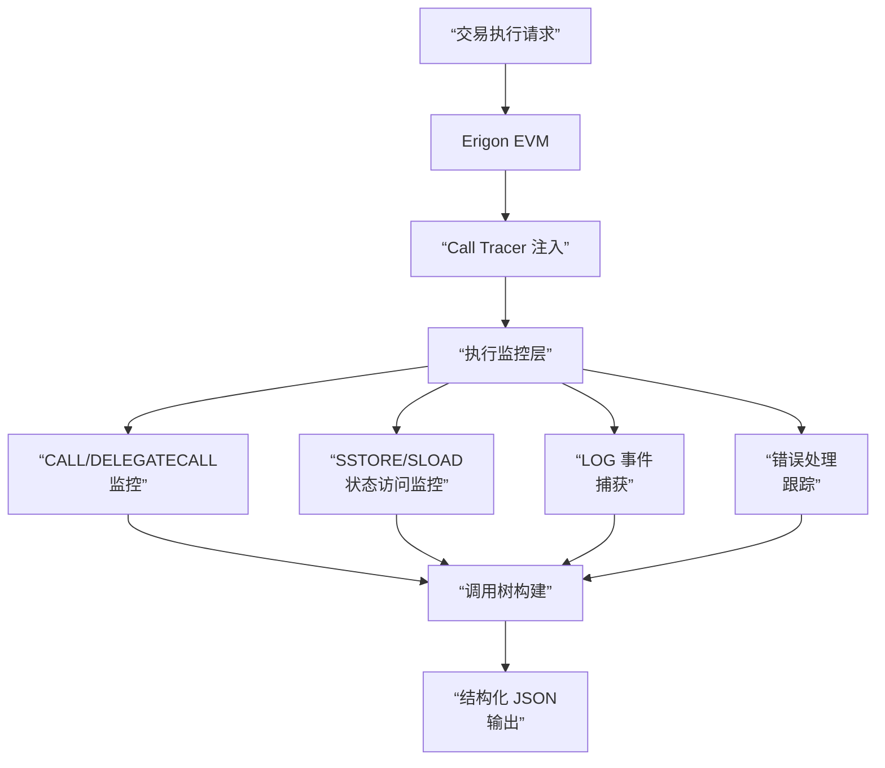

## 1. Erigon Call Tracer 是什么？

**核心定义**：Erigon Call Tracer 是 Erigon（以前称为 Turbo-Geth）客户端的一个高级调试功能，它能够在交易执行过程中**生成详细的调用轨迹树**，揭示智能合约内部和之间的每一个函数调用、状态变化和资金流动。

**简单类比**：如果把普通交易收据比作飞机的**登机牌**（只知道起点、终点和基础信息），那么 Call Tracer 提供的就像**黑匣子飞行记录仪**——它记录了飞行的每一个细节：每个操作、每次高度变化、所有系统状态。

---

## 2. 为什么需要 Call Tracer？

### 普通 RPC 调用的局限性

当你使用标准的 `eth_getTransactionReceipt` 时，你只能得到：

```json
{
  "transactionHash": "0x...",
  "status": "0x1",
  "gasUsed": "0x5208",
  "logs": [...]
}
```

**信息缺失**：
- ❌ 内部调用发生了什么？
- ❌ 哪个合约调用了哪个合约？
- ❌ 具体的函数调用参数是什么？
- ❌ 执行过程中发生了哪些状态变化？
- ❌ 为什么交易失败了？

### Call Tracer 提供的完整视图

Call Tracer 揭示了交易的**完整执行流**：

```
用户调用 (0xuser)
  ↳ Uniswap Router (0x7a25)
    ↳ 调用 WETH.deposit() (0xc02a)
    ↳ 调用 Pair.swap() (0x0d4a)  
      ↳ 内部 _update() 函数
      ↳ 内部 _safeTransfer() 函数
        ↳ Token.transfer(recipient)
```

---

## 3. 技术架构与工作原理



### EVM 操作码级别的监控

Call Tracer 在 EVM 执行级别工作，监控关键操作码：

| 操作码 | 监控内容 | 输出信息 |
|--------|----------|----------|
| `CALL` / `DELEGATECALL` | 合约间调用 | 调用者、目标、value、gas、calldata |
| `STATICCALL` | 只读调用 | 调用上下文、查询参数 |
| `SSTORE` | 状态写入 | 存储槽、旧值、新值 |
| `SLOAD` | 状态读取 | 存储槽、读取值 |
| `LOG0`-`LOG4` | 事件日志 | 主题、数据 |
| `REVERT` | 错误回滚 | 回退位置、错误信息 |

---

## 4. 核心 API 与使用方法

### 4.1 基础调用方式

```bash
# 使用 JSON-RPC 调用 callTracer
curl -X POST http://localhost:8545 \
  -H "Content-Type: application/json" \
  --data '{
    "jsonrpc": "2.0",
    "id": 1,
    "method": "debug_traceTransaction",
    "params": [
      "0x123...abc",  # 交易哈希
      {
        "tracer": "callTracer",
        "tracerConfig": {
          "onlyTopCall": false,
          "withLog": true
        }
      }
    ]
  }'
```

### 4.2 Python 集成示例

```python
import json
from web3 import Web3

class ErigonCallTracer:
    def __init__(self, erigon_rpc_url):
        self.w3 = Web3(Web3.HTTPProvider(erigon_rpc_url))
        
    def trace_transaction(self, tx_hash, with_logs=True, timeout=30):
        """追踪交易执行详情"""
        
        tracer_config = {
            "tracer": "callTracer",
            "timeout": f"{timeout}s",
            "tracerConfig": {
                "onlyTopCall": False,
                "withLog": with_logs
            }
        }
        
        try:
            result = self.w3.provider.make_request(
                "debug_traceTransaction", 
                [tx_hash, tracer_config]
            )
            return result['result']
        except Exception as e:
            print(f"Trace failed: {e}")
            return None
    
    def trace_block(self, block_number, with_logs=True):
        """追踪整个区块的所有交易"""
        
        tracer_config = {
            "tracer": "callTracer", 
            "tracerConfig": {
                "withLog": with_logs
            }
        }
        
        result = self.w3.provider.make_request(
            "debug_traceBlockByNumber",
            [hex(block_number), tracer_config]
        )
        return result['result']
```

---

## 5. 输出结构深度解析

Call Tracer 的输出是一个**嵌套的调用树结构**，让我们详细分解：

### 5.1 基础调用节点结构

```json
{
  "type": "CALL",
  "from": "0x742d35cc6634c0532925a3b8dc9f1a37cc19bcc5",
  "to": "0x7a250d5630b4cf539739df2c5dacb4c659f2488d",
  "value": "0xde0b6b3a7640000",
  "gas": "0x1c9c380",
  "gasUsed": "0x1a9b98",
  "input": "0x7ff36ab5000000000000000000000000000000000000000000000000002386f26fc10000000000000000000000000000000000000000000000000000000000000000000080000000000000000000000000742d35cc6634c0532925a3b8dc9f1a37cc19bcc500000000000000000000000000000000000000000000000000000000612e5b300000000000000000000000000000000000000000000000000000000000000002000000000000000000000000c02aaa39b223fe8d0a0e5c4f27ead9083c756cc20000000000000000000000006b175474e89094c44da98b954eedeac495271d0f",
  "output": "0x0000000000000000000000000000000000000000000000001a9b93cfe2e7b3d4",
  "time": "312.594µs",
  "calls": [
    // 内部调用会嵌套在这里
  ]
}
```

### 5.2 完整的 DEX 交易分析示例

```python
def analyze_uniswap_swap(trace_result):
    """分析 Uniswap 交易轨迹"""
    
    analysis = {
        'total_value_flow': 0,
        'contracts_interacted': [],
        'function_calls': [],
        'token_transfers': [],
        'gas_breakdown': {}
    }
    
    def traverse_call_tree(node, depth=0):
        # 记录所有合约交互
        if node.get('to') and node['to'] not in analysis['contracts_interacted']:
            analysis['contracts_interacted'].append(node['to'])
        
        # 分析调用类型和函数
        call_analysis = {
            'depth': depth,
            'type': node.get('type', 'UNKNOWN'),
            'from': node.get('from'),
            'to': node.get('to'),
            'value': int(node.get('value', '0x0'), 16) if node.get('value') else 0,
            'gas_used': int(node.get('gasUsed', '0x0'), 16),
            'input_preview': node.get('input', '')[:10] + '...' if node.get('input') else None
        }
        
        analysis['function_calls'].append(call_analysis)
        analysis['total_value_flow'] += call_analysis['value']
        
        # 递归处理内部调用
        for call in node.get('calls', []):
            traverse_call_tree(call, depth + 1)
    
    traverse_call_tree(trace_result)
    return analysis

# 使用示例
tx_hash = "0x8a7b3c0e5e5c5e5e5e5e5e5e5e5e5e5e5e5e5e5e5e5e5e5e5e5e5e5e5e5e5e5e5e"
trace = tracer.trace_transaction(tx_hash)
analysis = analyze_uniswap_swap(trace)

print(f"合约交互数量: {len(analysis['contracts_interacted'])}")
print(f"总资金流动: {analysis['total_value_flow'] / 10**18} ETH")
print(f"调用深度: {max(call['depth'] for call in analysis['function_calls'])}")
```

---

## 6. 在 DEX 和聚合器中的实际应用

### 6.1 交易失败诊断

```python
class TransactionFailureAnalyzer:
    def __init__(self, call_tracer):
        self.tracer = call_tracer
    
    def diagnose_failed_swap(self, failed_tx_hash):
        """诊断失败的交易根本原因"""
        
        trace = self.tracer.trace_transaction(failed_tx_hash)
        
        if not trace:
            return {"error": "无法获取交易轨迹"}
        
        # 查找 revert 或执行失败的位置
        failure_point = self.find_failure_point(trace)
        
        diagnosis = {
            'failed_at_contract': failure_point.get('to'),
            'failed_at_depth': failure_point.get('depth', 0),
            'revert_reason': self.decode_revert_reason(failure_point),
            'gas_remaining_at_failure': failure_point.get('gas', 0),
            'suggested_fix': self.suggest_fix(failure_point)
        }
        
        return diagnosis
    
    def find_failure_point(self, node, depth=0):
        """在调用树中找到失败点"""
        
        # 检查当前节点是否失败
        if node.get('error'):
            return {**node, 'depth': depth}
        
        # 检查子调用
        for call in node.get('calls', []):
            failure = self.find_failure_point(call, depth + 1)
            if failure:
                return failure
        
        return None
    
    def decode_revert_reason(self, failure_node):
        """解码 revert 原因"""
        
        if failure_node.get('output') and failure_node['output'].startswith('0x08c379a0'):
            # 这是 Error(string) 的编码
            try:
                # 解码 ABI 编码的字符串错误
                encoded_reason = failure_node['output'][10:]  # 去掉函数选择器
                reason_bytes = bytes.fromhex(encoded_reason[64:])  # 跳过偏移量
                return reason_bytes.decode('utf-8').rstrip('\x00')
            except:
                return "无法解码错误信息"
        
        return failure_node.get('error', '未知错误')
```

### 6.2 MEV 交易分析

```python
class MEVAnalyzer:
    def __init__(self, call_tracer):
        self.tracer = call_tracer
    
    def analyze_mev_bundle(self, bundle_transactions):
        """分析 MEV 交易包的策略"""
        
        bundle_analysis = []
        
        for tx_hash in bundle_transactions:
            trace = self.tracer.trace_transaction(tx_hash)
            analysis = self.analyze_single_mev_tx(trace)
            bundle_analysis.append(analysis)
        
        return self.correlate_mev_strategy(bundle_analysis)
    
    def analyze_single_mev_tx(self, trace):
        """分析单笔 MEV 交易"""
        
        analysis = {
            'strategy_type': None,
            'profit_estimation': 0,
            'target_pools': [],
            'arbitrage_paths': [],
            'sandwich_indicators': False
        }
        
        # 识别三明治攻击模式
        if self.detect_sandwich_pattern(trace):
            analysis['strategy_type'] = 'sandwich'
            analysis['sandwich_indicators'] = True
        
        # 识别套利路径
        arbitrage_paths = self.extract_arbitrage_paths(trace)
        if arbitrage_paths:
            analysis['strategy_type'] = 'arbitrage'
            analysis['arbitrage_paths'] = arbitrage_paths
            analysis['profit_estimation'] = self.estimate_arbitrage_profit(trace)
        
        # 识别清算交易
        if self.detect_liquidation_pattern(trace):
            analysis['strategy_type'] = 'liquidation'
        
        return analysis
    
    def detect_sandwich_pattern(self, trace):
        """检测三明治攻击模式"""
        
        calls = self.flatten_calls(trace)
        
        # 寻找模式：买入 -> 目标交易 -> 卖出
        buy_indicators = self.find_buy_indicators(calls)
        sell_indicators = self.find_sell_indicators(calls)
        victim_indicators = self.find_victim_indicators(calls)
        
        return len(buy_indicators) > 0 and len(sell_indicators) > 0 and len(victim_indicators) > 0
```

### 6.3 Gas 优化分析

```python
class GasOptimizationAnalyzer:
    def __init__(self, call_tracer):
        self.tracer = call_tracer
    
    def optimize_route_gas(self, successful_tx_hash):
        """基于成功交易分析 Gas 优化机会"""
        
        trace = self.tracer.trace_transaction(successful_tx_hash)
        gas_analysis = self.analyze_gas_usage(trace)
        
        optimizations = []
        
        # 检查不必要的外部调用
        for call in gas_analysis['external_calls']:
            if call['gas_used'] < 1000 and call['depth'] > 2:
                optimizations.append({
                    'type': 'UNNECESSARY_EXTERNAL_CALL',
                    'savings': call['gas_used'] * 2,  # 调用 + 返回成本
                    'description': f"考虑内联小函数调用: {call['to']}"
                })
        
        # 检查重复的状态读取
        sloads = gas_analysis['state_accesses']['sloads']
        duplicate_slots = self.find_duplicate_sloads(sloads)
        for slot in duplicate_slots:
            optimizations.append({
                'type': 'DUPLICATE_SLOAD',
                'savings': 200 * (len(duplicate_slots[slot]) - 1),  # 每次SLOAD约200 gas
                'description': f"缓存存储槽 {slot} 的读取"
            })
        
        return {
            'total_gas_used': gas_analysis['total_gas_used'],
            'potential_savings': sum(opt['savings'] for opt in optimizations),
            'optimizations': optimizations
        }
```

---

## 7. 性能考虑与最佳实践

### 7.1 性能优化策略

```python
class OptimizedCallTracer:
    def __init__(self, erigon_url, cache_ttl=300):
        self.tracer = ErigonCallTracer(erigon_url)
        self.cache = {}
        self.cache_ttl = cache_ttl
    
    async def get_cached_trace(self, tx_hash):
        """带缓存的交易追踪"""
        
        now = time.time()
        if tx_hash in self.cache:
            cached_data = self.cache[tx_hash]
            if now - cached_data['timestamp'] < self.cache_ttl:
                return cached_data['trace']
        
        # 缓存未命中，执行追踪
        trace = self.tracer.trace_transaction(tx_hash)
        if trace:
            self.cache[tx_hash] = {
                'trace': trace,
                'timestamp': now
            }
        
        return trace
    
    def batch_trace_transactions(self, tx_hashes, max_concurrency=5):
        """批量追踪交易，控制并发数"""
        
        semaphore = asyncio.Semaphore(max_concurrency)
        
        async def trace_with_limit(tx_hash):
            async with semaphore:
                return await self.get_cached_trace(tx_hash)
        
        tasks = [trace_with_limit(tx_hash) for tx_hash in tx_hashes]
        return await asyncio.gather(*tasks)
```

### 7.2 错误处理与重试

```python
class RobustCallTracer:
    def __init__(self, erigon_urls):  # 多个 Erigon 节点
        self.tracers = [ErigonCallTracer(url) for url in erigon_urls]
        self.current_tracer = 0
    
    def trace_with_retry(self, tx_hash, max_retries=3):
        """带重试的交易追踪"""
        
        for attempt in range(max_retries):
            try:
                tracer = self.tracers[self.current_tracer]
                result = tracer.trace_transaction(tx_hash)
                
                if result is not None:
                    return result
                
            except Exception as e:
                print(f"Attempt {attempt + 1} failed: {e}")
                
                # 切换到下一个节点
                self.current_tracer = (self.current_tracer + 1) % len(self.tracers)
                
                if attempt == max_retries - 1:
                    raise e
                
                time.sleep(1 * (attempt + 1))  # 指数退避
        
        return None
```

---

## 8. 与其他工具的对比

| 特性 | Erigon Call Tracer | Geth Debug Tracer | Tenderly Simulation |
|------|-------------------|-------------------|---------------------|
| **数据深度** | 🔸 **操作码级别** | 🔸 操作码级别 | 🔹 交易级别 |
| **执行环境** | 🔸 **真实链上数据** | 🔸 真实链上数据 | 🔹 模拟环境 |
| **性能影响** | 🔹 高（需同步节点） | 🔹 高 | 🔸 低 |
| **部署复杂度** | 🔹 高（需运行节点） | 🔹 高 | 🔸 低（API） |
| **实时性** | 🔸 **实时链上数据** | 🔸 实时链上数据 | 🔹 模拟数据 |

## 总结

**Erigon Call Tracer 的核心价值在于提供了无与伦比的交易执行透明度：**

- ✅ **根本原因分析**：精确找出交易失败的位置和原因
- ✅ **MEV 研究**：深入理解复杂的交易策略和套利模式  
- ✅ **Gas 优化**：识别合约交互中的低效模式
- ✅ **安全审计**：验证合约的实际行为与预期是否一致
- ✅ **协议分析**：理解复杂的跨合约交互模式

对于需要深度洞察区块链交易内部机制的 DEX、聚合器、MEV 研究者和协议开发者来说，Erigon Call Tracer 是一个不可或缺的**诊断工具**。虽然设置和运行成本较高，但它提供的深度信息是其他工具无法替代的。