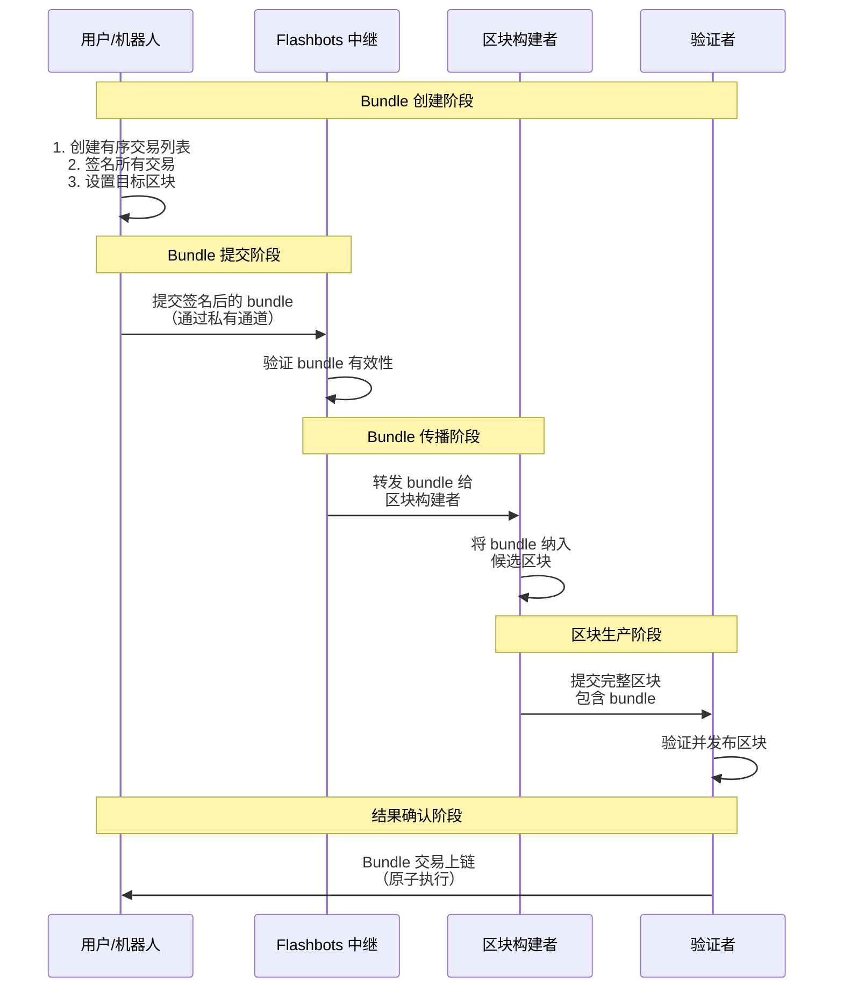

好的，我们来深入讲解 **flashbots-bundle**，这是与 MEV（矿工可提取价值）和交易保护密切相关的核心工具。

---

## Flashbots Bundle 深度解析

## 1. Flashbots Bundle 是什么？

**核心定义**：Flashbots Bundle 是一组有序的交易集合，这些交易被作为一个原子单元提交给矿工（验证者）。这意味着要么 bundle 中的所有交易都被包含在同一个区块中，要么都不包含。

**关键特性**：
- ✅ **原子性**：所有交易一起成功或一起失败
- ✅ **顺序保证**：交易按指定顺序执行
- ✅ **隐私保护**：不进入公开内存池，防止抢跑
- ✅ **无失败费用**：只有 bundle 被包含时才支付费用

---

## 2. 架构与工作原理



---

## 3. Golang 核心实现

### 3.1 基础 Bundle 结构

```go
package flashbots

import (
    "context"
    "crypto/ecdsa"
    "encoding/json"
    "fmt"
    "math/big"
    "time"

    "github.com/ethereum/go-ethereum/accounts"
    "github.com/ethereum/go-ethereum/common"
    "github.com/ethereum/go-ethereum/common/hexutil"
    "github.com/ethereum/go-ethereum/core/types"
    "github.com/ethereum/go-ethereum/crypto"
    "github.com/ethereum/go-ethereum/ethclient"
    "github.com/ethereum/go-ethereum/rpc"
)

// Bundle 表示一个 Flashbots 交易包
type Bundle struct {
    Transactions []hexutil.Bytes `json:"txs"`
    BlockNumber  *big.Int        `json:"blockNumber,omitempty"`
    MinTimestamp *big.Int        `json:"minTimestamp,omitempty"`
    MaxTimestamp *big.Int        `json:"maxTimestamp,omitempty"`
    RevertingTxs []hexutil.Bytes `json:"revertingTxHashes,omitempty"`
}

// BundleStats 包含 Bundle 的统计信息
type BundleStats struct {
    IsHighPriority bool    `json:"isHighPriority"`
    IsSimulated    bool    `json:"isSimulated"`
    SimulatedAt    string  `json:"simulatedAt"`
    ReceivedAt     string  `json:"receivedAt"`
}

// BundleResponse 是 Bundle 提交的响应
type BundleResponse struct {
    BundleHash common.Hash `json:"bundleHash"`
}

// FlashbotsClient 封装 Flashbots RPC 客户端
type FlashbotsClient struct {
    rpcClient   *rpc.Client
    ethClient   *ethclient.Client
    signerKey   *ecdsa.PrivateKey
    relayerURL  string
}

// NewFlashbotsClient 创建新的 Flashbots 客户端
func NewFlashbotsClient(ethURL, relayerURL string, signerKey *ecdsa.PrivateKey) (*FlashbotsClient, error) {
    rpcClient, err := rpc.Dial(ethURL)
    if err != nil {
        return nil, fmt.Errorf("failed to connect to Ethereum node: %v", err)
    }

    ethClient, err := ethclient.Dial(ethURL)
    if err != nil {
        return nil, fmt.Errorf("failed to connect to Ethereum client: %v", err)
    }

    return &FlashbotsClient{
        rpcClient:  rpcClient,
        ethClient:  ethClient,
        signerKey:  signerKey,
        relayerURL: relayerURL,
    }, nil
}
```

### 3.2 Bundle 构建器

```go
// BundleBuilder 用于构建复杂的交易包
type BundleBuilder struct {
    transactions []*types.Transaction
    signers      []*ecdsa.PrivateKey
}

func NewBundleBuilder() *BundleBuilder {
    return &BundleBuilder{
        transactions: make([]*types.Transaction, 0),
        signers:      make([]*ecdsa.PrivateKey, 0),
    }
}

// AddTransaction 添加交易到 bundle
func (bb *BundleBuilder) AddTransaction(tx *types.Transaction, signer *ecdsa.PrivateKey) error {
    // 验证交易签名
    from, err := types.Sender(types.LatestSignerForChainID(tx.ChainId()), tx)
    if err != nil {
        return fmt.Errorf("invalid transaction signature: %v", err)
    }

    expectedFrom := crypto.PubkeyToAddress(signer.PublicKey)
    if from != expectedFrom {
        return fmt.Errorf("transaction signer mismatch: expected %s, got %s", expectedFrom.Hex(), from.Hex())
    }

    bb.transactions = append(bb.transactions, tx)
    bb.signers = append(bb.signers, signer)
    return nil
}

// Build 构建最终的 bundle
func (bb *BundleBuilder) Build(targetBlock *big.Int) (*Bundle, error) {
    if len(bb.transactions) == 0 {
        return nil, fmt.Errorf("no transactions in bundle")
    }

    encodedTxs := make([]hexutil.Bytes, len(bb.transactions))
    for i, tx := range bb.transactions {
        rawTx, err := tx.MarshalBinary()
        if err != nil {
            return nil, fmt.Errorf("failed to encode transaction %d: %v", i, err)
        }
        encodedTxs[i] = rawTx
    }

    return &Bundle{
        Transactions: encodedTxs,
        BlockNumber:  targetBlock,
    }, nil
}

// CreateArbitrageBundle 创建套利 bundle 的示例
func (bb *BundleBuilder) CreateArbitrageBundle(
    buyTx, sellTx *types.Transaction,
    buySigner, sellSigner *ecdsa.PrivateKey,
    targetBlock *big.Int,
) (*Bundle, error) {
    // 重置 builder
    bb.transactions = bb.transactions[:0]
    bb.signers = bb.signers[:0]

    // 添加买入交易
    if err := bb.AddTransaction(buyTx, buySigner); err != nil {
        return nil, fmt.Errorf("failed to add buy transaction: %v", err)
    }

    // 添加卖出交易
    if err := bb.AddTransaction(sellTx, sellSigner); err != nil {
        return nil, fmt.Errorf("failed to add sell transaction: %v", err)
    }

    return bb.Build(targetBlock)
}
```

### 3.3 Bundle 提交与管理

```go
// SendBundle 发送 bundle 到 Flashbots 中继
func (fb *FlashbotsClient) SendBundle(ctx context.Context, bundle *Bundle) (*BundleResponse, error) {
    // 创建签名消息
    message := accounts.TextHash([]byte(bundle.String()))
    signature, err := crypto.Sign(message, fb.signerKey)
    if err != nil {
        return nil, fmt.Errorf("failed to sign bundle: %v", err)
    }

    // 设置签名
    signature[64] += 27 // 恢复 ID

    var result BundleResponse
    
    // 发送到 Flashbots 中继
    err = fb.rpcClient.CallContext(ctx, &result, "eth_sendBundle", bundle, hexutil.Encode(signature))
    if err != nil {
        return nil, fmt.Errorf("failed to send bundle: %v", err)
    }

    return &result, nil
}

// SimulateBundle 模拟 bundle 执行
func (fb *FlashbotsClient) SimulateBundle(ctx context.Context, bundle *Bundle, blockNumber *big.Int) (*BundleStats, error) {
    message := accounts.TextHash([]byte(bundle.String()))
    signature, err := crypto.Sign(message, fb.signerKey)
    if err != nil {
        return nil, fmt.Errorf("failed to sign bundle: %v", err)
    }
    signature[64] += 27

    var simulationResult struct {
        Success bool   `json:"success"`
        Error   string `json:"error,omitempty"`
    }

    params := []interface{}{bundle, blockNumber, hexutil.Encode(signature)}
    err = fb.rpcClient.CallContext(ctx, &simulationResult, "eth_callBundle", params...)
    if err != nil {
        return nil, fmt.Errorf("bundle simulation failed: %v", err)
    }

    if !simulationResult.Success {
        return nil, fmt.Errorf("bundle simulation reverted: %s", simulationResult.Error)
    }

    return &BundleStats{
        IsSimulated: true,
        SimulatedAt: time.Now().Format(time.RFC3339),
    }, nil
}

// SendPrivateTransaction 发送私有交易（非 bundle）
func (fb *FlashbotsClient) SendPrivateTransaction(ctx context.Context, tx *types.Transaction, options map[string]interface{}) (common.Hash, error) {
    rawTx, err := tx.MarshalBinary()
    if err != nil {
        return common.Hash{}, fmt.Errorf("failed to encode transaction: %v", err)
    }

    var txHash common.Hash
    params := []interface{}{hexutil.Encode(rawTx), options}
    
    err = fb.rpcClient.CallContext(ctx, &txHash, "eth_sendPrivateTransaction", params...)
    if err != nil {
        return common.Hash{}, fmt.Errorf("failed to send private transaction: %v", err)
    }

    return txHash, nil
}
```

---

## 4. 在 DEX 和 MEV 中的实际应用

### 4.1 套利策略实现

```go
type ArbitrageStrategy struct {
    flashbotsClient *FlashbotsClient
    bundleBuilder   *BundleBuilder
}

func NewArbitrageStrategy(fbClient *FlashbotsClient) *ArbitrageStrategy {
    return &ArbitrageStrategy{
        flashbotsClient: fbClient,
        bundleBuilder:   NewBundleBuilder(),
    }
}

// ExecuteArbitrage 执行三角套利
func (as *ArbitrageStrategy) ExecuteArbitrage(
    ctx context.Context,
    buyTx1, buyTx2, sellTx *types.Transaction,
    signer1, signer2, signer3 *ecdsa.PrivateKey,
    targetBlock *big.Int,
) error {
    
    // 构建套利 bundle
    bundle, err := as.bundleBuilder.CreateTriangularArbitrageBundle(
        buyTx1, buyTx2, sellTx,
        signer1, signer2, signer3,
        targetBlock,
    )
    if err != nil {
        return fmt.Errorf("failed to build arbitrage bundle: %v", err)
    }

    // 模拟执行
    stats, err := as.flashbotsClient.SimulateBundle(ctx, bundle, targetBlock)
    if err != nil {
        return fmt.Errorf("arbitrage simulation failed: %v", err)
    }

    if !stats.IsSimulated {
        return fmt.Errorf("bundle simulation failed")
    }

    // 发送 bundle
    response, err := as.flashbotsClient.SendBundle(ctx, bundle)
    if err != nil {
        return fmt.Errorf("failed to send arbitrage bundle: %v", err)
    }

    fmt.Printf("Arbitrage bundle submitted: %s\n", response.BundleHash.Hex())
    return nil
}

// CreateTriangularArbitrageBundle 创建三角套利 bundle
func (bb *BundleBuilder) CreateTriangularArbitrageBundle(
    buyTx1, buyTx2, sellTx *types.Transaction,
    signer1, signer2, signer3 *ecdsa.PrivateKey,
    targetBlock *big.Int,
) (*Bundle, error) {
    
    bb.transactions = bb.transactions[:0]
    bb.signers = bb.signers[:0]

    // 必须按顺序添加交易
    transactions := []struct {
        tx     *types.Transaction
        signer *ecdsa.PrivateKey
    }{
        {buyTx1, signer1},
        {buyTx2, signer2},
        {sellTx, signer3},
    }

    for i, item := range transactions {
        if err := bb.AddTransaction(item.tx, item.signer); err != nil {
            return nil, fmt.Errorf("failed to add transaction %d: %v", i, err)
        }
    }

    return bb.Build(targetBlock)
}
```

### 4.2 三明治攻击防护

```go
type SandwichProtection struct {
    flashbotsClient *FlashbotsClient
    mevDetector     *MEVDetector
}

// ProtectTrade 保护交易免受三明治攻击
func (sp *SandwichProtection) ProtectTrade(
    ctx context.Context,
    userTx *types.Transaction,
    userSigner *ecdsa.PrivateKey,
    targetBlock *big.Int,
) error {
    
    // 检测三明治攻击风险
    risk, err := sp.mevDetector.AssessSandwichRisk(userTx)
    if err != nil {
        return fmt.Errorf("risk assessment failed: %v", err)
    }

    if risk.RiskLevel >= HighRisk {
        // 高风险交易，使用 bundle 保护
        return sp.protectWithBundle(ctx, userTx, userSigner, targetBlock)
    }

    // 低风险交易，使用私有交易
    txHash, err := sp.flashbotsClient.SendPrivateTransaction(ctx, userTx, nil)
    if err != nil {
        return fmt.Errorf("failed to send private transaction: %v", err)
    }

    fmt.Printf("Trade protected via private transaction: %s\n", txHash.Hex())
    return nil
}

// protectWithBundle 使用 bundle 保护交易
func (sp *SandwichProtection) protectWithBundle(
    ctx context.Context,
    userTx *types.Transaction,
    userSigner *ecdsa.PrivateKey,
    targetBlock *big.Int,
) error {
    
    bundleBuilder := NewBundleBuilder()
    
    // 可以添加补偿交易或保护性交易
    // 这里简单地将用户交易放入 bundle
    if err := bundleBuilder.AddTransaction(userTx, userSigner); err != nil {
        return fmt.Errorf("failed to add user transaction to bundle: %v", err)
    }

    bundle, err := bundleBuilder.Build(targetBlock)
    if err != nil {
        return fmt.Errorf("failed to build protection bundle: %v", err)
    }

    // 模拟并发送
    if _, err := sp.flashbotsClient.SimulateBundle(ctx, bundle, targetBlock); err != nil {
        return fmt.Errorf("protection bundle simulation failed: %v", err)
    }

    response, err := sp.flashbotsClient.SendBundle(ctx, bundle)
    if err != nil {
        return fmt.Errorf("failed to send protection bundle: %v", err)
    }

    fmt.Printf("Trade protected via bundle: %s\n", response.BundleHash.Hex())
    return nil
}
```

### 4.3 Bundle 状态监控

```go
type BundleMonitor struct {
    flashbotsClient *FlashbotsClient
    ethClient       *ethclient.Client
}

// MonitorBundle 监控 bundle 状态
func (bm *BundleMonitor) MonitorBundle(ctx context.Context, bundleHash common.Hash, timeoutBlocks int64) error {
    startBlock, err := bm.ethClient.BlockNumber(ctx)
    if err != nil {
        return fmt.Errorf("failed to get current block: %v", err)
    }

    timeoutBlock := big.NewInt(0).SetUint64(startBlock + uint64(timeoutBlocks))
    
    for {
        currentBlock, err := bm.ethClient.BlockNumber(ctx)
        if err != nil {
            return fmt.Errorf("failed to get current block: %v", err)
        }

        // 检查是否超时
        if big.NewInt(0).SetUint64(currentBlock).Cmp(timeoutBlock) > 0 {
            return fmt.Errorf("bundle monitoring timeout after %d blocks", timeoutBlocks)
        }

        // 检查 bundle 状态
        status, err := bm.GetBundleStatus(ctx, bundleHash, big.NewInt(0).SetUint64(currentBlock))
        if err != nil {
            return fmt.Errorf("failed to get bundle status: %v", err)
        }

        if status.Included {
            fmt.Printf("Bundle %s included in block %d\n", bundleHash.Hex(), status.BlockNumber)
            return nil
        }

        // 等待下一个区块
        time.Sleep(12 * time.Second)
    }
}

// GetBundleStatus 获取 bundle 状态
func (bm *BundleMonitor) GetBundleStatus(ctx context.Context, bundleHash common.Hash, blockNumber *big.Int) (*BundleStatus, error) {
    var status struct {
        Included    bool     `json:"included"`
        BlockNumber *big.Int `json:"blockNumber,omitempty"`
    }

    err := bm.flashbotsClient.rpcClient.CallContext(ctx, &status, "eth_getBundleStatus", bundleHash, blockNumber)
    if err != nil {
        return nil, fmt.Errorf("failed to get bundle status: %v", err)
    }

    return &BundleStatus{
        Included:    status.Included,
        BlockNumber: status.BlockNumber,
    }, nil
}
```

---

## 5. 高级功能与最佳实践

### 5.1 Bundle 竞标策略

```go
type BundleBidStrategy struct {
    flashbotsClient *FlashbotsClient
    maxPriorityFee  *big.Int
    maxBlockRange   int64
}

// SendBundleWithBid 发送带竞标的 bundle
func (bbs *BundleBidStrategy) SendBundleWithBid(
    ctx context.Context,
    bundle *Bundle,
    minBlock, maxBlock *big.Int,
) error {
    
    currentBlock, err := bbs.flashbotsClient.ethClient.BlockNumber(ctx)
    if err != nil {
        return fmt.Errorf("failed to get current block: %v", err)
    }

    // 在多个目标区块上发送 bundle
    for blockNum := minBlock.Int64(); blockNum <= maxBlock.Int64(); blockNum++ {
        targetBlock := big.NewInt(blockNum)
        
        if targetBlock.Uint64() <= currentBlock {
            continue
        }

        // 复制 bundle 并设置目标区块
        bundleCopy := *bundle
        bundleCopy.BlockNumber = targetBlock

        // 发送到未来区块
        response, err := bbs.flashbotsClient.SendBundle(ctx, &bundleCopy)
        if err != nil {
            log.Printf("Failed to send bundle for block %d: %v", blockNum, err)
            continue
        }

        fmt.Printf("Bundle submitted for block %d: %s\n", blockNum, response.BundleHash.Hex())
    }

    return nil
}
```

### 5.2 错误处理与重试

```go
type RobustBundleSender struct {
    flashbotsClient *FlashbotsClient
    maxRetries      int
    retryDelay      time.Duration
}

// SendBundleWithRetry 带重试的 bundle 发送
func (rbs *RobustBundleSender) SendBundleWithRetry(ctx context.Context, bundle *Bundle, targetBlock *big.Int) error {
    var lastError error
    
    for attempt := 0; attempt < rbs.maxRetries; attempt++ {
        // 模拟 bundle
        _, err := rbs.flashbotsClient.SimulateBundle(ctx, bundle, targetBlock)
        if err != nil {
            lastError = err
            log.Printf("Bundle simulation failed (attempt %d): %v", attempt+1, err)
            time.Sleep(rbs.retryDelay)
            continue
        }

        // 发送 bundle
        response, err := rbs.flashbotsClient.SendBundle(ctx, bundle)
        if err != nil {
            lastError = err
            log.Printf("Bundle send failed (attempt %d): %v", attempt+1, err)
            time.Sleep(rbs.retryDelay)
            continue
        }

        fmt.Printf("Bundle successfully sent: %s\n", response.BundleHash.Hex())
        return nil
    }

    return fmt.Errorf("failed to send bundle after %d attempts: %v", rbs.maxRetries, lastError)
}
```

---

## 6. 使用场景总结

**Flashbots Bundle 主要用于**：

1. **✅ MEV 套利** - 原子化执行复杂的多步套利策略
2. **✅ 交易保护** - 防止用户交易被抢跑和三明治攻击  
3. **✅ 清算策略** - 原子化执行借贷协议的清算操作
4. **✅ 跨协议交互** - 确保多个协议间的交互原子性
5. **✅ 隐私交易** - 避免敏感交易策略在公开内存池暴露

**关键优势**：
- 🛡️ **防止抢跑** - 交易不进入公开内存池
- 💰 **成本节约** - 只有成功执行才支付费用
- 🔒 **原子保证** - 复杂操作要么全部成功要么全部失败
- ⚡ **优先处理** - 矿工优先处理带费用的 bundle

**注意事项**：
- 🔸 需要信任中继不审查交易
- 🔸 需要支付额外费用给矿工
- 🔸 设置和维护相对复杂

Flashbots Bundle 是现代 DeFi 基础设施中保护用户交易和实现复杂策略的关键工具。