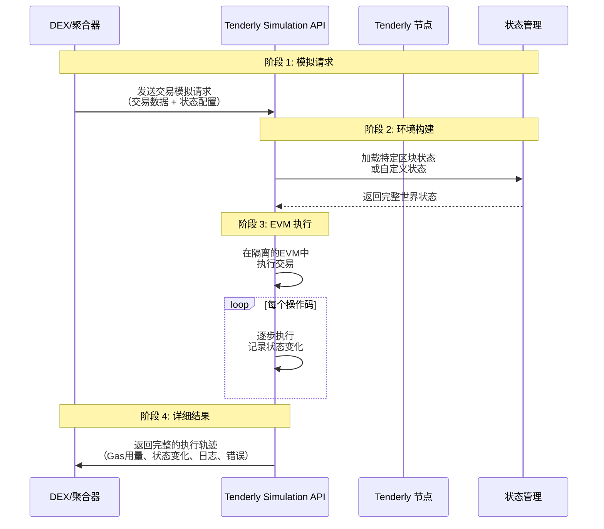

好的，我们来详细讲解 **Tenderly Simulation API**。这是一个非常强大且开发者友好的工具，它允许你在一个安全的、隔离的环境中模拟和执行区块链交易，而无需在真实的网络上花费 Gas 费用或承担任何风险。

---

## 1. Tenderly Simulation API 是什么？

**核心定义**：Tenderly Simulation API 是一个**高度精确的、预测性的以太坊虚拟机模拟服务**。它可以让你在交易实际上链之前，清晰地预见到交易执行的结果、状态变化和潜在错误。

**简单类比**：把它想象成区块链的 **“飞行模拟器”**。
- 飞行员不会直接开真飞机去测试危险动作。
- 同样，开发者不应该用真金白银（主网 Gas 费和有风险的交易）去测试智能合约交互。
- Tenderly 就是这个模拟器，让你可以无限次“坠毁”而没有任何损失。

---

## 2. 核心价值：为什么需要它？

### 对于 DEX/聚合器尤其重要：

| 场景 | 没有 Tenderly | 使用 Tenderly |
|------|---------------|---------------|
| **验证交易路径** | 发送真实交易，可能因滑点、流动性不足而失败，损失 Gas 费 | 预先模拟，确保路径有效，避免失败 |
| **优化交易参数** | 通过多次真实交易试错，成本极高 | 无限次模拟，找到最优 Gas、滑点容忍度 |
| **MEV 策略测试** | 在真实环境中测试，可能被反套利或损失资金 | 安全地模拟复杂交易包和套利策略 |
| **用户交易预览** | 用户对交易结果不确定，体验差 | 为用户提供准确的交易结果预览 |

---

## 3. 工作原理与技术架构



### 关键技术特性：

1. **状态控制**：可以模拟任何历史区块的状态，或自定义状态
2. **完全确定性**：与真实 EVM 行为完全一致
3. **深度可见性**：获得比普通 RPC 调用详细得多的执行信息

---

## 4. 核心功能详解

### 4.1 基础交易模拟

最基本的功能："如果我现在执行这笔交易，会发生什么？"

**API 调用示例**：
```python
import requests
import json

class TenderlySimulator:
    def __init__(self, account_slug, project_slug, api_key):
        self.base_url = f"https://api.tenderly.co/api/v1/account/{account_slug}/project/{project_slug}"
        self.headers = {
            "X-Access-Key": api_key,
            "Content-Type": "application/json"
        }
    
    def simulate_transaction(self, transaction_params):
        """模拟单笔交易"""
        
        payload = {
            "network_id": "1",  # 以太坊主网
            "from": transaction_params["from"],
            "to": transaction_params["to"],
            "input": transaction_params["data"],
            "gas": transaction_params.get("gas", 8000000),
            "gas_price": "0",
            "value": transaction_params.get("value", "0"),
            "save": True,  # 在Tenderly仪表板中保存模拟
            "save_if_fails": True  # 即使失败也保存
        }
        
        response = requests.post(
            f"{self.base_url}/simulate",
            headers=self.headers,
            data=json.dumps(payload)
        )
        
        return response.json()

# 使用示例
simulator = TenderlySimulator("my-account", "my-project", "your-api-key")

tx_params = {
    "from": "0x742d35Cc6634C0532925a3b8Dc9F1a37cC19bCc5",
    "to": "0x7a250d5630B4cF539739dF2C5dAcb4c659F2488D",  # Uniswap Router
    "data": "0x...",  # 编码后的swap调用
    "value": "1000000000000000000",  # 1 ETH
    "gas": 300000
}

result = simulator.simulate_transaction(tx_params)
print(f"模拟成功: {result['transaction']['status']}")
print(f"预计输出: {result['transaction']['transaction_info']['call_trace']['output']}")
```

### 4.2 状态覆盖

这是 Tenderly 最强大的功能之一：**模拟任意"假设"场景**。

```python
def simulate_with_state_overrides(self, transaction_params, state_overrides):
    """使用自定义状态模拟交易"""
    
    payload = {
        "network_id": "1",
        "from": transaction_params["from"],
        "to": transaction_params["to"], 
        "input": transaction_params["data"],
        "gas": 8000000,
        "state_objects": state_overrides  # 自定义状态
    }
    
    response = requests.post(
        f"{self.base_url}/simulate",
        headers=self.headers,
        data=json.dumps(payload)
    )
    
    return response.json()

# 使用场景示例：测试极端市场条件
state_overrides = {
    "0xYourPoolAddress": {
        "storage": {
            # 覆盖池子储备金，模拟流动性枯竭
            "0xreserve0_slot": "0x0000000000000000000000000000000000000000000000000000000000000001",
            "0xreserve1_slot": "0x0000000000000000000000000000000000000000000000000000000000000001"
        }
    },
    "0xTokenAddress": {
        "storage": {
            # 覆盖用户余额，测试大额交易
            "0xbalance_slot": "0x00000000000000000000000000000000000000000000d3c21bcecceda1000000"  # 1,000,000 代币
        }
    }
}

result = simulator.simulate_with_state_overrides(tx_params, state_overrides)
```

### 4.3 交易包模拟

模拟复杂的多交易场景，特别是对于 MEV 和套利策略。

```python
def simulate_bundle(self, transactions, block_number="latest"):
    """模拟交易包（Bundle）"""
    
    payload = {
        "network_id": "1",
        "block_number": block_number,
        "transactions": [] 
    }
    
    for i, tx in enumerate(transactions):
        payload["transactions"].append({
            "from": tx["from"],
            "to": tx["to"],
            "gas": tx.get("gas", 8000000),
            "gas_price": str(tx.get("gas_price", 0)),
            "value": str(tx.get("value", 0)),
            "input": tx["data"],
            "simulation_type": "quick"  # 或 "full"
        })
    
    response = requests.post(
        f"{self.base_url}/simulate-bundle",
        headers=self.headers,
        data=json.dumps(payload)
    )
    
    return response.json()

# MEV 套利包模拟示例
arbitrage_bundle = [
    {
        "from": "0xArbitrageBot",
        "to": "0xUniswapPoolA", 
        "data": "0x...",  # 在Uniswap用ETH买DAI
        "value": "1000000000000000000"  # 1 ETH
    },
    {
        "from": "0xArbitrageBot", 
        "to": "0xSushiswapPoolB",
        "data": "0x...",  # 在Sushiswap用DAI卖回ETH
        "value": "0"
    }
]

bundle_result = simulator.simulate_bundle(arbitrage_bundle)
profit = self.calculate_arbitrage_profit(bundle_result)
print(f"预计套利利润: {profit} ETH")
```

---

## 5. 在 DEX/聚合器中的实际应用场景

### 场景 1：交易路由验证
```python
class RouteValidator:
    def __init__(self, tenderly_simulator):
        self.simulator = tenderly_simulator
    
    async def validate_route(self, route, user_address, amount_in):
        """验证交易路径的有效性"""
        
        for path in route['paths']:
            # 为每个路径创建交易calldata
            transaction_data = self.encode_swap_data(path, amount_in)
            
            tx_params = {
                "from": user_address,
                "to": route['router_address'],
                "data": transaction_data,
                "value": amount_in if path['uses_eth'] else 0
            }
            
            # 模拟执行
            simulation = self.simulator.simulate_transaction(tx_params)
            
            if not simulation['transaction']['status']:
                print(f"路径失败: {simulation['transaction']['error_message']}")
                return False
                
            expected_output = self.decode_output(simulation)
            if expected_output < route['min_amount_out']:
                print(f"输出不足: {expected_output} < {route['min_amount_out']}")
                return False
        
        return True
```

### 场景 2：智能滑点计算
```python
class SlippageOptimizer:
    def __init__(self, tenderly_simulator):
        self.simulator = tenderly_simulator
    
    async def calculate_optimal_slippage(self, swap_params, market_volatility):
        """基于市场波动性计算最优滑点容忍度"""
        
        base_slippage = 0.005  # 0.5% 基础滑点
        
        # 测试不同滑点下的成功率
        slippage_test_points = [0.001, 0.005, 0.01, 0.02, 0.05]
        success_rates = []
        
        for slippage in slippage_test_points:
            test_params = swap_params.copy()
            test_params['slippage'] = slippage
            
            # 批量模拟（比如10次）在不同区块状态下的表现
            simulations = await self.batch_simulate_under_different_conditions(test_params)
            success_rate = self.calculate_success_rate(simulations)
            success_rates.append(success_rate)
            
            print(f"滑点 {slippage*100}% -> 成功率 {success_rate*100}%")
        
        # 找到成功率 > 95% 的最小滑点
        optimal_slippage = self.find_optimal_slippage(slippage_test_points, success_rates)
        return optimal_slippage
```

### 场景 3：Gas 优化
```python
class GasOptimizer:
    def __init__(self, tenderly_simulator):
        self.simulator = tenderly_simulator
    
    async def optimize_gas_limit(self, transaction_template):
        """精确计算交易所需的Gas Limit"""
        
        # 模拟交易获取实际Gas用量
        simulation = self.simulator.simulate_transaction(transaction_template)
        
        if simulation['transaction']['status']:
            actual_gas_used = simulation['transaction']['gas_used']
            
            # 添加安全边界（20%）
            recommended_gas = int(actual_gas_used * 1.2)
            
            return {
                'success': True,
                'actual_gas_used': actual_gas_used,
                'recommended_gas_limit': recommended_gas,
                'savings_vs_standard': 300000 - recommended_gas  # 对比标准30万gas
            }
        else:
            return {
                'success': False,
                'error': simulation['transaction']['error_message']
            }
```

---

## 6. 高级功能：Fork（分叉）模拟

这是 Tenderly 的王牌功能：**复制整个主网状态并在上面自由实验**。

```python
def create_fork_and_simulate(self, transactions, block_number="latest"):
    """创建主网分叉并在上面模拟交易"""
    
    # 1. 创建分叉
    fork_payload = {
        "network_id": "1",
        "block_number": block_number,
        "name": f"Arbitrage-Simulation-{int(time.time())}"
    }
    
    fork_response = requests.post(
        f"{self.base_url}/fork",
        headers=self.headers,
        data=json.dumps(fork_payload)
    )
    
    fork_id = fork_response.json()['simulation_fork']['id']
    fork_rpc_url = f"https://rpc.tenderly.co/fork/{fork_id}"
    
    # 2. 在分叉上执行交易
    results = []
    for tx in transactions:
        # 使用分叉的RPC端点发送交易
        fork_result = self.execute_on_fork(fork_rpc_url, tx)
        results.append(fork_result)
    
    # 3. 清理分叉
    requests.delete(
        f"{self.base_url}/fork/{fork_id}",
        headers=self.headers
    )
    
    return results
```

---

## 7. 与竞争对手的对比

| 特性 | Tenderly | 传统 eth_call | 本地测试网 |
|------|----------|---------------|------------|
| **状态准确性** | 🔸 **真实主网状态** | 🔸 当前状态 | 🔹 模拟状态 |
| **执行速度** | 🔸 快速 | 🔸 快速 | 🔹 较慢 |
| **调试信息** | 🔸 **完整调用轨迹** | 🔹 仅输出 | 🔸 部分信息 |
| **状态控制** | 🔸 **完全控制** | 🔹 只读 | 🔸 完全控制 |
| **成本** | 🔹 按用量付费 | 🔸 免费 | 🔸 免费 |

## 总结

**Tenderly Simulation API 本质上是一个"区块链时间机器"和"安全沙箱"：**

- ✅ **风险消除**：在真实资金面临风险前发现交易问题
- ✅ **成本节约**：避免失败的 Gas 费用
- ✅ **策略验证**：安全地测试复杂的 DeFi 策略
- ✅ **用户体验**：为用户提供准确交易预览
- ✅ **开发效率**：加速智能合约开发和调试

对于任何严肃的 DEX、聚合器或 DeFi 协议来说，Tenderly Simulation API 都已经从"锦上添花"变成了**核心基础设施**，它让开发者能够在真实的链上环境中自信地测试和优化他们的代码。