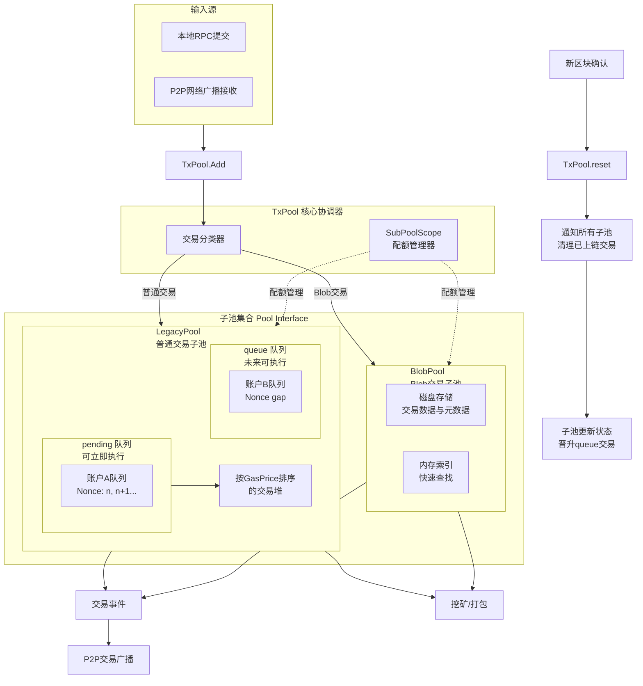

---

# Geth TxPool 整体技术架构详解

## 1. 概述与目标

**TxPool** 是 Geth 节点管理未打包交易（pending / queued transactions）的内存子系统，是 P2P 层、同步器与挖矿器之间的中介。TxPool 的任务包含：接收与验证外部交易、按策略保留与排序、对外广播、为打包/矿工提供候选集、并在链头更新时清理和晋升交易。

在 **v1.13.15** 中，TxPool 为支持 EIP-4844（Blob 交易）以及提高可扩展性与资源控制，将池划分为多个子池（`Pool` 接口实现），常见的子池有 `LegacyPool`（传统交易）与 `BlobPool`（存储 Blob 交易、部分数据落磁盘）。这种多子池架构使得不同交易类型可以用不同的验证、存储与驱逐策略。

**核心职责**

* **验证**：检查交易格式、签名、nonce、余额、内在 Gas 等。
* **分类**：识别交易类型（legacy, EIP-1559, blob 等）并路由到对应子池。
* **排序**：在 pending 集合里按价格/优先级排序供打包。
* **配额与驱逐**：控制内存/磁盘资源，按价格/策略驱逐低优先交易。
* **广播**：向 p2p 层转发新交易。
* **与链同步交互**：监听链头变化（reset），清理上链交易，晋升 queue→pending。

---

## 2. 高层架构与组件

### 2.1 架构总览

TxPool 是一个**协调器（Coordinator）**，管理一组实现 `Pool` 接口的子池，并维护一个统一的 `SubPoolScope` / 配额器来控制全局资源。数据流与事件驱动如下：

### 2.2 主要模块

* **TxPool（核心协调器）**：管理子池集合、事件发布/订阅、接收链头事件与外部请求。

  * 关键文件：`core/txpool/txpool.go`（入口/调度/配置）。
* **Pool 接口（子池契约）**：子池需实现的基本能力（Add、Reset、Pending、Subscribe、Close 等）。

  * 定义文件：`core/txpool/pool.go` 或 `core/txpool/subpool.go`（取决代码树）。
* **LegacyPool（传统交易子池）**：

  * 管理 `pending`（nonce 连续、可立即执行）和 `queue`（nonce 有 gap、未来可执行）两套结构。
  * 内部使用 per-account queues、price heap（按 gas/fee 排序）等数据结构。
  * 关键文件：`core/txpool/legacypool/*`（例如 `legacypool.go`, `list.go`, `journal.go`）。
* **BlobPool（Blob 交易子池）**：

  * Blob 类型交易的数据量大（payloads/blobs），核心策略是**元数据保内存，payload 可落磁盘**，并用独立的定价与驱逐策略。
  * 关键文件：`core/txpool/blobpool/*`（例如 `blobpool.go`, `datastore.go`）。
* **SubPoolScope / Quota 管理**：

  * 为每个子池 & 全局设置内存（/磁盘）上限，动态驱逐最差交易。Scope 在 TxPool 层调度。
* **事件总线 / 广播**：

  * 子池成功添加交易后产生 `NewTxsEvent`（或类似事件），TxPool 将事件广播到 P2P 层（eth protocol）并通知 miner。

---

## 3. 关键数据结构（抽象与实现）

### 3.1 全局视角

* `TxPool` 包含：

  * `subpools map[string]Pool` — 各子池实例（按类型 key）。
  * `reservations map[common.Address]SubPool` — 地址绑定到子池；

### 3.2 LegacyPool 内部

* **Account queue**（per-account ordered list）：

  * 每个帐户维护按 nonce 升序的交易列表。
  * 连续 nonce（从 account.CurrentNonce 开始）属于 `pending`，存在 nonce gap 的后续交易归入 `queue`。
* **Price heap / fee-based ordering**：

  * `pending` 集合在跨账户层面，按价格（或 EIP-1559 的 tip / feeCap）排序，供 miner/packer 获取最高收益交易。
* **Journal（本地交易日志）**：

  * 本地提交的交易通常写入 journal（持久化）以支持重启恢复本地交易（文件或 DB）。
  * 关键文件（示例）：`core/txpool/legacypool/journal.go`。

### 3.3 BlobPool 内部

* **磁盘存储（datastore）**：

  * Blob payload 数据和一定元数据落到磁盘（LevelDB/其他），内存中仅保存索引、元信息（sender, nonce, fee info, blob refs）。
* **内存索引**：

  * 快速查找交易哈希到磁盘记录的映射；也维护 per-account ordering 与价格排序。
* **独立限额 / 驱逐策略**：

  * 例如基于 Blob 大小、总 Blob 数、时间生命期（若有）等进行驱逐或续费要求。

---

## 4. 交易生命周期与关键流程

### 4.1 交易注入（Add）

流程要点：

1. **入口**：RPC/IPC 本地提交或 P2P 收到。
2. **快速预检**（lightweight）：

   * 合法 RLP / 编码大小范围 / 基本字段完整性。
3. **分类**（Classifier）：识别交易类型（Legacy/EIP1559/Blob），决定 target subpool。
4. **子池验证**：

   * 签名恢复发送者（`tx.Sender(signer)`）；
   * Nonce vs account's pending/chain nonce 关系；
   * Balance check：是否可支付 value + maxFee；
   * Intrinsic gas & blob-specific checks（例如 Blob 数量 / commitments 等）。
5. **入池**：成功后写入子池的结构（内存和/或磁盘），更新全局索引，触发广播事件（仅对非本地重复/惰性策略另论）。
6. **返回结果**：错误集合或成功确认。

### 4.2 区块确认与 Reset（Reset / Head change）

当链头推进或发生 reorg：

1. `TxPool.Reset(oldHead, newHead)` 触发。
2. **各子池执行`Reset`**：

   * 移除已上链的交易（比对 canonical mapping 或用 receipts），更新 per-account pending/queue 状态；
   * 把 queue 中因 nonce 现在可执行的 tx 晋升到 pending；
   * 可能对本地交易做重播/重新广播（若仍有效）。
3. TxPool 更新全局索引并通过事件通知变更。

### 4.3 交易替换（Replace）

* 当新交易与已有交易 `(from, nonce)` 冲突时：

  * 若新交易的 gas-price（或 feeCap/tip 组合）**至少高于**池中现有交易 `PriceBump%`（可配置），则允许替换（替代老 tx 并移除老 tx）。
  * 替换只在同一子池/同一账户上下文内发生。
* 替换能处理：用户加价撤回、重发、nonce reuse 等场景。

### 4.4 驱逐与资源控制（Eviction）

* 当某子池或全局资源超限（tx count、内存占用、磁盘占用）：

  * 驱逐策略通常基于 **最低优先级（lowest fee）** 或最老/最少收益的交易。
  * BlobPool 可能按 Blob 大小和 Blob 类型有独特策略。
  * 被驱逐交易从内存/磁盘删除，并从全局索引中剔除。

### 4.5 广播（P2P）

* 子池将事件发布到 TxPool（`NewTxsEvent`），TxPool 通过 P2P 的 eth protocol 的 `NewPooledTransactionHashes` / `Transactions` 等消息向 peers 广播交易哈希或完整交易（策略可控：是否发送 hash only 或 full tx）。
* 本地交易优先广播并写入 journal 以便恢复。

---

## 5. 交易验证细节（更细粒度）

**通用检查**

* RLP / size / gas limit 合法性。
* 签名校验（恢复 sender）。
* Nonce（>= chain nonce）；但上链/池内细节依赖 pending queue。
* Balance check（value + gas * maxFee <= balance）按 EIP-1559 需要考虑 feeCap 与 baseFee 等。
* Intrinsic gas（transaction intrinsic gas）必须小于 block gas limit。

**Blob 特有检查**

* Blob count, size limits（EIP-4844 规定的上限）。
* Blob commitments / proof 校验（若有）。
* 对 blob ephemeral storage 调度与磁盘写入限制。

---

## 6. Miner / Packager 接口（如何取交易）

* Miner/worker 使用 `Pending()`、`PendingTxs()`、或 `Content()` 等 API 从 TxPool 获取 candidate transactions。
* `Pending()` 返回按 account->nonce 排序的 pending map（便于构建 nonces 连续的 per-account sequences）。
* Tx selection policy（ miner 端）：

  * 按 global fee ordering（或 miner 自定义策略）取 top-N；
  * 注意跨子池取交易顺序（如何混合 Legacy 与 Blob 交易通常有策略优先级或 slot 分配）。

---

## 7. 事件与订阅机制

* TxPool 提供 `SubscribeNewTxsEvent` / `SubscribeNewTxs`（基于 event feed）用于：

  * P2P 层监听并广播；
  * miner 监听并更新其本地 tx candidate cache。
* 事件通常携带 transaction hash 列表或完整 tx depending on config。

---

## 8. 配置项与运维考量

常见配置：

* `--txpool.localaccount`、`--txpool.journal`（本地交易日志路径）
* `--txpool.pricelimit`、`--txpool.lifetimelimit`（视实现）
* 子池内存/磁盘上限（BlobPool 特有）
* 最大 peer 广播速率、txn 重发 / re-broadcast 策略
  运维关注点：
* 监控 txpool size、pending count、queue count、memory footprint、journal IO。
* 对 BlobPool，监控磁盘使用、IO 延迟、碎片/GC。
* 在高 baseFee 或网络拥堵时，注意驱逐率与用户投诉（tx 被 drop）。

---

## 9. 常用调试入口

* Coordinator / API：`core/txpool/txpool.go`
* Pool 接口定义：`core/txpool/pool.go` 或 `subpool.go`
* Legacy 实现：`core/txpool/legacypool/*.go`（look for `legacypool.go`, `list.go`, `journal.go`）
* Blob 实现：`core/txpool/blobpool/*.go`（`blobpool.go`, `datastore.go`）
* Miner 接口调用：`miner/worker.go`（如何调用 TxPool）
* P2P 广播 hook：`eth/handler.go` 与 `core/txpool` 事件 feed 订阅点

---

## 10. 性能 & 安全注意事项

* **DOS 防护**：对来自 P2P 的大量低价交易/垃圾交易需要速率限制、blacklist、per-account queue caps。
* **内存与磁盘带宽**：BlobPool 的磁盘写入/读取是关键瓶颈，要控制 parallel IO 与 GC。
* **一致性**：Reset 时需保证 pending/queue 与链状态一致，避免重复打包或漏包。
* **重启恢复**：通过 journal 恢复本地交易；确保 journal 的原子写入与崩溃恢复逻辑健壮。

---

## 11. 专题补充

### 专题一：多子池架构与交易路由机制

* 文件/入口：`core/txpool/txpool.go`, `core/txpool/pool.go`（或 `subpool.go`）
* 深入点：

  * TxPool 初始化与子池注册（factory/DI）；
  * `Add` 的分类逻辑（如何根据 tx.Type / AccessList / Blob 判断）；
  * 全局 `txLookup` 的维护策略；
  * SubPoolScope quota 的算法与配置项解析。

### 专题二：LegacyPool 实现与普通交易管理

* 文件：`core/txpool/legacypool/*.go`（`legacypool.go`, `list.go`, `journal.go`）
* 深入点：

  * 数据结构（per-account queue、priceHeap）的具体实现与复杂度；
  * `validateTx`、`addLocal`、`promoteQueue` 等关键方法流程；
  * journal 的持久化格式（如何写入/恢复本地交易）；
  * 替换（replace）与驱逐（evict）策略代码。

### 专题三：BlobPool 实现与磁盘存储管理

* 文件：`core/txpool/blobpool/*.go`（`blobpool.go`, `datastore.go` 等）
* 深入点：

  * 磁盘 schema：LevelDB key schema / record 格式（payload + meta）；
  * 内存索引到磁盘记录的映射结构；
  * Blob 特有验证（blob count/size/commitment 的校验点）；
  * 磁盘 IO 策略（写放大、GC、驱逐）和并发控制。

### 专题四：事件驱动、Reset机制与状态同步

* 文件：`core/txpool/txpool.go`（Reset）、以及各子池 `Reset` 实现
* 深入点：

  * 头变化（newHead）通知流程：订阅、处理队列、防抖（debounce）；
  * `Reset` 执行顺序、并发保证与 race 条件处理；
  * queue -> pending 晋升的完整条件与流程（代码级）。

### 专题五：P2P 集成、交易广播与挖矿接口

* 文件：`core/txpool/txpool.go`, `eth/handler.go`, `miner/worker.go`
* 深入点：

  * NewTxsEvent 事件数据结构、发布/订阅路径；
  * `eth` 协议如何接收 tx（`Tx`/`NewPooledTransactionHashes`）、何时广播 full tx vs only hash；
  * Miner 如何从多个子池合并交易（接口与优先级），block assembly 的交互点。

---
