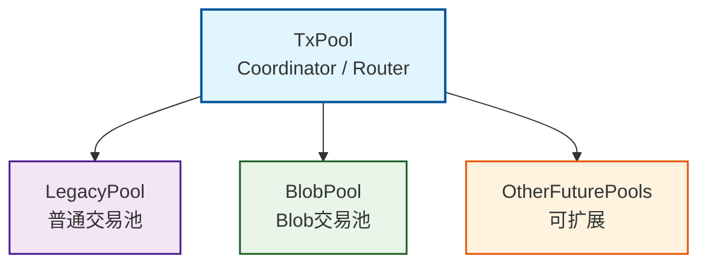
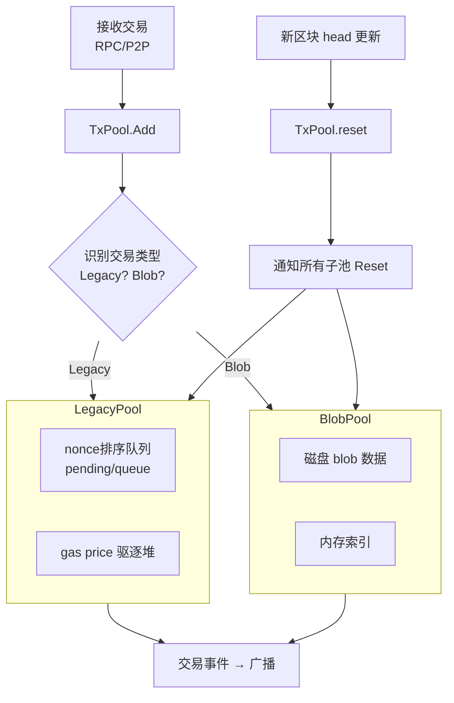

---

# **专题一：Geth TxPool 多子池架构与交易路由机制（v1.13.x / EIP-4844 后）**

## **1. 背景：为什么需要多子池架构？**

在 EIP-4844（Blob 交易）出现之前，Geth 只维护一个单一的交易池（Legacy TxPool），内部包含：

* pending（可立即执行）队列
* queue（nonce 不连续）队列
* price-ordered heap（优先级驱逐选择）

Blob 交易带来了根本性变化：

* **交易体积远大于普通交易（尤其是 blob 数据部分）**
* **gas 模型独立于普通 gas（blob gas / blob fee market）**
* **验证与驱逐规则不同**
* **必须有磁盘管理能力（blob 不能全部放内存）**

因此 Geth 自 v1.13 开始重构 TxPool：

### **核心目标**

| 目标                  | 说明                   |
| ------------------- | -------------------- |
| **解耦普通交易与 Blob 交易** | 两类交易生命周期不同，不能放在一个池里  |
| **模块化扩展能力**         | 未来还可能出现更多新交易类型       |
| **统一入口 & 多子池协作**    | 外层保持统一 API，内部独立处理    |
| **增强资源控制**          | 限制每类交易的资源占用比例，避免互相挤占 |

于是形成：**TxPool as Coordinator + Multiple SubPools** 的架构。

---

## **2. 整体架构概览**



TxPool 自身不存储交易，而是：

### **职责**

1. **识别交易类型，路由到对应子池**
2. **接收链头事件，统一通知所有子池 Reset**
3. **协调广播、错误处理、限制器等**
4. **提供统一 API（Add、Pending、Stats …）**

子池负责：

* 交易验证
* 排序/驱逐
* nonce 队列
* 本地交易恢复（LegacyPool）
* Blob 数据的磁盘/内存管理（BlobPool）

---

## **3. 多子池注册机制**

TxPool 通过“注册”方式管理多个子池。

伪代码：
```go
// eth.New时会创建交易池对象
// eth/backend.go: L235-L245
	if config.BlobPool.Datadir != "" {
		config.BlobPool.Datadir = stack.ResolvePath(config.BlobPool.Datadir)
	}
	blobPool := blobpool.New(config.BlobPool, eth.blockchain)

	if config.TxPool.Journal != "" {
		config.TxPool.Journal = stack.ResolvePath(config.TxPool.Journal)
	}
	legacyPool := legacypool.New(config.TxPool, eth.blockchain)

    // 这里创建交易池，并注册legacy和blob两个子池
	eth.txPool, err = txpool.New(config.TxPool.PriceLimit, eth.blockchain, []txpool.SubPool{legacyPool, blobPool})
```

```go
// core/txpool/txpool.go
type TxPool struct {
    subpools []SubPool // 子池列表
}
```

内置注册：

| 交易类型           | 子池             | 职责                                  |
| -------------- | -------------- | ----------------------------------- |
| Legacy（普通交易）   | **LegacyPool** | nonce 排序、pending/queue、gas price 驱逐 |
| Blob（EIP-4844） | **BlobPool**   | 磁盘存储、blob gas fee 驱逐                |

未来如果再出现新类型交易（例如更大类型的 calldata），可以按此机制扩展。

---

## **4. 交易分类与路由机制**

TxPool 的入口是：

```go
// 批量添加多个交易
func (tp *TxPool) Add(txs []*types.Transaction, local bool, sync bool)
```

### **4.1 路由决策（核心逻辑）**

TxPool 不做深入验证，只做：

1. 解析交易类型（tx.Type）
2. 选择对应子池
3. 调用子池的 `Add(...)`

伪代码：

```go
func (tp *TxPool) Add(txs []Transaction) {
	// 每个子池存储一个可接收的交易列表
	txsets := make([][]*types.Transaction, len(p.subpools))
	splits := make([]int, len(txs))

	for i, tx := range txs {
		for j, subpool := range p.subpools {
            // 调用子池的Filter方法，判断是否接收此交易类型
			if subpool.Filter(tx) {
				// 接收就添加到txsets的子列表中
				break
			}
		}
	}    
}
```

### **4.2 分类依据：TxType**

| TxType | 描述                         |
| ------ | -------------------------- |
| 0x00   | Legacy                     |
| 0x01   | AccessList (属于 LegacyPool)                     |
| 0x02   | EIP-1559 (属于 LegacyPool)  |
| 0x03   | Blob Transaction（EIP-4844） |

**注意：EIP-1559 不算新类型，仍属于 LegacyPool。
只有携带 Blob 的交易才进入 BlobPool。**

具体代码实现就是每个子池都会在各自的Filter方法中根据TxType判断是否可以处理该类型的交易：
```go
// core/txpool/legacypool/legacypool.go
func (pool *LegacyPool) Filter(tx *types.Transaction) bool {
	switch tx.Type() {
	case types.LegacyTxType, types.AccessListTxType, types.DynamicFeeTxType:
		return true
	default:
		return false
	}
}
```

```go
// core/txpool/blobpool/blobpool.go
func (p *BlobPool) Filter(tx *types.Transaction) bool {
	return tx.Type() == types.BlobTxType
}
```

---

## **5. 子池之间的独立性与共享行为**

### **独立**

每个子池完全独立处理自己的交易：

* 验证规则不同
* 驱逐策略不同
* nonce 管理不同（Blob 没有 Legacy 的 pending/queue 模型）
* 资源管理不同

### **共享行为**

由 TxPool 统一调度：

| 行为            | 谁负责                         |
| ------------- | --------------------------- |
| 新区块到达 → Reset | TxPool 调用所有子池（pool.Reset()） |
| 新交易事件通知 P2P   | TxPool（集中广播）                |
| 统计信息          | TxPool 聚合子池数据               |
| 统一 Add() 入口   | TxPool                      |

这种设计让 TxPool 更像：

> **一个总控 + 多个插件化交易子系统**

---

## **6. 多子池架构的数据流**



---

## **7. 全局限额：TxPool 如何控制多个子池的资源占用？**

多子池架构出现后，需要避免：

* BlobPool 占满磁盘导致 LegacyPool 无法工作
* LegacyPool 占满内存导致 BlobPool 无法执行验证

解决方案：

### **TxPool 有统一的资源限制体系**

包括：

| 限制项       | 适用对象     | 描述                   |
| --------- | -------- | -------------------- |
| 全局最大交易数量  | TxPool   | 所有子池合计               |
| 每个子池最大交易数 | 子池       | 例如 LegacyPool 有自己的限制 |
| 磁盘限制      | BlobPool | 控制 blob 元数据与文件大小     |
| 内存使用限制    | 所有子池     | 部分使用 LRU 驱逐策略        |

每个子池内部还会有自己的优先级驱逐逻辑（gas price / blob fee）。

---

## **8. 交易生命周期中 TxPool 的角色**

### **1）进入阶段**

Tx（RPC/P2P） → TxPool（统一入口） → 子池 Add → 验证 → 排序 → 根据规则接受/拒绝。

### **2）驻留阶段**

交易驻留于对应子池：

* LegacyPool：pending/queue 内存结构
* BlobPool：磁盘+内存索引混合结构

### **3）打包阶段**

矿工从 TxPool 获取交易：

```go
Pending()  // 返回所有 READY 的交易
```

不同子池会按优先级融合输出。

### **4）链头更新 / Reset 阶段**

新区块产生：

TxPool → 通知子池：

```
Reset(oldHead, newHead)
```

子池执行：

* 删除已上链交易
* 修正 nonce
* queue → pending 晋升
* 驱逐无效交易

---

