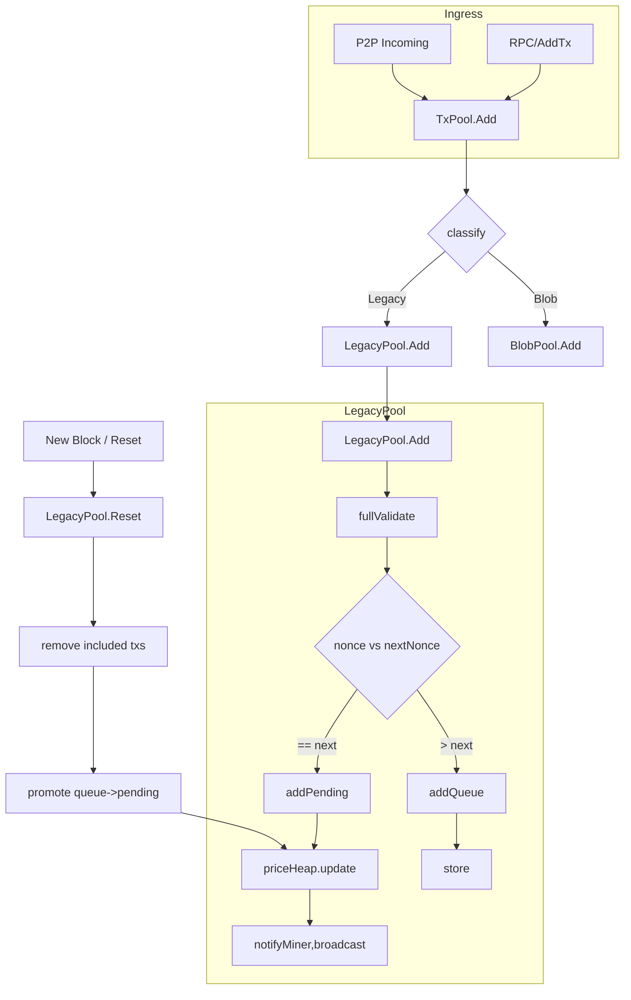

---

# 专题二：LegacyPool 实现与普通交易管理

## 一、简介与目标

**LegacyPool** 是 TxPool 针对“传统交易”（包括 legacy 交易与 EIP-1559 类型） 的子池实现。它实现了一套成熟的 nonce 管理、排序、替换与驱逐逻辑，目标是在链头变化、并发注入、高并发广播环境下，保持：

* 正确的 per-account nonce 顺序（保证 pending 连续）
* 合理的按费率排序供 miner 获取（收益最大化）
* 可控内存占用（驱逐与限额）
* 本地交易持久化恢复（journal/local tx）

核心职责：

1. 接收并验证交易（完整性、签名、nonce、balance、intrinsic gas 等）
2. 维护 per-account ordered queues：`pending`（连贯可执行）与 `queue`（未来等待的）
3. 在全局层面维护一个 fee-ordered heap/structure，用于驱逐和 miner 选择
4. 支持交易替换 (fee bump) 与驱逐策略
5. 持久化本地交易（journal）并在 restart 恢复

---

## 二、主要数据结构

下面列出 LegacyPool 的主要逻辑数据结构，并说明作用与典型实现要点。

### 1. Per-account Queue (AccountTxList)

* **结构**：每个发送者地址维护一个 `AccountTxList`（nonce 有序链表或双端队列）。
* **分区**：

  * `pending`：从当前 account.PendingNonce（或 chain nonce + 已被包含的 pending count）开始的、nonce 连续的交易序列（可直接打包）。
  * `queue`：当 nonce 在中间断裂时，剩下的按 nonce 增长顺序保存在 queue 中（等待前面的交易被包含后晋升）。
* **属性**：

  * 快速按 nonce 查找（map[nonce]→tx）
  * 最小/最大 nonce 追踪
* **复杂度**：

  * 插入/查找均为 O(log n) 或 O(1) 视实现（通常用 map + linked list）

### 2. Global Price Heap / Fee Priority (priceHeap)

* **目标**：跨账户选出 fee 最高的 transactions，供 miner pack 或驱逐。
* **实现**：

  * 堆（max-heap）或有序桶结构，元素为 `best` per-account pending tx（或整个 pending set depending on policy）。
  * 可能需要支持 decrease-key / remove arbitrary tx（用于替换或已上链的移除）。
* **复杂度**：

  * push/pop O(log m)（m = number of accounts/entries in heap）

### 3. txIndex / lookup

* **功能**：给定 txHash 快速判断该 tx 是否在 pool，属于哪个账户、哪个队列（pending/queue）、以及引用位置。
* **实现**：map[txHash] -> pointer{account, nonce, location}
* **注意**：实现可能分布在 pool 或 coordinator；但功能上必须存在。

### 4. Journal（本地交易持久化）

* **目的**：将用户本地提交的交易持久化（磁盘），便于节点重启后恢复并继续广播/打包。
* **实现**：append-only 文件或 LevelDB，写入 tx RLP + metadata（local flag、time）。
* **恢复**：启动时读取 journal，重新 Add 到 pool（注意 re-validation）。

### 5. Locks / Concurrency primitives

* **global mutex**：保护全局数据结构（heap, lookup map, account map）
* **per-account lock**（可选）：减少热点冲突（对高频账户并发写入）
* **condition / signals**：用于通知 miner / broadcaster 有新 pending txs

---

## 三、核心算法与流程（伪代码与解释）

### 1. 添加交易（Add / validate / insert）

相关代码逻辑（做过精简）：
```go

func (pool *LegacyPool) Add(txs []*types.Transaction, local, sync bool) []error {
	// 检查本地交易（如果开关禁止，则不允许本地交易）
	local = local && !pool.config.NoLocals

	// Filter out known ones without obtaining the pool lock or recovering signatures
	var (
		errs = make([]error, len(txs))
		news = make([]*types.Transaction, 0, len(txs))
	)
  // 遍历交易处理
	for i, tx := range txs {
    // 如果完全相同的交易已存在，直接报错
		if pool.all.Get(tx.Hash()) != nil {
			errs[i] = txpool.ErrAlreadyKnown
			knownTxMeter.Mark(1)
			continue
		}
    // 校验交易有效性，如前面、gas不足等（会调用通用txpool的校验方法）
		if err := pool.validateTxBasics(tx, local); err != nil {
			errs[i] = err
			invalidTxMeter.Mark(1)
			continue
		}
		// 收集合法的待处理交易
		news = append(news, tx)
	}
	if len(news) == 0 {
		return errs
	}

	// 执行交易添加逻辑并收集错误信息
	pool.mu.Lock()
  // 这个逻辑里会循环调用内部add方法逐个添加交易（具体见下面的add方法）
	newErrs, dirtyAddrs := pool.addTxsLocked(news, local)
	pool.mu.Unlock()

	var nilSlot = 0
	for _, err := range newErrs {
		for errs[nilSlot] != nil {
			nilSlot++
		}
		errs[nilSlot] = err
		nilSlot++
	}
  // 如果有地址下面的交易需要提升，则进一步处理(具体逻辑在下一小节)
	done := pool.requestPromoteExecutables(dirtyAddrs)
	if sync {
		<-done
	}
	return errs
}


// 交易池内部添加交易逻辑
// 先通过基本校验，然后添加到queue中等待进一步处理。
// 如果为替换交易（无论是替换pending还是queued交易），如果价格满足要求则进行替换。
// 如果新增交易为local，发送方将会被加入到特权allowlist，避免该地址发送的交易因为价格问题被丢弃
func (pool *LegacyPool) add(tx *types.Transaction, local bool) (replaced bool, err error) {
	// 1. 丢弃重复交易
	hash := tx.Hash()
	if pool.all.Get(hash) != nil {
		return false, txpool.ErrAlreadyKnown
	}

  // 2. 检查local开关
	isLocal := local || pool.locals.containsTx(tx)

  // 3. 如果校验失败，则丢弃（余额、nonce、）
	if err := pool.validateTx(tx, isLocal); err != nil {
		return false, err
	}

	from, _ := types.Sender(pool.signer, tx)

  // 如果该地址不存在已知交易，请求当前subpool绑定该地址，直到不存在任何该地址下的交易
	var (
		_, hasPending = pool.pending[from]
		_, hasQueued  = pool.queue[from]
	)
	if !hasPending && !hasQueued {
    // 请求地址绑定到子池（通过操作通用TxPool.reservations）
		if err := pool.reserve(from, true); err != nil {
			return false, err
		}
		defer func() {
      // 解除绑定动作
			if err != nil {
				pool.reserve(from, false)
			}
		}()
	}

  // 4. 检查交易数量是否超限，超出需要丢弃部分
	if uint64(pool.all.Slots()+numSlots(tx)) > pool.config.GlobalSlots+pool.config.GlobalQueue {
    // 非本地交易情况下，如果新交易价格比已有的价格都低，则丢弃它
		if !isLocal && pool.priced.Underpriced(tx) {
			return false, txpool.ErrUnderpriced
		}

    // 检查上次重组后地球了多少交易，如果超限，说明太满了，则直接报错
		if pool.changesSinceReorg > int(pool.config.GlobalSlots/4) {
			return false, ErrTxPoolOverflow
		}

    // 为新交易释放空间（丢弃已有的价格排序更的交易）
    // Discard第一个参数为需要释放的空间大小，返回可以丢弃的交易列表(包括queued交易，甚至pending交易)
		drop, success := pool.priced.Discard(pool.all.Slots()-int(pool.config.GlobalSlots+pool.config.GlobalQueue)+numSlots(tx), isLocal)

    // 如果还是无法释放足够的空间给远程交易，则报错
		if !isLocal && !success {
			return false, ErrTxPoolOverflow
		}

    // 如果新交易是未来交易（有nonce gap），则把将要丢弃的pending交易（如有）再加回取
		if !isLocal && pool.isGapped(from, tx) {
			var replacesPending bool
			for _, dropTx := range drop {
				dropSender, _ := types.Sender(pool.signer, dropTx)
				if list := pool.pending[dropSender]; list != nil && list.Contains(dropTx.Nonce()) {
          // 检查是否有丢弃pending交易
					replacesPending = true
					break
				}
			}

      // 如果有替换pending交易，则把准备要替换的交易再加回去
			if replacesPending {
				for _, dropTx := range drop {
					pool.priced.Put(dropTx, false)
				}
				return false, txpool.ErrFutureReplacePending
			}
		}

    // 如果没有丢弃pending交易，则处理要丢弃的交易
		for _, tx := range drop {
			sender, _ := types.Sender(pool.signer, tx)
      // 从交易池中移除此交易，并更新相关状态
			dropped := pool.removeTx(tx.Hash(), false, sender != from)
      // 有交易被丢弃，计数增加
			pool.changesSinceReorg += dropped
		}
	}

  // 如果该地址下存在nonce相同的pending交易，则进行替换
	if list := pool.pending[from]; list != nil && list.Contains(tx.Nonce()) {
    // 替换交易（要求新费用满足PriceBump要求）
		inserted, old := list.Add(tx, pool.config.PriceBump)
		if !inserted {
			return false, txpool.ErrReplaceUnderpriced
		}
		// 满足条件，执行交易替换
		if old != nil {
			pool.all.Remove(old.Hash())
			pool.priced.Removed(1)
		}
    // 添加新交易
		pool.all.Add(tx, isLocal)
		pool.priced.Put(tx, isLocal)
		pool.journalTx(from, tx)
		pool.queueTxEvent(tx)

    // 更新发送地址的心跳时间（因为替换的为pending交易）
		pool.beats[from] = time.Now()
		return old != nil, nil
	}

  // 没有替换pending交易，直接推送到queue
	replaced, err = pool.enqueueTx(hash, tx, isLocal, true)
	if err != nil {
		return false, err
	}

  // 如果为本地交易，且是第一次，则记录发送方身份
	if local && !pool.locals.contains(from) {
		pool.locals.add(from)
    // 并将该地址之前的remote交易更新为本地交易
		pool.priced.Removed(pool.all.RemoteToLocals(pool.locals))
	}
  // 持久化本地交易
	pool.journalTx(from, tx)

	return replaced, nil
}
```


### 2. Promote：从 queue 晋升到 pending（通常在 Reset 或当前 pending 被包含后）

伪代码：

```go
// 1. 请求处理指定地址，检查是否有可以处理的交易
func (pool *LegacyPool) requestPromoteExecutables(set *accountSet) chan struct{} {
	select {
    // 异步请求，放入reqPromoteCh
	case pool.reqPromoteCh <- set:
		return <-pool.reorgDoneCh
	case <-pool.reorgShutdownCh:
		return pool.reorgShutdownCh
	}
}

// 2. 异步循环处理待提升交易
func (pool *LegacyPool) scheduleReorgLoop() {
  // ...
  for {
    // 检查当前循环是否需要处理reorg
		if curDone == nil && launchNextRun {
      // 异步启动交易reorg处理
			go pool.runReorg(nextDone, reset, dirtyAccounts, queuedEvents)

      // 重置下一轮吃力开关
			curDone, nextDone = nextDone, make(chan struct{})
			launchNextRun = false

			reset, dirtyAccounts = nil, nil
			queuedEvents = make(map[common.Address]*sortedMap)
		}
    select {
      // ...
		case req := <-pool.reqPromoteCh:
      // 这里处理Promote请求，更新dirtyAccounts
			if dirtyAccounts == nil {
				dirtyAccounts = req
			} else {
				dirtyAccounts.merge(req)
			}
      // 设置下一轮循环处理开关
			launchNextRun = true
      // 这个用来控制同步响应
			pool.reorgDoneCh <- nextDone      
      // ...
    }
    // ...
  }
  // ...
}

// 3. 检查重组交易
func (pool *LegacyPool) runReorg(done chan struct{}, reset *txpoolResetRequest, dirtyAccounts *accountSet, events map[common.Address]*sortedMap) {
	defer close(done)

	var promoteAddrs []common.Address
	if dirtyAccounts != nil && reset == nil {
    // 要处理的地址列表
		promoteAddrs = dirtyAccounts.flatten()
	}
	pool.mu.Lock()
	if reset != nil {
    // Reset是整个区块的处理逻辑，后面再补充 TODO
		pool.reset(reset.oldHead, reset.newHead)

		// Nonces were reset, discard any events that became stale
		for addr := range events {
			events[addr].Forward(pool.pendingNonces.get(addr))
			if events[addr].Len() == 0 {
				delete(events, addr)
			}
		}
		
    // Reset的情况，需要尝试处理queue中所有的地址
		promoteAddrs = make([]common.Address, 0, len(pool.queue))
		for addr := range pool.queue {
			promoteAddrs = append(promoteAddrs, addr)
		}
	}

  // 检查指定列表中可以提升的交易（同时也会删除nonce过时的交易，比如当前区块该地址最新nonce为100，则会从交易池删除所有小于此nonce的交易，并返回从100开始nonce连续的交易）
	promoted := pool.promoteExecutables(promoteAddrs)

  // 新块的情况，需要从交易池删除区块已经包含的交易
	if reset != nil {
    // 重新检查pending交易，不满足条件的放入queue
		pool.demoteUnexecutables()
    // 更新交易池中所有地址的最新nonce
		nonces := make(map[common.Address]uint64, len(pool.pending))
		for addr, list := range pool.pending {
			highestPending := list.LastElement()
			nonces[addr] = highestPending.Nonce() + 1
		}
		pool.pendingNonces.setAll(nonces)
	}

  // 检查pending和queue队列是否超限，如果超出则清除多余的交易
	pool.truncatePending()
	pool.truncateQueue()

	// 重置重组后交易变更计数
	pool.changesSinceReorg = 0 
	pool.mu.Unlock()

  // 将提升的交易发送NewTxsEvent事件
	for _, tx := range promoted {
		addr, _ := types.Sender(pool.signer, tx)
		if _, ok := events[addr]; !ok {
			events[addr] = newSortedMap()
		}
		events[addr].Put(tx)
	}
	if len(events) > 0 {
		var txs []*types.Transaction
		for _, set := range events {
			txs = append(txs, set.Flatten()...)
		}
		pool.txFeed.Send(core.NewTxsEvent{Txs: txs})
	}
}
```

说明：

* Promotion 发生在旧 nonce 被消耗（上链）或池内先前的 pending 被移除时；
* 需要循环晋升，直到遇到 nonce gap。

### 3. Replace policy（fee bump）

规则核心：允许用更高费用的交易替换池内同 `(from, nonce)` 的交易（通常只在 pending 或 queue 的位置上）：

常见策略：

* 新交易 fee >= old.fee * (1 + PriceBumpPercent) 或 newFee >= oldFee + fixedBump
* 若满足则替换，并更新 heap/lookup/journal

伪代码：

```go
if existing := acct.find(tx.Nonce()); existing != nil {
    if newFee < existingFee * (1 + bump) { return ErrReplacementTooLow }
    acct.replace(existing, tx)
    lp.lookup.update(tx.Hash(), ...)
    // if existing was local, migrate journal accordingly
}
```

注意点：

* 必须防止替换用于 DoS（攻击者不停提高微小增量替换）；PriceBump 限制提供保护；
* 替换需要同时处理 heap 更新与可能的广播（broadcast new tx, drop old).

这个逻辑其实在上面的交易添加部分已经有涉及。

### 4. Eviction（驱逐）

当全局或子池超限，驱逐规则通常按以下优先级：

1. 按 fee 从低到高删除（最低收益先删）
2. 对于同一账户，可能优先保留本地交易
3. 对于 queue/pending，优先驱逐 queue 中最低价的（因为不立即可执行）
4. BlobPool 有单独规则（与 LegacyPool 分开）

伪代码 high-level：

```go
func (lp *LegacyPool) ensureLimits() {
    for lp.totalTxs > lp.maxTxs {
        victim := lp.selectLowestFeeTx()
        lp.remove(victim)
        lp.metrics.incEvicted()
    }
}
```

实现细节：

* `selectLowestFeeTx` 可以直接从 min-heap 或合并各账户的最低优先级项获取。
* 删除需要从 lookup/heap/account structures/journal 一并移除。


### 5. Reset（链头变更、已打包 tx 清理）

核心流程（TxPool 调用各子池的 Reset）：

```go
func (lp *LegacyPool) Reset(oldHead, newHead) {
    lp.lock()
    defer lp.unlock()

    // 1. For each account, remove txs that are now included (<= newHeadNonce for that account)
    for each acct in accountMap {
        removed := acct.removeIncludedTxs(newHead)
        if removed > 0 { lp.lookup.removeMany(removed) }
    }
    // 2. Recalculate acct.nextNonce based on chain state + pending count
    // 3. Promote queue -> pending where possible
    // 4. Compact / reheapify priceHeap
}
```

注意：

* 包含检测通常需要对照 canonical chain 的 receipts 或 block mapping（更稳妥）。
* Reset 必须处理 reorg 的情形（区块被回滚），这意味着此前被认为已上链的 tx 可能需要被恢复回池（但通常节点会依赖 journal 或重广播）。

Reset内部就是需要调用前面的runReorg逻辑，处理交易的提升和旧交易的清理。

---

## 四、并发、锁与性能注意

### 并发策略

* **全局锁（coarse-grained）**：最简单可靠，但在高并发下成为瓶颈。
* **混合锁（建议）**：使用 global mutex for structure changes + per-account mutex for account queue ops（减少冲突）。
* **读写分离**：某些只读操作（Pending() 查询）可以尽量用读锁或复制快照避免阻塞写入。

实现要点：

* 在 Add/Remove/Promote/Reset 等写操作中尽量缩短锁持有时间（先做外部校验再获取锁）。
* 对 heap 操作需要同步；若使用 concurrent heap，要小心 decrease-key 的实现。

### 性能优化

* 使用 map+linked-list 实现 per-account queues（O(1) insert/remove）
* priceHeap 只存每个 account 的 head（而不是所有 tx），以减少 heap 大小；当 account head 被消耗时再 push next head
* 批量操作（Reset 时）尽量合并 heap 重建而不是多次单个操作


---

## 五、常见调优项

* `txpool.globalslots` / `txpool.localslots`：全局/本地 tx 容量（示例）
* `priceBump`：替换交易要求的最低增幅（百分比）
* `journal.size`：journal 最大大小或滚动策略
* `perAccountQueueLimit`：每账户最大 pending+queue 条数
* `evictionThresholds`：内存/tx count 超限触发阈值

监控建议：

* 监控 metrics：pendingCount、queueCount、evictedCount、replacedCount、journalSize、avgValidationLatency
* 告警：evictedRate 高、pendingCount 激增、journal IO latency 升高

---

## 六、示意流程图



---

## 七、源码定位建议

* `core/txpool/legacypool/`

  * `legacypool.go`（主逻辑：Add / Reset / Pending / remove）
  * `list.go`（per-account queues / list 数据结构）
  * `journal.go`（本地交易持久化）
* `core/txpool/txpool.go`（Coordinator 调用与事件 glue）
* `miner/worker.go`（如何从 Pending 获取交易）
* `eth/handler.go`（P2P 广播/接收路径）


---
