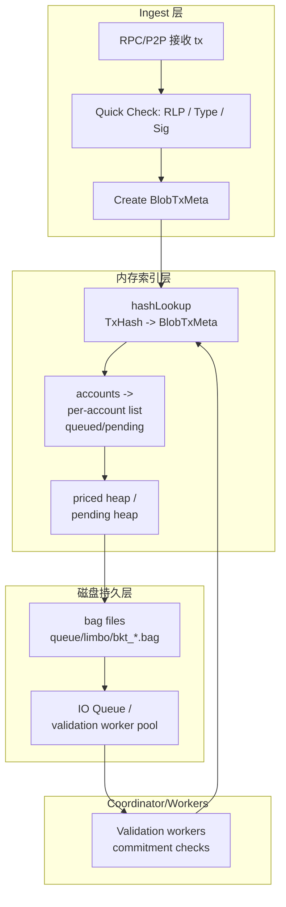

---

# 专题三：BlobPool 实现与存储管理

## 一、背景与设计目标

### 1.1 为什么需要单独的 BlobPool？

EIP-4844 引入的 Blob 交易带来三个决定性约束：

* **体积大**：每笔交易可含多份 blob（每份 blob 固定较大），其 payload 远大于普通 calldata，致使内存不可承受长期保存全部 blob。
* **不同计费**：blob 使用独立的费用模型（blob gas / blob fee），需要在池内与普通交易并行但分离地管理费用优先级。
* **验证昂贵**：例如 KZG commitment 的校验极其耗 CPU/IO，必须把此类工作异步化并受并发限流保护。

因此 BlobPool 的设计目标：

* 内存仅保存轻量元数据（节省 RAM）；
* 把大量 blob payload 持久化到磁盘（append-only 容器）；
* 提供可控的磁盘、IO、内存配额与驱逐策略；
* 在重启/崩溃后能可靠恢复（扫描容器重建索引）；
* 提供矿工所需的元数据 + payload fetch 路径（按需拉取 payload）。

### 1.2 设计目标汇总

* 高效写入：顺序写（append-only）以降低写放大；
* 低内存占用：只保留 `BlobTxMeta` 等轻量结构；
* 崩溃一致：payload 写入与元数据暴露的顺序保证一致性；
* 简化 GC：粗粒度（bag 级）回收以减少复杂性与 IO；
* 安全：对 KZG 等重验证异步限流，避免 DoS。

---

## 二、BlobPool 的整体架构（组件分解）



**组件说明**

* **Ingest 层**：负责接收交易并做最小化的快速检查（类型、签名、blob 数量/大小限制）。
* **Index 层（内存）**：保存 `BlobTxMeta`，按 account 分类，支持 `TxHash -> meta` 的快速查找，并维护按 fee 的优先队列（供矿工/驱逐逻辑使用）。
* **Storage 层（磁盘）**：真实 payload 与元数据被写入 `queue/` 或 `limbo/` 下的 `bkt_xxxxx.bag` 文件；磁盘上的每个 entry 同时包含元数据和 payload（便于单次扫描恢复）。
* **Coordinator / Worker**：负责把重 CPU 的验证（KZG commitment 等）放在受限 worker pool 中执行，验证通过后把交易状态从 `staged` → `pending/queued`。

---

## 三、设计要点

1. **Bag 文件（bkt_xxxxx.bag）为核心容器**：每个 `.bag` 同时包含条目的元数据和对应 payload，append-only。
2. **目录分区：`queue/` 与 `limbo/`**：

   * `queue/`：nonce 尚不可执行（等待前序 nonce），元数据与 payload 存放于此；
   * `limbo/`：曾是 pending 的 tx 或处于不确定状态的 tx，保存以便 reorg 恢复或最终 GC。
3. **内存只保留元数据**：`BlobTxMeta`（含 BagID/offset/length），payload 不常驻内存，仅可用 LRU 缓存。
4. **写入顺序与 crash-consistency**：先 append payload 到当前 bag 并 flush，再把内存索引指向该 bag entry（或在同一批次中完成），保证重启可通过扫描 bag 恢复。
5. **GC 采取 bag 级别回收**：若整个 bag 条目全部过期或被删除，删除整个 bag 文件；若部分有效，采取重写（compact）旧 bag 到新 bag；避免在热路径做大量随机删除。
6. **验证异步化**：KZG 等开销大的工作在 worker pool 中完成，并对并发度进行限制，防止入池路径阻塞。
7. **广播策略保守**：优先广播 tx metadata/commitments（不发完整 payload），其他节点按需 fetch。

---

## 四、物理组织

### 4.1 实际目录（你本地看到的一致结构）

```
<datadir>/geth/blobpool/
    limbo/
        bkt_00004096.bag
        bkt_00135168.bag
        ...
    queue/
        bkt_00004096.bag
        bkt_00135168.bag
        ...
```

* `queue/` 和 `limbo/` 分别保存不同状态下的 bag 文件；
* 每个 bag 文件名中 `bkt_xxxxx` 是 bucket id，按容量或时间段分片。

### 4.2 bag 文件内部（逻辑结构）

```
[BagHeader]
[Entry1Header][Entry1MetaRLP][Entry1BlobBytes...]
[Entry2Header][Entry2MetaRLP][Entry2BlobBytes...]
...
[BagFooter(optional)]
```

**EntryMeta（示例字段）**

```text
TxHash, From, Nonce, BlobCount, CommitmentList, FeeInfo, Timestamp, Flags
```

**EntryPayload**

* 多个 blob bytes 紧接在 metadata 之后，顺序固定（便于一次读取）。
* Bag 内也通常会记录每个 entry 在文件内的 byte offset，以便随机读取。

---

## 五、LevelDB / 索引说明

> **重要修正**：v1.13.15 的 BlobPool 不使用 LevelDB 做主索引。元数据与 payload 被放在 bag 文件中，索引在内存中重建与维护；必要的持久化（local journal）另行保存为 append-only 日志。

* **内存索引**：`hashLookup`（TxHash → *BlobTxMeta）、`accounts`（Address → per-account list）由运行时维护；重启时通过扫描所有 bag 文件重建。
* **journal**（local tx）仍以 append-only 形式持久化，记录 local Blob tx 的 txHash、来源与 bag 存储状态（如果 payload 还未写，会记录重试信息）。
* 若你的具体部署存在额外的 LevelDB（例如为其它目的保留），那是定制化实现，但标准 v1.13.15 使用 bag 文件为主。

---

## 六、内存索引与缓存策略（BlobTxMeta）

**内存结构示例**

```go
// core/txpool/blobpool/config.go
type Config struct {
  // 存放可执行blob文件的数据目录
	Datadir   string 
  // 本地数据库存储容量上限
	Datacap   uint64 
  // 替换交易手续费增长比例
	PriceBump uint64 
}
```

```go
// core/txpool/blobpool/blobpool.go
// blob交易元数据结构
type blobTxMeta struct {
  // 交易哈希
	hash common.Hash
  // 存储ID（持久层存储）
	id   uint64
  // 字节大小（持久层存储）
	size uint32

  // nonce
	nonce      uint64
  // 交易的总成本上限（执行费用+blob费用），用于验证账户余额是否足够
	costCap    *uint256.Int
  // 执行小费上限（maxPriorityFeePerGas），用于跨账户的交易优先级排序和验证替换价格提升
	execTipCap *uint256.Int
  // 执行费用上限（maxFeePerGas），用于验证替换价格提升
	execFeeCap *uint256.Int 
  // blob费用上限（maxFeePerBlobGas），用于验证替换价格提升
	blobFeeCap *uint256.Int
  // 执行所需的gas量，在读取blob之前检查交易包含的有效性
	execGas    uint64 
  // blob gas消耗量，在读取blob之前检查交易包含的有效性
	blobGas    uint64 

  // 到达交易执行费用上限所需的1559费用调整绝对数量
	basefeeJumps float64 
  // 到达交易blob费用上限所需的4844费用调整绝对数量
	blobfeeJumps float64 

  // 所有先前nonce中的最差gas小费（最小值）
	evictionExecTip      *uint256.Int
  // 所有先前nonce中的最差基础费用（转换为费用跳跃次数的最小值）
	evictionExecFeeJumps float64 
  // 所有先前nonce中的最差blob费用（转换为费用跳跃次数的最小值）
	evictionBlobFeeJumps float64 
}

// 下面是源代码中的注释原文：
// BlobPool 是专用于 EIP-4844 blob 交易的交易池。
//
// Blob 交易是特殊的存在，专为特定目的（Rollups）设计，并预期遵守该特定用例。
// 这些行为预期使我们能够设计一个比通用交易池更健壮（即重发问题）
// 和更能抵抗 DoS 攻击（例如替换冲刷攻击）的交易池。然而，这些改进也意味着
// 我们将对进入和离开池实施显著更激进的策略：
//
//   - Blob 交易体积大。初始设计目标是 128KB 的 blob，
//     我们必须确保这些数据在网络上传输的次数绝对最少。
//     广播到 sqrt(peers) 是不可行的，相反，这些交易应该只被公告，
//     远程方如果需要则应主动请求它。
//
//   - 区块的 blob 空间是有限的。由于区块被限制为只能包含少量 blob 交易，
//     我们可以利用池内极低的预期变动率。值得注意的是，
//     我们应该能够为池使用持久化磁盘后端，解决了困扰通用交易池的 tx 重发问题，
//     只要没有人为的变动（即池战争）。
//
//   - Blob 的目的是用于第二层。第二层应该使用 blob 交易来提交它们自己当前的状态，
//     这些状态独立于以太坊主网（状态，交易）。这意味着 blob 交易没有理由被取消或替换，
//     除了潜在的基础费用/矿工小费调整。
//
//   - 替换成本高昂。鉴于其大小，应积极阻止传播替换现有交易的 blob 交易。
//     虽然通用交易可以从 1 Wei 的 Gas 成本开始，并且需要 10% 的费用增加来替换，
//     但我们建议要求更高的最低成本（例如 1 gwei）和更激进的增加（100%）。
//
//   - 取消是禁止的。驱逐一个已传播的 blob 交易是一个巨大的 DoS 攻击载体。
//     因此，a) 替换（更高费用）的 blob 交易不能使已传播的（未来）blob 交易失效（累计费用）；
//     b) 禁止 Nonce 不连续的 blob 交易；c) blob 交易的存在排除了非 blob 交易。
//
//   - 恶意取消是可能的。尽管池可能会阻止取消 blob 的交易，但区块可能包含此类交易
//     （恶意矿工或 flashbotter）。池应限制每个账户的 blob 交易总数，以防止在通过
//     普通交易取消之前传播过多数据。但它也应该足够高以支持恢复因重组而失效的交易。
//     也许 4-16 个。
//
//   - 本地交易没有意义。矿池历史上使用本地交易进行支付或后门交易。
//     随着 1559 的实施，基础费用通常主导最终价格，因此 0 或非 0 小费变化不大。
//     Blob 交易保留了 1559 的 2D Gas 定价（并在此基础上引入了动态 blob Gas 费），
//     所以本地性没有意义。有了避免重发问题的磁盘支持 blob 池，
//     也不需要保存自己的交易以备后用。
//
//   - 不含 blob 的 blob 交易是不好的。理论上没有强有力的理由禁止包含 0 个 blob 的 blob 交易。
//     但实际上，在池中允许此类交易会破坏低变动率的不变性，因为 blob 约束不再适用。
//     即使我们可以接受包含此类交易的区块，重组将需要将它们移回 blob 池，这可能会破坏不变量。
//
//   - 丢弃 blob 需要延迟。当普通交易被包含时，它们会立即从池中驱逐，因为它们已包含在区块中。
//     然而，Blob 并不包含在执行链中，因此小型重组无法重新池化"丢失的" blob 交易。
//     为了支持重组，blob 会被保留在磁盘上，直到它们最终确定。
//
//   - Blob 可以通过 flashbots 到达。区块可能包含我们从未在网络上见过的 blob 交易。
//     由于我们也无法从区块中恢复它们，engine_newPayload 需要将它们交给我们，
//     我们将它们缓存直到最终确定，以支持重组而不丢失交易。
//
// 虽然上面的一些约束可能听起来过于激进，但总体思路是 blob 池应该为其预期用例稳健地工作，
// 并且虽然任何人都可以自由地将 blob 交易用于任意的非 Rollup 用例，
// 但不应该允许他们在网络上肆意妄为。
//
// 在实现方面，有一些有趣的设计选择：
//
//   - 将交易添加到池中会阻塞，直到持久化到磁盘。这是可行的，因为 TPS 很低
//     （初始每个区块 2-4 个 blob，峰值可能 8-16），所以自然变动是每个区块几 MB。
//     禁止进行 O(n) 更新的替换，并且交易传播是基于拉的（即没有待处理数据的堆积）。
//
//   - 当选择交易进行包含时，主要标准是签名者小费（当然，还要有足够高的基础费用/数据费用）。
//     然而，相同小费的交易将按它们的基础费用/数据费用拆分，优先选择那些更接近当前网络限制的交易。
//     这样做的想法是，即使费用上涨，限制非常宽松的交易仍然可以被包含，
//     而限制更接近的交易可能已经无效。
//
// 当池最终达到饱和时，一些可能永远无法执行的旧交易需要被驱逐，以支持更新的交易。
// 驱逐策略相当复杂：
//
//   - 超过容量会驱逐账户中在池化 nonce 序列中任何地方支付最低的 blob 交易的最高 nonce，
//     因为该交易将在最远的未来执行，因此阻塞了它之后的任何交易。
//     故意不驱逐最小的交易以避免出现 nonce 间隔。
//
//   - 类似地，如果池已满，则新交易考虑驱逐旧交易的价格是该账户整个 nonce 序列中的最低价格。
//     这避免了恶意用户通过在低支付的被阻塞交易后面隐藏看似高支付的交易来对池进行 DoS 攻击。
//
//   - 由于 blob 交易有 3 个价格参数：执行小费、执行费用上限和数据费用上限，
//     没有单一的参数可以创建总价格排序。更重要的是，由于基础费用和 blob 费用可以独立移动，
//     也没有预定义的方法将它们组合成一个稳定的顺序。这导致在每个区块之后都需要解决一个多维问题。
//
//   - 第一个观察是，比较 1559 基础费用或 4844 blob 费用需要在它们的动态背景下进行。
//     由于这些费用在区块之间以约 1.125 的乘数（最大）上下跳跃，
//     比较两个交易中的费用应基于 log1.125(fee) 以消除噪声。
//
//   - 第二个观察是，基础费用和 blob 费用独立移动，因此无法自行拆分混合交易
//     （A 的基础费用更高，B 的 blob 费用更高）。与其看绝对费用，
//     有用的度量是超过交易费用上限所需的最大时间。
//     具体来说，我们感兴趣的是从当前费用跳到交易费用上限所需的跳跃次数：
//
//     跳跃次数 = log1.125(txfee) - log1.125(basefee)
//
//   - 第三个观察是，基础费用往往徘徊在一定范围内，而不是剧烈波动。
//     从当前费用开始所需的跳跃次数越高，其相关性就越低。
//     为了也消除这里的噪声，池将使用 log(jumps) 作为比较交易的增量。
//
//     增量 = sign(jumps) * log(abs(jumps))
//
//   - 要建立总顺序，我们需要将两个基础费用（对数跳跃）的维度降低到单个值。
//     从池的角度来看，有趣的方面是交易变得可执行（费用下降，跨越较小的负跳跃计数器）
//     或不可执行（费用上升，跨越较小的正跳跃计数器）的速度有多快。
//     因此，池只关心两个增量值中的最小值作为驱逐优先级。
//
//     优先级 = min(deltaBasefee, deltaBlobfee)
//
//   - 上述非常激进的降维和噪声减少应该会导致交易被分组到少量桶中，
//     费用越远，桶越大。这很好，因为它允许我们有意义地使用矿工小费作为分割器。
//
//   - 对于池中不再包含不可执行 blob 交易的情况，将较晚的驱逐优先级授予具有高费用上限的交易是没有意义的，
//     因为这可能引发池战争。因此，任何正优先级将被分组在一起。
//
//     优先级 = min(deltaBasefee, deltaBlobfee, 0)
//
// 优化权衡：
//
//   - 驱逐依赖于每个账户的 3 个费用最小值（执行小费、执行上限和 blob 上限）。
//     在账户的所有交易中维护这些值是有问题的，因为每次交易替换或包含都需要重新扫描所有其他交易来重新计算最小值。
//     相反，池在 nonce 范围内维护一个滚动最小值。
//     更新所有最小值只需要从交换进出 nonce 开始，直到第一个无变化点为止。

// blob交易池对象结构
type BlobPool struct {
  // 交易池配置
	config  Config
  // 跨子池的地址保留逻辑
	reserve txpool.AddressReserver

  // 持久层存储对象
	store  billy.Database 
  // 磁盘上已经存储的数据大小
	stored uint64
  // 持久层non-finalized blobs
	limbo  *limbo 

  // 链上可接受的最小 gas tip
	gasTip *uint256.Int

  // 交易哈希和数据库entry映射
	lookup map[common.Hash]uint64 
  // 发送方地址分类的blob交易列表，按nonce排序
	index  map[common.Address][]*blobTxMeta
  // 按地址统计交易花费
	spent  map[common.Address]*uint256.Int
  // 存储出价非常低的帐号，当资源不够时优先驱逐
	evict  *evictHeap 
}
```

**内存数据结构**

* `hashLookup map[common.Hash]*BlobTxMeta`
* `accounts map[common.Address]*list`  — per-account ordered by nonce（list 内存只放 *BlobTxMeta 引用*）
* `pendingHeap` — 按 fee 排序（只包含可打包的头部交易）
* LRU payload cache — 限定大小，命中时免做磁盘读

**设计要点**

* 元数据尽量紧凑，避免在内存中保存冗余字段；
* per-account list 便于晋升（queue → pending）时 O(1) 查找与移动；
* heap/priority 只包含能被矿工关注的最优条目，减少排序开销。

---

## 七、Blob 验证流程（两阶段：快速 + 完整）

### 7.1 轻量预检（主路径，同步）

在 Add 路径中先做快速拒绝以节省资源：

* 校验 tx type（Blob）与 RLP decode；
* 签名恢复 -> 得到 sender；
* 检查 blobCount/每 blob 的大小是否在协议 Hard-limit 内；
* 基本字段存在性（fee fields 等）；
* 如果超出本地配额（短期磁盘/并发限制），可以返回 ErrPoolFull/Reject。

快速检验成功后，把 tx 的元信息与 payload append 到当前 bag（见 8.1 写入流程），并把 meta 放入内存索引作为临时状态（`staged` 或 `stored`），再将 txHash 放入 validationQueue。

### 7.2 完整验证（异步，受限并发）

异步 worker pool 执行：

* Commitment 校验（KZG）：校验 payload 与交易中承诺一致。这一步 CPU/crypto 重且耗时，必须限流；
* Balance / Nonce 校验：基于当前 `currentState` 或 pendingNonces 计算是否有效；
* Fee/Blob-gas 计算：确保 tx 能支付对应费用；
* 校验通过：更新 meta.State → `pending` 或 `queued`（取决于 nonce 连续性）并把它推入 pendingHeap 或 accounts.queue；
* 校验失败：将 meta 标记为 `invalid`，将 payload 标记为可 GC（或直接纳入回收队列）。

**注意：** 若在完整验证期间发生 reorg，worker 需要重新计算 state（基于最新 head）再决定最终状态。

---

## 八、读写流程

下面给出关键路径的详尽伪代码（贴近 v1.13.15 实现风格），便于审计或直接比对源码。

### 8.1 添加 Blob 交易（Add）

```go
func (bp *BlobPool) AddBlobTx(tx *types.Transaction, local bool) error {
    // 1. 快速校验
    if !isBlobTx(tx) { return ErrNotBlob }
    if err := quickCheck(tx); err != nil { return err }

    // 2. 恢复发送者身份
    from, err := tx.Sender(bp.signer)
    if err != nil { return err }

    // 3. 检查交易有效性
    if bp.hashLookup.Has(tx.Hash()) { return ErrKnown }

    // 4. 创建blob交易元数据
    meta := &BlobTxMeta{ TxHash: tx.Hash(), From: from, Nonce: tx.Nonce(), ... , State: Staged }

    // 5. 持久化blob交易
    bag, err := bp.selectCurrentBag(queueOrLimboPath)
    if err != nil { return err }
    offset, length, err := bag.AppendEntry(meta, tx.Payloads())
    if err != nil {
        return err
    }
    meta.BagID = bag.ID
    meta.Offset = offset
    meta.Length = length

    // 6. 更新交易缓存信息
    bp.mu.Lock()
    bp.hashLookup[meta.TxHash] = meta
    bp.accounts[from].Insert(meta)
    bp.mu.Unlock()

    // 7. 异步校验队列
    bp.validationQueue.Push(meta.TxHash)

    // 8. 广播通知（blob体不广播）
    bp.txFeed.Send(NewBlobMetaEvent{Meta: meta})

    // 9. enforce limits
    bp.ensureLimits()

    return nil
}
```

要点：

* `AppendEntry` 负责顺序写并返回文件内偏移（需要在单一 IO 队列下序列化以分配 offset）。
* 在完成第5步后即可把 meta 放入内存索引（因为 disk 上已有 payload）；若第5步失败需保证没有残留 meta。

### 8.2 验证 Worker（异步）

```go
func validationWorker() {
    for txHash := range bp.validationQueue {
        meta := bp.hashLookup[txHash]
        ok := checkCommitments(meta, bp.readPayload(meta))
        if !ok {
            // mark invalid and schedule GC
            meta.State = Invalid
            bp.scheduleGC(meta)
            continue
        }
        // state-dependent checks (balance/nonce)
        if !bp.fullStateCheck(meta) {
            meta.State = Invalid
            bp.scheduleGC(meta)
            continue
        }
        // pass -> promote to pending or queue
        bp.mu.Lock()
        if meta.Nonce == bp.pendingNonces.Get(meta.From) {
            meta.State = Pending
            bp.pendingHeap.Push(meta)
        } else {
            meta.State = Queued
            bp.accounts[meta.From].InsertQueue(meta)
        }
        bp.mu.Unlock()
    }
}
```

---

## 九、驱逐（Eviction）、GC 与容量限制

### 9.1 配额类型

* `max_blobpool_disk_bytes` —— BlobPool 磁盘上限
* `max_blobpool_tx_count` —— 池中最大 blob tx 数
* `per_account_limits` —— 单账户限制（pending+queue）

### 9.2 驱逐策略

优先级（低 → 高驱逐可能性）：

1. **过期最久**（timestamp 最老）
2. **低 fee**（blob fee / tip 低）
3. **limbo 区的条目**（limbo 是回收优先区）
4. **按 bag 整体**：若一个 bag 全部条目可回收，则直接删除 bag 文件（高效）

驱逐后：

* 在内存中把 meta 移出（删除 hashLookup & accounts 列表）
* 在 bag 中把该 entry 标记为 tombstone（写入轻量标记）
* 后台 GC 会在合适时机删除整 bag 或 compact

### 9.3 GC 模式

* **粗粒度（推荐）**：按 bag 整体删除，或把有效条目复制到新 bag 后删除旧 bag；
* **标记-清除**：逻辑删除标记先于物理删除；
* **避免热路径删除**：真正的文件删除或重写在后台线程完成。

---

## 十、journal / 本地交易持久化（Local Tx）

* Local BlobTx 的元数据写入 journal（append-only 文件），但 **不** 把完整 payload 写入 journal（payload 已在 bag）。
* journal 记录包含：

  * txHash
  * BagID / Offset / Length（若 payload 已写）
  * 本地标志 / timestamp
  * 重试计数器
* 重启恢复时，journal 用来定位 local tx 并确保它们被重新注册到内存索引；若 payload 尚未完成写入，则恢复流程会尝试重写或把条目标记为 invalid。

---

## 十一、与 P2P / Broadcast 的协作

### 广播策略

* **主广播**：tx metadata + commitments（不广播 payload）
* **按需 fetch**：peer 看到 metadata 并想要打包时发起 fetch 请求；本地节点根据 BagID/Offset 读取并流式发送 payload
* **安全**：对 fetch 请求要限速与验证来源，避免被利用做 IO 放大攻击

### Fetch API（接口思路）

* `FetchBlob(txHash)`：返回一个可流式读取的 io.Reader（支持分片）
* `HasBlob(txHash)`：快速判断本地是否有 payload（hashLookup 存在且 state != Invalid）

---

