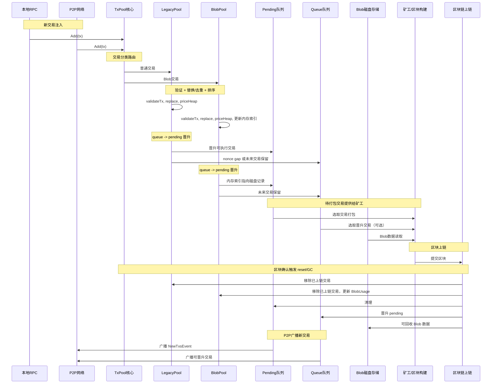

下面为你撰写 **专题七：驱逐、GC、容量限制**，针对 **Geth TxPool（v1.13.15 多子池架构）**，深入分析驱逐策略、垃圾回收机制和容量管理。

---

# **专题七：驱逐（Eviction）、GC、容量限制**

## **1. 概述**

TxPool 作为以太坊节点的交易缓冲区，需要在**有限的内存和磁盘资源**下管理海量交易。即便交易合法且未上链，也可能因为资源限制而被**驱逐（evict）**或**垃圾回收（GC）**。

设计目标：

1. **保证池容量可控**，避免节点 OOM 或系统崩溃。
2. **优先保留高价值交易**，确保矿工/打包者能够获取最高收益交易。
3. **兼容多子池架构**，不同子池独立管理自身容量，同时支持全局协调。
4. **与替换机制协作**，同一账户的交易通过替换进行内部调节，而跨账户的竞争通过驱逐实现。

---

## **2. 主要容量管理参数**

Geth TxPool 的容量限制可分为 **全局限制**和 **子池限制**。

| 参数                    | 描述               | 默认值 / 特征                         |
| --------------------- | ---------------- | -------------------------------- |
| `txpool.globalslots`  | 全局交易数量上限         | 4096                             |
| `txpool.globalqueue`  | 全局 queue 数量上限    | 1024                             |
| `txpool.accountslots` | 单账户 pending 交易上限 | 16                               |
| `txpool.accountqueue` | 单账户 queue 交易上限   | 64                               |
| BlobPool 特有           | Blob Gas Budget  | 全局 blobGasUsed 上限，防止 BlobTx 消耗过大 |

**说明**：

* **pending**: 可立即执行交易队列
* **queue**: 因 nonce gap 或资源限制暂存的交易
* **全局限制**: 控制整个池的交易数量或 blob gas 使用
* **子池限制**: 控制单账户或单子池的占用

---

## **3. 驱逐（Eviction）策略**

### **3.1 Eviction 触发条件**

交易池会触发驱逐的情况：

1. **子池或全局容量满**，新交易无法加入：

   * 如果池已满，必须移除低优先级交易释放空间。
2. **队列（queue）溢出**：

   * 单账户 queue 超过 `accountqueue`
   * 全局 queue 超过 `globalqueue`
3. **BlobPool 超出 blobGasBudget**：

   * 磁盘资源受限，必须释放 BlobTx

---

### **3.2 Eviction 策略核心原则**

1. **按价格（priority）驱逐**：

   * tipCap / feeCap / blobFeeCap 低的交易优先驱逐
2. **按账户策略**：

   * 同一账户内部按 nonce 排序，保留最早（可执行）交易，删除高 nonce 的 queue
3. **跨账户全局调度**：

   * 全局 pending 堆，低价格交易被弹出
4. **BlobPool 特有**：

   * blobGasUsed 高且 feeCap 低的交易优先驱逐
   * 磁盘 IO 和索引更新同时处理

---

### **3.3 代码实现**

核心文件：

```
core/txpool/legacypool/legacypool.go
core/txpool/blobpool/blobpool.go
core/txpool/pool.go
```

关键函数：

| 功能          | 函数                            |
| ----------- | ----------------------------- |
| 池容量检查       | `subPoolScope.reachedLimit()` |
| 全局驱逐        | `pool.evict()`                |
| queue 驱逐    | `promoteQueue()` 时处理溢出        |
| BlobPool 驱逐 | `blobPool.evict()`，磁盘 + 内存索引  |

---

## **4. 垃圾回收（GC）机制**

### **4.1 触发条件**

* **区块上链后**：

  * 上链交易从 pending/queue 删除 → 可回收内存
* **池容量满**：

  * 驱逐低价值交易，同时释放内存和索引
* **BlobPool**：

  * 已被替换或过期的 BlobTx，删除磁盘数据，回收 blobGas

### **4.2 GC 流程**

1. **标记已上链或无效交易**
2. **从账户队列和全局堆中移除**
3. **更新全局和子池索引（txLookup）**
4. **BlobPool 同步删除磁盘记录**
5. **事件通知 P2P**（可广播删除 / 清理信号）

---

## **5. 队列晋升与驱逐结合**

* 当新的区块上链后，pending 交易被打包 → queue 交易可能晋升
* 晋升时需要考虑：

  * 新晋升交易能否支付 gas
  * 全局容量是否允许
  * 低价 queue 交易可能被驱逐
* 这个机制保证：

  * 高价值交易进入 pending
  * 低价值或 nonce gap 交易留在 queue 或被删除

---

## **6. BlobPool 的 GC 和容量限制**

* BlobPool 特有限制：

  * **blobGasBudget**: 磁盘 blobGasUsed 的全局上限
  * 驱逐策略：

    1. 按 blobFeeCap 从低到高排序
    2. 删除超限交易
* 磁盘 IO 与索引同步：

  * 删除记录 → 更新 in-memory 索引
  * 保证查询 `Pending` / `Queue` 的一致性

---

## **7. 防止 DoS 与异常交易**

* 交易池驱逐与 GC 的设计同时兼顾安全性：

  * 避免单账户或攻击者填满整个池
  * 避免 BlobTx 用过大 blobGas 或低 fee 占用资源
  * 通过 `priceBump` + 队列容量限制，限制低成本重复替换

---

## **8. 代码级关键点**

| 功能            | 文件 / 函数                           |
| ------------- | --------------------------------- |
| 全局容量检查        | `subpool_scope.go:reachedLimit`   |
| 账户队列溢出处理      | `legacypool/list.go:promoteQueue` |
| evict 最低价交易   | `legacypool/list.go:evict`        |
| BlobPool 磁盘驱逐 | `blobpool/blobpool.go:evict`      |
| GC（上链交易删除）    | `txpool/txpool.go:Reset()` → 子池清理 |

---

## **9. 总结**

1. **驱逐**：当池满或队列溢出，按价格优先级删除交易
2. **GC**：删除上链或无效交易，释放内存与索引
3. **容量限制**：

   * 单账户队列限制
   * 全局 pending / queue 限制
   * BlobPool blobGasBudget
4. **协作机制**：

   * 替换 + 驱逐 + 队列晋升形成完整交易调度系统
   * 保证资源合理使用、高价值交易优先

> **整体结论**：Geth TxPool 的驱逐、GC 与容量管理机制是保障节点稳定、高效运行的核心模块，和替换机制、拍卖系统相辅相成，保证交易池既公平又安全。

---
下面是一个完整的**TxPool 交易全生命周期时间序列图**，包含 **LegacyPool 与 BlobPool 的差异**，展示从交易入池到上链及 GC 的完整流转。



### **图说明**

1. **交易注入阶段**

   * 交易通过 RPC 或 P2P 注入 TxPool。
   * TxPool 根据类型路由到 LegacyPool 或 BlobPool。

2. **验证、替换与排序**

   * 每个子池独立验证交易合法性。
   * 检测 `(account, nonce)` 替换规则。
   * 按 Gas / BlobFee 排序，准备晋升。

3. **队列管理**

   * Pending：可立即执行交易。
   * Queue：nonce gap 或未来可执行交易。
   * BlobPool 使用内存索引 + 磁盘存储。

4. **矿工选取与上链**

   * Pending / 晋升交易供矿工组块。
   * BlobPool 需读取磁盘 Payload 数据。

5. **区块确认 & GC**

   * 移除已上链交易。
   * 清理内存队列，更新磁盘资源（Blob）。
   * Queue 晋升到 Pending，供下一轮打包。

6. **P2P 广播**

   * Pending 和晋升交易触发 NewTxsEvent。
   * 节点间同步交易池状态。

---

这个图可以清晰看到 **LegacyPool 和 BlobPool 在生命周期中的差异**，尤其是 **BlobPool 磁盘 + 内存索引的机制**。
