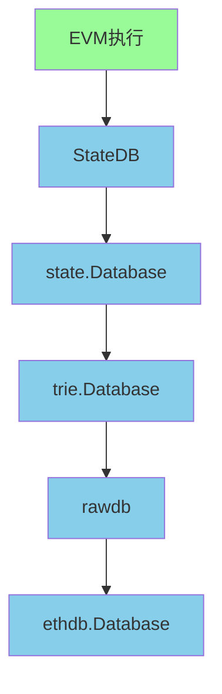

# 以太坊中的存储机制分析

在 以太坊 中，数据存储是一个非常重要的组成部分，它负责存储区块链的各种数据，包括区块、交易、状态等。Geth 采用分层存储架构，每一层都有其特定的职责。

## 存储架构概览

以太坊 的存储架构可以分为以下几个层次：

1. **ethdb.Database** - 最底层的键值存储接口
2. **rawdb** - 对 ethdb 的封装，提供特定功能的访问函数
3. **trie.Database** - 默克尔前缀树(MPT)的存储层
4. **state.Database** - 状态数据库接口层
5. **StateDB** - EVM 执行时的状态管理接口
6. **各种高层数据库** - 如 Receipts、Headers 等特定用途数据库



## 底层存储接口

### ethdb.Database

`/ethdb/database.go` 是一个接口，定义了数据库的基本操作，包括：

```go
type Database interface {
    // 键值对操作
    Has(key []byte) (bool, error)
    Get(key []byte) ([]byte, error)
    Put(key []byte, value []byte) error
    Delete(key []byte) error
    
    // 批量操作
    NewBatch() Batch
    NewBatchWithSize(size int) Batch
    
    // 迭代器
    NewIterator(prefix []byte, start []byte) Iterator
    
    // 状态管理
    Stat(property string) (string, error)
    Compact(start []byte, limit []byte) error
    Close() error
}
```

这是最底层的存储接口，Geth 支持多种数据库实现，如 LevelDB、PebbleDB 等。

## 具体数据库实现

以太坊支持多种具体的数据库实现，用户可以通过 `--db.engine` 参数进行配置。

### LevelDB

LevelDB 是 Google 开发的高性能键值存储库，是 Geth 早期版本的默认数据库：

- 实现文件：`/ethdb/leveldb/leveldb.go`
- 存储路径：`datadir/geth/chaindata`
- 特点：
  - 成熟稳定
  - 高性能读写
  - 支持压缩
  - 适用于大多数场景

```go
// LevelDB 实现示例
type Database struct {
    fn string      // 文件名
    db *leveldb.DB // LevelDB 实例
    log.Log        // 日志记录器
}
```

### PebbleDB

PebbleDB 是新一代的数据库实现，是目前 Geth 的默认数据库：

- 实现文件：`/ethdb/pebble/pebble.go`
- 存储路径：`datadir/geth/chaindata`
- 特点：
  - 更好的并发性能
  - 更高的写入吞吐量
  - 更好的内存管理
  - 更快的启动时间

```go
// PebbleDB 实现示例
type Database struct {
    fn    string
    db    *pebble.DB
    log   log.Logger
    quit  chan chan error
    meter *meter
}
```

### 内存数据库

内存数据库主要用于测试和开发环境：

- 实现文件：`/ethdb/memorydb/memorydb.go`
- 特点：
  - 数据不会持久化
  - 启动和关闭速度快
  - 适用于测试场景

```go
// 内存数据库实现示例
type Database struct {
    db   map[string][]byte
    lock sync.RWMutex
}
```

## 数据库存储结构

Geth 使用多个逻辑数据库来组织不同类型的数据，这些数据都存储在同一个物理数据库中，通过前缀进行区分。

### 主要数据库文件

在 Geth 的数据目录中，主要有以下几个数据库文件：

1. **chaindata** - 主数据库目录
   - 路径：`datadir/geth/chaindata`
   - 包含：区块数据、状态数据、交易数据等所有链上数据
   - 用途：全节点模式下存储完整的区块链数据

2. **lightchaindata** - 轻客户端数据库目录
   - 路径：`datadir/geth/lightchaindata`
   - 包含：仅存储区块头数据
   - 用途：轻客户端模式下存储必要的数据，节省存储空间

3. **nodes** - 节点数据库目录
   - 路径：`datadir/geth/nodes`
   - 包含：P2P网络节点信息

4. **keystore** - 密钥存储目录
   - 路径：`datadir/keystore`
   - 包含：账户私钥文件

### 为什么需要两个链数据库？

Geth 支持两种节点模式：

1. **全节点模式 (Full Node)**
   - 存储完整的区块链数据
   - 包含所有区块、交易、状态等数据
   - 使用 `chaindata` 数据库
   - 需要大量存储空间（数百GB到数TB）
   - 可以独立验证所有交易

2. **轻节点模式 (Light Node)**
   - 仅存储区块头数据
   - 通过网络请求其他数据
   - 使用 `lightchaindata` 数据库
   - 存储空间需求小（几十MB到几GB）
   - 适用于资源受限的设备

代码中同时处理两个数据库的原因：
```go
for _, name := range []string{"chaindata", "lightchaindata"} {
    // 对两个数据库都执行相同的操作
}
```

这是因为：
1. Geth 需要支持两种节点模式
2. 在某些操作中（如初始化、清理等），需要同时处理两种数据库
3. 保证无论节点以何种模式运行，都能正确执行相关操作

### chaindata 数据库中的逻辑分区

在 `chaindata` 数据库中，数据通过前缀进行逻辑分区：

- **区块头数据** - 前缀 `"h"`
- **区块体数据** - 前缀 `"b"`
- **收据数据** - 前缀 `"r"`
- **交易查找数据** - 前缀 `"l"`
- **Bloom 过滤器数据** - 前缀 `"B"`
- **预映像数据** - 前缀 `"secure-key-"`
- **配置数据** - 前缀 `"ethereum-config-"`
- **账户 Trie 节点** - 前缀 `"secure-trie-node"`
- **存储 Trie 节点** - 前缀 `"storage-trie-node"`

这些数据都存储在同一个物理数据库中，通过不同的前缀进行区分和管理。

## Ancient数据存储机制

Geth 使用 Ancient 数据存储机制来优化历史数据的存储和访问：

### Ancient数据概念

Ancient 数据是指那些一旦写入就不会再修改的历史数据，主要包括：
- 区块头（Headers）
- 区块体（Bodies）
- 收据（Receipts）

这些数据被存储在一种特殊的、只读的存储结构中，以提高访问效率并减少存储空间占用。

### Ancient数据存储结构

Ancient 数据使用 freezer 机制存储：
- 路径：`datadir/geth/chaindata/ancient`
- 特点：
  - 只读存储，数据一旦写入就不会修改
  - 使用文件系统存储，而非键值数据库
  - 按区块号分片存储
  - 提高历史数据访问性能

### Ancient数据访问代码示例

以下代码展示了如何读取 canonical hash：

```go
// ReadCanonicalHash retrieves the hash assigned to a canonical block number.
func ReadCanonicalHash(db ethdb.Reader, number uint64) common.Hash {
    var data []byte
    db.ReadAncients(func(reader ethdb.AncientReaderOp) error {
        data, _ = reader.Ancient(ChainFreezerHashTable, number)
        if len(data) == 0 {
            // Get it by hash from leveldb
            data, _ = db.Get(headerHashKey(number))
        }
        return nil
    })
    return common.BytesToHash(data)
}
```

代码解释：
1. 首先尝试从 Ancient 存储中读取指定区块号的 canonical hash
2. 如果 Ancient 存储中没有找到，则从普通数据库中读取
3. `ChainFreezerHashTable` 是 Ancient 存储中用于存储区块哈希的表

### Canonical概念

Canonical 链是指被网络共识认为是主链的区块链分支：

1. **Canonical Block** - 在主链上的区块
2. **Canonical Hash** - 主链上区块的哈希值
3. **Canonical Chain** - 从创世区块到当前最新区块的主链路径

在区块链网络中，可能会出现分叉，但只有一条链会被认为是 canonical 链。

## rawdb 层

`/core/rawdb` 是对 ethdb.Database 的一层封装，提供了针对不同数据类型的访问函数：

- `/core/rawdb/accessors_chain.go` - 区块链数据访问（区块头、区块体、收据等）
- `/core/rawdb/accessors_state.go` - 状态数据访问
- `/core/rawdb/accessors_trie.go` - Trie 数据访问
  
例如，读取区块头的函数：

```go
func ReadHeader(db ethdb.Reader, hash common.Hash, number uint64) *types.Header {
    data, _ := db.Get(headerKey(number, hash))
    if len(data) == 0 {
        return nil
    }
    header := new(types.Header)
    if err := rlp.Decode(bytes.NewReader(data), header); err != nil {
        return nil
    }
    return header
}
```

## Trie 存储层

以太坊使用默克尔前缀树（Merkle Patricia Trie）来组织状态数据。`/trie/database.go` 实现了 Trie 数据的存储和管理：

```go
type Database struct {
    diskdb ethdb.KeyValueStore // 持久化存储
    cleans  *fastcache.Cache    // 内存缓存
    dirties map[common.Hash]*cachedNode // 脏节点
    oldest  common.Hash         // 最旧的节点
    newest  common.Hash         // 最新的节点
    // ... 其他字段
}
```

Trie 层主要负责：
1. Trie 节点的缓存管理
2. 节点的序列化和反序列化
3. 脏节点的跟踪和刷写

## State Database 层

`/core/state/database.go` 定义了状态数据库接口：

```go
type Database interface {
    // 打开账户Trie树
    OpenTrie(root common.Hash) (Trie, error)
    // 打开账户的存储Trie树
    OpenStorageTrie(addrHash, root common.Hash) (Trie, error)
    // 复制给定的Trie树
    CopyTrie(Trie) Trie
    // 获取合约字节码
    ContractCode(addrHash, codeHash common.Hash) ([]byte, error)
    // 获取合约大小
    ContractCodeSize(addrHash, codeHash common.Hash) (int, error)
    // 获取底层存储Trie数据的数据库
    TrieDB() *trie.Database
}
```

## StateDB 层

`/core/state/statedb.go` 是 EVM 执行时直接交互的状态管理接口，它是最上层的状态操作接口：

```go
type StateDB struct {
    db   Database
    trie Trie
    
    // 状态对象缓存
    stateObjects        map[common.Address]*stateObject
    stateObjectsPending map[common.Address]struct{}
    stateObjectsDirty   map[common.Address]struct{}
    
    // 存储缓存
    storagePool          map[storagePoolKey][]byte
    storageChanges       map[common.Address]map[common.Hash]struct{}
    
    // 日志和退款
    logs         map[common.Hash][]*types.Log
    logSize      uint
    refund       uint64
    
    // 预编译合约访问列表
    accessList *accessList
}
```

StateDB 主要职责：
1. 管理账户状态（余额、nonce、代码等）
2. 管理合约存储（storage）
3. 跟踪状态更改
4. 生成状态证明
5. 管理访问列表（EIP-2930）

## 数据分片存储

Geth 通过前缀区分不同类型的存储数据，定义在 `/core/rawdb/schema.go` 中：

```go
// 不同数据类型的前缀
var (
    headerPrefix       = []byte("h")  // 区块头前缀
    bodyPrefix         = []byte("b")  // 区块体前缀
    receiptPrefix      = []byte("r")  // 收据前缀
    txLookupPrefix     = []byte("l")  // 交易查找前缀
    bloomBitsPrefix    = []byte("B")  // Bloom过滤器前缀
    preimagePrefix     = []byte("secure-key-") // 预映像前缀
    configPrefix       = []byte("ethereum-config-") // 配置前缀
    // ... 更多前缀定义
)
```

## freezer 存储

对于历史数据，Geth 使用 `/core/rawdb/freezer.go` 来存储，这些数据基本是静态的，可以存储在机械硬盘等廉价存储介质上：

```go
type Freezer struct {
    // 冻结数据文件
    files map[string]*freezerTable
    // 元数据
    meta *os.File
    // 同步锁
    lock sync.RWMutex
}
```

## 存储优化策略

### 冷热数据分离

Geth 使用 freezer 机制将历史数据与活跃数据分离存储：
- 快速访问存储：用于最近的区块和状态数据，存储在 SSD 上
- Freezer 存储：用于较旧的区块和收据数据，可以存储在机械硬盘上

这种设计可以：
1. 减少对昂贵 SSD 的依赖
2. 提高数据库整理和读取性能
3. 使更多状态树节点常驻内存，提升整体系统效率

### 多层缓存机制

Geth 实现了多层缓存来提高访问效率：
1. 内存缓存（fastcache）：缓存最近访问的 Trie 节点
2. 数据库缓存：LevelDB/PebbleDB 内部缓存
3. 状态缓存：StateDB 中的状态对象缓存

### 数据分片

Geth 通过前缀区分不同类型的数据，实现逻辑上的数据分片：
- 账户 Trie 节点：使用 AccountTrieNodeKey 前缀
- 存储 Trie 节点：使用 StorageTrieNodeKey 前缀
- Verkle 树数据：使用 VerklePrefix 前缀

## 存储方案演进

Geth 实现了两种状态存储方案：
1. HashScheme：传统的基于哈希的存储方案
2. PathScheme：基于路径的存储方案，为未来数据分片做准备

## 总结

Geth 的存储架构具有以下特点：

1. **分层设计** - 每一层都有明确的职责，便于维护和扩展
2. **接口抽象** - 通过接口隔离具体实现，支持多种数据库后端
3. **缓存优化** - 多层缓存提高访问效率
4. **数据分片** - 通过前缀区分不同类型的数据
5. **冷热分离** - freezer 机制将历史数据与活跃数据分离存储
6. **可扩展性** - 支持多种存储后端和存储方案

StateDB 作为最上层的状态管理接口，与 EVM 紧密配合，是整个存储架构中的关键组件，负责处理所有状态变更操作，并通过下层的 Trie 和数据库接口将数据持久化。