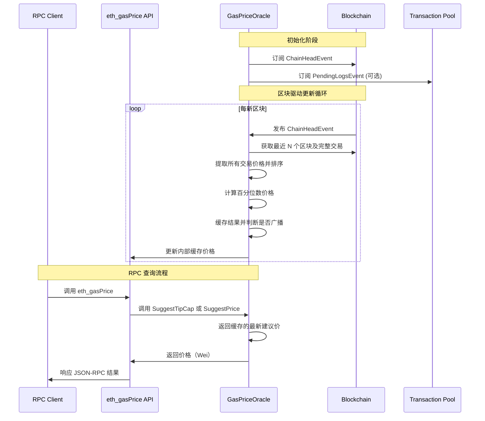

---

### **以太坊燃料费估算机制**

#### **1. 概述与设计目标**

以太坊的燃料费估算机制是一个复合系统，由两个主要部分组成：

1. **Gas Price Oracle (GPO)**：链下服务，通过分析最近区块中的交易历史，动态估算当前网络环境下可被快速纳入区块的 **合理 Gas 价格**。
2. **EIP-1559 BaseFee 机制**：链上算法，根据网络拥堵情况动态调整基础费用。

**设计目标：**
1.  **实时性**：反映当前网络拥堵程度和 Gas 价格市场。
2.  **稳健性**：抵抗单区块的异常价格波动（如巨鲸的高价交易）。
3.  **实用性**：为普通用户提供"一价包中"的建议，平衡确认速度与成本。
4.  **去中心化**：每个节点独立计算，不依赖外部 API。

#### **2. 核心设计机制**

##### 2.1 Gas Price Oracle (GPO)

GPO 的核心算法基于一个简单而有效的观察：**将最近区块中的所有交易按 Gas 价格排序，选择一个百分位数（如第 60 百分位）的价格作为建议价格**。这种方法天然过滤了异常高价和低价交易。

**2.1.1 数据采样窗口**
- **默认设置**：检查最近的 **20 个区块**（`DefaultMaxBlockHistory`）。
- **排除最新区块**：为避免叔块或不稳定区块的影响，默认排除最新的 1 个区块。
- **采样交易数下限**：如果 20 个区块中的交易总数不足 **3 笔**，则扩大采样范围，直到采样到至少 3 笔交易或达到 200 个区块的上限。

**2.1.2 价格计算算法**
1. **收集**：从采样区块中提取所有交易的 **有效 Gas 价格**。对于 EIP-1559 交易，有效价格为 `min(tx.GasTipCap + block.BaseFee, tx.GasFeeCap)`。
2. **排序**：将所有有效 Gas 价格升序排列。
3. **选择百分位点**：
   - **默认配置**：选择第 **60 个百分位数**（`DefaultPercentile`）的价格。
   - **含义**：这意味着在过去 N 个区块中，约有 60% 的交易支付的价格**低于**此建议价，40% 的交易支付的价格**高于**此价。用户支付此价格，有较大概率在后续几个区块中被确认。

**2.1.3 缓存与更新策略**
- **块驱动更新**：每次收到新的区块头时，GPO 会触发一次价格重计算。
- **缓存结果**：计算结果会被缓存，避免对每个 RPC 请求都进行全量计算。
- **防抖动**：仅在价格变化超过一定阈值（`DefaultMinSuggestedPriorityFee`）时，才对外广播新的建议价格事件。

##### 2.2 EIP-1559 BaseFee 机制

EIP-1559 引入了基础费用（BaseFee）机制，这是一种链上算法，根据网络拥堵情况动态调整基础费用。

**2.2.1 BaseFee 计算机制**
BaseFee 根据前一个区块的 Gas 使用情况动态调整：

```
下一个区块的 BaseFee = 当前区块 BaseFee * (目标 Gas 使用量 + 弹性因子 * (实际 Gas 使用量 - 目标 Gas 使用量)) / (目标 Gas 使用量 + 弹性因子 * 目标 Gas 使用量)
```

简化公式：
```
下一个区块的 BaseFee = 当前区块 BaseFee * (目标 Gas + 弹性因子 * (实际 Gas - 目标 Gas)) / (目标 Gas + 弹性因子 * 目标 Gas)
```

其中：
- 目标 Gas 使用量 = 区块 Gas Limit / 2
- 弹性因子 = 8 (固定值)

**2.2.2 BaseFee 调整规则**
1. 如果区块使用超过 50% 的 Gas Limit，BaseFee 增加（最多增加 12.5%）
2. 如果区块使用低于 50% 的 Gas Limit，BaseFee 减少（最多减少 12.5%）
3. 如果区块使用正好等于 50% 的 Gas Limit，BaseFee 保持不变

#### **3. 系统架构与工作流程**



#### **4. 关键数据结构与代码分析**

##### 4.1 核心结构体：`Oracle` (`eth/gasprice/gasprice.go`)
```go
// Oracle 根据过去区块的内容推荐 gas price。
type Oracle struct {
    backend     OracleBackend // 提供区块链和交易池数据的后端
    lastHead    common.Hash   // 上次计算时的区块头哈希
    lastPrice   *big.Int      // 上次计算出的 gas 价格（缓存）
    maxPrice    *big.Int      // 建议价格的上限
    ignorePrice *big.Int      // 忽略低于此价格的交易（视为无效数据）

    // 配置参数
    maxBlockHistory uint64    // 检查的最大区块数（默认 20）
    percentile      int       // 百分位数（默认 60）
    minSuggestedPriorityFee *big.Int // 最小建议优先级费用
}
```

##### 4.2 价格计算核心方法：
这是计算 EIP-1559 类型建议价格（`SuggestTipCap`）的核心逻辑：
```go
func (oracle *Oracle) SuggestTipCap(ctx context.Context, head *types.Header) (*big.Int, *big.Int, error) {
    // 1. 确定采样区块范围
    var (
        blocks = oracle.maxBlockHistory
        end    = head.Number.Uint64()
        start  = end - blocks + 1
    )
    if end < blocks { start = 0 }

    // 2. 遍历区块，收集所有交易的 `min(tip, feeCap-baseFee)`
    var receipts []*big.Int
    for n := start; n <= end; n++ {
        // 获取区块和交易
        block, err := oracle.backend.BlockByNumber(ctx, rpc.BlockNumber(n))
        // ... 提取每笔交易的有效 Tip

        // 对于每笔交易：
        // tip = tx.GasTipCap
        // if tip > (tx.GasFeeCap - block.BaseFee) {
        //     tip = tx.GasFeeCap - block.BaseFee
        // }
        // 将 tip 加入 receipts 列表
    }

    // 3. 排序并选择百分位点
    sort.Sort(bigIntArray(receipts))
    tip := receipts[(len(receipts)-1)*oracle.percentile/100]

    // 4. 应用下限保护（如 1 Gwei）
    if tip.Cmp(oracle.minSuggestedPriorityFee) < 0 {
        tip = new(big.Int).Set(oracle.minSuggestedPriorityFee)
    }

    // 5. 返回建议的 Tip 和总价（Tip + BaseFee）
    return tip, new(big.Int).Add(tip, head.BaseFee), nil
}
```

##### 4.3 BaseFee 计算实现

BaseFee 的计算在共识层实现，具体在 `/consensus/misc/eip1559.go` 中：

```go
// 相关参数
// params/protocal_params.go
	DefaultBaseFeeChangeDenominator = 8          // Bounds the amount the base fee can change between blocks.
	DefaultElasticityMultiplier     = 2          // Bounds the maximum gas limit an EIP-1559 block may have.
	InitialBaseFee                  = 1000000000 // Initial base fee for EIP-1559 blocks.


// /consensus/misc/eip1559.go
// 根据链的负载动态计算baseFee
func CalcBaseFee(config *params.ChainConfig, parent *types.Header) *big.Int {
    // 如果当前块是第一个 EIP-1559 块，则返回 InitialBaseFee。
	if !config.IsLondon(parent.Number) {
		return new(big.Int).SetUint64(params.InitialBaseFee)
	}

	// 以上一个区块gasLimit的一半作为比较基准，判断baseFee的变化方向
	parentGasTarget := parent.GasLimit / config.ElasticityMultiplier()
    // 如果parentGasUsed等于gasLimit的一半，则baseFee不变
	if parent.GasUsed == parentGasTarget {
		return new(big.Int).Set(parent.BaseFee)
	}

	var (
		num   = new(big.Int)
		denom = new(big.Int)
	)

	if parent.GasUsed > parentGasTarget {
		// 如果父块使用了比目标更多的 gas，则 baseFee 应该增加。
		// max(1, parentBaseFee * gasUsedDelta / parentGasTarget / baseFeeChangeDenominator)
		num.SetUint64(parent.GasUsed - parentGasTarget)
		num.Mul(num, parent.BaseFee)
		num.Div(num, denom.SetUint64(parentGasTarget))
		num.Div(num, denom.SetUint64(config.BaseFeeChangeDenominator()))
		baseFeeDelta := math.BigMax(num, common.Big1)

		return num.Add(parent.BaseFee, baseFeeDelta)
	} else {
        // 如果父块使用了比目标更少的 gas，则 baseFee 应该减少。
		// max(0, parentBaseFee * gasUsedDelta / parentGasTarget / baseFeeChangeDenominator)
		num.SetUint64(parentGasTarget - parent.GasUsed)
		num.Mul(num, parent.BaseFee)
		num.Div(num, denom.SetUint64(parentGasTarget))
        // 这一步，除 8，得到结果为整数，当num <= 7 时，结果为 0，所以baseFee 最小为 7
		num.Div(num, denom.SetUint64(config.BaseFeeChangeDenominator()))
		baseFee := num.Sub(parent.BaseFee, num)

		return math.BigMax(baseFee, common.Big0)
	}
}
```

##### 4.4 RPC API 接口
```go
// eth/api_backend.go
// 获取 EIP-1559 优先级费用建议
// 传统的 gasPrice 需要在此基础上增加baseFee
func (b *EthAPIBackend) SuggestGasTipCap(ctx context.Context) (*big.Int, error) {
	return b.gpo.SuggestTipCap(ctx)
}

// eth/api_backend.go
// 获取费用历史
func (b *EthAPIBackend) FeeHistory(ctx context.Context, blockCount uint64, lastBlock rpc.BlockNumber, rewardPercentiles []float64) (firstBlock *big.Int, reward [][]*big.Int, baseFee []*big.Int, gasUsedRatio []float64, err error) {
	return b.gpo.FeeHistory(ctx, blockCount, lastBlock, rewardPercentiles)
}
```

相关 API 接口代码：
```go
// internal/ethapi/api.go
// GasPrice returns a suggestion for a gas price for legacy transactions.
func (s *EthereumAPI) GasPrice(ctx context.Context) (*hexutil.Big, error) {
	tipcap, err := s.b.SuggestGasTipCap(ctx)
	if err != nil {
		return nil, err
	}
	if head := s.b.CurrentHeader(); head.BaseFee != nil {
		tipcap.Add(tipcap, head.BaseFee)
	}
	return (*hexutil.Big)(tipcap), err
}

// MaxPriorityFeePerGas returns a suggestion for a gas tip cap for dynamic fee transactions.
func (s *EthereumAPI) MaxPriorityFeePerGas(ctx context.Context) (*hexutil.Big, error) {
	tipcap, err := s.b.SuggestGasTipCap(ctx)
	if err != nil {
		return nil, err
	}
	return (*hexutil.Big)(tipcap), err
}
```

#### **5. 核心功能特性**

##### 5.1 对 EIP-1559 的完整支持
- **`SuggestGasTipCap()`**：建议优先费用（Tip），这是矿工的实际收益。
- **`SuggestPrice()`**：建议总 Gas 价格（Tip + BaseFee），兼容传统 RPC 调用。
- **智能处理 FeeCap**：当交易的 `GasFeeCap` 接近当前 `BaseFee` 时，有效 Tip 会被限制，防止用户过度支付。

##### 5.2 防异常机制
- **忽略价格**：通过 `IgnorePrice` 配置（默认 2 Wei），过滤极低价格的垃圾交易，避免拉低建议价格。
- **价格上限**：通过 `MaxPrice` 配置（默认 500 Gwei），防止在网络极端拥堵时给出不合理的高价建议。
- **最小建议费用**：确保建议的 Tip 不低于一个合理值（如 1 Gwei），维持网络安全。

##### 5.3 交易池待处理交易支持（可选）
GPO 可以配置为不仅检查已上链交易，还检查交易池中 **待处理（pending）** 的交易。这能让价格建议对网络拥堵反应更迅速。通过 `OracleBackend` 的 `PendingTransactions` 方法实现。

#### **6. 配置文件与参数**

**`eth/gasprice/gasprice.go` 中的默认配置：**
```go
var DefaultConfig = Config{
    Blocks:           20,      // 采样区块数
    Percentile:       60,      // 百分位数
    MaxHeaderHistory: 0,       // 0 表示无限制
    MaxBlockHistory:  0,
    MaxPrice:         gasprice.DefaultMaxPrice,        // 500 Gwei
    IgnorePrice:      gasprice.DefaultIgnorePrice,     // 2 Wei
    MinSuggestedPriorityFee: big.NewInt(params.GWei),  // 1 Gwei
}
```

**启动参数：**
```bash
geth --gpo.blocks 50 --gpo.percentile 80 --gpo.maxprice 100000000000
```

#### **7. 关键源代码文件路径**

*   **核心实现**:
    *   `eth/gasprice/gasprice.go`：`Oracle` 结构体和主要算法实现。
    *   `eth/gasprice/fee_history.go`： 统计历史费用。
    *   `consensus/misc/eip1559.go`：BaseFee 计算实现。
*   **RPC API 集成**:
    *   `eth/api.go`：`PublicBlockChainAPI.SuggestGasTipCap()` 和 `.FeeHistory()` 方法。
*   **服务集成**:
    *   `eth/backend.go`：`Ethereum` 结构体中初始化 `gpo` 字段。

#### **8. 局限性**

1.  **历史数据依赖**：本质是滞后指标，在网络费用快速变化时可能不够及时。
2.  **本地视野**：仅基于本节点看到的数据，如果节点同步不佳或网络分区，建议可能不准确。
3.  **简单模型**：未考虑交易复杂程度、合约交互热度等更精细的因素。
4.  **无未来预测**：无法预测未来几分钟的 BaseFee 变化趋势。

#### **9. 总结**

以太坊的燃料费估算机制是一个复合系统，包括链下 GPO 预言机和链上 EIP-1559 BaseFee 机制。GPO 通过在**时间窗口**（最近 N 个区块）和**价格分布**（百分位数）两个维度上进行统计，为以太坊用户提供了一个可靠的 Gas 价格参考基准。而 EIP-1559 的 BaseFee 机制则根据网络拥堵情况动态调整基础费用，使费用市场更加可预测和稳定。

对于大多数应用场景，使用 GPO 的默认建议是安全且经济的选择。对于需要更精确或前瞻性估值的 DeFi 或高频应用，则需要结合更复杂的链下预言机或预测模型。