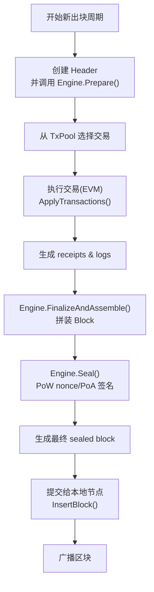
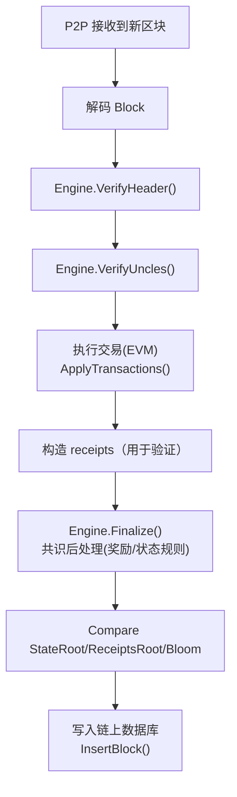

本文是 **基于 Geth v1.13.15 的 Engine 接口（未分 EL/CL，PoA 仍在共识层）** 的完整讲解。


---

#  **第一篇：Engine 设计理念与职责边界**

在 v1.13.15 中，以太坊客户端仍然是 “**执行层 + 共识层合一**”（与 The Merge 后不同）。

**Engine 接口是整个共识模块的总入口**，Miner（挖矿模块）只有通过 Engine 才能构造与验证区块。

下图是 v1.13.15 的矿工与 Engine 的关系：

```
TxPool → Miner → Engine → Block → Chain
                    ↑
                Clique / Aura / IBFT
```

在 PoA（Clique、Aura或 IBFT）里没有 PoW，也没有 Beacon/Validator Set split，
所有逻辑都在 Engine 中完成：

* 验证者身份管理
* 签名验证
* difficulty/extraData 的生成
* 出块间隔（slot）规则
* Seal 阶段执行签名
* Finalize 阶段发放奖励或执行系统合约（例如 Clique 不发奖励）

Engine 可以理解为一个“**共识插件**”，Geth 把所有共识相关责任装进这个插件内。

---

# 1. Engine 的总体设计哲学

### **Engine 的特点：**

| 功能                         | 描述                                            |
| -------------------------- | --------------------------------------------- |
| **交易执行不在 Engine 中**        | 交易执行（EVM）在 miner/state 执行，Engine 只关心区块外壳。     |
| **共识规则全部在 Engine 中**       | 校验难度、校验签名、校验出块顺序、validator set 管理等。           |
| **Miner 与 Engine 的协作非常明确** | Miner 决定交易执行和 header 草稿，而 Engine 决定“如何 seal”。 |
| **支持 plug-in**             | Engine 是可插拔的，PoA/PoW 都统一这个接口。                 |

---

# 2. 接口逐条深度解析

下面开始 “逐条讲解 Engine 接口功能 + PoA 中的真实表现”。

---

## 2.1 **Author(header) → 出块者是谁？**

在 PoA 共识中：

* Header.Coinbase 不一定是签名者，由共识确定
* 必须从 **header.ExtraData** 或 **Seal 字段（Clique 的 signature）** 中提取出真实出块者

例如 Clique：

```go
func (c *Clique) Author(header *types.Header) (common.Address, error) {
    // 从 header.ExtraData 中的签名恢复出 signer 地址
}
```

**作用：**

* 给 block.coinbase 账户发奖励（如果链有奖励规则）
* 提供 RPC 接口（eth_getBlockBy… 中返回 miner 字段）

⛏️ 在 PoA 中 author = signer，不等于 header.coinbase。

---

## 2.2 **VerifyHeader(...) → 单个区块头验证**

这里是共识层最核心的入口。

PoA 的 VerifyHeader 会检查：

| 类型                 | 检查内容                                                 |
| ------------------ | ---------------------------------------------------- |
| **结构检查**           | gas limit、timestamp、difficulty、hash 等是否符合规则          |
| **出块者合法性**         | signer 是否在 validator set 中                           |
| **epoch/round 规则** | clique 会检查 difficulty 是否是签名者 / in-turn / out-of-turn |
| **签名验证**           | extraData[65:] 签名是否正确                                |
| **时间戳间隔**          | 是否满足 slot 间隔（例如 clique 默认 15s）                       |
| **奖励规则检查**         | header 不能非法改变奖励相关字段                                  |

PoA 没有工作量证明，因此 VerifyHeader 核心是：

> 签名验证 + 顺序规则

---

## 2.3 **VerifyHeaders(...) → 批量验证**

Miner 导入网络区块时会调用此接口。

PoA 的实现通常会：

* 并行执行签名验证
* 做 timestamp 排序合法性
* 做 validator 投票/晋升规则（Clique UBFT）

这是为提升同步速度设计的。

---

## 2.4 **VerifyUncles(...) → 叔块验证（PoA 基本禁用）**

在 PoA（Clique / IBFT）：

🔸 **不允许 Uncles**
🔸 Uncles 列表必须为空

因此 VerifyUncles 会直接报错：

```
if len(block.Uncles()) > 0 → error: forbidden
```

---

## 2.5 **Prepare(...) → Miner 草稿 Header → Engine 修正 header**

Prepare 是 “启动出块的第一步”。

Miner 提供一个“草稿 header”，Engine 补充共识字段：

PoA（Clique）中 Prepare 会：

| 字段                    | 行为                                           |
| --------------------- | -------------------------------------------- |
| **header.Difficulty** | 根据是否轮到自己出块 (in-turn / out-of-turn) 设置为 2 或 1 |
| **header.ExtraData**  | 加入 validator list（每 epoch）                   |
| **header.Nonce**      | 用于投票管理                                       |
| **header.Coinbase**   | 可以由共识层强制为某个地址（PoA 通常无奖励）                     |
| **header.GasLimit**   | 根据历史区块做 gaslimit 调整                          |

Prepared header 是一个 “半成品区块头”。

---

## 2.6 **Finalize(...) → 交易执行后对 State 的后处理**

Finalize 被 验证节点 在“交易执行完成后”调用：

动作包括：

| 动作               | PoA 情况                        |
| ---------------- | ----------------------------- |
| 计算 block reward  | PoA 通常 reward=0（Clique）       |
| 维护 validator set | 投票逻辑生效（Clique 有两类投票：添加/移除）    |
| withdrawals      | v1.13.15 之前 ignored（没有 Merge) |

Finalize **不会组装区块**，只会写入 StateDB。例如：

```go
func (c *Clique) Finalize(chain, header, state, txs, uncles, withdrawals) {
    // 处理投票
    // 应用 validator set 变更
    // 不给任何人奖励
}
```

---

## 2.7 **FinalizeAndAssemble(...) → Finalize + 构造 block**

Miner 的最终步骤：

```go
block := engine.FinalizeAndAssemble(...)
```

它会：

* 调用 Finalize 写入奖励/validator set
* 组装完整的 types.Block（含 body + txs + receipts）
* 计算 txRoot、receiptRoot、stateRoot
* 填好 Bloom、GasUsed、Size

PoA 里 FinalizeAndAssemble 没有复杂奖励，主要是：

**构造最终 block + 更新 validator set。**

---

## 2.8 **Seal(...) → 生成签名并回传给 Miner**

**PoA Seal = 生成签名 + 回传区块**

行为：

* 不会阻塞（异步返回）
* 多个 Seal 结果可能同时传出（IBFT round robin 可多轮签名）

Clique 的 Seal 流程：

```text
parent.header → 构造 sealHash → 用私钥签名 → 填入 extraData → 发送结果
```

⛏️ 在 PoA 里，Seal 不做计算，只做“签名”。

Miner 会：

```go
engine.Seal(block, resultCh, stopCh)
```

收到 resultCh 后才广播区块。

---

## 2.9 **SealHash(header) → 需要被签名的 hash**

PoA 会从 header 中删除签名字段（extraData 中后 65 字节）再 hash：

```go
hasher := sha3.NewLegacyKeccak256()
rlp.Encode(hasher, strippedHeader)
```

SealHash 是签名前的“裸 hash”。

---

## 2.10 **CalcDifficulty(...) → 计算当前区块的难度**

在 PoA 里：

* difficulty 不代表算力
* 是共识状态机的一个信号量

例如 clique：

| in-turn        | out-of-turn    |
| -------------- | -------------- |
| difficulty = 2 | difficulty = 1 |

用于防止分叉偏移，让链倾向于 in-turn validator 的链。

> 这里难度设计有个巧妙的点，利用了总难度越大的链，越少概率被分叉，因为合法矿工出块的难度值更大大。

---

## 2.11 **APIs() → 暴露共识相关 RPC**

包括：

* clique.getSigners
* clique.getSnapshot
* clique.proposals
* clique.propose / discard

这些 RPC 用于 validator 管理。

---

## 2.12 **Close() → 清理线程**

关闭后台 goroutine，例如：

* IBFT 的 timer/round manager
* Clique 可能没有后台线程，但仍有结构清理

---

# 3. PoA Miner 与 Engine 的工作流

## 3.1 **Miner 构造 block header（未签名）**

```go
header := miner.createHeader(parent)
engine.Prepare(chain, header)
```

---

## 3.2 **EVM 执行交易并写入状态**

```go
for tx := range selectedTxs {
    applyTransaction(...)
}
```

生成：

* receipts
* logs
* gasUsed
* stateRoot


---

## 3.3 **FinalizeAndAssemble → 构成完整 block**

```go
block := engine.FinalizeAndAssemble(...)
```

---

## 3.4 **Seal（签名）**

```go
engine.Seal(block, resultCh, stopCh)
```

Seal 返回签名后的区块。

---

## 3.5 **Miner 广播区块**

```go
backend.BroadcastBlock(block)
```

---

## 3.6 **流程图**

> 矿工的共识流程：


> 同步节点的共识验证流程：


# 🔴 小结

✔ v1.13.15 的 Engine 设计哲学
✔ 每个 Engine 接口在 PoA 中的详细作用
✔ Clique/Aura/IBFT 的行为差异点
✔ Miner 调用 Engine 的完整流程