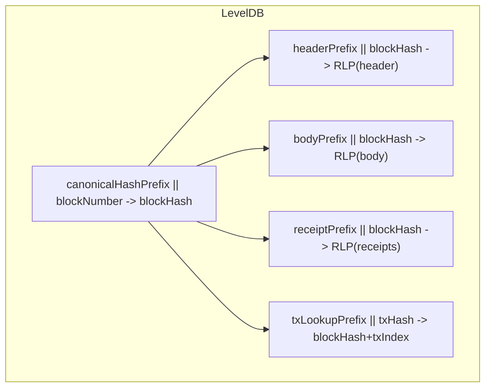
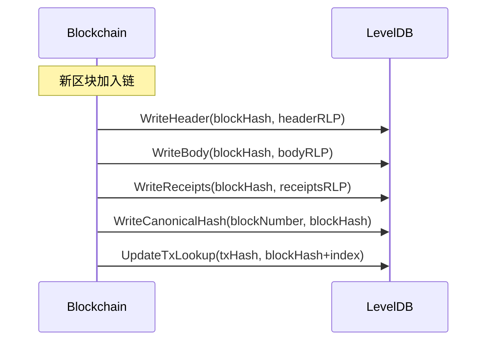
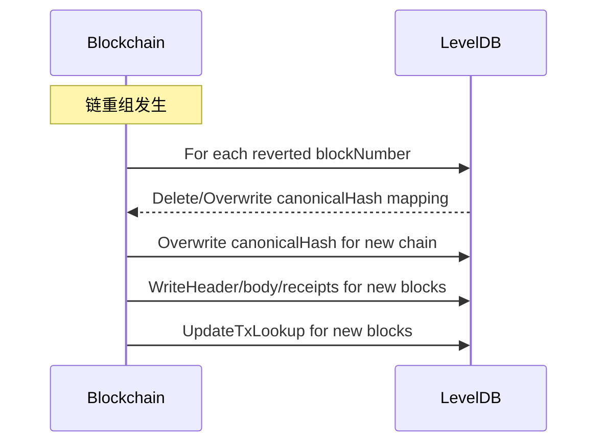
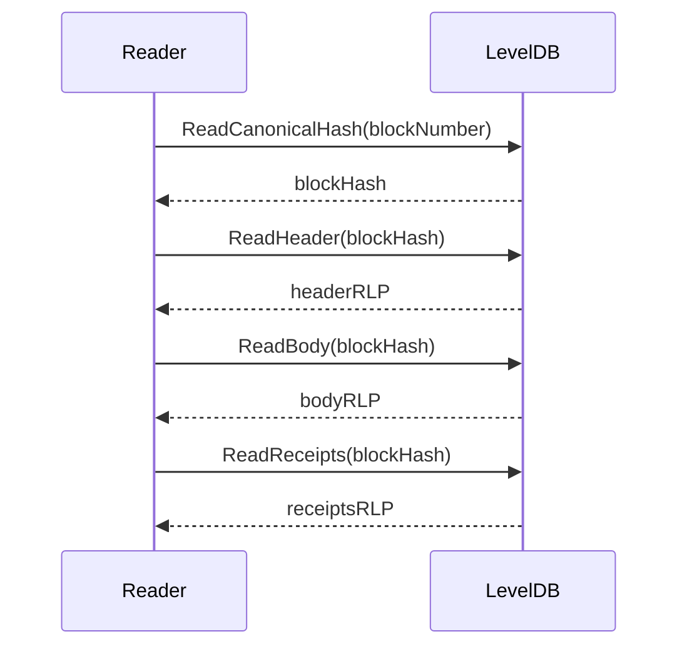
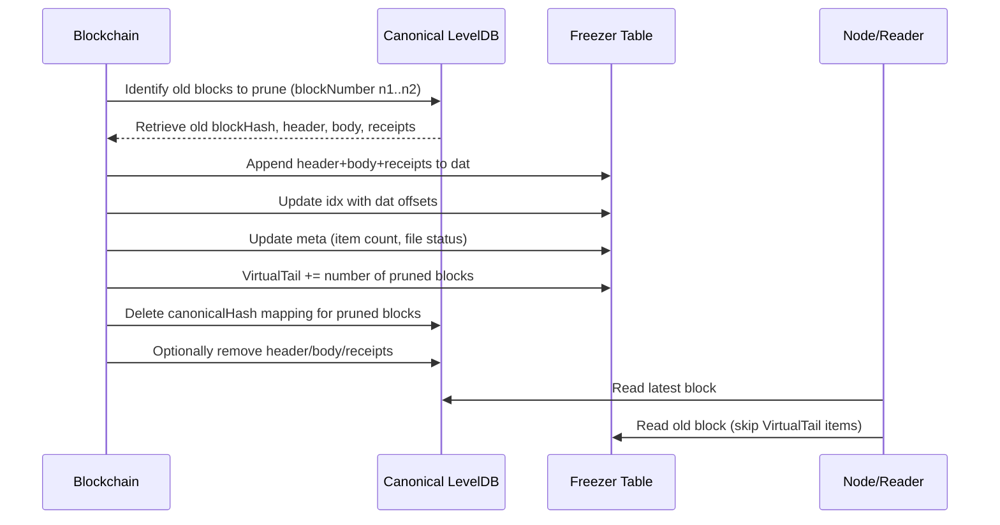

# 1.Canonical 数据概述

在 Geth 中，Canonical Chain 指的是 **当前被认为有效的区块链主链**，也就是 **最长/最有效链**，它包括：

* 当前链上每个区块的 **hash**、**number（高度）**、**header、body、receipts** 等
* 维护 **区块高度到 hash 的映射**，方便快速访问链上特定高度的区块

与 Freezer 的区别：

| 特性   | Freezer                | Canonical                |
| ---- | ---------------------- | ------------------------ |
| 存储对象 | 历史古老数据（ancient blocks） | 当前链有效区块                  |
| 更新频率 | 追加/只读，删除只从前往后          | 动态更新，高频更新（新块加入/回滚）       |
| 文件类型 | meta / idx / dat       | LevelDB key-value 存储（db） |
| 删除方式 | VirtualTail 逻辑删除       | overwrite key 或删除 key    |

**核心思想**：

* Canonical 数据是 **可变的**，因为链可能发生 reorg（回滚）
* Freezer 数据是 **不可变的**，只追加
* Canonical 数据使用 **LevelDB** 作为存储引擎，而 Freezer 是 **文件化 append-only**

---

# 2. Canonical 数据设计机制

Canonical 数据主要包含几个映射（在 `core/rawdb/`）：

1. **Header Chain**

   * key: `headerPrefix || hash` → RLP(header)
   * key: `headerNumberPrefix || number` → hash（canonical chain 的高度到 hash 映射）

2. **Block Body**

   * key: `bodyPrefix || hash` → RLP(body)

3. **Receipts**

   * key: `receiptPrefix || hash` → RLP(receipts)

4. **Transaction Lookup**

   * key: `txLookupPrefix || txHash` → `blockHash + index`

5. **Canonical Hash Mapping**

   * key: `canonicalHashPrefix || number` → block hash
   * 方便快速定位当前链上某高度对应的 block hash

**总结**：Canonical 数据是 **多表映射（多种 key 前缀） + LevelDB KV 存储**，随区块追加/回滚动态更新。

> 主要数据的索引入口在Canonical Hash Mapping中，根据区块高度获取到区块哈希，然后可以结合各种前缀获取到对应的数据。
> 另外 TX 的存储是独立的，直接根据前缀和交易哈希可以直接索引。

---

# 3. 存储实现原理

* **LevelDB KV 结构**（key 前缀区分不同类型）
* 逻辑类似关系型数据库索引：

```
[canonicalHashPrefix || blockNumber] → blockHash
[headerPrefix || blockHash] → RLP(header)
[bodyPrefix || blockHash]   → RLP(body)
[receiptPrefix || blockHash] → RLP(receipts)
[txLookupPrefix || txHash]   → blockHash+txIndex
```

* **追加新块**：

  1. 写入 header/body/receipts
  2. 更新 canonical mapping（block number → hash）
  3. 更新 tx lookup 映射

* **链回滚（reorg）**：

  1. 根据旧链的高度，覆盖 canonical mapping
  2. 旧 hash 仍保留在 db（可能被 Freezer 或 prune 回收）
  3. header/body/receipts 可选择保留或 Freezer 冷存储

---

# 4. 关键源码位置（v1.13.15）

| 功能                | 主要文件                            | 关键函数                 |
| ----------------- | ------------------------------- | -------------------- |
| 写入 canonical hash | `core/rawdb/accessors_chain.go` | `WriteCanonicalHash` |
| 读取 canonical hash | `core/rawdb/accessors_chain.go` | `ReadCanonicalHash`  |
| 写 header          | `core/rawdb/accessors_chain.go` | `WriteHeader`        |
| 写 body            | `core/rawdb/accessors_chain.go` | `WriteBody`          |
| 写 receipts        | `core/rawdb/accessors_chain.go` | `WriteReceipts`      |
| 回滚 reorg          | `core/blockchain.go`            | `SetHead` / `reorg`  |

---

# 5. 存储规则

* **Key-Value 存储**（LevelDB）

  * key 长度可变，前缀标识类型
  * value 是 **RLP 编码数据**
* **覆盖规则**

  * 新区块加入 → 写入新的 block number → hash 映射
  * reorg → 覆盖 block number → hash mapping
* **删除规则**

  * 逻辑删除由 Freezer 实现（prune 旧区块）
  * Canonical 数据通常保留最新 N 个块到 Freezer 或被 prune 删除

---

# 6. 主要流程示意

### 6.1 Canonical KV 文件组织示意图

> 1. 所有 key-value 存储在 LevelDB
> 2. blockNumber → blockHash 是主链高度映射
> 3. header/body/receipts/txLookup 是按 blockHash 索引

**说明：**

* `canonicalHashPrefix || blockNumber` 是主链高度到 hash 的映射
* header/body/receipts 都通过 blockHash 快速定位
* txLookup 支持交易哈希快速定位所在区块及 index

### 6.2 新区块写入流程（append/覆盖）



**解释：**

* 新区块加入时，header/body/receipts 写入 LevelDB
* canonical hash 映射可能覆盖已有 blockNumber（reorg 场景）
* txLookup 写入交易索引

---

### 6.3 链回滚 / Reorg 流程



**说明：**

* 回滚旧链通过覆盖 canonical hash 实现
* header/body/receipts 旧数据可保留（Freezer 可以冷存）
* txLookup 也会更新，保证查询最新链


### 6.4 随机读取指定高度区块流程



* 先通过 blockNumber 找到当前 canonical hash
* 再通过 blockHash 读取 header/body/receipts
* 随机读取高效，不需要遍历全表


### 6.5 串联起来

这里就可以和前面介绍的 Freezer 机制串联起来，组成一个完整的流程，从 Canonical 读取数据，写入 Freezer 文件，更新 VirtualTail：

> ⚠️ 串联这个流程的逻辑在Blockchain ->> Freezer: WriteBlock(block)，并不在 Canonical 操作中。




---

1. **Canonical prune 触发条件**

   * 区块高度超过节点保留策略或存储限制
   * 定期或按配置 prune

2. **旧块迁移 Freezer**

   * 读取 header/body/receipts
   * append 到 Freezer dat
   * idx 记录对应 dat 偏移
   * meta 更新文件状态

3. **更新 VirtualTail**

   * 标记逻辑删除
   * 读取时跳过 VirtualTail 前的条目

4. **Canonical 映射清理**

   * 删除或覆盖 canonical hash mapping
   * 可选删除 header/body/receipts，减轻 LevelDB 负载

5. **节点访问逻辑**

   * 最新块 → Canonical
   * 古老块 → Freezer（顺序读取，跳过 VirtualTail 前的数据）

---

# 7. 设计特性与 Freezer 对比

| 方面    | Canonical                  | Freezer                        |
| ----- | -------------------------- | ------------------------------ |
| 数据可变性 | 可覆盖 / 回滚                   | append-only + VirtualTail      |
| 存储介质  | LevelDB KV                 | 文件 meta/idx/dat                |
| 删除策略  | 覆盖 / prune                 | VirtualTail 标记 + 尾部 truncate   |
| 读取方式  | 随机读取                       | 顺序读取为主                         |
| 写入方式  | 高频 append + overwrite      | 顺序 append 低频写入                 |
| 回滚处理  | reorg 覆盖 canonical mapping | 不支持中间删除，需 append + VirtualTail |
---

# 8. 代码示例（v1.13.15）

```go
// 写入 canonical hash
func WriteCanonicalHash(db Database, hash common.Hash, number uint64) error {
    key := append(canonicalHashPrefix, uint64ToBytes(number)...)
    return db.Put(key, hash.Bytes())
}

// 读取 canonical hash
func ReadCanonicalHash(db Database, number uint64) common.Hash {
    key := append(canonicalHashPrefix, uint64ToBytes(number)...)
    data, _ := db.Get(key)
    return common.BytesToHash(data)
}
```

* `Database` 是 LevelDB 接口
* 前缀区分不同表
* 通过覆盖同一 key 实现链回滚 / reorg

---

# 9. 总结

* Canonical 数据是 **动态、覆盖型的链状态数据**
* 存储依赖 **LevelDB key-value**
* 可以频繁更新、高效随机读写
* 与 Freezer 对比：

  * **Canonical = 可变链**（append + overwrite）
  * **Freezer = 历史不可变数据**（append-only + VirtualTail）
* reorg / prune / repair 机制与 Freezer 协作确保节点完整性

> ⚠️ 非常重要的一点：Canonical 数据是平面化的，不是结构化数据，也不是状态数据，所有数据全部是 KV 结构，根据各种 KEY 索引的。这样就很容易理解了：
> 1. 把区块高度作为 Key，存储区块哈希；
> 1. 把一个区块的数据拆分成几部分，使用区块哈希和不同的前缀作为 Key 存储；
> 1. 把交易哈希作为 Key 存储交易数据；
> 
> 如此简单而已！
