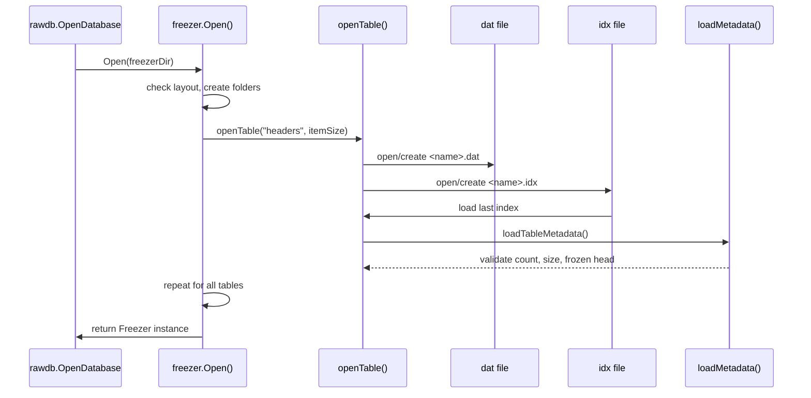
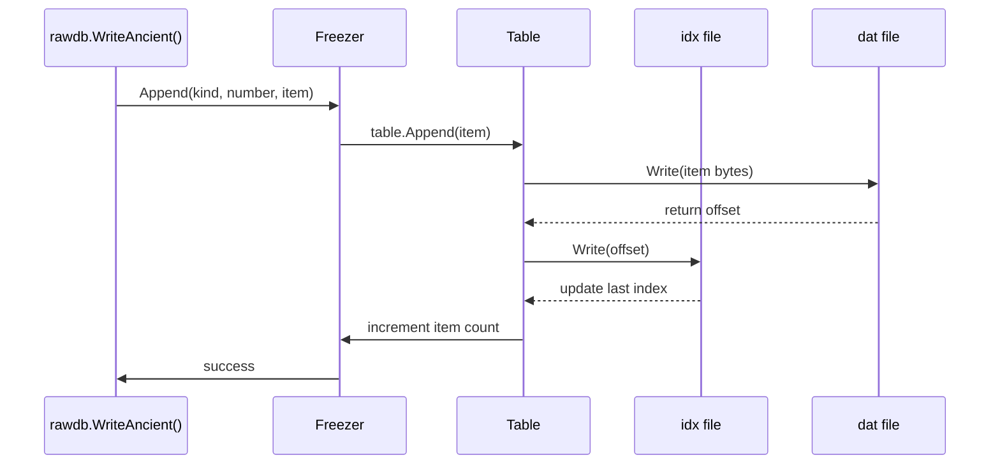
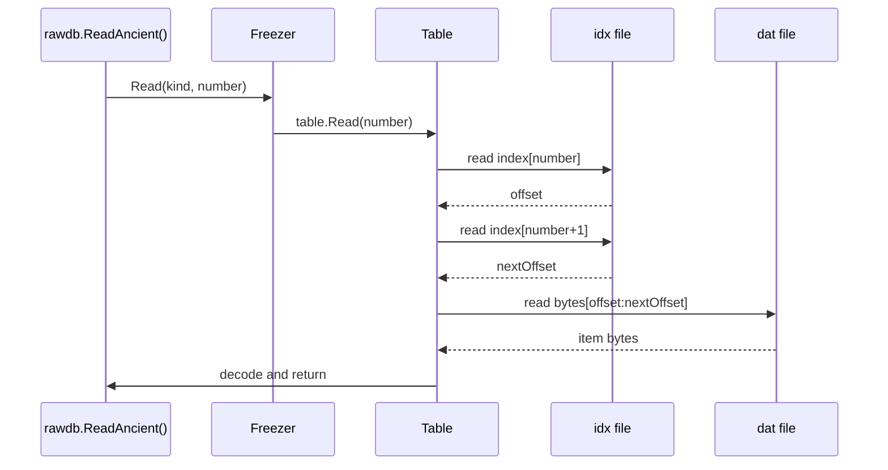
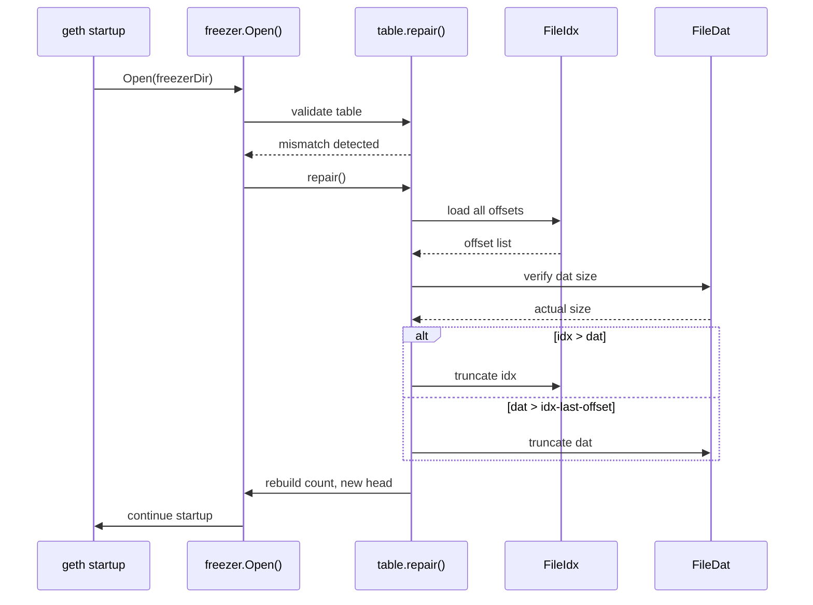
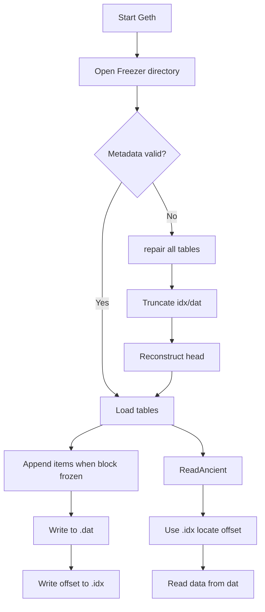

# Geth Freezer 存储系统详解

## 概述

Freezer 是 Geth 中用于管理古老区块数据的存储系统，采用 append-only 文件格式来存储不再活跃的历史数据，以减轻 LevelDB 的存储压力。

### 核心概念

* **Ancient（古老数据）**：当区块变得"很旧"（不再活跃、不会被回滚）时，按只追加格式写成的长期冷存储文件，存储在 `chaindata/ancient/` 目录下。
* **Freezer（冷存储器）**：管理 Ancient 数据的逻辑层，负责将 LevelDB 中的旧数据迁移到 Ancient 文件，并维护元数据和索引。

---

## 1. 架构设计

### 1.1 为什么需要 Freezer

* **LevelDB 性能问题**：对大量历史条目的随机读写和空间复用效率不高
* **元数据开销**：LevelDB 占用大量元数据，影响查询稳定性
* **存储优化**：Ancient 采用顺序追加、不可变方式，极大降低 I/O 与元数据开销

### 1.2 存储结构

```
chaindata/ancient/chain
├── headers/
│   ├── index    # 偏移索引文件
│   └── data     # RLP 编码的区块头数据
├── bodies/
│   ├── index
│   └── data     # RLP 编码的区块体数据
├── receipts/
│   ├── index
│   └── data     # RLP 编码的收据数据
├── diffs/
│   ├── index
│   └── data     # RLP 编码的难度数据
└── hashes/
    ├── index
    └── data     # 按高度顺序的区块哈希
```

注意上面的目录结构只是未来方便理解，其实全部是平铺文件，没有分层，真实的结构如下:
```shell
ls chaindata/ancient/chain
FLOCK                                   # 锁文件
bodies.0000.cdat                        # 数据文件
bodies.cidx                             # 索引文件(cidx表示压缩， ridx表示不压缩)
bodies.meta                             # 元文件
diffs.0000.rdat
diffs.meta
diffs.ridx
hashes.0000.rdat
hashes.meta
hashes.ridx
headers.0000.cdat
headers.cidx
headers.meta
receipts.0000.cdat
receipts.cidx
receipts.meta
```

### 1.3 核心数据结构

#### Freezer 结构体
```go
// core/rawdb/freezer.go
type Freezer struct {
    tables  map[string]*freezerTable  // 每种数据类型对应一个 table
    quit    chan struct{}             // 关闭通知通道
    wg      sync.WaitGroup            // 同步清理 goroutine
    readonly bool                     // 只读模式标志
    root     string                   // 数据目录路径
    frozen   uint64                   // 已冻结的最大块高度
    head     uint64                   // 当前可读的最大块高度
}
```

```go
// core/rawdb/ancient_scheme.go
// 表类型定义
const (
	ChainFreezerHeaderTable = "headers"
	ChainFreezerHashTable = "hashes"
	ChainFreezerBodiesTable = "bodies"
	ChainFreezerReceiptTable = "receipts"
	ChainFreezerDifficultyTable = "diffs"
)
```

#### FreezerTable 元数据
```go
type freezerTableMeta struct {
    // 表示这个 table 的元数据/文件布局版本。不同版本可能改变 index/dat 的组织或 meta 的语义。版本号用于兼容与后向迁移判别（例如新版代码在打开旧表时会检查 Version，决定是否需要迁移或拒绝打开）。
    // 在 repair/打开流程中，若 Version 与代码期望的不匹配，程序会走兼容/升级逻辑或报错以避免错误解码。
	Version uint16

    // 逻辑尾指标（logical tail）：表示“被标记为删除/隐藏的条目数”。它等于已从表中移除的条目数量 + 表内被隐藏（例如被压缩/合并）的条目数量。它不应低于 actual tail（实际尾）。
    // 实际上，freezer 的物理存储仍然是 append-only 的 .dat/.idx，而 VirtualTail 允许在逻辑上“移除”一些最早的项（例如在合并、压缩、回滚或迁移过程中需要标记死数据），而不必立即物理删除文件尾部的数据。
    // 在读取/计数时，代码通常会用 index 的物理长度减去 VirtualTail 来得出可用/有效条目数，或者用 VirtualTail 来判断某个高度是否已被“删除/隐藏”，从而决定读取路径或是否触发进一步修复。
	VirtualTail uint64
}
```

---

## 2. 核心功能实现

### 2.1 创建流程



**创建步骤：**
1. 创建 freezer 对象
2. 为每种数据类型创建 freezerTable
3. 加载元数据并验证
4. 计算全局 frozen 高度
5. 校验 LevelDB 与 freezer 的连续性

### 2.2 写入流程



**写入步骤：**
1. 检查块号连续性（不允许跳号）
2. 写入 data 文件（append-only）
3. 写入 index 文件（记录偏移）
4. 更新元数据
5. 更新全局 frozen 高度

### 2.3 读取流程



**读取步骤：**
1. 从 index 文件获取数据偏移
2. 从 data 文件读取指定范围的数据
3. RLP 解码返回结果

### 2.4 清理流程

**注意：** Freezer 本身不会删除已写入数据（append-only 特性），清理指的是：
- 将 LevelDB 中的热数据迁移到 freezer
- 删除 LevelDB 中的旧块数据

**清理步骤：**
1. 判断区块高度是否达到冻结条件
2. 从 LevelDB 读取数据，写入 freezer
3. 删除 LevelDB 中的旧数据
4. 更新 freezer.frozen 高度

---

## 3. 修复机制

### 3.1 修复目标

- 清理损坏的 ancient 文件
- 清除尾部未完整写入的数据
- 回滚到正确的、可恢复的 block number

### 3.2 修复流程



### 3.3 常见修复场景

#### 场景 1：meta 文件损坏
**症状：** `rlp: input list has too many elements for rawdb.freezerTableMeta`
**修复：** 删除旧 meta，从 index 重建，重写 meta

#### 场景 2：data 中多出碎片字节
**症状：** data 文件大小大于 index 记录的偏移
**修复：** 截断 data 文件，修剪 index，重写 meta

#### 场景 3：index 多写
**症状：** index 记录的偏移大于 data 文件大小
**修复：** 裁掉 index 中多余 offsets，重写 meta

---

## 4. 源码文件结构

### 4.1 核心实现文件

| 文件路径 | 功能描述 |
|---------|----------|
| `core/rawdb/freezer.go` | Freezer 管理器，打开/关闭与公用操作 |
| `core/rawdb/freezer_table.go` | Table 读写/索引/offset 管理 |
| `core/rawdb/freezer_meta.go` | freezerTableMeta 的 RLP 定义与编解码 |
| `core/rawdb/database.go` | LevelDB + Freezer 混合数据库入口 |
| `core/rawdb/rawdb.go` | canonical 映射与 key helper |

### 4.2 辅助工具

- `rawdb.InspectFreezerTable()`：打印 table 索引用于调试
- `geth --datadir.ancient`：指定外部 freezer 目录
- `geth db freezer-migrate`：freezer 迁移工具

---

## 5. 完整工作流程



---

## 6. 关键特性总结

### 6.1 设计优势

- **高性能**：append-only 写入，顺序读取
- **低开销**：减少 LevelDB 元数据和 compaction 开销
- **可靠性**：自动修复机制保证数据一致性
- **透明性**：上层应用无需关心数据存储位置

### 6.2 限制与注意事项

- **只追加**：不支持随机写入或修改
- **连续性要求**：必须按块号顺序写入
- **同步要求**：所有 table 必须保持同步
- **修复影响**：repair 可能导致数据回滚

### 6.3 最佳实践

1. **定期监控**：检查 freezer 与 LevelDB 的连续性
2. **备份重要数据**：在进行大规模迁移前备份
3. **使用官方工具**：遇到问题时优先使用 `geth db freezer-migrate`
4. **版本兼容性**：注意不同版本间的 freezer 格式变化


---

## 7. 底层数据读写逻辑

1. **Freezer 的目录结构与文件布局（真实结构）**
2. **meta 文件：存储格式、编码、读写规则（RLP 编码）**
3. **idx 文件：存储格式、偏移表、写入规则、读取规则（固定 8 字节）**
4. **dat 文件：存储格式、写入布局、读取方式（原始 bytes）**
5. 三者之间的关系图
6. 开发者常见误区矫正（尤其是 meta 中没有 items/bytes）

---

## 7.1. Freezer 的目录结构与文件布局

每个 **ancient table**（如 headers、bodies、receipts…）对应两类文件：

```
<root>/ancient/
    headers/
        meta           ← meta 文件（RLP）
        index          ← idx: 8 字节偏移表
        data           ← dat: 原始 append-only 数据
```

geth 的代码中对应：

* `table.metaPath`  → meta
* `table.idxPath`   → index
* `table.datPath`   → data

所有文件的打开流程见：
`core/rawdb/freezer_table.go` → `openTable()`

---

## 7.2. meta 文件：**RLP 编码的 freezerTableMeta**

### 文件内容（整体结构）

meta 文件用了 **RLP 编码**，编码的数据结构是：

```go
type freezerTableMeta struct {
    Version     uint16     // RLP 编码为 big-endian uint
    VirtualTail uint64     // RLP 编码为 big-endian uint
}
```

### 读取规则（真实代码）

文件 → 读全部内容 → RLP decode：

源码：`core/rawdb/freezer_table.go: readMetadata()`

```go
blob, _ := os.ReadFile(metaPath)
var meta freezerTableMeta
rlp.DecodeBytes(blob, &meta)
```

### 写入规则

将结构体 Meta → RLP encode → 写入 meta 文件：

源码：`writeMetadata()`：

```go
blob, _ := rlp.EncodeToBytes(meta)
os.WriteFile(metaPath, blob, 0644)
```

### ⚠️ 注意：

meta **不是**固定大小结构体，不是 binary layout，而是 **RLP**。

---

## 7.3. idx 文件：**每 8 字节一个 offset 的定长二进制文件**

### 文件内容结构（精确格式）

| 字节范围 | 内容                               | 类型      |
| ---- | -------------------------------- | ------- |
| 0-7  | 第 0 项的 offset（uint64 big-endian） | 8 bytes |
| 8-15 | 第 1 项 offset                     | 8 bytes |
| ...  | 后续每项                             | 8 bytes |

即：

```
index file = offset[0] | offset[1] | offset[2] | ...
每个 offset 是 uint64 big-endian
```

### 写入规则

每 append 一项：

```go
binary.BigEndian.PutUint64(buf, offset)
idx.Write(buf) // 追加
```

来源：`core/rawdb/freezer_table.go: appendIndex()`

### 读取规则

读取 n-th 项 offset：

```go
ofs := make([]byte, 8)
idx.ReadAt(ofs, n*8)
offset := binary.BigEndian.Uint64(ofs)
```

源码：`readOffset()`

### 额外意义：

* `.idx` 文件长度 / 8 = 当前物理条目数量
* offset[n] = data 文件中第 n 项的起始位置
* offset[n+1] - offset[n] = 该项的字节长度

---

## 7.4. dat 文件：**append-only 的原始字节流**

文件内容是 raw bytes，只根据 idx 中的 offset 切片来读取。

格式非常简单：

```
dat file = [item0 raw bytes][item1 raw bytes][item2 raw bytes]...
```

geth 不对 dat 文件做任何结构化编码。

### 写入规则（append-only）

```go
dat.Write(itemBytes)
```

然后 idx 写入当前写入前的 offset。

见 `appendData()`。

### 读取规则

读取某一项：

```go
start := offset[n]
end   := offset[n+1]
buf := make([]byte, end-start)
dat.ReadAt(buf, start)
```

之后由上层 rawdb 做 RLP 解码、block body 解码等。

---

## 7.5. 三个文件的关系图（超级关键）

```mermaid
flowchart LR
    A[Table] --> B(meta, RLP)\nVersion,VirtualTail
    A --> C(index file)\n8-byte offsets
    A --> D(data file)\nraw bytes

    C -->|offset[n]| D
    C -->|offset[n+1]| D
```

读取 item n 的流程：

1. 读取 `offset[n]`
2. 读取 `offset[n+1]`
3. dat[offset[n] : offset[n+1]] 即为 item 内容
4. 上层再解码（如 block header RLP）

---

## 7.6. meta/idx/dat 如何共同构成 ancient 表

最终：

* **meta**：描述删除/隐藏条目（VirtualTail）与版本
* **idx**：索引——告诉你 dat 中每条记录从哪里开始
* **dat**：真实存储记录数据
* **freezer 读写规则**：严格 append-only，不允许覆盖

这个组合非常类似：

```
meta = bookkeeping 信息
idx  = 定位信息（目录）
dat  = 实际数据体
```

是典型的 LSM + append-only 文件组织。

---

## 7.7. 补充：VirtualTail 如何与 idx/dat 协作实现“逻辑删除”

例如：

```
idx 中物理上有 100 项（offset[0..100]）
VirtualTail = 10
```

表示：

* 前 10 项已逻辑删除或隐藏
* 可读数据从第 10 项开始
* 物理上仍保留 100 项，但有效条目数 = 100 - 10 = 90

**读取时**必须跳过 VirtualTail 之前的记录。
> ⚠️ 注意：VirtualTail 仅用于逻辑删除，不与数据压缩、隐藏写入有关。而且只能从最早的数据连续删除。
> 另外，相对的truncate操作只会从尾部删除数据，不会操作中间或之前的数据。

这是 geth 实现“迁移、压缩、隐藏写入”的关键机制。

