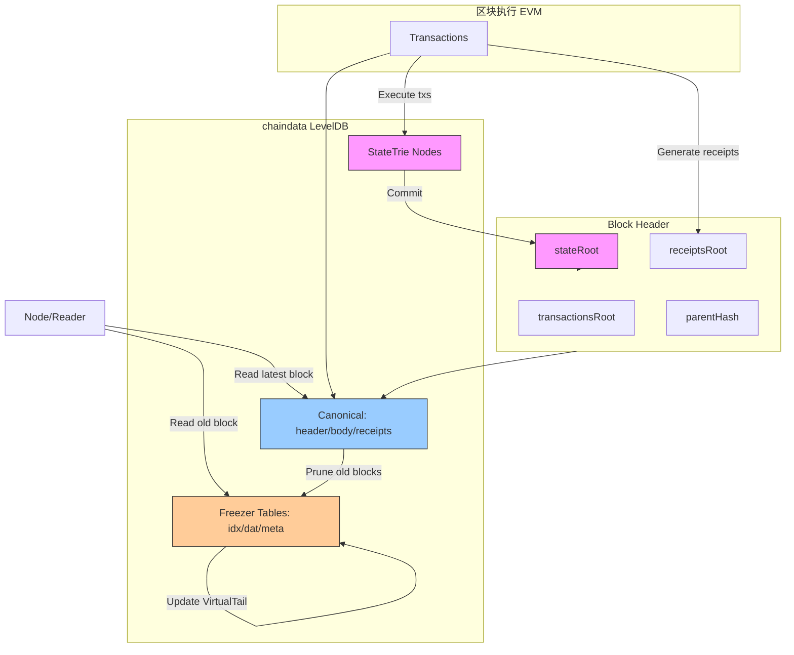
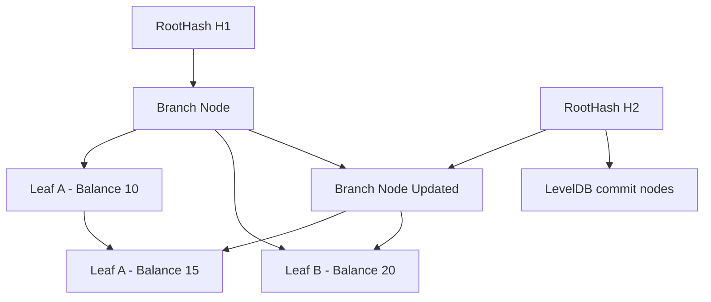

---

# StateTrie 全面解析

## 1. 概述

在以太坊节点中，账户状态管理是区块链执行和验证的核心。Geth 通过 **StateTrie**、**StateDB** 和 **chaindata LevelDB** 协同管理账户状态，实现高效验证和存储。

StateTrie 负责存储账户状态的 Merkle 树结构，StateDB 提供操作接口，而 Canonical / Freezer 管理完整区块数据。三者互相协作构成节点的数据存储体系。

---

## 2. 核心概念

| 名称                      | 类型    | 作用                                          |
| ----------------------- | ----- | ------------------------------------------- |
| **StateTrie**           | 数据结构  | 保存所有账户（EOA + 合约）的状态，生成 `stateRoot`          |
| **StateDB**             | 操作接口  | 对 StateTrie 提供增删改查接口、缓存管理、增量写入              |
| **State**               | 模块/包  | StateTrie + StateDB 的实现模块，无独立存储意义           |
| **Canonical / Freezer** | 数据库存储 | 存储完整区块数据（header/body/receipts），平面化存储，便于历史访问 |

---

## 3. StateTrie 设计机制

### 3.1 数据结构

StateTrie 是 **Merkle-Patricia Trie (MPT)**，特点：

1. **叶子节点（Leaf Node）**

   * 存储账户信息（nonce、balance、storageRoot、codeHash）
   * key = 账户地址（160-bit）
   * value = RLP 编码账户结构

2. **分支节点（Branch Node）**

   * 每个节点有 16 个子节点（对应 hex 0–f） + 1 个 value（叶子或空）

3. **扩展节点（Extension Node）**

   * 压缩共享路径前缀，减少 trie 高度

### 3.2 节点存储

* 节点序列化为 RLP，写入 **chaindata LevelDB**
* Key = `hash(node)` → Value = RLP(node)
* StateTrie 与 Canonical/Freezer 共用同一 LevelDB，通过 key 前缀区分数据类型

### 3.3 树深度

* 地址长度：160 bit = 20 字节 = 40 hex 字符
* 理论最大深度：40 层
* 实际深度：约 20–30 层，依赖路径压缩（Extension 节点）
* 扩展节点和共享未修改节点大幅降低实际高度

---

## 4. StateTrie 核心逻辑

### 4.1 更新流程

假设账户 A 发生状态变化：

1. **查找节点**

   * 根据账户地址 hex path，从 root 遍历 trie 找到叶子节点 H_old

2. **生成新叶子节点**

   * 更新账户状态 → RLP 编码新叶子节点 H_new

3. **递归更新父节点**

   * 受影响的 branch/extension 节点生成新节点
   * 其他未修改节点共享

4. **更新根哈希**

   * 最终生成新根 hash → `stateRoot`

5. **写入 LevelDB**

   * 新生成节点写入 LevelDB
   * 旧节点保留，用于历史回滚

**增量更新特点**：

* 只更新受影响路径的节点
* 保留未修改节点，共享节点减少存储
* 支持快照与回滚机制

---

### 4.2 Node 缓存与优化

* StateDB 内存缓存 Trie 节点
* Batch 提交节点到 LevelDB
* 支持快速查询和原子性写入
* 节点共享减少存储占用

---

## 5. 与 Canonical / Freezer 的关系

| 组件        | 数据类型                 | 存储方式                   | 功能                                    |
| --------- | -------------------- | ---------------------- | ------------------------------------- |
| Canonical | 区块头 / 区块体 / Receipts | LevelDB key-value      | 存储链上完整区块数据，按 blockNumber/blockHash 索引 |
| Freezer   | 归档旧区块                | table 文件（idx/dat/meta） | 存储历史区块，支持顺序逻辑删除（VirtualTail）          |
| StateTrie | 账户状态                 | LevelDB (同 chaindata)  | 保存全局账户状态，生成 stateRoot，供 EVM 验证        |

**协作流程示意**：

```
新交易执行 → StateDB 更新 StateTrie → 得到新 stateRoot

stateRoot 写入区块头

区块头 + 区块体 + receipts 存 Canonical / Freezer

旧区块 prune → 写 Freezer 表 → 更新 VirtualTail
```

---

## 6. StateTrie 与区块头、区块体哈希关系

* **stateRoot**：StateTrie 根哈希，记录在区块头
* **区块体**：Transactions + UncleHeaders，不存 stateRoot
* **区块头验证**：

  * 根哈希可以快速验证所有账户状态
  * TransactionsRoot / ReceiptsRoot 验证交易与收据
* **Canonical / Freezer**：存储序列化后的区块数据，方便节点访问和归档

---

## 7. 历史状态与回滚

* 每次账户变更产生新的节点
* 未修改节点共享 → 节省空间
* StateDB 提供 **Snapshot / Revert** 功能，支持历史状态回滚
* StateTrie 的增量写入保证 **效率与一致性**

---

## 8. 核心代码路径（Geth v1.13.15）

* **StateDB**（操作接口）：`core/state/state.go`

  * `func (s *StateDB) SetBalance(addr common.Address, amount *big.Int)`
  * `func (s *StateDB) Commit(deleteEmptyObjects bool) trie.Hash`

* **StateTrie 节点**：`trie/node.go`

  * `LeafNode` / `BranchNode` / `ExtensionNode`
  * `func Update(key []byte, value []byte) (Node, error)`

* **LevelDB 存储**：`ethdb.Database`

  * `db.Put(key, value)` / `db.Get(key)`
  * 所有 trie 节点、Canonical 数据共用同一个 DB

---
## 9. 整体协作流程



---

1. **StateTrie (ST)**

   * 保存账户状态
   * 交易执行后更新节点 → 生成新的 `stateRoot`

2. **StateDB**

   * 封装操作 StateTrie 的接口，支持增量写入、缓存、回滚

3. **Block Header**

   * 记录 `stateRoot`, `transactionsRoot`, `receiptsRoot`, `parentHash`
   * 用于链上验证和哈希链接

4. **Canonical**

   * 保存最新区块的 header/body/receipts
   * 平面化 key-value 存储

5. **Freezer**

   * 保存归档旧块
   * 顺序写入 dat/idx/meta 文件
   * 通过 `VirtualTail` 实现逻辑删除

6. **节点访问**

   * 最新区块 → Canonical
   * 历史区块 → Freezer
   * 状态验证 → StateTrie 根哈希 (stateRoot)

---

### 9.1 StateTrie 节点更新增量示意图




---

#### 图示说明

1. **RootOld**：原始 StateTrie 根哈希 H1，代表区块执行前全局账户状态
2. **Leaf A / Leaf B**：叶子节点存储账户状态，Balance = 10/20
3. **Leaf A 更新**：账户 A 余额变为 15 → 生成新叶子节点 L1New
4. **父节点更新**：受影响的 branch 节点生成新节点 B1New，未修改节点 L2 共享
5. **根哈希更新**：新根 RootNew（H2）生成，记录整个 Trie 的最新状态 → 区块头 stateRoot
6. **LevelDB 写入**：只写受影响节点（L1New + B1New + RootNew），未修改节点复用旧节点，支持增量写入

---

💡 **关键点**：

* 新根哈希 H2 反映整个 StateTrie 的最新状态
* 仅更新受影响节点，未修改节点复用 → 提高效率，节省存储
* LevelDB 中旧节点保留 → 支持历史状态回滚或快照
* stateRoot 最终写入区块头，保证区块链全局状态一致性

## 10. 总结

* **StateTrie**：存储账户状态的树结构，生成 stateRoot
* **StateDB**：操作接口，封装增量更新、缓存、回滚
* **State**：代码模块名，无独立存储意义
* **Canonical / Freezer**：存储区块数据，平面化存储
* **协作关系**：

  * StateTrie 生成 stateRoot → 区块头记录
  * 区块数据存入 Canonical / Freezer
  * 节点可通过 root 哈希验证区块状态

> StateTrie 是以太坊节点状态管理的核心，设计巧妙利用路径压缩、增量写入和共享节点，实现百万账户的高效管理和全局一致性验证。

> ⚠️StateTrie 是一种数据组织结构，最终存储还是到 LevelDB 中，Key 为各个节点的哈希值。
---

