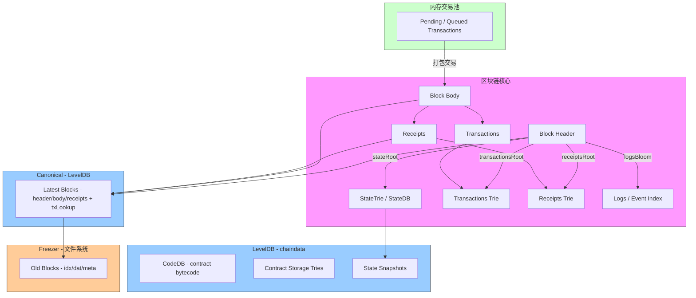

---

# 以太坊存储补充详解文档

## 1 — 概览（回顾）

在 Geth 中，我们可以把节点数据分成几类（此前讨论的三大类 + 若干辅助存储）：

* **Canonical（LevelDB）**：主链区块（header/body/receipts）与索引（blockNumber → blockHash、txLookup 等）。平面化 KV 存储，频繁更新（覆盖）。
* **Freezer（ancients）**：历史区块归档（meta/idx/dat），append-only，逻辑删除由 `VirtualTail` 标记。
* **StateTrie（stateRoot）**：所有账户的全局状态，Merkle-Patricia Trie，节点（RLP）写入同一个 LevelDB（chaindata），由 StateDB 管理。
* **辅助存储**（本文重点补充）：TransactionsTrie / ReceiptsTrie、CodeDB、StorageTrie，以及 Snapshots 等。

---

## 2 — Block Trie（Transactions Trie）与 TransactionsRoot

### 目的与概念

* **TransactionsTrie**（简称交易 Trie）是把区块内交易列表组织成一个 Merkle-Patricia Trie 的方式，得到的 **transactionsRoot** 被写入区块头（`Header.TransactionsRoot`）。
* 该 root 允许验证“某个交易是否在该区块中” 的 Merkle 证明。

### 节点与叶子

* 叶子通常是交易的 RLP（或 RLP 的某种编码）作为叶值。每个交易以其序号（index）或编码的键插入 Trie（实现细节可能以 RLP 列表构建，最终得到相同 root）。
* 内部节点与 StateTrie 一样用 MPT 节点（branch/extension/leaf）。

### 存储与实现（Geth 的常见做法）

* **区块体（Block.Body）中包含完整的 transaction 列表的 RLP**，这使得 node 能在需要时重建交易 Trie 并计算 root。
* **是否持久化 Trie 节点**：通常，Geth 不会为每个区块单独长期存储完整的交易-Trie 节点集合（因为 block body 已包含交易原文，重构 root 可在需要时完成）。但如果需要为 proof 或某些功能持久化 trie 节点，节点会被写入 trie 节点 KV（key=hash(node) -> value=RLP(node)），与 state trie 节点放同一个 DB 空间。
* **计算 root**：当构造区块或验证区块时，节点会把交易列表编码并通过 trie 构造（或通过交易列表直接计算 trie root），然后与 header 中的 `TransactionsRoot` 对比。

### 读写与验证规则

* 写入新块：先将 transactions 写入 block body（RLP）；计算 transactionsRoot（由交易列表计算）；写 header。
* 验证：接收区块时，用 body 中的交易重建 transactionsRoot（或以区块提供的 proofs）并核对 header。

---

## 3 — Receipts Trie（ReceiptsRoot）与收据的组织与存储

### 目的

* **ReceiptsRoot**（区块头 `Header.ReceiptsRoot`）是将该区块所有交易产生的 **Receipt** 按照一个 Merkle-Patricia Trie 组织后得到的根哈希。Receipt 包含：交易的 `status`、`cumulativeGasUsed`、日志（Log）等信息。
* ReceiptsRoot 支持通过根哈希验证某笔交易的执行结果（receipt）与日志。

### 收据的存储

* Geth 会把 **每个交易的 receipts 列表**存入 LevelDB（通常通过 `rawdb.WriteReceipts` 这类接口，value 是 RLP 编码的 receipts 列表，key 通常基于 blockHash）。
* 同样像 transactionsTrie，**ReceiptsTrie 节点是否单独长期保存**取决于实现需要；receipt 本身作为列表保存在 DB，能用于在需要时生成 receiptsTrie 并计算 root。
* 另外，logs/bloom filter（用于日志快速检索）也与 receipts 一起存储或索引在 LevelDB 中（logs bloom 存在 header 中用于快速筛选）。

### 读写与验证

* 写入区块时：将 receipts 列表写进 DB、计算 receiptsRoot（基于 receipts list 的 Trie 或计算方法），写 header。
* 验证区块：以 receipts 列表生成或校验 receiptsRoot。

---

## 4 — CodeDB（合约 bytecode 存储）

### 目的

* 合约代码（bytecode）通常以 **codeHash** 为索引存储：`codeHash = keccak(code)`。节点通过 codeHash 在需要时拿到合约的实际 bytecode。
* 之所以用 codeHash 作为 key，是因为多个合约（理论上）可能有相同的 bytecode，可以实现去重与共享。

### 存储方式（Geth）

* CodeDB 在同一个 `chaindata` LevelDB 中存储，通常由 rawdb 层提供 `WriteCode` / `ReadCode` 等 helper。例如 Key 前缀（如 `codePrefix`）+ codeHash → value: raw bytecode。
* 合约账户的 `codeHash` 字段（存在 Account 的结构中）引用了这个字节码条目；真正的字节码按需加载（懒加载）。

### 读写规则与实现要点

* 当合约创建或系统写入合约 bytecode 时，节点会：

  1. 计算 `codeHash`（keccak）
  2. 将 bytecode 写入 CodeDB（key=codePrefix||codeHash）
  3. 在账户对象里写入 codeHash（不重复写 bytecode）
* 读取合约代码：根据 account.codeHash 到 CodeDB 获取 bytecode 并传递给 EVM。

---

## 5 — StorageTrie（每个合约的存储 trie）

### 概念与功能

* **每个合约账号都有自己的 storage trie**（又是一个 Merkle-Patricia Trie），其 root hash 存在该合约账号的 `storageRoot` 字段（即 Account.StorageRoot）。
* storage trie 的叶子是合约存储槽（slot）对应的值，叶的 key 通常是 `keccak(slotKey)`（为了隐藏原始 slot 位置并均匀分布）。

### 组织与存储

* storage trie 的节点也序列化为 RLP，**写入同一个 LevelDB（chaindata）**，用节点 hash 作为 key（与 state trie 节点、transactions/receipts trie 节点共享同一节点存储空间，但 key 前缀/命名通常区分用途）。
* 因为合约可能有大量 storage entry，storage trie 在设计上支持增量写入、节点共享与路径压缩，和 StateTrie 的处理方式类似。

### 读写规则与更新

* 当 EVM 修改合约存储时：

  1. StateDB 操作会修改对应合约的 storage trie（使用 storageRoot 定位入参）
  2. 变更只影响受影响路径上的节点，生成新节点 hash
  3. 更新合约 Account 的 `storageRoot`
  4. Commit 时把受影响的 storage trie 节点写入 LevelDB

### 典型细节

* storage slot key 通常会先做 keccak，然后插入到 storage trie，因此原始 slot → 存储 key 的映射并不直接可读（增加保护与均匀分布）。
* storage trie 与 StateTrie 节点共存在 LevelDB，但它们的根 hash 存在对应合约的 Account 里，所以要读取某合约的存储需要先从 StateTrie 找到 account.storageRoot。

---

## 6 — Snapshots（StateTrie 快照 / 快速同步 / 回滚支持）

### 目的

* Snapshot 的核心目标是：**快速创建、恢复或传输某个 stateRoot 的所有账户与存储键值集合**，用于：

  * 快速同步（fast sync / snap sync）：允许新节点在不重放全部交易的前提下快速获取账户状态
  * 回滚（在做 snapshot/revert 时）
  * 提供更高效的 StateDB 快照与回滚操作

### Snapshot 的两种层面

1. **内存级 snapshot（StateDB 提供的 Snapshot / Revert）**

   * StateDB 支持内存中 snapshot（保存一个变化点），后续可以 revert 回到 snapshot 点（用于交易执行、回滚临时状态等）。
   * 这是运行时的轻量机制，不涉及大规模磁盘迁移。

2. **持久化 / 分布式 snapshot（用于 snap sync）**

   * Geth 的 snap sync 机制会以 stateRoot 为单位下载/上传 “快照”，这些快照代表某一根 hash 下的完整状态集合或增量（以 k/v 或 chunk 形式）。
   * 这些 snapshot 通常会保存在额外的 snapshot 存储（DB 前缀或独立目录）以便后续校验与重用，并可进行 GC（垃圾回收）。
   * 有时实现会把 snapshot 切分成 chunks（account range）、并在 LevelDB 中按特定前缀保存以支持下载、验证、安装。

### 存储与实现要点（Geth 风格）

* **StateDB 的 Snapshot API**（内存）支持快照与 revert，例如：`Snapshot() int` / `RevertToSnapshot(id int)`（名字可能有小差别，但意图一致）。
* **持久化 snapshots** 通常使用额外的 DB 前缀或文件，以便在做 snap sync 时构建/校验/安装。
* Snapshot 的存在使得 **新节点无需重放全部交易即可恢复某一 stateRoot 下的全量状态**，大幅提高同步速度。

### 读写规则

* 创建 snapshot（持久化）通常会把当前 state trie 的所有必要键值分批导出到 snapshot 存储（并写入校验根／签名等信息）。
* 安装 snapshot 时，会把快照内容写回 LevelDB（作为新的 trie 节点集合），然后设定 stateRoot 与区块头对应关系。

---

## 7 — 它们与 Canonical / Freezer / StateTrie 的关系 & 在区块链流程中的位置

把所有部件放在一起，按“交易执行到区块归档”的顺序：

1. **交易在 mempool 中等待**（TxPool）
2. **打包成区块（Block.Body）** → 写入 Canonical 的 block body（transactions 列表）
3. **EVM 执行区块中的交易**：

   * 每笔交易在执行过程中会通过 **StateDB** 操作 **StateTrie**（包括修改账户、修改 StorageTrie、写入合约 code 到 CodeDB 若为部署）
   * 执行产生 **Receipts**（收据）并记录日志
4. **Commit StateDB**：仅写入受影响的 trie 节点（state 和 storage 的 node），得到新的 `stateRoot`
5. **构造区块头**：把 `stateRoot`、`transactionsRoot`、`receiptsRoot`、logsBloom 等写入 header
6. **把 header/body/receipts 等写入 Canonical LevelDB**（blockHash→header/body/receipts；canonical mapping blockNumber→blockHash）
7. **旧区块 prune 时**：节点会把旧块写入 **Freezer**（ancients 文件），并在 Canonical 中删除或覆盖对应条目；Freezer 负责 append-only 存储与 VirtualTail 逻辑删除
8. **Snapshots / snap sync**：当需要快速同步或恢复历史状态时，节点会用 snapshots 与持久化格式来导出/导入 state 节点集合，从而避免全部交易回放。

示意图如下：



---

## 8 — 常见问题、调试建议与源码定位提示

### 常见问题与定位建议

* **如何找到 code bytes 存储和读取函数？**

  * 在 `core/rawdb` 或 `core/rawdb` 的 helper 文件里查找 `WriteCode` / `ReadCode`、`codePrefix`。这些函数负责 key 前缀 + codeHash 写入/读取。
* **如何找到 receipts 写入/读取？**

  * 查 `core/rawdb/accessors_chain.go` 或 `rawdb` 中 `WriteReceipts` / `ReadReceipts` 等。
* **如何重算 transactionsRoot/receiptsRoot？**

  * 在构造/验证区块时，body 中的 transactions/receipts 列表会被用来重建 trie（或用列表直接计算）并得到 root。搜 `TransactionsRoot` / `ReceiptsRoot` 计算函数（通常在 `core/types` 或 `core` 的区块构造路径）。
* **Snapshot 实现在哪里？**

  * StateDB 的 snapshot / revert API 在 `core/state` 包中；snap sync 的实现散布在同步器 / snapshot 子系统（查 `internal/snapshot`、`core/rawdb` 的相关前缀存储）。
* **StorageTrie 节点如何定位到合约？**

  * 每个合约 account 的 `storageRoot` 字段指向对应 storage trie 的根 hash；从 state trie 拿到 account 后用该 root 进行 storage trie 操作。查 `core/state` 中 storage 相关代码。

### 调试实用小贴士

* **要验证某个区块的 receiptsRoot 是否正确**：把 block body 中的 receipts 列表用相同的构造方法重算 receiptsRoot，比较 header 值。
* **要查看某个合约的 storage**：先用 StateDB.ReadAccount(address) 找到 account.storageRoot，然后以 storageRoot 为基础检索 storage trie（有工具函数在 trie / state 包）。
* **要修复 trie 节点或 snapshot 问题**：snapshot / trie 节点通常会以 hash→RLP 的 kv 存在 LevelDB，使用小脚本遍历 key 前缀并用 RLP 解码检查。

---

## 附：简化伪代码（“交易执行 → 更新 state trie → 写 code → 写 receipts → 写 canonical → prune→ freezer”）

```go
// (伪代码，表意用)
for each newBlock {
    for each tx in newBlock.Txs {
        // 执行交易
        receipt := evm.ApplyTransaction(stateDB, tx)
        receipts = append(receipts, receipt)
        if tx.createsContract {
            codeHash := keccak(code)
            rawdb.WriteCode(db, codeHash, code) // 写CodeDB
            account.CodeHash = codeHash
        }
    }

    // 更新state trie，生成新的stateRoot
    newStateRoot := stateDB.Commit(deleteEmptyObjects)

    // 计算transactionsRoot
    txRoot := computeTransactionsRoot(newBlock.Txs)
    // 计算receiptsRoot
    receiptsRoot := computeReceiptsRoot(receipts)

    // 各个根哈希存入区块头
    header.StateRoot = newStateRoot
    header.TransactionsRoot = txRoot
    header.ReceiptsRoot = receiptsRoot

    // 写Canonical DB （header/body/receipts ）
    rawdb.WriteHeader(db, header)
    rawdb.WriteBody(db, newBlock.Hash(), newBlock.Body())
    rawdb.WriteReceipts(db, newBlock.Hash(), receipts)

    // 冻结旧区块
    if shouldPrune(oldBlockNumber) {
        rawdb.MoveBlockToFreezer(db, freezer, oldBlockNumber)
    }
}
```

---

# 小结

* **TransactionsTrie / ReceiptsTrie / StorageTrie / CodeDB / Snapshots** 都是为了补充 StateTrie 与 Canonical/Freezer 的功能：前者是用于验证与状态存取的不同 Trie（transactions/receipts/state/storage），CodeDB 保存合约字节码，Snapshots 支持快速同步与回滚。它们共同构成完整的节点存储体系：**执行（EVM）→ 状态（StateTrie/StorageTrie）→ 区块（Canonical）→ 历史归档（Freezer）→ 快速恢复（Snapshots）**。

