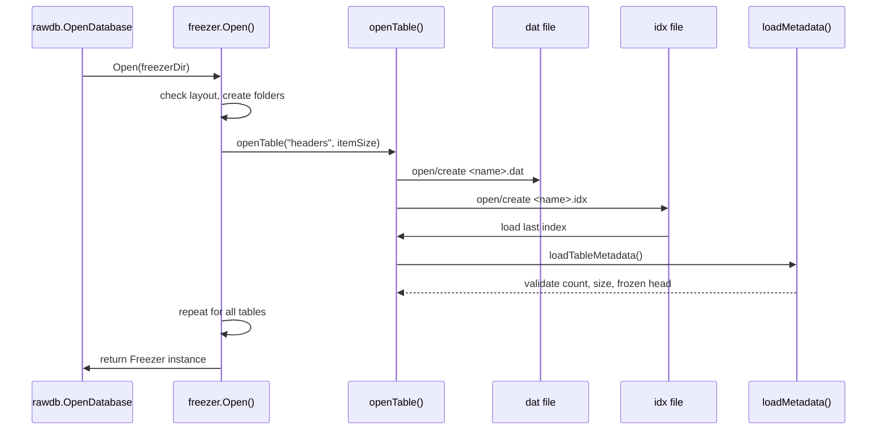
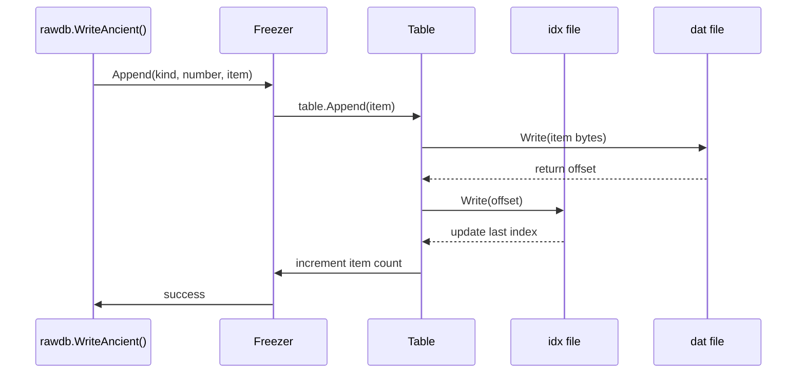
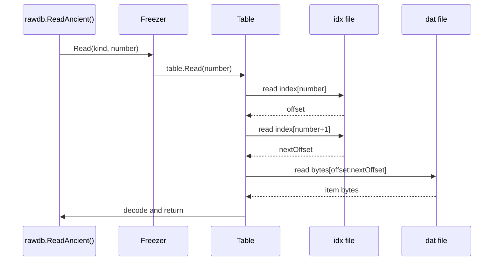
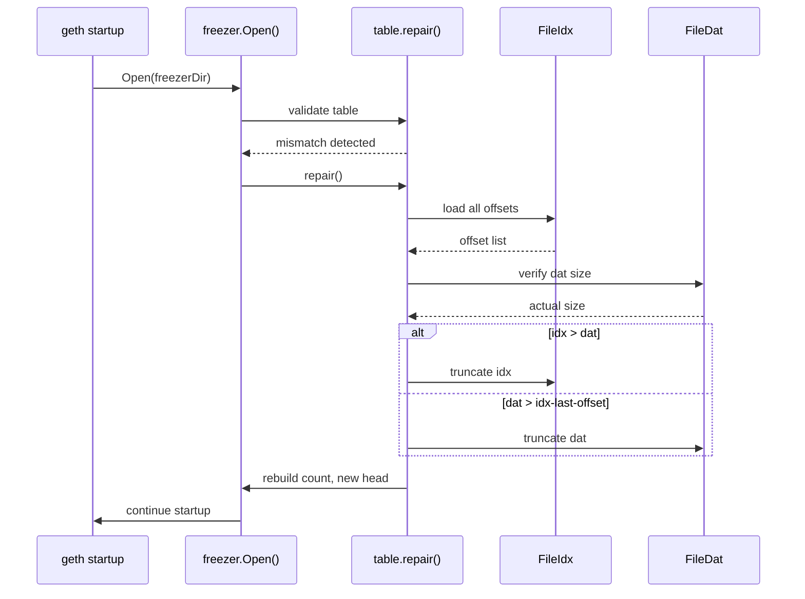
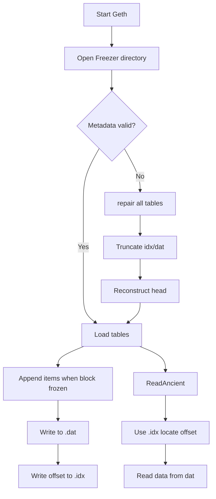

# Geth Freezer 存储系统详解

## 概述

Freezer 是 Geth 中用于管理古老区块数据的存储系统，采用 append-only 文件格式来存储不再活跃的历史数据，以减轻 LevelDB 的存储压力。

### 核心概念

* **Ancient（古老数据）**：当区块变得"很旧"（不再活跃、不会被回滚）时，按只追加格式写成的长期冷存储文件，存储在 `chaindata/ancient/` 目录下。
* **Freezer（冷存储器）**：管理 Ancient 数据的逻辑层，负责将 LevelDB 中的旧数据迁移到 Ancient 文件，并维护元数据和索引。

---

## 1. 架构设计

### 1.1 为什么需要 Freezer

* **LevelDB 性能问题**：对大量历史条目的随机读写和空间复用效率不高
* **元数据开销**：LevelDB 占用大量元数据，影响查询稳定性
* **存储优化**：Ancient 采用顺序追加、不可变方式，极大降低 I/O 与元数据开销

### 1.2 存储结构

```
chaindata/ancient/chain
├── headers/
│   ├── index    # 偏移索引文件
│   └── data     # RLP 编码的区块头数据
├── bodies/
│   ├── index
│   └── data     # RLP 编码的区块体数据
├── receipts/
│   ├── index
│   └── data     # RLP 编码的收据数据
├── diffs/
│   ├── index
│   └── data     # RLP 编码的难度数据
└── hashes/
    ├── index
    └── data     # 按高度顺序的区块哈希
```

注意上面的目录结构只是未来方便理解，其实全部是平铺文件，没有分层，真实的结构如下:
```shell
ls chaindata/ancient/chain
FLOCK                                   # 锁文件
bodies.0000.cdat                        # 数据文件
bodies.cidx                             # 索引文件(cidx表示压缩， ridx表示不压缩)
bodies.meta                             # 元文件
diffs.0000.rdat
diffs.meta
diffs.ridx
hashes.0000.rdat
hashes.meta
hashes.ridx
headers.0000.cdat
headers.cidx
headers.meta
receipts.0000.cdat
receipts.cidx
receipts.meta
```

### 1.3 核心数据结构

#### Freezer 结构体
```go
// core/rawdb/freezer.go
type Freezer struct {
    tables  map[string]*freezerTable  // 每种数据类型对应一个 table
    quit    chan struct{}             // 关闭通知通道
    wg      sync.WaitGroup            // 同步清理 goroutine
    readonly bool                     // 只读模式标志
    root     string                   // 数据目录路径
    frozen   uint64                   // 已冻结的最大块高度
    head     uint64                   // 当前可读的最大块高度
}
```

```go
// core/rawdb/ancient_scheme.go
// 表类型定义
const (
	ChainFreezerHeaderTable = "headers"
	ChainFreezerHashTable = "hashes"
	ChainFreezerBodiesTable = "bodies"
	ChainFreezerReceiptTable = "receipts"
	ChainFreezerDifficultyTable = "diffs"
)
```

#### FreezerTable 元数据
```go
type freezerTableMeta struct {
    // 表示这个 table 的元数据/文件布局版本。不同版本可能改变 index/dat 的组织或 meta 的语义。版本号用于兼容与后向迁移判别（例如新版代码在打开旧表时会检查 Version，决定是否需要迁移或拒绝打开）。
    // 在 repair/打开流程中，若 Version 与代码期望的不匹配，程序会走兼容/升级逻辑或报错以避免错误解码。
	Version uint16

    // 逻辑尾指标（logical tail）：表示“被标记为删除/隐藏的条目数”。它等于已从表中移除的条目数量 + 表内被隐藏（例如被压缩/合并）的条目数量。它不应低于 actual tail（实际尾）。
    // 实际上，freezer 的物理存储仍然是 append-only 的 .dat/.idx，而 VirtualTail 允许在逻辑上“移除”一些最早的项（例如在合并、压缩、回滚或迁移过程中需要标记死数据），而不必立即物理删除文件尾部的数据。
    // 在读取/计数时，代码通常会用 index 的物理长度减去 VirtualTail 来得出可用/有效条目数，或者用 VirtualTail 来判断某个高度是否已被“删除/隐藏”，从而决定读取路径或是否触发进一步修复。
	VirtualTail uint64
}
```

---

## 2. 核心功能实现

### 2.1 创建流程



**创建步骤：**
1. 创建 freezer 对象
2. 为每种数据类型创建 freezerTable
3. 加载元数据并验证
4. 计算全局 frozen 高度
5. 校验 LevelDB 与 freezer 的连续性

### 2.2 写入流程



**写入步骤：**
1. 检查块号连续性（不允许跳号）
2. 写入 data 文件（append-only）
3. 写入 index 文件（记录偏移）
4. 更新元数据
5. 更新全局 frozen 高度

### 2.3 读取流程



**读取步骤：**
1. 从 index 文件获取数据偏移
2. 从 data 文件读取指定范围的数据
3. RLP 解码返回结果

### 2.4 清理流程

**注意：** Freezer 本身不会删除已写入数据（append-only 特性），清理指的是：
- 将 LevelDB 中的热数据迁移到 freezer
- 删除 LevelDB 中的旧块数据

**清理步骤：**
1. 判断区块高度是否达到冻结条件
2. 从 LevelDB 读取数据，写入 freezer
3. 删除 LevelDB 中的旧数据
4. 更新 freezer.frozen 高度

---

## 3. 修复机制

### 3.1 修复目标

- 清理损坏的 ancient 文件
- 清除尾部未完整写入的数据
- 回滚到正确的、可恢复的 block number

### 3.2 修复流程



### 3.3 常见修复场景

#### 场景 1：meta 文件损坏
**症状：** `rlp: input list has too many elements for rawdb.freezerTableMeta`
**修复：** 删除旧 meta，从 index 重建，重写 meta

#### 场景 2：data 中多出碎片字节
**症状：** data 文件大小大于 index 记录的偏移
**修复：** 截断 data 文件，修剪 index，重写 meta

#### 场景 3：index 多写
**症状：** index 记录的偏移大于 data 文件大小
**修复：** 裁掉 index 中多余 offsets，重写 meta

---

## 4. 源码文件结构

### 4.1 核心实现文件

| 文件路径 | 功能描述 |
|---------|----------|
| `core/rawdb/freezer.go` | Freezer 管理器，打开/关闭与公用操作 |
| `core/rawdb/freezer_table.go` | Table 读写/索引/offset 管理 |
| `core/rawdb/freezer_meta.go` | freezerTableMeta 的 RLP 定义与编解码 |
| `core/rawdb/database.go` | LevelDB + Freezer 混合数据库入口 |
| `core/rawdb/rawdb.go` | canonical 映射与 key helper |

### 4.2 辅助工具

- `rawdb.InspectFreezerTable()`：打印 table 索引用于调试
- `geth --datadir.ancient`：指定外部 freezer 目录
- `geth db freezer-migrate`：freezer 迁移工具

---

## 5. 完整工作流程



---

## 6. 关键特性总结

### 6.1 设计优势

- **高性能**：append-only 写入，顺序读取
- **低开销**：减少 LevelDB 元数据和 compaction 开销
- **可靠性**：自动修复机制保证数据一致性
- **透明性**：上层应用无需关心数据存储位置

### 6.2 限制与注意事项

- **只追加**：不支持随机写入或修改
- **连续性要求**：必须按块号顺序写入
- **同步要求**：所有 table 必须保持同步
- **修复影响**：repair 可能导致数据回滚

### 6.3 最佳实践

1. **定期监控**：检查 freezer 与 LevelDB 的连续性
2. **备份重要数据**：在进行大规模迁移前备份
3. **使用官方工具**：遇到问题时优先使用 `geth db freezer-migrate`
4. **版本兼容性**：注意不同版本间的 freezer 格式变化

---


通过这种重新组织，文档现在具有更清晰的结构，从概念到实现，从正常流程到异常处理，形成了一个完整的知识体系。
