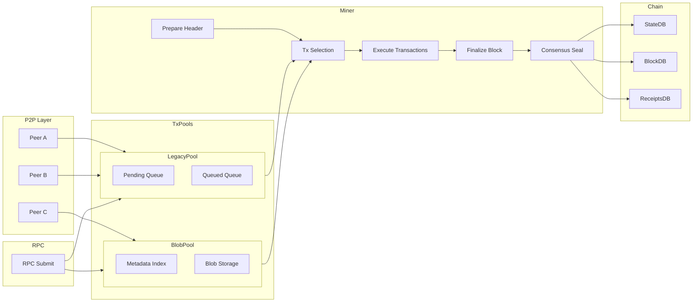

---

# 📘 第一篇：矿工出块整体流程与系统架构

本文目标是为读者建立一幅从 **接收交易 → 进入池 → 执行 → 构造区块 → 共识封装 → 广播** 的完整架构图。
该文聚焦于“全景理解”，不涉及 EVM 细节或某个共识算法的数学推导。

---

# 一、矿工出块是一个“系统工程”？

在很多人的印象里，矿工（Miner / Block Producer）的任务似乎很简单：

1. 从 mempool 拿交易
2. 执行
3. 把结果写进区块
4. 广播新块

但在实际实现中，一名合格矿工节点要满足：

* **共识规则**（不同链不同算法）
* **交易市场规则**（gas price、blob gas price、max blob 用量等）
* **资源限制**（时间预算、区块 gas limit、blob 额度）
* **安全要求**（拒绝恶意交易、防止 DoS）
* **数据一致性**（stateRoot、receiptsRoot 必须正确）
* **并发事务管理**（tx pool 多线程、P2P 输入、区块执行流水等）

因此，矿工是一个由 **多模块协作** 的复杂系统，而并非一个简单的“运 EVM 的程序”。

为了理解后续几篇文章，我们先建立完整的流程模型。

---

# 二、矿工出块的六大阶段

下面是一条从 **P2P/RPC** 输入开始，到矿工成功产出并广播新块的**完整执行链**：

```
[1] 接收交易  
      ↓
[2] 进入交易池（LegacyPool & BlobPool）
      ↓
[3] 出块准备（准备 parent、header、共识参数）
      ↓
[4] 交易调度（选择可打包交易）
      ↓
[5] 执行交易（EVM / 状态变更 / 收据）
      ↓
[6] 构造区块 + Seal（共识） + 广播
```

这六个阶段与共识算法（PoW / PoS / PoA / BFT / Rollup）无关，是所有区块链矿工的共通结构。

---

# 三、矿工出块架构图



这个图展示了：交易先进入交易池，矿工从 pool 中挑选交易，用状态执行，构造区块，然后用共识引擎封装并提交区块。

---

# 四、阶段一：交易接收

交易来源包括：

1. **RPC**：用户通过钱包、前端调用 RPC 接口 `eth_sendRawTransaction`
2. **P2P**：其他节点的广播
3. **本地**：例如 node operator 直接插入的交易

每笔交易先做轻量校验：

* RLP 解码、签名合法性
* 结构字段范围检查
* nonce、gas、value 合规检查
* blob 交易的 commitment 基本检查（如长度）

然后分类进入：

* **普通交易（Legacy / EIP-1559）→ LegacyPool**
* **Blob 交易（EIP-4844）→ BlobPool**

矿工并不直接拿交易，而是从交易池拿“筛选好的候选交易”。

---

# 五、阶段二：进入交易池

TxPool 是矿工的“交易市场”，存储所有 **等待被矿工执行** 的交易。

## 5.1 LegacyPool（普通交易池）

关键结构：

* `pending[address]`：nonce 连续、可立即执行的交易
* `queue[address]`：nonce 断档、暂不可执行
* `pricedList`：按 gas price 排序的全局优先队列
* `locals`：本地交易，永不驱逐
* `beats`：每个账户的最后活跃时间

交易池负责：

* 决定哪些交易 **可以出块**（nonce、balance、gas price 等）
* 决定哪些交易需要被 **驱逐**（太贵、太老、太大）
* 在区块被打包后，根据 receipts 调整 pending/queue

## 5.2 BlobPool（Blob 交易池）

* 内存中仅存 **元数据**
* payload 进入磁盘：`blobpool/limbo/*.bag` 与 `blobpool/queue/*.bag`
* 资源限制：blob gas 限额、blob 个数、磁盘容量
* 驱逐与清理策略不同于 LegacyPool（更偏向磁盘 GC）

这些交易池的设计决定了“矿工能从哪里拿到什么交易”，是出块的第一关。

---

# 六、阶段三：出块准备

矿工每次尝试出块时，需要：

1. 获取当前链的 **parent block**
2. 构造新的区块头（header）但字段未填完
3. 调用共识模块的 `Prepare()` 函数补充必要字段

例如：

* PoW 填充 difficulty
* PoA/Clique 填充 extraData
* PoS 填入 randaoMix、proposer index
* EIP-1559 填入 baseFee
* EIP-4844 填入 `excessBlobGas`

并从 parent 世界状态构建：

* `StateDB`（可执行状态快照）
* `GasPool`（区块 gas 上限）
* 对 blob 的预算：blob gas 限额（max_blobs_per_block）

最终生成一个 BlockContext / EVM Context，供执行器使用。

---

# 七、阶段四：交易选择

这是“挖矿策略”的核心：

1. 遵守 nonce 顺序
2. 优先 gas 价格最高的交易
3. 遵守 gas limit / blob limit
4. 不执行已知冲突交易（同账户、同 nonce）
5. 本地交易可获得优先权
6. 不能选入非法 blob（承诺不匹配、blob 数过多）

过程一般是：

* 从 pricedList/pop() 取交易
* 检查 nonce 是否匹配 pending 状态
* 检查执行预算是否足够（gasPool、blobGas）
* 试执行（EVM），若失败看是否可丢弃或插回队列
* 放入 txsForBlock 列表

直到：

* 区块 gas 用完
* blob 限额用完
* 时间窗口结束（例如 PoS proposer 有固定 slot 时间）

调度器是高性能矿工实现中最考验工程能力的部分。

---

# 八、阶段五：执行交易

真正执行一笔交易需要：

1. 从 pool 拿交易
2. 在 EVM 上运行用户代码
3. 更新账户余额、nonce、storage、logs
4. 消耗 gas，记录 refund
5. 生成 receipt 与 logsBloom
6. 更新区块上下文（累计 gas used）

执行的最重要约束：

* EVM 必须基于 **parent block 的状态**
* 所有变更必须最终写入一个新的 StateRoot
* receipts 必须最终写入 receiptsRoot
* blob tx 必须写入 blob commitments / KZG 映射

执行阶段结束后，miner 得到了：

* `executedTxs`（实际进入区块的交易）
* `receipts[]`
* `intermediateRoot/stateRoot`

---

# 九、阶段六：构造区块、Seal 共识与广播

### 1. Finalize

将以下内容写入 block header：

* `stateRoot`
* `transactionsRoot`
* `receiptsRoot`
* `logsBloom`
* `gasUsed`
* `blobGasUsed / excessBlobGas`（EIP-4844）

### 2. Seal（由共识完成）

共识引擎负责：

* PoW：计算 nonce，找到合法 difficulty 的 hash
* PoA：签名 header
* PoS(L1)：由 proposer 对区块签名
* Rollup(L2)：构造 L2 output root

输出的是一个合法的 **已封装区块（Sealed Block）**。

### 3. 写入区块数据库并广播

* 写入 ChainDB、ReceiptsDB、Bloom filter 等
* 更新 canonical head
* 广播到 p2p 网络的所有 peers

至此，矿工的出块流程结束。

---

# 十、总结：矿工出块是一条“生产流水线”

全文总结如下图：

```
交易输入 → Pool 筛选 → 生成上下文 → 调度交易 → 执行 → Finalize → 共识封装 → 广播新区块
```
