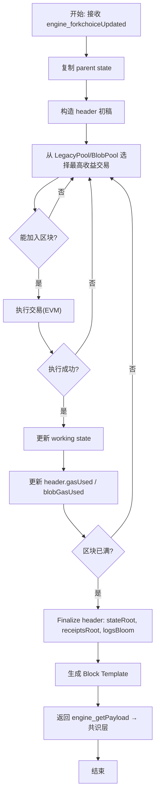

本篇将紧接第一篇的“外层流程”，进一步深入 **Geth 矿工在“出块准备阶段（Pre-Block Construction Stage）”的完整细节**，包括：

* 交易选择机制（LegacyTx / BlobTx）
* 多子池调度
* 执行引擎（EVM）与状态检查
* 区块模板构建
* 手续费 / 优先费 / MEV 相关接口
* 区块可封装性（sealability）判断

> 🌟 **本篇定位：交易进入区块前，Geth 内部如何组织、筛选与执行交易，最终形成可交给共识层封装的“区块模板（Block Template）”。**
> 🌟 **共识部分（例如 PoW/PoS 签名、随机数、slot、validator 工作）一律抽象为接口，不深入内部。**

---

# **第二篇：区块构建阶段全解析**

---

# **一、总览：区块构建阶段的目标**

当共识层（CL）向执行层（EL/Geth）发出请求：

```
engine_forkchoiceUpdatedV2
engine_getPayloadV3
```

Geth 的任务是：

1. **构建一个 block template（区块模板）**
2. 尽可能从交易池中挑选收益最高且能被执行的交易
3. 模拟执行所有交易（EVM 执行）
4. 保证区块 gas 限制、blob 限制、baseFee 规则
5. 返回“可以被封装的区块体”（未签名 / 未封装）

---

# **二、区块构建主流程（BlockBuilder）**

Geth 用一个类似下图的流程构建区块（伪代码）：

```
func BuildBlockTemplate(parent, time, suggested_fee_recipient):
    st = copy(parent_state)
    header = makeHeader(parent, time, st)
    txs = SelectTransactions(st, header)
    blobs = SelectBlobs(st, header)
    applyAll(st, txs + blobs)
    finalizeHeader(header, st)
    return Block(header, txs + blobs)
```

关键模块：

* **状态复制**：基于 parent block 的 post-state 克隆一个 working state
* **构造 header 初稿**：包含 parentHash、gasLimit、baseFee、feeRecipient
* **从交易池选择交易（两大池：LegacyPool + BlobPool）**
* **执行交易**
* **Finalize header**
* **返回区块模板**

下面分几部分深入讲解。

---

# **三、交易选择机制**

区块构建最核心部分就是：

### **SelectTransactions() — 从多个子池优先队列取最有价值的交易**

Geth 的 Transaction Pool（TxPool）结构如下：

```
TxPool
 ├── LegacyPool   （普通交易）
 └── BlobPool     （EIP-4844 blob 交易）
```

每个子池内部又有多级结构：

* pending
* queued
* pricing queue
* eviction
* per-account ordering
* nonce dependencies

本篇重点是 **选交易进入区块（block building）**，不是交易池本身的存储结构。

---

## **3.1 交易选择算法总体结构**

Geth 的区块构建交易选择遵循：

### **① 先按收益排序（Tip / BlobFee）**

* Legacy 交易排序：

  ```
  priority = effectiveGasTip
  ```
* Blob 交易排序：

  ```
  priority = blobFeeCap - blobBaseFee
  ```

### **② 按账号 nonce 串联**

交易池内部保证：

* 对同一个账号（sender）必须从 nonce 最小的开始依次加入区块
* 如遇到 gap（比如 nonce=10 缺失，而来了 nonce=11），11 禁止进入 block builder

### **③ 动态 gas 计算**

构建区块过程会不断：

* 统计当前区块已使用 gas
* 动态判断区块是否还能加入更多交易
* 对 4844 blob 交易要处理 `blobGasUsed`

---

## **3.2 详细流程：从各子池选择交易**

简化后的伪流程：

```
while block not full:
    tx = next highest priority tx from (LegacyPool, BlobPool)
    
    if cannot include:
        skip or move to next
        continue

    if executing tx fails:
        - if sender balance insufficient → drop this sender's whole nonce sequence
        - if gas不足/invalid → skip this tx only
        continue

    include tx into block
```

多池调度采用 **多路归并（multi-way merge）**：

* LegacyPool → highest tip tx
* BlobPool → highest blob fee tx
* 轮询比较两个池子头部，选择收益更高者

---

# **四、执行引擎（EVM）预执行阶段**

Geth 在构建区块时必须对每个交易：

1. 使用 working state 执行
2. 检查余额、nonce、gas、签名
3. 检查 calldata 是否正确
4. 检查 blob sidecar（4844）

### **EVM 执行的位置：**

代码入口：

```
core/state_processor.go
core/evm.go
core/blockchain.go
```

在构建区块时：

```
state.TransitionDb()
```

每个交易执行结果返回：

* gas used
* logs
* touched accounts
* storage writes
* refunds

这些内容会用于：

* 更新 working state
* 更新 block txRoot / receiptRoot / logsBloom

---

# **五、区块头构建（Block Header Construction）**

区块头初稿：

```
parentHash
beneficiary (suggested fee recipient)
stateRoot (最终才能填)
receiptsTrie
gasLimit
gasUsed
baseFee
blobGasUsed
excessBlobGas
timestamp
```

区块构建过程会不断修改 header 字段：

* 每加入一笔交易 → gasUsed 增加
* 每加入 blob tx → blobGasUsed 更新
* 最终 st.Commit() → stateRoot 填写
* 收据生成 → receiptsRoot 填写

---

# **六、手续费、奖励与 MEV 相关接口**

### **6.1 baseFee（EIP-1559）**

区块构建必须遵守：

```
baseFee(next block) = adjust(parent.baseFee, gasUsed, gasTarget)
```

这个影响 Legacy 交易的最低上链价格：

```
effectiveGasTip + baseFee <= gasFeeCap
```

### **6.2 blobBaseFee（EIP-4844）**

影响 blob tx 是否能被接受：

```
blobFeeCap >= blobBaseFee
```

### **6.3 feeRecipient**

由共识层（权限节点/validator）指定：

```
engine_forkchoiceUpdatedV2(payloadAttributes.suggestedFeeRecipient)
```

Geth 只负责执行：

* 矿工费（tips）发送到该地址
* MEV rewards 由外部系统（如 mev-boost）处理
  Geth 在此阶段只是透明处理已排序的交易（无内置拍卖机制）

---

# **七、区块可封装性（sealability）判断**

区块构建完成后，Geth 会校验该区块是否满足：

* gasUsed ≤ gasLimit
* blobGasUsed ≤ blobLimit
* timestamp ≥ parent.timestamp
* correct baseFee / blobBaseFee
* nonce & uncle rules（简化）
* receiptsRoot、stateRoot 一致

通过后即可交付给共识层：

```
engine_getPayloadV3 → 返回区块模板
```

---

# **八、完整流程可视化**




---

