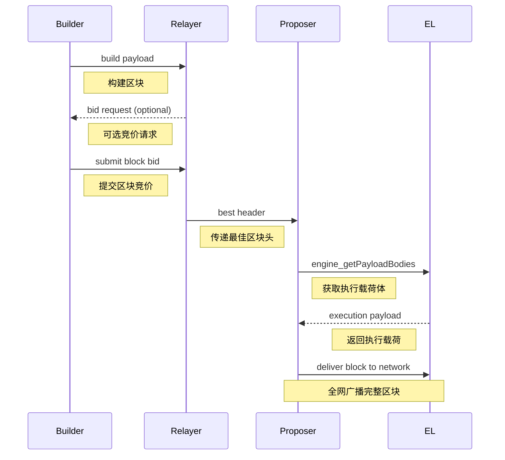

> 本篇聚焦 **PBS（Proposer-Builder Separation）** 时代的区块生产流程，涵盖 Builder、Relayer、Proposer 的角色划分，Block Bid 竞价结构，Execution Layer（EL）如何与这些角色协作，并说明 EIP-4844 时代的额外差异。

---

# 📘 **第六篇：Builder / Proposer（MEV-Boost）时代的区块构造**

自以太坊完成合并（The Merge）后，区块构造进入 **PBS 时代：Proposer 不再自己选交易，而是从 Builder 购买完整区块**。
PBS 是最重要的结构性升级之一，使得：

* 链上交易排序价值（MEV）从 validator 手中剥离；
* 节点无需本地打包 tx → 减少中心化诱因；
* Builder 专业构造高价值区块（跨池搜索、套利、清算）；
* Proposer 只负责选择出价最高、结构正确的区块头。

这一机制由 **MEV-Boost（中间件）** 在链下实现，EL（即 geth）通过 **Engine API** 配合 CL（共识层）实现完整流程。

---

# 一、PBS 时代的三角色模型

PBS 将 “出块” 分成三个角色：

```
┌─────────┐     ┌─────────────┐     ┌───────────────┐
│ Proposer│ <-- │    Relayer   │ <--│    Builder     │
└─────────┘     └─────────────┘     └───────────────┘
 (Validator)        (Bid Router)        (Block Maker)
```

---

## 🔵 1. Proposer（验证者）

职责：

* 在 slot 内必须交付一个有效区块
* 通过 MEV-Boost 询价，从 Relayer 处获取 “最佳区块”
* 验证 Builder 提供的 block header 与 execution payload 一致性
* 如果没有有效 builder block → fallback 本地构造（local block）

---

## 🟡 2. Relayer（中继）

职责：

* 从多个 builder 收集 block bids
* 验证 block-body 与 header 一致性（确保 mev-boost 安全）
* 只向 proposer 提供 **header**（隐藏完整内容）
* proposer 接受后，relay 才将完整区块 payload 提交给 validator/CL

---

## 🔴 3. Builder（构造者）

职责：

* 从 Mempool（含 private tx、Bundle）构造最赚钱的区块
* 最大化 MEV、套利、清算收入
* 预执行所有交易 → 得到完整 StateRoot / ReceiptsRoot
* 最终生成一个 **Execution Payload** 并竞价（bid）

---

# 二、Execution Layer 在 PBS 中的角色

PBS 是在共识层（CL）主导下进行的。
Execution Layer（EL，如 geth）在 PBS 中不再直接参与交易选择，而是：

### 📌 EL 特性变化：

| 动作            | PBS 前 (矿工自打包) | PBS 后 (Builder 打包) |
| ------------- | ------------- | ------------------ |
| 执行交易          | 本地执行          | 由 Builder 执行       |
| 构造 block body | 本地构造          | Builder 提供         |
| 验证 block      | 必须验证          | 必须验证               |
| broadcast     | 本地广播          | Builder/Relayer 广播 |

EL 核心任务仍是：

**验证一个 ExecutionPayload 是否和 Header 一致**，并落盘到区块链中。

---

# 三、MEV-Boost + Builder 流程总览（PBS 全链路）

以下时序图说明完整建块流程：



核心要点：

1. **Builder** 构造 execution payload（交易执行完的区块），通过 relay 提交 bid
2. **Relayer** 验证并挑选最佳 bid，将 *header* 发送给 proposer
3. **Proposer**（validator）决定接受 builder block
4. CL 调用 `engine_getPayload` 获取完整 block payload
5. EL 验证 payload → 导入链

---

# 四、Builder 的区块构造流程

Builder 的构造过程与传统矿工相同，但目标不同：**最大化价值**。

### 📦 4.1 Mempool 组合来源

Builder 的 tx 集合来源更多：

* 公共 mempool（公开交易）
* private tx（bundle, flashbots）
* arbitrage bot orders
* backrun/ frontrun pairs
* MEV 搜索引擎（内部策略）

---

### 🧠 4.2 Builder 的交易排序（不同于矿工）

矿工：按 transaction tip/gas 优先排序
Builder：按“利润”排序，包括：

* DEX arbitrage
* Liquidation 机会
* NFT sniping
* L2 和跨链 MEV
* 订单流 internalization 等

排序核心逻辑是一个 **搜索优化引擎**，通常使用：

* 图搜索 / simulation search
* 并行模拟多条 path
* 动态交易选择（对抗抢跑）

---

### 🔍 4.3 执行交易（必需）

Builder 必须完整执行所有交易，生成：

* StateRoot
* ReceiptsRoot
* LogsBloom
* WithdrawalsRoot（EIP-4895）
* BlobCommitments（EIP-4844）

因为 proposer 无法验证 body，只能验证 header：

→ 所以 builder block body 必须正确，否则 relay 不会转发。

---

### 🧱 4.4 产生 Execution Payload + Bid

Builder 输出两个结果：

```
payload = { Header, Body, BlobsBundle }
bid = { header, value(FeeToProposer) }
```

其中：

* `header` → 提交给 proposer
* `body/payload` → relay 缓存，不直接给 proposer
* `value` → 这块对 proposer 的收入（含 MEV）

---

# 五、Proposer（Validator）如何选择区块？

validator 运行 CL 客户端，CL 通过以下逻辑工作：

---

## 📌 5.1 询价流程（通过 MEV-Boost）

1. slot 开始
2. CL → mev-boost 请求 bids
3. mev-boost → relayer 请求 best bid
4. relayer 返回 *header* 和 *value*
5. proposer 决定：

```
if value > local_block_value:
    accept(builder header)
else:
    build local block
```

---

## 📌 5.2 builder block 被接受

若 proposer 接受 builder header：

1. CL 调用 `engine_getPayload(validationPayloadId)`
2. EL（geth）从 relayer 拉取完整 payload
3. EL 验证 payload → 导入 → 返回给 CL
4. CL 继续封装为 BeaconBlock（共识层）

---

## 📌 5.3 fallback：本地构造区块

若：

* builder 没有响应
* bid 不合法
* bid 太小
* relay 宕机

→ proposer 使用本地逻辑构造 “本地区块”。

此时代码走：

```
miner.prepareWork → txpool → BlockContext → Assemble
```

即回到传统出块流程。

---

# 六、Execution Layer（EL）如何验证 Builder 提供的区块？

EL 验证逻辑：

1. 提取 header 中的：

   * parentHash
   * stateRoot
   * txRoot
   * receiptsRoot
2. 重放完整 block payload：

   * 执行所有 tx
   * 计算 stateRoot/receiptsRoot/txRoot
3. 比较 header 声明的根是否一致

如果：

```
stateRoot != computedStateRoot → INVALID (builder fraud)
```

则拒绝该区块。

---

# 七、区块广播（Block Propagation）

Builder → relay → proposer 完成后，还需要广播给网络：

广播方向：

```
1. proposer → gossip 网路（CL）
2. CL → EL → 导入本地链
3. EL → full node peers → 传播 execution payload
```

---

# 八、PBS / Builder 模式的攻击与防御

### ⚠ 常见攻击：

* Block withholding（builder 拿钱不交区块）
* Header-body mismatch（builder 提供假 header）
* Time griefing（slot 临界点拖延）
* Relay 自己 front-run
* Builder collusion（联合垄断订单流）

---

### 🛡 防御机制（PBS 的核心价值）

| 防御                              | 实现主体         |
| ------------------------------- | ------------ |
| Relay 验证 body 是否与 header 匹配     | Relayer      |
| 不给 proposer 发送 payload，避免偷 MEV  | PBS 设计       |
| proposer 必须能 fallback 构造区块      | CL+EL        |
| builder 无法选择 slot（validator 随机） | Ethereum PoS |
| 多 relay 冗余                      | mev-boost    |

---

# 九、EIP-4844（Blob）时代的 PBS 变化

4844 时代 builder block 多了两个结构：

* Blob Sidecar
* KZG commitments

Builder 必须：

1. 收集 blob tx
2. 生成 blobs
3. 生成 commitments + proofs
4. 提交完整 `BlobsBundle`
5. Proposer 仍然只看 header（包括 blob commitments root）

EL 必须验证 blob 的：

* versioned hash correctness
* commitment correctness（KZG verify）
* sidecar completeness

**PBS 对 blob 的承载方式完全兼容，relay 仍然隐藏 blob 数据直到 proposer 接受 bid。**

---

# 十、总结：PBS 时代出块的最大变化

| 组件            | PBS 前 | PBS 后（MEV-Boost）  |
| ------------- | ----- | ----------------- |
| 构造 block body | 本地执行  | Builder 执行        |
| 挖矿/签名         | 本地    | Proposer（验证者）     |
| 区块价值捕获        | 矿工    | Builder（MEV 抽象层）  |
| 广播            | 本地    | proposer → gossip |
| fallback      | 不需要   | 必须支持 local block  |

**PBS 的本质：把“从交易中赚钱”从 validator 身上剥离出来，降低中心化。**

